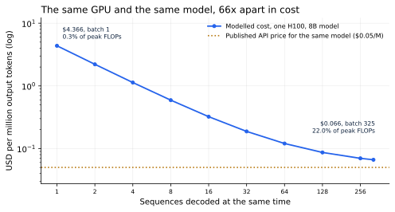

# 1. The Cost of a Token

*Written to [STANDARDS.md](STANDARDS.md). Generated from
`chapters/ch01.md` and `code/results/ch01.json`; run `make ch01` in
`code/` to recompute, `make check` to verify nothing has drifted.*

**Depends on:** nothing. This is the first chapter.
**Tier 0** — no code to run, no GPU, free. Bring a calculator if you
like; everything here is arithmetic you can check.

## Objectives

By the end of this chapter you can:

1. Explain what you are actually buying when you pay for a token.
2. Name the single choice that moves the cost of serving a model by
   nearly two orders of magnitude.
3. Read a cost-per-million-tokens figure and say what it assumes.
4. Describe what an inference engineer does, and why the role is paid
   the way it is.

## Why it matters

You run a customer-support assistant. It is not exotic: 200 requests a
second at the busy hour, each producing about 300 tokens of reply. That
is 5.2 billion tokens of output a day.

Here is the entire book in one comparison. Serving that traffic on a
single rented H100 SXM 80GB, with an 8-billion-parameter open model:

- Done badly, it costs **$22,627 a day**.
- Done well, it costs **$343 a day**.

Same GPU. Same model. Same weights, the same answers, the same
hardware rental. The difference over a year is **$8.1 million**.

Nobody chooses the expensive version on purpose. They arrive at it by
writing the obvious code, which is what you will do in
Chapter 11, and then not knowing what to change. The
rest of this book is what to change, in the order the numbers justify.

> **If you're new here: what a token is**
>
> Models do not read letters or words. Text is chopped into **tokens** —
> common chunks, roughly three-quarters of a word in English, so "the"
> is one token and "inference" may be two. The model reads your prompt
> as a list of token numbers and writes its reply the same way, one
> token at a time.
>
> Everything in serving is priced per token because that is the unit of
> work. When a provider quotes $0.05 per million output tokens,
> that is the invoice. When this book talks about making things faster,
> it means producing more tokens per second per dollar of hardware.
>
> You do not need to know how tokens are chosen. Chapter 2
> covers what the model does with them, and that is all you need.

## Follow one request

A user types a question. Here is what your money is spent on.

1. **The request arrives** at a web server, which holds a connection
   open because the answer will arrive gradually, a token at a time.
2. **The prompt is read.** The model processes all 1,200-odd tokens of
   conversation history in one pass. This is the **prefill**, and it is
   fast per token, because the tokens can all be worked on at once.
3. **The reply is written**, one token at a time. Each token requires
   its own pass through the model, and each pass must wait for the one
   before it, because the model cannot know its fifth word before
   choosing its fourth. This is the **decode**, and it is where the
   time and the money go.
4. **The connection closes**, the memory that held this conversation is
   released, and the meter stops.

Steps 2 and 3 behave so differently that most of this book treats them
as separate problems. Chapter 3 is about why.

## Work it out

You rent one H100 SXM 80GB for **$3.25 an hour**. That is the whole
cost side of the equation, and it does not change with how cleverly you
use the card. Only the other side moves: how many tokens per second you
get for it.

Start with the slowest honest way to serve: one user at a time.

The model has 8B parameters. Stored at two bytes each, that
is **16 GB** of weights. To produce one token, the GPU must
read every one of those weights out of its memory. That memory delivers
**3.35 TB/s**, so one token takes at least:

> 16 GB ÷ 3.35 TB/s ≈ 4.8 milliseconds

which is about 209 tokens per second. At $3.25 an hour, that
works out to about **$4.36 per million tokens**.

The table below says 207 rather than 209, and the two-token
difference is worth a sentence. Reading the weights is not quite all
the GPU does: it must also read the stored state of *this*
conversation. At one sequence that state is a rounding error. At
325 sequences it will be 80% of all the memory
traffic, and by Chapter 13 it is the whole problem.
Hold on to it.

Now look at what the GPU was doing during those 4.8 milliseconds. It
read 16 GB and did two arithmetic operations per parameter —
16 billion operations, on a chip that can do nearly a thousand trillion
of them a second. It spent **0.3%** of its arithmetic
capacity. The other 99.7% of the machine you are renting sat still,
waiting for memory.

Here is the move that fixes it, and it is worth pausing on because
almost everything in this book is a variation of it. **Reading the
weights costs the same whether you are answering one user or three
hundred.** If you decode 300 conversations in the same pass, you read
the weights once and get 300 tokens out instead of one. The rent is
unchanged. The output is not.

So the cost per token depends on a single choice: how many sequences
you decode together.

<!-- include: tables/ch01-cost.md -->
| Sequences at once | Throughput | Cost per 1M output tokens | Arithmetic used | Limited by |
|---|---|---|---|---|
| 1 | 207 tok/s | **$4.365** | 0.3% of peak | memory |
| 2 | 409 tok/s | **$2.209** | 0.7% of peak | memory |
| 4 | 798 tok/s | **$1.131** | 1.3% of peak | memory |
| 8 | 1,525 tok/s | **$0.592** | 2.5% of peak | memory |
| 16 | 2,800 tok/s | **$0.322** | 4.5% of peak | memory |
| 32 | 4,809 tok/s | **$0.188** | 7.8% of peak | memory |
| 64 | 7,501 tok/s | **$0.120** | 12.1% of peak | memory |
| 128 | 10,416 tok/s | **$0.087** | 16.8% of peak | memory |
| 256 | 12,929 tok/s | **$0.070** | 20.9% of peak | memory |
| 325 | 13,627 tok/s | **$0.066** | 22.0% of peak | memory |

A model, not a benchmark: H100 SXM 80GB, $3.25/GPU-hour, 8B parameters in bf16, 1,500-token sequences. For comparison, hosted Llama-3.1-8B, cheapest tracked provider is published at $0.05 per million output tokens.

**Figure 1.1** — The same GPU and the same model, 66x apart in
cost. Modelled cost per million output tokens against how many
sequences are decoded together, both axes logarithmic. The published
API price for the same model sits below even the best point on the
curve. *Provenance in `code/figures/ch01-cost.caption.txt`.*

Three things to take from this, all of which the book returns to.

**The cheapest and dearest points differ by 66x**, and nothing
about the hardware or the model changed between them. This is why
inference is an engineering discipline rather than a purchasing
decision.

**Even at its best the GPU is mostly idle.** At 325
concurrent sequences the card is using 22% of its arithmetic
capacity. It is still waiting for memory, just less wastefully.
Chapter 4 explains why this is the normal condition of
serving, and Chapter 8 gives you the one graph that
predicts it.

**At that point, 80% of the memory traffic is not the model.**
It is the conversations themselves — the per-sequence state the model
keeps so it does not have to re-read the whole conversation for every
token. That state is called the KV cache, it is the subject of
Chapter 12, and by Chapter 13 it will be the
thing standing between you and more concurrency.

## Where this is soft

**This is a model, not a benchmark.** Every number above is arithmetic
over published hardware specifications and rental prices, and it makes
assumptions a real system would not honour exactly: perfect batching,
no scheduling overhead, no time lost to prefill, every sequence the
same length. Real numbers are worse. Chapter 9 builds
the harness that measures rather than models, and Part VII runs it
against production engines.

**Our best number is still above the market price.** A hosted version
of this model is published at $0.05 per million output tokens —
below the $0.066 this chapter modelled, by 1.3x.
That gap is not an error in the arithmetic. It is the arithmetic
telling you that real providers do things this chapter has not
mentioned:

- They serve the weights at lower precision, halving the bytes that
  must be read (Chapter 25 and Chapter 26).
- They pack the memory far better than a naive allocator, so more
  sequences fit (Chapter 14).
- They share work between requests with identical beginnings
  (Chapter 15).
- They do not pay on-demand hourly rates.

Read that list again: it is most of this book's table of contents. The
gap between $0.066 and $0.05 is the thing you are about to
learn to close.

**Prices move.** Every figure here was verified in September 2026 and
is recorded with its source in `FACTS.md`. GPU rental rates have fallen
year over year and token prices with them. The *shape* of the curve —
the 66x spread, the idle arithmetic, the memory wall — is set by
physics and will outlive the prices.

## In production

The job this book prepares you for is the one that owns the number in
Figure 1.1.

An inference engineer picks hardware, chooses and configures a serving
engine, decides batch sizes and memory limits against a latency target,
compresses models, and is accountable for cost per million tokens and
for the latency users feel. It sits between machine learning and
systems engineering, and closer to systems.

It is paid accordingly. Inference and GPU specialists were reported at
$300,000–$500,000 and above in 2026, ahead of general machine-learning
engineering, and the reason is visible in the arithmetic above: the
difference between a competent and an incompetent serving setup is
$8.1 million a year on one model on one GPU. Chapter 46
covers the role, the interviews and the portfolio directly.

You do not need permission to start. Everything through
Chapter 13 runs on a laptop.

## Numbers to remember

| Quantity | Value |
|---|---|
| Rented H100 SXM 80GB | $3.25 per hour (Sept 2026) |
| 8B model in bf16 | 16 GB of weights, read once per token |
| Decode floor, one sequence | ~4.8 ms per token, 207 tokens/s |
| Cost range on one GPU | $4.36 to $0.066 per million tokens |
| Arithmetic capacity used, one sequence | 0.3% |
| Published API price, hosted 8B | $0.02 in / $0.05 out per million |

## Sources

- NVIDIA H100 datasheet — memory capacity, bandwidth and peak
  throughput used throughout this chapter. Recorded in `FACTS.md`.
- Published GPU rental price indexes, September 2026 — the
  $3.25/hour figure is the on-demand median across providers;
  the range runs from about $1.50 to $7.00. Recorded in `FACTS.md`.
- Published API price sheets, September 2026 — $0.05 per million
  output tokens for a hosted 8B open model at the cheapest tracked
  provider. The same open weights are priced severalfold apart across
  providers, depending on hardware, batching, quantization and margin:
  direct evidence that this chapter's spread is real and commercial.
- Compensation surveys, 2026 — the salary range quoted above. Recorded
  in `FACTS.md`.

## Exercises

**★ 1.1** Your service produces 20 million output tokens a day. Using
Figure 1.1, what is the annual difference between serving at one
sequence at a time and at 325?

**★ 1.2** A colleague proposes buying a faster GPU with twice the
arithmetic throughput and the same memory bandwidth. Using the
reasoning in "Work it out", predict the effect on the cost of decoding
one sequence at a time. Explain in one sentence.

**★★ 1.3** The chapter's model assumes every sequence is
1,500 tokens. Redo the batch-325 calculation for
sequences of 8,000 tokens. What happens to the share of memory traffic
spent on the KV cache, and what does that imply about serving long
conversations?

**★★ 1.4** Find the current published price per million output tokens
for an 8B-class open model from three providers. Explain the spread
between them using only ideas from this chapter. Which of your three
is most likely running at the right end of Figure 1.1?
