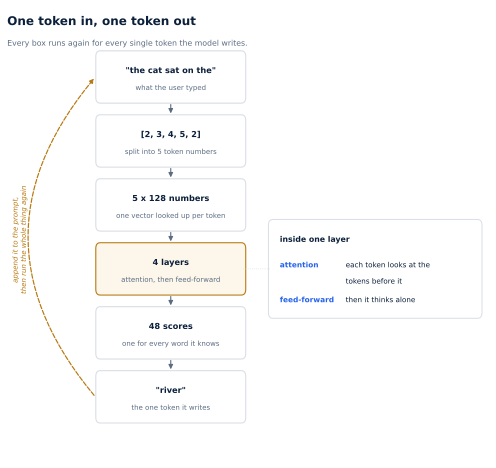
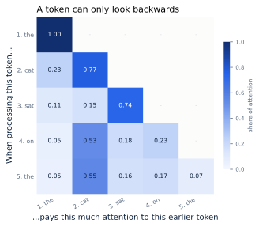
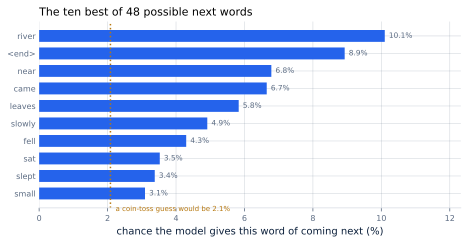

# 2. What a Model Does When It Answers

*Written to [STANDARDS.md](STANDARDS.md). Generated from
`chapters/ch02.md` and `code/results/ch02.json`; every figure is drawn
from a real forward pass, traced by `make ch02` in `code/`.*

**Depends on:** Chapter 1.
**Tier 0** — runs on a laptop CPU in under a second, free.

## Objectives

By the end of this chapter you can:

1. Follow one token through the model, and name what happens at each
   stage.
2. Say exactly what a token needs from the tokens before it, and what
   it does not need.
3. Explain why writing an answer is a loop, and what one turn of that
   loop costs.
4. State the two facts about that loop on which every optimization in
   this book depends.

## Why it matters

Chapter 1 made a claim and asked you to accept it:
producing one token means reading every weight in the model. That one
sentence is the reason serving is expensive, the reason batching works,
and the reason the rest of this book is shaped as it is.

This chapter shows you it is true by watching it happen.

You do not need to know how a model is *trained*, and nothing here
requires mathematics beyond multiplication and addition. What you do
need is a clear picture of what happens between a user pressing enter
and a word appearing, because every technique in this book is a change
to some part of that picture.

We will follow a five-word prompt — **"the cat sat on the"** — through a real
model, small enough that every number fits on the page, and watch it
choose the next word.

> **If you're new here: vectors, and what a model is made of**
>
> A **vector** is a list of numbers. That is all. When this chapter
> says a token becomes "a vector of 128 numbers", it means the
> word has been replaced by a list of 128 numbers that the model
> can do arithmetic on.
>
> A **parameter** (or *weight*) is one number that was learned during
> training and is now fixed. Our model has 801,920 of them. A
> production model has billions. They are just numbers, sitting in
> memory, and the model's entire behaviour is those numbers.
>
> The model's work is almost entirely **multiplying lists of numbers by
> tables of parameters** and adding up the results. When you read
> "reads every weight", it means precisely that: to do the
> multiplication, the chip has to fetch each of those numbers out of
> memory. That fetching is what you will spend your money on.

## The whole path, once

Here is the entire journey, start to finish. Every section after this
one zooms into one box.

**Figure 2.1** — One token in, one token out. The prompt is split into
token numbers; each becomes a vector; the vectors pass through the
model's 4 layers; the model scores every word it knows and
writes one. Then the arrow at the left: the written token is appended
to the prompt and the whole path runs **again**, for every single token
of the answer. *Provenance in
`code/figures/ch02-pipeline.caption.txt`.*

Keep that loop in mind. A 300-word answer means running this path about
400 times. Not once.

## Step 1: text becomes numbers

Models do not work with letters. Text is first cut into **tokens** and
each token is replaced by its number in a fixed list of tokens the
model knows — its **vocabulary**.

Our model has a deliberately tiny vocabulary of 48 whole words,
so that every number in this chapter is readable. The prompt becomes:

> "the cat sat on the"  →  [2, 3, 4, 5, 2]

Notice that "the" appears twice and gets the same number both times:
`2`. The word is the same, so the token is the same.

Real models use sub-word pieces rather than whole words, so that they
can spell unfamiliar names and handle any language: "inference" might
be two pieces, "Khan" might be three. That changes the vocabulary size
(typically 30,000–200,000 rather than 48) but changes nothing
about the rest of this chapter.

Next, each token number is used to look up a vector in a table — one
row per word in the vocabulary. This table is part of the model's
learned parameters. After the lookup, our five tokens have become five
vectors of 128 numbers each:

<!-- include: tables/ch02-shapes.md -->
| Stage | What it is | Shape |
|---|---|---|
| The prompt, as text | "the cat sat on the" | `-` |
| As token numbers | [2, 3, 4, 5, 2] | `5` |
| After the lookup table | a vector per token | `5 x 128` |
| Through each of the 4 layers | same shape in, same shape out | `5 x 128` |
| Keys and values kept per layer | what attention reads later | `4 x 5 x 32` |
| Scores for the next token | one per word in the vocabulary | `5 x 48` |
| Used to write a token | only the last row matters | `48` |

That third row is worth pausing on. From here to the very end, the data
has the same shape: **one vector per token**. Every layer takes five
vectors and produces five vectors. Nothing grows, nothing shrinks. What
changes is *what those numbers mean*.

A useful way to hold this: each token now has a **notepad** of
128 numbers, and each layer lets it revise its notepad. The
model's answer is whatever is written on the last token's notepad at
the end.

## Step 2: what a layer does

Each of the 4 layers does two things in order.

### Attention: each token looks at the tokens before it

This is the part worth understanding properly, because it is the part
that costs memory, and memory is what this book is about.

The intuition. The word "the" at position 5 is ambiguous on its own. To
revise its notepad usefully, it needs context: *which* "the"? The one
after "sat on". So it needs to look at the words before it.

Attention is how it does that, and it works like a very small search.
Every token produces three vectors from its notepad:

- a **query** — what am I looking for?
- a **key** — what do I offer to anyone looking?
- a **value** — what do I hand over if someone looks at me?

A token attends to an earlier token by comparing its own query against
that token's key. A good match means a high score. The scores are then
turned into fractions that add up to 1, and the token collects a
blend of the other tokens' **values**, weighted by those fractions.

That is the whole mechanism. Query to find, key to be found, value to
be taken.

**And there is one rule: a token may only look backwards.** Token 5 may
look at tokens 1 through 5. It may not look at token 6, because when
the model is writing, token 6 does not exist yet. This rule is built
into the architecture, not learned.

Here is that happening, in the real model, for our prompt:

**Figure 2.2** — A token can only look backwards. Each row shows how
one token divided its attention across the tokens at or before it.
*Provenance in `code/figures/ch02-attention.caption.txt`.*

Read the bottom row with me, because reading one row teaches the whole
figure. It is token 5, the second "the", deciding where to look:

> the 0.05, cat 0.55, sat 0.16, on 0.17, the 0.07

Those five numbers add to 1.00 — attention always divides a
fixed budget of 1.0, it never creates more. The largest share,
0.55, went to "cat". And the row simply
stops after position 5; there is nothing to the right to look at.

Now look at the shape of the whole figure. The top-right half is empty.
Token 1 has exactly one number, 1.00, because the first token has only
itself to look at. Token 2 has two, token 3 has three. That triangle is
the single most consequential fact in this book, and we will come back
to it in a moment.

> **A caution about this figure.** This model was never trained; its
> parameters are random numbers. So *which* earlier token each one
> favours is arbitrary and means nothing. What is not arbitrary is the
> structure: every row sums to exactly one, and the upper triangle is
> exactly zero. `make ch02` asserts both on every run. Those are
> properties of the architecture, and they hold for every transformer
> ever trained. In a
> trained model the same picture develops readable patterns — heads
> that track grammatical agreement, heads that find the last mention of
> a name. That is a fascinating subject and it is not this book's; see
> *Large Language Models from the Ground Up*, Part III.

### Feed-forward: each token thinks alone

After attention, each token has gathered context from the tokens before
it. The second half of the layer lets it process what it gathered,
**one token at a time, with no communication between them.** It is a
much bigger chunk of arithmetic than attention and a much simpler idea:
multiply the notepad by a table of parameters, apply a simple
non-linear function, multiply by another table.

In our model, **67%** of each layer's parameters sit in these
two feed-forward tables rather than in attention, and the proportion is
similar in production models. When Chapter 1 said the
GPU must read every weight to produce a token, this is most of what it
is reading.

Then the next layer does the same two things again, and the next, until
all 4 are done.

## Step 3: numbers become a word

At the end, we take **only the last token's notepad** — the other four
are irrelevant for choosing what comes next — and multiply it by one
final table with one row per word in the vocabulary. That produces one
number per word: a score for how well each word fits as the next token.

Those 48 raw scores are turned into probabilities that sum to 1:

**Figure 2.3** — The ten best of 48 possible next words.
*Provenance in `code/figures/ch02-scores.caption.txt`.*

The model gives "river" 10.1%. Pure chance would give
every word 2.1%, and again — this model is untrained, so
the ranking is meaningless. What matters is the *form* of the output:
**the model does not produce a word. It produces a score for every word
it knows, and something else picks one.**

That picking is a separate, cheap step. Always taking the highest
scorer is called *greedy* decoding, and it is what this book uses
whenever it needs two runs to produce identical output. Real services
usually sample instead, which is what makes a chatbot give different
answers to the same question.

## Step 4: and then it does it all again

The chosen token is appended to the prompt, and the whole path runs
again — now with six tokens instead of five. Then seven. Then eight,
until the model produces the special "end" token or hits a limit.

This is the loop in Figure 2.1, and it is why serving is expensive: not
because the model is slow, but because you pay for it once per token of
output, sequentially, with each token waiting for the one before it.

## The two facts

Everything in the remaining chapters is a consequence of these two.

**Fact one: producing one token reads every weight, once.**

To write a single token, every parameter in the model must be fetched
from memory and used. That cost does not depend on how long your prompt
is, and it does not shrink for short answers.

<!-- include: tables/ch02-cost.md -->
| Per token written | This chapter's model | A production 8B model |
|---|---|---|
| Parameters | 801,920 | 8 billion |
| Weights read | 3.2 MB (fp32) | 16 GB (bf16) |
| Arithmetic | 1.6 million operations | 16 billion operations |
| Keys and values stored | 4,096 bytes | 128 KiB |

Read the right-hand column against Chapter 1's
arithmetic: 16 GB read per token, at an accelerator's
memory bandwidth, is the 4.8 milliseconds that set the floor on how
fast one user can be served. Chapter 4 takes this fact
apart properly.

Note also how lopsided the last two rows are. Producing a token needs
16 billion arithmetic operations — which a modern accelerator can do
in a fraction of a millisecond — but requires reading 16 GB, which
it cannot. **The model is not hard to compute. It is hard to fetch.**

**Fact two: attention needs every earlier token's keys and values.**

Look back at Figure 2.2. When the model writes token 6, that new token
must attend to tokens 1 through 5 — which means it needs their keys and
values, in every layer.

But notice what it does *not* need: their **queries**. A query is only
used by the token that produced it, at the moment it was produced.
Keys and values are needed forever; queries are needed once.

That asymmetry is worth 128 KiB per token of storage in a production
model, and it is the difference between a server that answers 300
people at once and one that answers 60. It is also a choice: you can
keep those keys and values, or recompute them every single time.
Chapter 11 recomputes them and measures the damage.
Chapter 12 keeps them, and that single decision is the largest
speedup in this book.

## Where this chapter simplifies

Four things were left out deliberately. None of them changes anything
above; all of them appear later.

- **How the model knows the order of the words.** Something must
  distinguish "the cat sat on the" from "the the sat on cat". Our model
  adds a learned position vector; most modern models rotate the query
  and key vectors by an angle that depends on position. The technique
  matters for long contexts, and Chapter 33 covers it.
- **Normalization and residual connections.** Each layer actually adds
  its output to the notepad rather than replacing it, and rescales
  along the way. This is what makes deep models trainable. It does not
  change the shapes or the costs.
- **Multiple heads.** Attention does not run once per layer; it runs
  several times in parallel, each with its own queries, keys and
  values, and the results are joined. Our model has 4 such
  heads of 32 numbers each. Figure 2.2 shows one of them. This
  matters a great deal for memory, and Chapter 12 returns to it.
- **Models that do not use all their weights.** Some large models
  activate only a fraction of their parameters per token. That breaks
  fact one in an interesting way, and Chapter 33 deals with it.

And one thing is not a simplification but a limitation worth repeating:
this model is untrained, so its *outputs* are meaningless. Its
*structure, shapes and costs* are exactly those of a real one.

## In production

Between our model and a production one, these things change:

- the vocabulary grows from 48 to 30,000–200,000 sub-word pieces;
- 128 becomes 4,096 or more, and 4 becomes 32 to 80;
- attention uses fewer key/value heads than query heads, to cut that
  128 KiB per token — the reason is now obvious to you, and
  Chapter 12 does the arithmetic;
- the numbers are stored in two bytes rather than four, or one.

These things do not change:

- one vector per token, all the way through;
- a token may only look backwards;
- every weight is read for every token written;
- keys and values are needed again, queries are not;
- and the whole path runs once per token of output.

## Numbers to remember

| Quantity | Value |
|---|---|
| Shape of the data, everywhere inside the model | one vector per token |
| Attention budget per token | sums to exactly 1 |
| What a token needs from earlier tokens | their keys and values, never their queries |
| Weights read per token, production 8B | 16 GB |
| Arithmetic per token, production 8B | 16 billion operations |
| Keys and values stored per token, production 8B | 128 KiB |

## Sources

- Vaswani, Shazeer, Parmar, Uszkoreit, Jones, Gomez, Kaiser and
  Polosukhin, "Attention Is All You Need", NeurIPS 2017
  (arXiv:1706.03762) — introduces the architecture, the query/key/value
  formulation and the causal mask used throughout this chapter.
- Shazeer, "Fast Transformer Decoding: One Write-Head is All You Need",
  arXiv:1911.02150, 2019 — states fact two and its cost, and is the
  origin of the key/value head reductions used by production models.
- *Large Language Models from the Ground Up*, Parts I and III — the
  full derivation, and what attention patterns look like once a model
  has been trained.

## Exercises

**★ 2.1** Our prompt is 5 tokens. If the model writes a
40-token answer, how many times does the full path in Figure 2.1 run,
and how many times is the complete set of weights read?

**★ 2.2** In Figure 2.2, row 1 contains a single value of 1.00.
Explain why it could not have been anything else.

**★★ 2.3** A colleague suggests caching each token's **query** vector
to save work later, alongside its keys and values. Explain why this
saves nothing, using only the description of attention in this chapter.

**★★ 2.4** Run `python3 -m bench.run_ch02` with the prompt changed to
`["the", "cat", "sat", "on", "the", "mat"]`. Before running it, predict
the shape of the attention figure and the number of values in its last
row. Then check.

**★★★ 2.5** Fact one says every weight is read for every token. Using
`tinyserve`, verify the claim rather than trusting it: instrument
`forward` to count the total number of parameter values actually read
during one token of generation, and compare it to `model.n_params`.
Report any discrepancy and explain it. (There is one, and finding it
teaches you something about the output head.)
