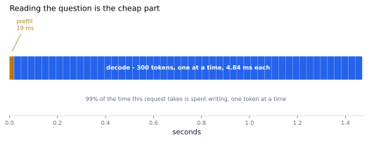
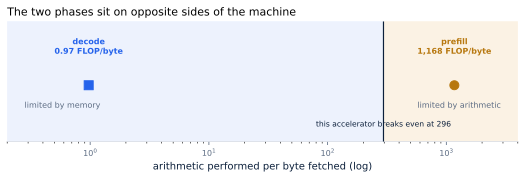
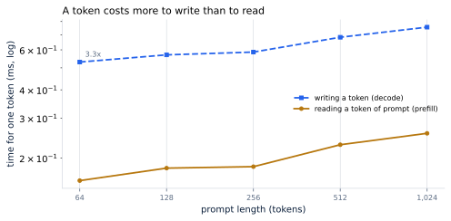

# 3. Prefill and Decode

*Written to [STANDARDS.md](STANDARDS.md). Generated from
`chapters/ch03.md` and `code/results/ch03.json`; run `make ch03` in
`code/` to re-measure and re-render.*

**Depends on:** Chapter 2.
**Tier 0** — a few minutes on a laptop CPU, free.

## Objectives

By the end of this chapter you can:

1. Name the two phases of answering a request and say what each does.
2. Explain, from the arithmetic, why they hit different limits in the
   hardware.
3. Look at any optimization in this book and say which phase it helps.
4. Explain why the time to the first word and the time between words
   are different numbers with different cures — and why input tokens
   cost less than output tokens.

## Why it matters

Chapter 2 ended with a loop: score every word, write one
token, append it, run the whole path again. That description is true
but it hides something, because **the first turn of the loop is not
like the others.**

Put one request on a clock. A 1,200-token conversation, an
8B model, 300 tokens of reply:

**Figure 3.1** — Reading the question is the cheap part. Reading the
whole 1,200-token prompt takes **19 ms**. Writing the
reply takes **1.45 seconds** — 99% of the request.
*Provenance in `code/figures/ch03-timeline.caption.txt`.*

99%. Almost everything you will ever optimize lives in
that blue band, and this chapter explains why the two bands are so
unlike each other.

## The two phases

**Prefill** is reading the prompt. Every token of it is already
known, so the model can process them **all at once**, in a single pass.
Nothing has to wait for anything else.

**Decode** is writing the reply. Each token needs its own pass, and
each pass must wait for the one before it, because the model cannot
choose its fifth word before it has chosen its fourth. This is not an
implementation weakness. It is what "generating text" means.

So the two phases differ in the one way that matters to a computer:
**how much work is available to do at the same time.**

<!-- defines: time to first token, inter-token latency -->
They also produce the two numbers a user feels. **Time to first token**
is the wait before anything appears, and it is prefill. **Inter-token
latency** is the gap between words once they start, and it is decode.
They have different causes, so they have different cures.

> **If you're new here: why "at the same time" decides everything**
>
> Modern accelerators are extremely wide. They contain thousands of
> arithmetic units that all want work simultaneously. Give a GPU one
> multiplication and it does it in a moment, with almost all of itself
> idle. Give it a million independent multiplications and it does them
> in barely longer, because it had the capacity all along.
>
> The catch is that all those units need *data*, and data arrives from
> memory far more slowly than the units can consume it. So the real
> question for any piece of work is never "how much arithmetic is
> this?" It is: **how much arithmetic do I get per byte I have to
> fetch?** Fetching is the slow part; arithmetic riding along with it
> is nearly free.
>
> <!-- defines: arithmetic intensity, memory-bound, compute-bound, break-even point -->
> That ratio has a name — **arithmetic intensity** — and the rest of
> this chapter is about the fact that prefill and decode have wildly
> different values of it. Work with too little of it is called
> **memory-bound**: the arithmetic units finish early and wait. Work
> with plenty is **compute-bound**: memory keeps up and the arithmetic
> is the limit. The value where a machine crosses from one to the other
> is its **break-even point**.

## Why the phases hit different limits

Recall the first of Chapter 2's two facts: **to produce
output, every weight in the model must be fetched from memory.** For an
8B model in two-byte numbers, that is 16 GB, fetched.

Now ask what you get for that one fetch in each phase.

- In **prefill**, you fetch the weights once and use them on
  1,200 tokens at the same time. The cost is shared
  1,200 ways.
- In **decode**, you fetch the weights once and use them on
  **one** token. Nothing is shared.

That is the whole story, and it is worth three orders of magnitude:

<!-- include: tables/ch03-reference.md -->
| Phase | Arithmetic | Bytes fetched | Work per byte | Limited by |
|---|---|---|---|---|
| Reading the prompt (prefill) | 18.7 TFLOP | 16.0 GB | **1,168.39** | compute |
| Writing a token (decode) | 0.0 TFLOP | 16.2 GB | **0.97** | memory |

An 8B model in bf16 on an accelerator that breaks even at **296** operations per byte: below that it waits for memory, above it it waits for arithmetic. Prefill of a 1,200-token prompt; decode at a 1,500-token context. Arithmetic over published specs, not a measurement.

**Figure 3.2** — The two phases sit on opposite sides of the machine.
*Provenance in `code/figures/ch03-intensity.caption.txt`.*

The vertical line is the accelerator's break-even point:
296 operations per byte fetched. Below it, the arithmetic units
finish early and sit waiting for memory. Above it, memory keeps up and
arithmetic becomes the limit.

Prefill lands at **1,168** operations per byte —
4.0x above break-even, comfortably
compute-bound. Decode lands at **0.97** —
**304x below** break-even, deeply
memory-bound. They are 1,203x apart.

This is why the two phases behave like different programs. They are the
same weights and the same arithmetic; only the amount of work sharing
each fetch has changed, and that single difference puts them on
opposite sides of the hardware.

Chapter 8 builds this picture properly, and you will
use it to predict whether an optimization can possibly help before you
spend a day implementing it.

## Measured

The arithmetic above is arithmetic. Here is the effect on a real
machine, with `tinyserve` reading prompts of 64, 128, 256, 512, 1,024 tokens and
then writing tokens at each of those lengths.

<!-- include: tables/ch03-measured.md -->
| Prompt length | Reading the prompt | Writing tokens | A token costs this much more to write |
|---|---|---|---|
| 64 | 6,287 tok/s | 1,886 tok/s | **3.3x** |
| 128 | 5,538 tok/s | 1,753 tok/s | **3.2x** |
| 256 | 5,456 tok/s | 1,705 tok/s | **3.2x** |
| 512 | 4,367 tok/s | 1,466 tok/s | **3.0x** |
| 1,024 | 3,890 tok/s | 1,323 tok/s | **2.9x** |

\* run-to-run spread exceeded 5%.

**Figure 3.3** — A token costs more to write than to read, at every
prompt length measured. *Provenance in
`code/figures/ch03-per-token.caption.txt`.*

The direction is right: writing a token costs 2.9x to 3.3x
more than reading one. The size looks badly wrong. Before blaming the
measurement, be careful which two numbers are being compared.

**1,203x is a ratio of work per byte. It is not a ratio of
time.** A phase that does less work per byte is not slower by that
factor; it is slower by however much the hardware punishes being
memory-bound. For the accelerator above, the honest time comparison is
this: prefill costs **16 microseconds** per token
of prompt, decode costs **4.84 ms** per token of output. That is
**307x** — not 1,203x. Keep the two apart.
Confusing them overstates the gap fourfold, and it is an easy mistake
to make.

So the real question is why this machine showed about three rather than
307x. There are two reasons, and Chapter 4
measures both on your own machine.

**A CPU is far more balanced than an accelerator.** How much a machine
punishes memory-bound work depends on where it breaks even, and a
general-purpose processor breaks even at a tiny fraction of an
accelerator's 296 operations per byte — it has proportionally far
less arithmetic bolted onto its memory system. The same two phases
therefore land much closer together here than they would on the
hardware you will actually deploy on.

**And `tinyserve` is too small to reach either limit.** Its matrices
are small enough that prefill never approaches the machine's peak
arithmetic, and its weights are small enough that per-call overhead,
not memory bandwidth, sets the floor under decode. Neither phase is
running against the wall that the arithmetic describes.

Keep this in mind for the rest of Part III: `tinyserve` faithfully
reproduces every *structure* in this book, and systematically
understates every *memory* effect. Where that matters, the chapter will
say so, and Part VII measures the real thing.

## What follows from this

**Two latencies, not one.** Users experience prefill as the wait before
anything appears, and decode as the speed at which words arrive. They
have different causes, so they have different cures, and a service
level objective has to name both. Chapter 5 makes them
precise.

**Every optimization targets one phase.** This is the most useful
navigational fact in the book:

| Technique | Helps | Because |
|---|---|---|
| Keeping keys and values (Chapter 12) | decode | stops re-reading the whole conversation per token |
| **Paging** the cache (Chapter 14) — storing it in fixed-size pieces that can live anywhere | decode | fits more sequences, so more work shares each fetch | <!-- defines: paging -->
| Batching (Chapter 16, Chapter 17) | decode | the one real cure: share each weight fetch across users |
| Quantization (Chapter 25, Chapter 26) | decode | fetches fewer bytes for the same weights |
| Speculative decoding (Chapter 29) | decode | gets several tokens from one fetch |
| Prefix caching (Chapter 15) | prefill | skips prompt work already done for someone else |
| Attention kernels (Chapter 20) — a **kernel** is one program that runs on the accelerator | prefill mostly | prefill is where attention's cost concentrates | <!-- defines: kernel -->
| Chunked prefill (Chapter 18) | both, by arbitrating | stops a long prompt stalling everyone's decode |

Notice how one-sided that list is. Decode is where the money goes, so
decode is where the book goes.

**And it explains a price you already saw.**
Chapter 1 recorded published prices for a hosted 8B
model: about $0.02 per million input tokens and $0.05 per million
output tokens. Input tokens are prefill, shared 1,200 ways.
Output tokens are decode, shared with nobody. The provider is not
charging you more for output out of preference; they are passing on
1,203x, softened by how well they batch.

## Where this is soft

**The two phases do not run in tidy sequence on a real server.** Figure
3.1 shows one request alone. A live server is prefilling somebody's
prompt while decoding somebody else's reply, and a long prefill can
stall everyone's decode. That conflict is a scheduling problem, and
Chapter 18 is where it is solved.

**The measured numbers understate the effect**, for the cache reason
above. Trust their direction and shape, not their magnitude.

<!-- defines: grouped-query attention, multi-query attention -->
**The cache can be made smaller at the source.** Production models let
several query heads share one key-value head, which cuts the stored
cache proportionally; this is **grouped-query attention**, and its
extreme, one shared head for all queries, is **multi-query attention**.
Chapter 12 does the arithmetic.

**The balance shifts with the workload.** A summarization service with
huge prompts and one-word answers is prefill-heavy. A reasoning model
that produces thousands of thinking tokens before answering is decode-
heavy to an extreme. Chapter 33 covers both ends.

## In production

- **Input and output tokens are metered and priced separately**,
  everywhere, for the reason above.
- **Time to first token and inter-token latency are reported
  separately** by every serving engine's metrics. If only one of them
  is on your dashboard, you are blind to half your service.
- **Some systems run the two phases on different machines**, sending
  the conversation's keys and values between them, because one phase
  wants arithmetic and the other wants memory bandwidth.
  Chapter 19 builds it.

## Numbers to remember

| Quantity | Value |
|---|---|
| Work per byte, prefill of a 1,200-token prompt | 1,168 operations per byte |
| Work per byte, decode | 0.97 operations per byte |
| Ratio between the phases | 1,203x |
| Where this accelerator breaks even | 296 operations per byte |
| Share of one request's time spent decoding | 99% |
| The one real cure for decode's problem | share each weight fetch across more tokens |

## Sources

- Pope, Douglas, Chowdhery, Devlin, Bradbury, Levskaya, Heek, Xiao,
  Agrawal and Dean, "Efficiently Scaling Transformer Inference",
  MLSys 2023 — the standard analysis of the two phases and their
  different limits at serving scale.
- Williams, Waterman and Patterson, "Roofline: An Insightful Visual
  Performance Model for Multicore Architectures", CACM 52(4), 2009 —
  the origin of the break-even point in Figure 3.2.
- Agrawal, Kedia, Panwar, Mohan, Kwatra, Gulavani, Tumanov and
  Ramjee, "Taming Throughput-Latency Tradeoff in LLM Inference with
  Sarathi-Serve", OSDI 2024 — what happens when the two phases compete
  for the same accelerator.
- Published API price sheets, September 2026, recorded in `FACTS.md` —
  the input and output prices quoted above.

## Exercises

**★ 3.1** A request has a 4,000-token prompt and a 50-token answer.
Another has a 50-token prompt and a 4,000-token answer. Both move the
same number of tokens. Which costs the provider more, and by roughly
how much?

**★ 3.2** Using Figure 3.2, explain why making an accelerator twice as
fast at arithmetic, with unchanged memory bandwidth, would barely
improve decode.

**★★ 3.3** Work per byte for prefill was 1,168
operations per byte with a 1,200-token prompt. Recompute it
for a 40-token prompt. Is prefill still compute-bound? What
does your answer say about a chat service whose users send very short
messages?

**★★ 3.4** Run `python3 -m bench.run_ch03` with `DECODE_STEPS` raised
to 200 and the largest prompt raised to 2,048. Predict first whether
the measured gap will widen or narrow, and why. Then explain your
result in terms of the cache argument above.

**★★★ 3.5** This chapter separates two ratios: work per byte
(1,203x) and time per token (307x). Derive the
second from the first. That is, given a phase's work per byte, a
machine's peak arithmetic rate and its memory bandwidth, write the
expression for how long one token takes, and show where the factor of
four between the two ratios comes from. Then use your expression to
predict the time ratio on a machine that breaks even at 8 operations
per byte instead of 296, and check your prediction against
Chapter 4's measurements.
