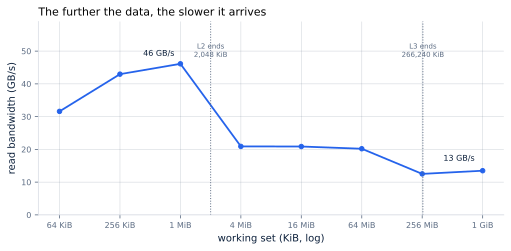
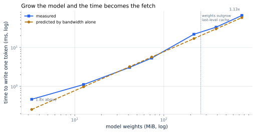

# 4. The Memory Wall

*Written to [STANDARDS.md](STANDARDS.md). Generated from
`chapters/ch04.md` and `code/results/ch04.json`; run `make ch04` in
`code/` to re-measure on your own machine and re-render.*

**Depends on:** Chapter 3.
**Tier 0** — a few minutes on a laptop CPU, free. Every measurement in
this chapter is one you can reproduce on the machine in front of you.

## Objectives

By the end of this chapter you can:

1. Compute the fastest a machine could possibly write one token, from
   the model's size and the machine's memory bandwidth.
2. Explain why a cache does not rescue decoding, and why buying more
   arithmetic does not either.
3. Measure your own machine's memory hierarchy and its break-even point.
4. Name the only thing that actually cures the problem.

## Why it matters

Chapter 3 showed decoding sitting far below the
accelerator's break-even point, doing about one operation for every
byte it fetches. It did not say *why* fetching should be the slow part.
This chapter answers that, and proves the claim that chapter left
hanging.

The short answer is that it is not new and it is not an accident.
In 1995 — a decade before anyone trained a language model — Wulf and
McKee pointed out that processor speed and memory speed were both
improving exponentially, but at different exponents, and that the gap
between two diverging exponentials itself grows exponentially. They
called the result a **memory wall** and predicted everyone would hit
it. Thirty years later, serving a language model is what hitting it
looks like.

> **If you're new here: what bandwidth is**
>
> **Bandwidth** is how many bytes per second a machine can move from
> memory into the processor. **Latency** is how long one fetch takes
> to arrive. They are different: a delivery lorry has enormous
> bandwidth and terrible latency.
>
> Decoding is a bandwidth problem, not a latency one. The model does
> not fetch one weight and wait; it streams all of them, in order, as
> fast as the memory system will supply them. So the number that
> matters is bytes per second, and the question this chapter asks is
> simply: how many, and why not more?

## Memory is not one thing

A processor does not have "memory". It has a hierarchy of them, each
larger and slower than the one above it. Small, fast stores sit next to
the arithmetic; large, slow ones sit further away.

You can see the whole hierarchy by outgrowing it. The measurement below
reads a block of memory over and over and reports how fast the bytes
arrive, for blocks from 48 KiB up to a gigabyte:

**Figure 4.1** — The further the data, the slower it arrives. Read
bandwidth against working-set size on this machine, measured
single-threaded. *Provenance in
`code/figures/ch04-cliff.caption.txt`.*

The steps in that line are the hardware. While the block fits in this
core's private caches — 48 KiB at the first level, 2 MiB at
the second — bytes arrive at up to **46 GB/s**. Once the block
is far larger than the last-level cache of 260 MiB, they arrive at
**13 GB/s**. Same machine, same instruction, same bytes:
**3.4x slower**, purely because of where the data had to
come from.

That is the wall, in miniature. Now watch a model hit it.

## Why the cache does not save you

Caches work by **reuse**. Fetch something once, use it many times, and
the cost of fetching is amortized. Everything in the hierarchy above is
built on the assumption that programs reuse data.

Decoding does not reuse data. Chapter 2's first fact
said that writing one token reads every weight in the model, once.
Then that token is finished, and the next one reads every weight again
— from the beginning, in the same order, with nothing kept.

A cache can only help if the model fits in it. For a real model it
cannot: 16 GB of weights against a last-level cache measured in
hundreds of megabytes is not close. So **every token pays the full
price of fetching the entire model from main memory**, and the fastest
that can possibly happen is:

> time for one token  ≥  weights in bytes ÷ memory bandwidth

For an 8-billion-parameter model in two-byte numbers on an H100, that
is 16 GB ÷ 3.35 TB/s = **4.8 ms per token** —
about **209 tokens a second**, and no amount of
programming skill will beat it. This is the number
Chapter 1 opened the book with, and it is nothing more
than a division.

## The wall, measured

Here is the claim Chapter 3 made and could not prove:
that `tinyserve` is too small to show the memory wall, and that a
larger model would.

The experiment grows the model — nothing else changes — from
3.3 MiB of weights to 753 MiB, a span of 229x, and
times one decode step at each size. Against each measurement sits the
prediction from the division above, using this machine's own measured
bandwidth:

<!-- include: tables/ch04-wall.md -->
| Model weights | Time to write one token | Predicted by bandwidth alone | Measured / predicted |
|---|---|---|---|
| 3 MiB | 0.47 ms | 0.26 ms | **1.83x** |
| 13 MiB | 1.12 ms | 0.98 ms | **1.14x** |
| 41 MiB | 3.08 ms | 3.22 ms | **0.96x** |
| 73 MiB | 5.35 ms | 5.69 ms | **0.94x** |
| 218 MiB | 21.87 ms | 16.93 ms | **1.29x** |
| 386 MiB | 33.22 ms | 30.03 ms | **1.11x** |
| 753 MiB | 66.40 ms | 58.53 ms | **1.13x** |

**Figure 4.2** — Grow the model and the time becomes the fetch.
*Provenance in `code/figures/ch04-wall.caption.txt`.*

At 3.3 MiB the measurement sits **1.8x above** the
prediction. Bandwidth is not the limit there; the model is small enough
to sit in cache, and what you are timing is mostly the fixed cost of
setting up the work.

At 753 MiB the measurement is **1.13x** the prediction.
They have converged. Nothing else is left: writing a token has become
fetching the weights, and a number you can compute with a division now
tells you what the machine will do.

**That is the wall.** Not a metaphor — a line that measurement lands on
once the model is big enough, on a laptop, in a few minutes.

## Why more arithmetic does not help

The natural instinct is to buy a faster chip. Look at what "faster"
usually means.

<!-- include: tables/ch04-machine.md -->
| | This machine (measured) | An H100 (published) |
|---|---|---|
| Memory bandwidth | 13 GB/s | 3.35 TB/s |
| Arithmetic | 156 GFLOP/s | 990 TFLOP/s |
| **Breaks even at** | **12** FLOP/byte | **296** FLOP/byte |

The accelerator is 26x more lopsided: it carries far more arithmetic per unit of memory bandwidth, so work that is short of arithmetic is punished far more severely on it. Measured single-threaded; see the note on the measuring machine.

The accelerator has roughly 26x more arithmetic per unit of
memory bandwidth than this laptop-class processor does. That is not a
flaw; it is what the hardware was designed for. Training a model is
enormously arithmetic-heavy, and accelerators are built for training.

But it means the accelerator has to be handed **296**
operations for every byte before its arithmetic is the thing that
limits it. Decoding brings about one. So the hardware sold as the
fastest way to run a model is, for this particular job, the most
lopsided machine you could pick.

And it gets worse with each generation. **Adding arithmetic without
adding bandwidth moves the break-even point further right**, which
makes decoding *relatively* worse, not better. A chip with twice the
arithmetic and the same memory system writes tokens at exactly the same
speed.

This is the answer to the question Chapter 1 raised
and left open: why a very expensive accelerator uses a fraction of a
percent of its arithmetic to serve one user. It is not being wasted
through bad programming. It is idle because it is waiting, and the
thing it is waiting for cannot be bought faster.

## The only cure

You cannot make the fetch faster — bandwidth is a property of the
hardware you rented. Everything that works, works by making that fetch
**count for more**. There are exactly three ways:

1. **Use each fetch for more tokens.** Read the weights once, write a
   token for a hundred conversations at the same time. This is
   batching, it is the single most valuable idea in serving, and it is
   Chapter 16 and Chapter 17.
2. **Fetch fewer bytes.** Store each weight in one byte instead of two
   and the division above halves. This is quantization,
   Chapter 25 and Chapter 26.
3. **Fetch less often.** Get several tokens out of one pass over the
   weights by guessing ahead and checking. This is speculative
   decoding, Chapter 29.

Every technique in Parts IV through VI is one of those three moves. You
now have the framework to judge any of them before you read the
chapter: ask what it does to bytes fetched per token produced. If the
answer is nothing, it will not help decoding, however clever it is.

## Where this is soft

**Measured single-threaded.** Bandwidth and arithmetic were both
measured on one core so that the break-even point compares like with
like. A multi-core measurement gives higher numbers for both; the
ratio, which is what the chapter argues from, moves much less.

**The small end of Figure 4.1 is not pure bandwidth.** At working sets
of tens of kilobytes the measurement includes the fixed cost of
starting the work, so the left of that curve understates how fast the
first cache level really is. The cliff between the levels is real; the
peak height is conservative.

**The arithmetic rate is the noisiest number here.** It moved
6% between repeats on this machine, and that carries
straight into the break-even point, which is why this chapter quotes it
as a round 12 rather than to three digits. The comparison the
argument rests on — around ten here against 296 on the
accelerator — survives that variance comfortably.

**A shared cloud instance.** These numbers come from a virtual machine
whose memory system is shared with other tenants. Your own machine will
give different values and the same shape — which is the point of it
being a Tier 0 experiment.

**A CPU is not an accelerator.** The hierarchy, the reuse argument and
the division all carry over exactly. The magnitudes do not: an
accelerator's memory is far faster in absolute terms and far more
lopsided relative to its arithmetic. Where this book needs the real
magnitudes, it says so, and Part VII measures them.

## In production

- **Bandwidth is what you are buying.** When accelerators are compared
  for serving, memory bandwidth and memory capacity predict throughput
  better than peak arithmetic does. Read the datasheet in that order.
- **Bandwidth per dollar-hour** is the metric that matters for decode,
  and it is not the metric most marketing leads with.
- **Mixture-of-experts models break the "every weight" assumption** on
  purpose: they activate a fraction of their parameters per token,
  which is a direct attack on the division above.
  Chapter 33 covers what that costs elsewhere.
- **If your dashboard shows low accelerator utilization during
  decoding, that is expected**, not a bug to chase. The fix is
  batching, not profiling.

## Numbers to remember

| Quantity | Value |
|---|---|
| The decode floor | weights in bytes ÷ memory bandwidth |
| 8B in bf16 on an H100 | 16 GB ÷ 3.35 TB/s = 4.8 ms per token |
| This machine, cache versus memory | 46 GB/s versus 13 GB/s |
| Breaks even at | 12 FLOP/byte here, 296 on the accelerator |
| Effect of doubling arithmetic on decode | none |
| The three cures | more tokens per fetch, fewer bytes, fewer fetches |

## Sources

- Wulf and McKee, "Hitting the Memory Wall: Implications of the
  Obvious", ACM SIGARCH Computer Architecture News 23(1), March 1995,
  pp. 20–24 — names the problem and argues that a gap between two
  diverging exponentials must itself diverge.
- Pope et al., "Efficiently Scaling Transformer Inference", MLSys 2023
  — the same argument applied to transformer serving, with the
  arithmetic for batching as the cure.
- NVIDIA H100 datasheet — the bandwidth and arithmetic figures for the
  accelerator column, recorded in `FACTS.md`.

## Exercises

**★ 4.1** A 70-billion-parameter model is served in two-byte numbers on
an accelerator with 3.35 TB/s of memory bandwidth. What is the fastest
it can write one token for a single user? How many tokens per second is
that?

**★ 4.2** A vendor offers a chip with three times the arithmetic of an
H100 and the same memory bandwidth, for twice the price. What happens
to your decode throughput, and what happens to your cost per million
output tokens?

**★★ 4.3** Run `make ch04` on your own machine. Where does your cache
cliff fall, and how does it compare to your processor's published cache
sizes? At what model size does your measurement converge on the
bandwidth prediction?

**★★ 4.4** Section "The only cure" lists three ways to make a fetch
count for more. For each, write the effect on the decode floor formula
as an equation. Which of the three changes the numerator, which the
denominator, and which neither?

**★★★ 4.5** The convergence in Figure 4.2 is not perfect: the largest
model still sits slightly above the bandwidth prediction. Account for
the gap. Instrument `forward` to separate time spent in matrix
multiplication from time spent elsewhere, measure both at the largest
model size, and report how much of the residual is arithmetic, how much
is the KV cache read, and how much is overhead. Report with provenance.
