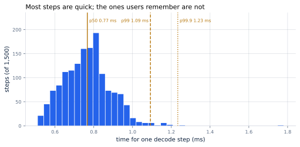
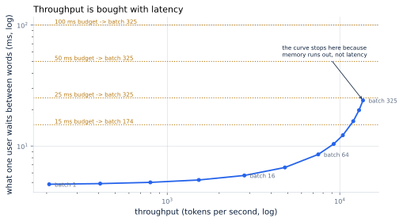

# 5. Latency, Throughput, and the SLO

*Written to [STANDARDS.md](STANDARDS.md). Generated from
`chapters/ch05.md` and `code/results/ch05.json`; run `make ch05` in
`code/` to re-measure and re-render.*

**Depends on:** Chapter 4.
**Tier 0** — a couple of minutes on a laptop CPU, free.

## Objectives

By the end of this chapter you can:

1. Name the four numbers a serving team argues about, and say which
   users feel and which finance feels.
2. Explain why an average latency is close to useless and what to
   report instead.
3. Read a throughput-against-latency curve and find the operating point
   a given budget allows.
4. Write a service level objective for a real service, and say which of
   its constraints actually binds.

## Why it matters

Chapter 4 ended with the only cure for decoding's problem:
share each fetch of the weights across more tokens. Serve a hundred
conversations in the pass that would have served one and the cost per
token collapses.

There is a catch, and it is the subject of this chapter. **That pass
takes longer.** Every one of those hundred users waits for the whole
batch, every token. Push it far enough and you have an extremely
cost-efficient service that nobody wants to use.

So serving is not an optimization problem. It is a **constrained**
optimization problem: get throughput as high as it will go *without*
making the experience worse than you promised. This chapter is about
stating that promise precisely, because a promise you cannot state you
cannot engineer against.

## The four numbers

**Time to first token (TTFT).** From the request arriving to the first
word appearing. This is prefill, so it grows with the prompt.

**Inter-token latency (ITL).** The gap between successive words once
they start. This is one decode step, and it is what makes a reply feel
brisk or laboured.

**Throughput.** Tokens per second the whole server produces, across
everyone. This is what your bill divides by.

**Goodput.** Throughput that actually met the promise. A server
producing a million tokens a second, all of them too late to be useful,
has excellent throughput and zero goodput. Goodput is the honest
number, and it is the one to put on a dashboard.

The first two belong to a user. The third belongs to your accountant.
The fourth is the only one that belongs to both.

> **If you're new here: why a percentile, not an average**
>
> Suppose a hundred requests: ninety-nine take 10 ms and one takes
> 2,000 ms. The average is about 30 ms, which sounds fine, and it
> describes not one of those hundred requests. It is not the fast
> experience and it is not the slow one.
>
> A **percentile** describes a real experience. The **p50**, or median,
> is what a typical request gets. The **p99** is what the unluckiest
> one in a hundred gets. Since a single reply is hundreds of decode
> steps, and a single user session is many replies, users meet your
> p99 constantly — it is not a rare event, it is *most people, some of
> the time*.
>
> This is why serving teams quote percentiles and treat averages with
> suspicion. Dean and Barroso called it "the tail at scale", and their
> point was that as a system grows, the tail stops being an edge case
> and becomes the typical experience.

## The tail is real

Here is the distribution of 1,500 consecutive decode steps on
`tinyserve`, one sequence, nothing else running on the machine:

**Figure 5.1** — Most steps are quick; the ones users remember are not.
*Provenance in `code/figures/ch05-tail.caption.txt`.*

<!-- include: tables/ch05-percentiles.md -->
| | Time for one decode step | Relative to the median |
|---|---|---|
| Mean | 0.77 ms | 1.00x |
| p50 (median) | 0.77 ms | 1.00x |
| p90 | 0.93 ms | 1.21x |
| p99 | 1.09 ms | 1.42x |
| p99.9 | 1.23 ms | 1.61x |
| Slowest seen | 1.78 ms | 2.32x |

1,500 consecutive decode steps on tinyserve, nothing else running.

The mean is 1.00x the median here, which is the one case where
an average is not actively misleading — and even so it tells you
nothing about the shape. The p99 is 1.4x the median, and the
slowest step of the 1,500 took 1.78 ms against a typical
0.77 ms.

Nothing caused that. There was no other tenant, no garbage collection
worth the name, no network. It is the ordinary jitter of a real machine
— scheduling, interrupts, memory timing — and it is the *floor* on
tail behaviour, not a realistic estimate. A production server has
queueing, other tenants, and requests of wildly different lengths, and
its tail is far worse.

**Design for the tail you will have, not the median you measured.**

## Throughput is bought with latency

Now the trade. The curve below is what the hardware allows: how
throughput and per-user latency move together as more sequences are
decoded in one pass.

**Figure 5.2** — Throughput is bought with latency. *Provenance in
`code/figures/ch05-tradeoff.caption.txt`.*

Serving one sequence gives 207 tokens per second at
4.8 ms between words. Serving 325 gives
13,626 at 24 ms. **Throughput rises
66x; the wait between words rises 5x.**
That is an extraordinarily good trade, and it is the entire economic
case for batching.

It is a good trade because of the memory wall. Up the flat part of that
curve you are adding sequences almost for free — the fetch of the
weights was going to happen anyway, and more riders on it cost almost
nothing. The curve only turns upward when the per-sequence costs (each
sequence's own cached keys and values) start to rival the shared cost
of the weights.

## What a budget buys

Draw a horizontal line at the slowest inter-token latency you are
willing to inflict, and read off where it crosses. That is your
operating point.

<!-- include: tables/ch05-budgets.md -->
| Latency budget | Largest batch it allows | Throughput | Cost per 1M output tokens | What stops you |
|---|---|---|---|---|
| 15 ms | 174 | 11,608 tok/s | **$0.078** | the budget |
| 25 ms | 325 | 13,626 tok/s | **$0.066** | memory runs out first |
| 50 ms | 325 | 13,626 tok/s | **$0.066** | memory runs out first |
| 100 ms | 325 | 13,626 tok/s | **$0.066** | memory runs out first |

Arithmetic over published specs, not a measurement. The batch is also capped at 325 sequences by the memory accounting in Chapter 13.

Read the last column, because it contains the chapter's real lesson.
**Only the 15 ms budget actually binds.** Every looser
budget permits the same batch, because before latency becomes a problem
you run out of memory to hold the conversations — the ceiling
Chapter 13 computes.

That is worth sitting with. A team could spend a quarter tuning latency
and buy nothing, because latency was never what stopped them. The first
job of a service level objective is not to be ambitious; it is to tell
you **which constraint is actually binding**, so you work on the right
one.

## The case study, stated

This is where the service this book keeps returning to gets its
numbers. A customer-support assistant:

- **Traffic** — 1,200-token conversations, 300-token
  replies, 200 requests a second at the busy hour.
- **The promise** — p99 time to first token under 1,000 ms,
  p99 between words under 50 ms, available 99.9% of the time.
- **The goal** — the lowest cost per million output tokens that keeps
  that promise.

Against the model above, that promise resolves to: an operating point
of **325 concurrent sequences**, 24 ms
between words, 13,626 tokens per second.

And note what it says about TTFT. Prefill of a 1,200-token prompt
takes about **19 ms** against the 1,000 ms promised —
53x of headroom. For this workload, time to first token
is not a problem at all. A summarization service with 30,000-token
documents would find the opposite, and would spend its engineering
there instead.

A user sees the first word almost at once, then words at about
42 a second — several times faster than anyone reads — and
the complete 300-token reply lands in 7.2 seconds. That is the
service. Everything in Parts III to VIII is an attempt to serve it for
less.

## Where this is soft

**The curve is a model, not a measurement.** It is arithmetic over the
hardware's published specifications, and it assumes every sequence is
the same length, that batching is free, and that nothing queues.
Chapter 16 and Chapter 17 measure the real curve,
and it is lower.

**The measured tail is a floor.** One sequence on an idle machine is
the best case. Add queueing, other tenants and mixed request lengths
and the tail stretches; Chapter 41 models that properly.

**Availability is not modelled here at all.** The 99.9% in the promise
is a reliability target, not a latency one, and it is
Chapter 44's subject.

**Percentiles do not compose.** A reply is hundreds of decode steps, so
the chance of a reply containing at least one p99 step is high. The
p99 of *steps* and the p99 of *replies* are different numbers, and
exercise 5.4 asks you to work out how different.

## In production

- **Report p50 and p99 for TTFT and ITL separately.** Four numbers, not
  one latency figure. Every serving engine exposes them.
- **Alert on goodput**, not throughput. A server that has quietly
  stopped meeting its promise still looks busy.
- **Write the SLO before tuning.** Without it you cannot tell an
  improvement from a trade, and most changes in this book are trades.
- **Re-derive the binding constraint after every change.** Fix memory
  and latency may start to bind; fix latency and cost may. The
  constraint moves, and optimizing a constraint that is not binding is
  the most common wasted quarter in this field.

## Numbers to remember

| Quantity | Value |
|---|---|
| The four numbers | TTFT, inter-token latency, throughput, goodput |
| What to report | p50 and p99, never a bare average |
| Batching's trade, this model | 66x throughput for 5x latency |
| Measured tail, idle machine | p99 is 1.4x the median — and that is the floor |
| The case study's operating point | 325 sequences, 24 ms between words |
| First question of any SLO | which constraint actually binds? |

## Sources

- Dean and Barroso, "The Tail at Scale", Communications of the ACM
  56(2), February 2013, pp. 74–80 — why tail latency dominates the
  experience of a large service, and why averages mislead.
- Beyer, Jones, Petoff and Murphy, *Site Reliability Engineering*,
  O'Reilly, 2016, chapters 4 and 6 — service level objectives, and
  choosing what to measure.
- Pope et al., "Efficiently Scaling Transformer Inference", MLSys 2023
  — the latency-throughput trade for transformer decoding.

## Exercises

**★ 5.1** Your service promises p99 inter-token latency under 40 ms.
Using Figure 5.2, what is the largest batch you may run, and what
throughput does it give?

**★ 5.2** A colleague reports "average latency is 30 ms, we are fine".
Give two distributions with a 30 ms mean, one acceptable and one
unacceptable, and say what you would ask them to report instead.

**★★ 5.3** The chapter says only the 15 ms budget binds,
because memory runs out first. Suppose you halve the KV cache each
sequence needs. Which constraint binds now, and what does that do to
the operating point? (Chapter 26 is one way to halve it.)

**★★ 5.4** A reply is 300 tokens, so it is 300 decode
steps. If each step independently has a 1% chance of exceeding the p99,
what fraction of *replies* contain at least one such step? What does
your answer say about quoting a per-step p99 to a product manager?

**★★★ 5.5** Goodput is defined in this chapter but never measured.
Measure it: extend the harness to generate requests at a chosen arrival
rate, apply the case study's promise as a pass/fail test per request,
and report goodput against offered load. Find the load at which goodput
peaks and the load at which it collapses, and explain the gap between
them. Report with percentiles and provenance.
