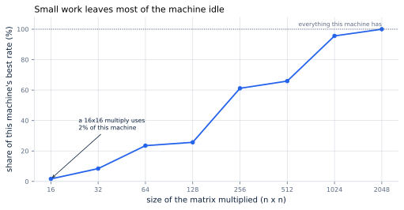
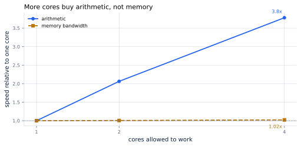

# 7. Reading the GPU

*Written to [STANDARDS.md](STANDARDS.md). Generated from
`chapters/ch07.md` and `code/results/ch07.json`; run `make ch07` in
`code/` to measure your own machine and re-render.*

**Depends on:** Chapter 6.
**Tier 0** — a few minutes on a laptop CPU, free. The accelerator
figures are published specifications, clearly marked.

## Objectives

By the end of this chapter you can:

1. Explain what a wide processor is, and why small work leaves most of
   it idle.
2. Explain why adding processing power does not speed up decoding —
   measured, not asserted.
3. Read an accelerator's datasheet in the order that matters for
   serving.
4. Report what your own machine can do, and read a live accelerator's
   monitoring without being fooled by it.

## Why it matters

Two claims are outstanding. Chapter 1 said a very
expensive accelerator uses a fraction of a percent of its arithmetic
serving one user. Chapter 4 said buying more arithmetic
would not help. Both are about the *shape* of the machine, and this
chapter measures that shape.

You cannot measure an accelerator from a laptop. You do not need to:
the effect is a property of **wide hardware**, not of any particular
chip, and your laptop is a narrow version of the same thing. Everything
below is measured on whatever machine you run it on, and the
accelerator's published numbers are given alongside for scale.

> **If you're new here: what "wide" means**
>
> A processor core does one stream of instructions at a time, quickly.
> A **wide** processor has many units doing arithmetic at once, and
> gets its speed from doing thousands of things simultaneously rather
> than one thing faster.
>
> An accelerator takes this to an extreme. An H100 has 132 **streaming
> multiprocessors**, each of which runs many threads in lockstep. That
> is where 990 TFLOP/s of arithmetic comes from: not from being
> quick, but from being enormously parallel.
>
> The catch, and the subject of this chapter: **all that width has to
> be filled.** A machine built to do ten thousand things at once,
> handed one thing, does one thing.

## Small work leaves the machine idle

Matrix multiplication is where a model spends its time. Here is how
much of this machine a multiply uses, against how big it is:

<!-- include: tables/ch07-sizes.md -->
| Matrix multiplied | Rate achieved | Share of this machine's best |
|---|---|---|
| 16 x 16 | 8 GFLOP/s | **2%** |
| 32 x 32 | 40 GFLOP/s | **8%** |
| 64 x 64 | 112 GFLOP/s | **24%** |
| 128 x 128 | 123 GFLOP/s | **26%** |
| 256 x 256 | 293 GFLOP/s | **61%** |
| 512 x 512 | 315 GFLOP/s | **66%** |
| 1024 x 1024 | 457 GFLOP/s | **96%** |
| 2048 x 2048 | 478 GFLOP/s | **100%** |

Measured on Intel(R) Xeon(R) Processor @ 2.10GHz, 4 cores, median of 5 runs. The curve is not perfectly smooth: some sizes suit the library's internal blocking better than others.

**Figure 7.1** — Small work leaves most of the machine idle.
*Provenance in `code/figures/ch07-size.caption.txt`.*

A 16×16 multiply reaches **2%** of what
this machine can do. The same operation at 2048×2048 reaches
all of it. Nothing about the hardware changed between those two rows —
only whether there was enough work to fill it.

Now recall the shapes from Chapter 2. In the reference
model, one projection is a multiply of 4,096 by 4,096
numbers. During **prefill**, 1,200 tokens go through it at once: a
1,200-row multiply, comfortably to the right of Figure 7.1. During
**decode**, one token goes through it: a **single-row** multiply, off
the left-hand edge of that chart entirely.

That is the same fact Chapter 3 established from
arithmetic intensity, arriving from the other direction. Decoding is
not just short of bytes-per-operation; it is short of *work to do at
once*. The machine is idle for both reasons, and batching fixes both,
because adding sequences makes the multiply taller.

## More cores buy arithmetic, not memory

Here is the experiment that settles Chapter 4's claim.
Take one operation limited by arithmetic and one limited by memory, and
run each with more of the machine allowed to work:

<!-- include: tables/ch07-scaling.md -->
| Cores allowed | Arithmetic | Memory bandwidth |
|---|---|---|
| 1 | 120 GFLOP/s (**1.00x**) | 13.1 GB/s (**1.00x**) |
| 2 | 248 GFLOP/s (**2.06x**) | 13.2 GB/s (**1.01x**) |
| 4 | 454 GFLOP/s (**3.78x**) | 13.4 GB/s (**1.02x**) |

**Figure 7.2** — More cores buy arithmetic, not memory. *Provenance in
`code/figures/ch07-scaling.caption.txt`.*

With 4 cores instead of one, arithmetic runs
**3.8x** faster. Memory bandwidth runs
**1.02x** — which is to say it does not improve at all, and
in this measurement slightly degrades, because the cores now contend
for the one memory system they share.

**One memory system, however many processors.** That is the sentence to
keep. It is why every generation of accelerator widens the gap rather
than closing it: adding arithmetic is comparatively easy and adding
bandwidth is comparatively hard, so the break-even point
(296 operations per byte on an H100) drifts higher with each
generation, and memory-bound work like decoding falls further behind.

Buying a wider machine to speed up decoding is buying the thing that is
not the problem.

## Reading a datasheet

Accelerator datasheets lead with the arithmetic figure, because it is
the largest number. For serving, read them in this order instead:

1. **Memory capacity.** Does the model fit, with room for
   conversations? If not, nothing else matters — see
   Chapter 13 and Chapter 38.
2. **Memory bandwidth.** This sets your decode speed, through the
   division in Chapter 4. It is the number that predicts
   throughput.
3. **Arithmetic, by precision.** This sets prefill speed, and tells you
   what a lower precision buys — often exactly double per halving,
   which is Chapter 26's argument.
4. **Interconnect.** Only once a model needs more than one card. The
   gap between an in-node link and a general-purpose bus is large
   enough to decide whether splitting a model is viable at all.

Every figure this book quotes for accelerators lives in `FACTS.md` with
its source and the month it was checked, because these change.

## Watching a live accelerator

When you do have one, `nvidia-smi` is the first thing you will run, and
its headline number will mislead you.

**`GPU-Util` is not the fraction of the machine you are using.** It is
the fraction of *time* during which at least one kernel was running.
A tiny kernel occupying a single one of an H100's 132 streaming
multiprocessors, run continuously, reports **100%** — while the machine
is 0.8% busy.

That is not a rare pathological case. It is precisely what decoding one
sequence looks like: continuous, small, and almost entirely idle. A
dashboard showing 100% GPU utilization on a decode-heavy service is
telling you the card is *awake*, not that it is *working*.

What to look at instead:

- **Memory used** — against capacity, the number that actually stops
  you, per Chapter 13.
- **`DCGM_FI_PROF_SM_ACTIVE`** — the share of cycles with any work
  resident on a multiprocessor. This is closer to the honest answer.
- **`DCGM_FI_PROF_SM_OCCUPANCY`** — how full each multiprocessor is.
- **Achieved tokens per second**, from your own harness. In the end
  this is the only metric that pays the bill, and
  Chapter 9 builds it next.

## Renting one without surprises

- **You pay for the card, not the work.** An idle rented accelerator
  costs exactly what a busy one does, which is the whole of
  Chapter 6's argument.
- **Check the billing granularity** before you start: per second, per
  minute and per hour differ by a lot for short experiments.
- **Spot and pre-emptible instances** are much cheaper and can be taken
  away mid-run. Fine for measurement, not for serving.
- **Check what is attached.** Two instances with the same accelerator
  can differ in host memory, disk and network by enough to dominate a
  benchmark, which is why Chapter 9 records the whole
  machine alongside every number.
- **Measure before you trust.** Run the device report on the machine
  you rented. Virtualized and shared instances do not always deliver
  the datasheet.

## Where this is soft

**This is a CPU standing in for an accelerator.** The structure —
width needing wide work, one memory system behind many processors —
is the same. The magnitudes are not: an accelerator is far wider and
far more lopsided, so both effects are much stronger there than the
numbers above.

**Four cores is a narrow test of parallel scaling.** The arithmetic
speedup of 3.8x on 4 cores is sub-linear partly
because of the small core count and partly because of this shared
virtual machine. The comparison that matters is between the two lines,
not the absolute value of either.

**Figure 7.1 is not perfectly smooth.** Some matrix sizes suit the
library's internal blocking better than others, so the curve has bumps.
The trend is the finding; individual points are not.

## In production

- **Judge accelerators on memory bandwidth and capacity** for decode
  work, not on the headline arithmetic figure.
- **Do not trust `GPU-Util` as an efficiency metric.** Alert on tokens
  per second and on memory, not on it.
- **Record the machine with every measurement.** Instance type,
  driver, and what else was resident. Chapter 9 makes
  this a rule.
- **Re-check the datasheet each generation.** The ratio of arithmetic
  to bandwidth is what decides how much of this book you need, and it
  has moved in one direction for a decade.

## Numbers to remember

| Quantity | Value |
|---|---|
| Wide hardware needs wide work | a 16×16 multiply uses 2% of this machine |
| Decode's shape | a single-row multiply; prefill's is 1,200 rows |
| More cores, arithmetic | 3.8x on 4 cores |
| More cores, memory bandwidth | 1.02x — one memory system, however many processors |
| Datasheet reading order | capacity, bandwidth, arithmetic, interconnect |
| `nvidia-smi` GPU-Util | time any kernel ran; 100% is compatible with 0.8% busy |

## Sources

- NVIDIA H100 whitepaper and datasheet — streaming multiprocessor
  count, memory capacity and bandwidth, arithmetic by precision.
  Recorded in `FACTS.md`.
- NVIDIA DCGM documentation and published analyses of GPU utilization
  metrics — what `GPU-Util` measures and what to use instead, recorded
  in `FACTS.md`.
- Williams, Waterman and Patterson, "Roofline", CACM 52(4), 2009 — the
  break-even point, built properly in Chapter 8.

## Exercises

**★ 7.1** Two cards have identical memory bandwidth; one has twice the
arithmetic. Which serves more decode tokens per second, and why?

**★ 7.2** A dashboard shows GPU-Util at 99% and throughput far below
what you expected. Give the most likely explanation in one sentence,
and name the metric you would look at next.

**★★ 7.3** Run `make ch07` on your own machine. At what matrix size do
you reach 90% of your peak rate? Using that, estimate the smallest
batch size at which decoding would start to fill your machine, and say
what assumption makes the estimate rough.

**★★ 7.4** Figure 7.2 shows bandwidth failing to improve with more
cores. Predict what the same experiment would show on a machine with
32 cores and the same memory system, and describe an experiment that
would distinguish your prediction from "the benchmark is broken".

**★★★ 7.5** The chapter claims decode's single-row multiply sits off
the left edge of Figure 7.1. Put it on the chart. Measure achieved rate
for multiplies of shape (m × 4,096) by (4,096 ×
4,096) for m from 1 to 2,048, which is the batch dimension of a
real decode step. Report where the curve reaches half of peak, compare
it to the concurrency ceiling from Chapter 13, and
say whether a real server can ever fill this machine.
