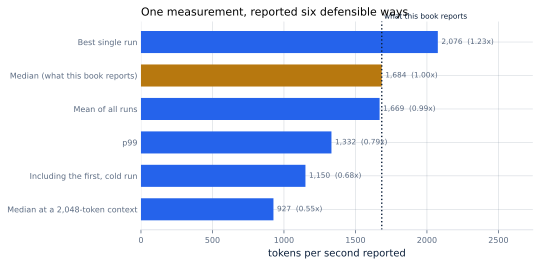

# 9. Measuring Honestly

*Written to [STANDARDS.md](STANDARDS.md). Generated from
`chapters/ch09.md` and `code/results/ch09.json`; run `make ch09` in
`code/` to re-measure and re-render.*

**Depends on:** Chapter 8.
**Tier 0** — a couple of minutes on a laptop CPU, free.

## Objectives

By the end of this chapter you can:

1. Show how far a benchmark number can move without the system
   changing at all.
2. Name the ways a published measurement misleads, and the harness
   feature that prevents each.
3. Build a harness whose output can be trusted by someone who was not
   there.
4. Read a vendor's throughput claim and list the questions it fails to
   answer.

## Why it matters

Chapter 8 gave you a way to predict what is possible.
Everything after this measures whether it happened. So before the book
measures anything else, it is worth knowing how easily a measurement
lies.

Here is one decode step on `tinyserve`. Nothing about the model, the
machine or the code changes between these rows. Only the way the result
is reported changes:

<!-- include: tables/ch09-framings.md -->
| How it is reported | What is wrong with it | Tokens per second | Relative |
|---|---|---|---|
| Best single run | reports the luckiest run | 2,076 | **1.23x** |
| Median (what this book reports) | none | 1,684 | **1.00x** |
| Mean of all runs | an average hides the tail | 1,669 | **0.99x** |
| p99 | none - this is what unlucky users get | 1,332 | **0.79x** |
| Including the first, cold run | no warmup | 1,150 | **0.68x** |
| Median at a 2,048-token context | the same claim, harder conditions | 927 | **0.55x** |

The same operation, on the same machine, unchanged. **2.2x** separates the most flattering framing from the least, and every row is defensible on its own.



**Figure 9.1** — One measurement, reported six defensible ways.
*Provenance in `code/figures/ch09-framings.caption.txt`.*

**2.2x** separates 2,076 tokens per second from
927, on one machine, with one unchanged program.

No row is a lie. Each is a real number that a real run produced. And
that is exactly the problem: **a benchmark without its conditions is
not a measurement, it is a claim.** Two teams can each report honestly
and differ by a factor of two, and neither will be able to tell whether
their systems differ at all.

## The seven ways a number misleads

Each of these is a way to report a true number that will not reproduce.
For each, the fix is a property of the harness, not a matter of
intention.

**1. No warmup.** The first run allocates buffers, faults in pages and
finds nothing in cache. Reporting it costs 1.46x here.
*Fix:* the harness always runs the work before it starts timing, and
never reports a cold result.

**2. A single run.** The luckiest of 400 runs is
1.23x the median. Run a benchmark once and you have
sampled noise, not performance. *Fix:* repeat, report the median, and
report the spread when it exceeds 5%.

**3. An average.** A mean is dragged by the tail and describes nobody's
experience, as Chapter 5 showed. *Fix:* percentiles.
The harness reports p50 and p99 and never a bare mean.

**4. Unstated conditions.** The same system reports 1,684 tokens
per second at a 128-token context and 1.82x that at
2,048. Both are "decode throughput". *Fix:* every result carries the
conditions that produced it, in the same file as the number.

**5. Unstated load.** Throughput without saying how many requests were
in flight is unfalsifiable — you can always raise it by batching harder
and hurting latency. *Fix:* throughput is reported at a stated
concurrency, against a stated latency budget.

**6. Mismatched units.** Two systems counting tokens with different
tokenizers are not comparable, and neither are two counting
input-plus-output against output alone. *Fix:* the model, its revision
and what is being counted are recorded with the result.

**7. Missing provenance.** A number without the hardware, the driver,
the library versions and the commit cannot be reproduced or contested.
*Fix:* every result file carries all of it, automatically, whether or
not anyone asked.

> **If you're new here: why this is not mostly about dishonesty**
>
> Almost nobody fakes a benchmark. What happens instead is that a
> measurement is taken for one purpose, by someone who knew the
> conditions, and then travels — into a slide, a blog post, a
> procurement decision — leaving the conditions behind.
>
> The defence is not integrity. It is making the conditions *travel
> with the number*, so that separating them takes deliberate effort
> rather than happening by default.

## What the harness does about it

`bench/harness.py` is what every other chapter of this book measures
with. It is small, and each part exists because of one of the failures
above.

```python
def repeat(fn, warmup: int = 1, runs: int = 3) -> Repeated:
    """Warm up, then time `runs` times. Returns every value, not just the median."""
    for _ in range(warmup):
        fn()
    return Repeated([fn() for _ in range(runs)])
```

Note what it returns. Not a number — every value it measured. The
summary is computed from those, and the raw values stay in the results
file, so a reader can compute a different summary and disagree with
mine.

```python
    @property
    def spread(self) -> float:
        """Half-range as a fraction of the median."""
        return (max(self.values) - min(self.values)) / 2 / abs(self.median)

    @property
    def noisy(self) -> bool:
        return self.spread > 0.05
```

Anything noisier than 5% is flagged, and the chapters that quote it say
so — Chapter 12 reports its headline speedup as "about 42x"
for exactly this reason, and Chapter 4 quotes a round
number because the measurement behind it moved 6%.

And every result file opens with where it came from:

```json
"provenance": {
  "measured_utc": "...",
  "hardware": {"cpu": "...", "cores_available": 4, "gpu": null},
  "software": {"python": "...", "numpy": "...", "blas": "...", "platform": "..."},
  "commit": "..."
}
```

That block is written by the harness, not by the author, which is the
only arrangement that survives a deadline.

## Two kinds of load generator

The harness above times an operation. Measuring a *server* needs
something more, and the difference matters enough to name.

- **Closed loop.** A fixed number of clients, each sending the next
  request when the last one returns. Easy to build, and it has a
  serious flaw: when the server slows down, the clients slow down too,
  so the offered load falls and the queue never grows. A closed-loop
  test cannot show you overload.
- **Open loop.** Requests arrive at a fixed rate regardless of whether
  the server is keeping up. This is how real traffic behaves, and it is
  the only way to find the load at which a service falls over.

Use closed-loop to measure an operation, open-loop to measure a
service. Chapter 41 needs the second, and exercise 9.5
builds it.

## Where this is soft

**These numbers come from a shared virtual machine.** A quiet, dedicated
machine would show a smaller spread between the framings — but not
zero, and the spread is the finding rather than its size.

**The framings are not exhaustive.** There are more ways to mislead
than seven: a favourable model, a favourable batch size, a competitor
configured by its detractor, a metric changed after seeing the results.
The defence is the same in every case — publish the conditions and the
raw values.

**This chapter's harness measures one process on one machine.** It has
no network, no queue and no other tenants. Everything it reports is
therefore a best case, and Chapter 43 deals with measuring a
system that real users are using.

## In production

- **Publish raw values, not just summaries.** It costs nothing and it
  is the difference between a result and an assertion.
- **Make provenance automatic.** If recording the machine is a step
  someone has to remember, it will be missing from the measurement that
  matters most.
- **Re-run the baseline every time.** Comparing today's optimized run
  against last month's baseline compares two machines, two driver
  versions and two levels of background load.
- **When reading someone else's benchmark**, ask: how many runs, warm
  or cold, what percentile, what context length, what concurrency, what
  tokenizer, and on what machine. A claim that cannot answer six of
  those is Figure 9.1 with the flattering bar selected.

## Numbers to remember

| Quantity | Value |
|---|---|
| Spread across honest framings, unchanged system | 2.2x |
| Cost of reporting a cold run | 1.46x |
| Gain from reporting the luckiest of 400 runs | 1.23x |
| Cost of honest percentiles (p99 against median) | 1.26x |
| Cost of a 2,048-token context against 128 | 1.82x |
| What makes a number reproducible | the conditions travelling with it |

## Sources

- Beyer, Jones, Petoff and Murphy, *Site Reliability Engineering*,
  O'Reilly, 2016, chapter 6 — choosing what to measure and how to
  report it.
- Dean and Barroso, "The Tail at Scale", CACM 56(2), 2013 — why
  averages mislead for anything users experience.
- The measurement methodology of published inference benchmark tools,
  as public reference points for the load-generator distinction.

## Exercises

**★ 9.1** A vendor reports "3,000 tokens per second". List six
questions you would need answered before the number means anything.

**★ 9.2** Using Figure 9.1, construct the most flattering honest
description of this system, and then the most damning. Neither may
contain a false statement.

**★★ 9.3** The harness flags a measurement as noisy above 5% spread.
Run `make ch09` three times and record how often each framing crosses
that threshold. Is 5% the right number for this machine, and what would
you set it to?

**★★ 9.4** Add an eighth way to mislead that this chapter does not
list, demonstrate it by measuring it on `tinyserve`, and state the
harness feature that would prevent it.

**★★★ 9.5** Build the open-loop generator the chapter describes.
Requests arrive at a fixed rate from a Poisson process, independently
of whether the server keeps up; measure queueing delay and completed
requests per second as the offered rate rises. Find the rate at which
queueing delay stops being bounded, and show that a closed-loop test
with the same client count never reveals it. Report with percentiles
and provenance.
