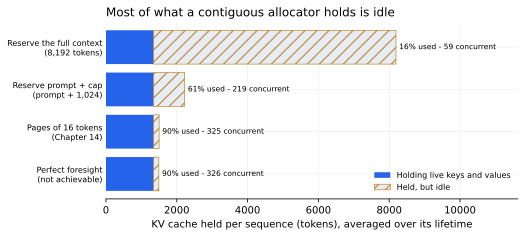

# 13. Where the Memory Goes

*Sample chapter, written to [STANDARDS.md](STANDARDS.md). This file is
generated from `chapters/ch13.md` and `code/results/ch13.json`. Run
`make ch13` in `code/` to recompute and re-render; `make check` fails
if it has drifted.*

**Depends on:** Chapter 12 (the KV cache).
**Tier 0** — arithmetic and a short CPU run, free.

## Objectives

By the end of this chapter you can:

1. Explain why a server must hold KV memory a sequence is not yet
   using, and separate the two reasons it does.
2. Measure how much of an allocation holds live data, rather than how
   much was requested.
3. Compute how many concurrent sequences an allocation policy allows on
   a given accelerator.
4. Predict what paging is worth before you build it in Chapter 14.

## Why it matters

Chapter 12 ended with an estimate: 64 GB of free memory,
128 KiB per token, so about 59 sequences of 8K tokens.
That estimate quietly assumed every sequence uses its full context.

Almost none of them do. Run the generation from Chapter 12 with
`tinyserve`'s default cache and measure what you got versus what you
used: **1 MiB of a 4 MiB allocation is
holding data — 25%.** The rest is reserved, untouched, and
unavailable to anyone else.

At production scale on the book's case study it is worse.
Under the traffic in STANDARDS.md section 7, a server that reserves the
full context for each sequence has **16%** of that memory
holding live keys and values. **84% of your most expensive
resource is idle**, and your accelerator is roughly five times emptier
than its memory usage suggests.

This chapter measures that waste precisely and splits it into its two
causes, because they have different fixes.

> **If you're new here: reserved is not used**
>
> Asking an allocator for memory and putting data in it are separate
> events. A server that says "this request may produce up to 8,192
> tokens, so set aside room for 8,192 tokens" has *reserved* that
> memory: no other request may use it. Whether the request ever writes
> there is a different question.
>
> Throughout this chapter, **held** means reserved by a sequence and
> unavailable to others; **live** means actually holding keys and
> values the model will read. The gap between them is the subject.

## Two different wastes

Follow one typical request: a 1,026-token prompt that will
produce a 234-token answer.

**Over-reservation.** When the request arrives, nobody knows it will
stop at 234 tokens. The model might run to the cap. A
contiguous allocator must commit a slot before the first token is
generated, and a slot it may need to grow into cannot be handed to
someone else later. So it reserves for the worst case and holds
8,192 tokens' worth for a sequence that will use about
1,337.

**Growth headroom.** Now imagine perfect foresight: the allocator knows
this sequence will use exactly 1,337 tokens and reserves
exactly that. It is *still* not full. At the first decode step the
sequence occupies its prompt and one token; the room for the remaining
answer sits empty and reserved. Averaged over the sequence's life, a
sequence holding prompt + output uses prompt + output/2.

The first waste is a guess you were forced to make. The second is
arithmetic, and no amount of foresight removes it. Only handing memory
back and forth *while the sequence is alive* removes it — which is what
Chapter 14 does.

## Measure

The traffic, sampled 19,998 times from the case study's profile
with seed 0:

<!-- include: tables/ch13-traffic.md -->
| | p50 | p99 |
|---|---|---|
| Prompt tokens | 1,026 | 3,701 |
| Output tokens | 234 | 1,024 |
| Total per sequence | 1,337 | 4,032 |

19,998 sampled requests, seed 0; lengths are lognormal about means of 1,200 and 300 tokens. 2 samples exceeded the 8,192-token context and were dropped, as the server would refuse them.

Now hold that traffic fixed and vary only the allocation policy. "Held
per sequence" is averaged over each sequence's lifetime, because that
is the memory genuinely unavailable to other requests during it.

<!-- include: tables/ch13-policies.md -->
| Allocation policy | Held per sequence | In use | Wasted | Concurrent sequences |
|---|---|---|---|---|
| Reserve the full context (8,192) | 8,192 tok (1,024 MiB) | 16% | **84%** | **59** |
| Reserve prompt + cap (prompt + 1,024) | 2,224 tok (278 MiB) | 61% | **39%** | **219** |
| Pages of 16 tokens (Chapter 14) | 1,502 tok (188 MiB) | 90% | **10%** | **325** |
| Perfect foresight (not achievable) | 1,494 tok (187 MiB) | 90% | **10%** | **326** |

**Figure 13.1** — Most of what a contiguous allocator holds is idle.
KV cache held per sequence under four policies, split into the part
holding live data and the part held but idle. Reserving the full
context uses 16% of what it holds and fits
59 sequences; 16-token pages use 90%
and fit 325. *Provenance in
`code/figures/ch13-memory.caption.txt`.*

Three things to take from this.

**Capping the request helps, and is not enough.** Refusing to let a
client ask for more than 1,024 new tokens lifts utilization from
16% to 61% and nearly quadruples concurrency, for
one line of configuration. It is the first thing to do and it still
leaves 39% of the memory idle, because the cap is still a
guess about a length nobody knows.

**Perfect foresight is worth less than you would think.** An allocator
that knew each answer's length in advance would reach 90%,
not 100%. The missing 10% is growth headroom, and it is
the floor for any policy that commits a sequence's memory in one piece.

**Paging reaches that floor without the foresight.** Handing out memory
in 16-token pages as the sequence grows gets 90%
utilization and 325 concurrent sequences — within
1 sequence of the unattainable oracle, and **5.5x**
the concurrency of reserving the full context. That is the result
Chapter 14 builds, and you now know what it should measure before you
write it.

## Where this estimate is soft

**This is arithmetic, not a benchmark.** There is no timing here and no
run-to-run noise; the only randomness is the seeded traffic sample. It
is exact for the model it describes, and the model leaves things out:
allocator metadata, memory the framework holds for activations, and
external fragmentation when freed slots do not fit the next request.
Every omission makes the real numbers slightly worse, not better.

**Our 84% is worse than the published range.** Kwon et al.
report that existing systems waste 60%–80% of KV memory. This
chapter's full-context policy wastes 84%, outside that
range, and the reason is worth understanding rather than hiding: waste
from over-reservation is set by the ratio of the advertised context to
the typical sequence. Our case study advertises 8,192
tokens and typically uses 1,337, a ratio of about six. Serve
longer conversations, or advertise a shorter context, and the figure
moves. Quote your own ratio, not ours.

**The concurrency figures assume KV cache is the only pressure.** In
Chapter 18 the scheduler will also need memory for requests it has
admitted but not started, and Chapter 20's attention kernels want
workspace. Treat 325 as a ceiling.

## In production

- **`--max-model-len`** is the single most effective memory flag in
  vLLM and SGLang, for exactly the reason above: it sets the worst case
  every reservation is sized against. Setting it to the longest
  conversation you actually serve, rather than the model's maximum, is
  free capacity.
- **`--max-num-seqs`** caps how many sequences may be resident. Set it
  from an accounting like this one rather than by trial and error.
- **`--gpu-memory-utilization`** decides how much of the card the
  engine may claim for weights plus cache. Raising it buys concurrency
  until something else on the device needs room.
- **Preemption.** When the cache fills anyway, the engine must evict a
  sequence and either recompute its cache later or swap it to host
  memory. vLLM logs this; if you see it regularly, this chapter's
  arithmetic is telling you why. Chapter 18 covers the policy.

## Numbers to remember

| Quantity | Value |
|---|---|
| KV memory in use, full-context reservation, case-study traffic | 16% |
| KV memory in use, 16-token pages | 90% |
| Ceiling for any policy that commits memory in one piece | 90% |
| Concurrency gain from paging over full-context reservation | 5.5x |
| Average live cache of a sequence | prompt + output/2 |

## Sources

- Kwon, Li, Zhuang, Sheng, Zheng, Yu, Gonzalez, Zhang and Stoica,
  "Efficient Memory Management for Large Language Model Serving with
  PagedAttention", SOSP 2023, pp. 611–626, doi:10.1145/3600006.3613165
  (arXiv:2309.06180) — reports 60%–80% of KV memory wasted by
  fragmentation and over-reservation in the systems it measured, and
  introduces the fix Chapter 14 builds.

## Exercises

**★ 13.1** Your service advertises a 32,768-token context but the p99
conversation is 3,000 tokens. Using the method in this chapter,
estimate the utilization of a full-context reservation policy. What
single configuration change would you make first?

**★ 13.2** Explain, in two sentences, why an allocator with perfect
knowledge of every answer's length still cannot reach 100%
utilization.

**★★ 13.3** Rerun `python3 -m bench.run_ch13` with `OUTPUT_MEAN` set to
2,000 — a reasoning model that thinks before answering. Predict, before
running it, whether over-reservation waste rises or falls, and what
happens to the gap between paging and perfect foresight. Explain the
result.

**★★ 13.4** The `paged_16` policy in this chapter rounds each
sequence up to a whole number of 16-token pages. Derive the
worst-case waste per sequence from the page size alone, then compute
the utilization for page sizes 1, 16, 64 and 256. Why might a server
not simply choose the smallest page?

**★★★ 13.5** This chapter models memory a sequence holds *over its
lifetime*, which assumes sequences arrive and depart smoothly. Write a
discrete-event simulation of the case-study traffic at 200 requests per
second with the measured decode rate from Chapter 12, and report the
distribution of memory in use over time, with percentiles. How often
would a server sized for the *mean* have to preempt a request? Report
with provenance, per the harness's rules.
