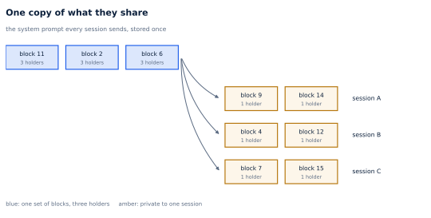
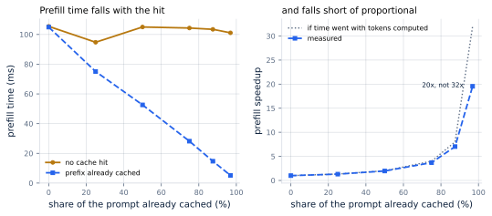
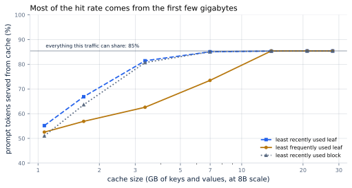

# 15. Prefix Caching

*Written to [STANDARDS.md](STANDARDS.md). Generated from
`chapters/ch15.md` and `code/results/ch15.json`; run `make ch15` in
`code/` to re-measure and re-render.*

**Depends on:** Chapter 14.
**Tier 0** — a few minutes on a laptop CPU, free.

## Objectives

By the end of this chapter you can:

1. Explain why two requests that begin with the same tokens can share
   memory, and why they can share only whole blocks.
2. Build a prefix cache: a name for each block, a count of who holds
   it, and an index that says what to throw away first.
3. Measure what a hit saves, and say why it saves less than the number
   of tokens it skipped.
4. Size a prefix cache for a given stream of traffic, and choose its
   eviction policy.

## Why it matters

Chapter 14 ended with two sequences holding two identical
copies of the same blocks. That is not a corner case. It is what most
production traffic looks like.

An assistant puts the same system prompt in front of every request. A
chat session re-sends the entire conversation on every turn, growing by
one exchange each time. An agent re-sends its tool definitions,
unchanged, all day. In the stream of 500 requests measured
later in this chapter — 200 sessions, 300 follow-up
turns, 8 distinct system prompts — **85% of
all prompt tokens had already been computed for somebody else.**

When an arriving prompt finds its opening already in memory that is a
**cache hit**; when it does not, a **cache miss**. The share that
arrives as hits is the **hit rate**, and for a prefix cache it is
counted in tokens rather than in requests: a hit on thirty-two tokens
and a hit on three thousand are not the same event.

<!-- defines: cache hit, cache miss, hit rate -->

The market has already priced this. Hosted APIs charge about a tenth of
the normal input price for prompt tokens they can serve from cache:
Anthropic's cache reads are 0.1x the base input price, and OpenAI's
cached input is 0.1x the uncached rate (both verified September 2026;
see `FACTS.md`). A 90% discount is what a provider is willing to give
away for the work this chapter avoids.

## Why it works at all

The justification is one sentence, and it comes from
Chapter 2: because of the causal mask, a
token's keys and values depend only on the tokens *before* it.

Nothing that comes later can reach back and change them. So if two
prompts begin with exactly the same tokens, the keys and values for
that opening are the same computation on the same inputs. Computing
them twice is pure waste. (The same computation, in exact arithmetic.
What floating point does to that promise is measured below, and it is
not nothing.)

Two consequences follow, and both matter.

**It must be a prefix, not a substring.** A token's keys and values
depend on its *position* as well as on the tokens before it. The same
paragraph appearing at position 0 of one prompt and position 900 of
another produces entirely different keys and values. Sharing works only
from the very beginning of the prompt, which is why this is called
prefix caching and not text caching.

**It stops at the first difference.** One changed token — a timestamp,
a user's name, a retrieved document in a different order — and
everything after it is different too. A prompt whose first line
contains the current time can share nothing at all. This is the single
most useful thing in this chapter for whoever writes the prompts, and
it comes back under **In production**.



**Figure 15.1** — Three sessions, one copy of the system prompt.
*Provenance in `code/figures/ch15-prefixtree.caption.txt`.*

## Giving a block a name

To reuse a block, a server must be able to *find* it: given an arriving
prompt, which cached blocks, if any, hold its opening?

The trick is to give each block a name computed from its contents. A
**hash** is a short number computed from a piece of data, used as a
stand-in for it; two different pieces of data are overwhelmingly
unlikely to get the same one. Hash the 16 tokens in a block, and
blocks with the same tokens get the same name.

<!-- defines: hash -->

That is not quite enough. The tokens `the cat sat` mean one thing at
the start of a prompt and something else 900 tokens in, and the keys
and values differ accordingly. The name has to say *where*, too. The
fix is to fold the previous block's name into this one:

<!-- listing: tinyserve/prefix.py block_hash no-docstring -->

```python
def block_hash(parent: int, tokens: tuple[int, ...]) -> int:
    return hash((parent, tokens))
```

Chaining the parent's hash into the child's makes each name stand for a
whole prefix rather than for sixteen tokens in isolation. Two prompts
get the same name for their third block only if their first, second and
third blocks all agree — which is exactly the condition under which the
block may be reused. The check is O(1) instead of a comparison of
hundreds of tokens.

> **A collision here is a security bug, not a slow lookup.** If two
> different prefixes got the same name, one request would read another
> request's context and answer from it. That is why vLLM's default hash
> is SHA-256 as of v0.11, and why its documentation warns that a
> non-cryptographic hash "theoretically increases the risk of hash
> collisions, which can cause undefined behavior or even leak private
> information in multi-tenant environments". Our `hash` is Python's
> built-in one, which is fine for a book and not fine for a fleet.

## Build

Three small pieces sit on top of Chapter 14's pool.

**Count the holders.** A block that two sequences are using must not go
back to the free list when the first of them finishes. Chapter 14's
`give_back` becomes a decrement:

<!-- listing: tinyserve/prefix.py SharedBlockPool.give_back -->

```python
def give_back(self, blocks: list[int]) -> None:
    for b in blocks:
        self.refs[b] -= 1
        if self.refs[b] == 0:
            self._free.append(b)
        elif self.refs[b] < 0:
            raise RuntimeError(f"block {b} was given back too many times")
```

`release` on a finished sequence is unchanged, and now does the right
thing: it drops that sequence's claim, and the block survives if anyone
else — including the cache itself — still holds it.

**Let a sequence start in the middle.** Adopting a prefix is not a
copy. It is an assignment to a block table:

<!-- listing: tinyserve/prefix.py SharedKVCache.adopt no-docstring -->

```python
def adopt(self, blocks: list[int], n_tokens: int) -> None:
    if n_tokens % self.pool.block_size:
        raise ValueError("a shared prefix must end on a block boundary")
    self.pool.incref(blocks)
    self.blocks = list(blocks)
    self.length = self.shared_tokens = n_tokens
```

No keys or values move. The sequence simply begins life at position
`n_tokens` with a block table that already points at the right storage,
and `forward` — which reads `cache.length` to know where it is — needs
no telling.

**Index the prefixes.** The cache is a tree of blocks: the path from
the root to a node spells out a prefix, one block per edge, and the
node holds the block with that prefix's keys and values. Matching an
arriving prompt is a walk down from the root for as long as the names
agree:

<!-- listing: tinyserve/prefix.py PrefixTree.match -->

```python
def match(self, tokens: list[int]) -> list[int]:
    """The longest cached prefix of `tokens`, as blocks to adopt."""
    self.clock += 1
    node, parent_hash, found = self.root, ROOT_HASH, []
    for chunk in self._blocks_of(tokens):
        h = block_hash(parent_hash, chunk)
        child = node.children.get(h)
        if child is None:
            break
        self._touch(child)
        node, parent_hash = child, h
        found.append(child.block)
    return found
```

This is the structure SGLang calls RadixAttention, in its simplest
form. A true radix tree adds two refinements: chains of single-child
nodes are collapsed into one edge, which saves memory in the index
itself, and matching is done token by token rather than block by block.
Neither changes *which* prefixes can be reused. The cost of the
simplification is measured below, and it is small.

### The discipline that removes copy-on-write

Chapter 14's last exercise suggested sharing blocks and
copying one when a sequence writes to it — **copy-on-write**, the classic answer. Do not do it.
There is a simpler rule that makes the problem disappear: *share only
blocks that are already full*.

<!-- defines: copy-on-write -->

A full block will never be written to again; its sixteen tokens are
final. A partly filled block is still being written to, so it stays
private to its sequence and is never offered to the cache. With that
one rule, no shared block is ever written, no copy is ever needed, and
the whole class of bugs that copy-on-write invites does not arise. It
is also what production engines do: vLLM's design document is explicit
that "We only cache full blocks."

The rule is worth enforcing rather than remembering:

<!-- listing: tinyserve/prefix.py SharedKVCache.append -->

```python
def append(self, layer: int, k: np.ndarray, v: np.ndarray,
           start: int) -> tuple[np.ndarray, np.ndarray]:
    # The invariant that removes copy-on-write, made executable:
    # a sequence never writes into a block it adopted.
    if start < self.shared_tokens:
        raise RuntimeError(
            f"write at position {start} would land in an adopted block "
            f"(the first {self.shared_tokens} tokens are shared)")
    return super().append(layer, k, v, start)
```

The price is paid in the last, partial block: a shared opening of
512 tokens can only be reused down to the last block
boundary. On the traffic measured below that costs 7
tokens per hit on average — half a block, as it should be.

## It does not change the answer, quite

Same prompt, same weights: one sequence computes all of it, another
adopts 256 tokens of cached prefix and computes only the rest.

**Same tokens generated: yes**, over 32 tokens.
But the scores are not identical — the largest difference between the
two runs is 8e-7 — and neither are the keys: the adopted
blocks differ from the same keys computed afresh by 3e-6.

That is worth stopping on, because it is not what
Chapter 14 found. Paging moved numbers and changed nothing;
the answer was identical to the last bit. Prefix caching stores numbers
computed in one pass and reuses them in another, and the two passes had
a different amount of text in them.

Which step is sensitive to that? Rather than guess, ask each one:

<!-- include: tables/ch15-numerics.md -->
| Step of the forward pass | Contracts over | Same answer when the sequence is 96 tokens longer? |
|---|---|---|
| A projection (Q, K, V, feed-forward) | the model dimension, which does not change | **yes** |
| The softmax in attention | the sequence, which does | **no** — differs by 1.5e-08 |

And what that does to the keys the cache hands back, layer by layer:

| Layer | Difference from the same key computed afresh |
|---|---|
| 0 | exactly 0 |
| 1 | 1.9e-06 |
| 2 | 2.1e-06 |
| 3 | 2.6e-06 |

Layer 0's keys come from the embedding and a projection alone, so they are identical. Every layer after it has been through an attention softmax.

The softmax divides by a sum taken along the sequence. Tokens after the
current one are masked and contribute exactly zero, so the *value* of
that sum does not depend on how many of them there are — but the
*grouping* does. Summing a longer row pairs the terms up differently,
floating-point addition is not associative, and the totals part company
in the last bits. Every attention weight inherits that difference, then
the residual stream, then the keys and values written at the next
layer, which is why the divergence starts at layer 1 and grows.

None of this is an implementation mistake, and none of it can be tuned
away: it is what reusing arithmetic across differently-shaped passes
costs. A production kernel has more of it, not less, since it also
splits the same sum across threads.

Usually it is invisible. A difference of 8e-7 in a score
almost never changes which token scores highest, and here the generated
text was identical. Usually is not always: vLLM issue #33123 reports
exactly this on one AMD accelerator, where the cache-hit and cache-miss
paths diverge enough to change the chosen token at position 3, and the
two answers part company completely — same engine, same model, same
prompt, nothing different but a cache hit.

So the honest statement is not "prefix caching cannot change the
output". It is: **prefix caching computes the same quantity by a
different route, and the last bits may differ.** If you depend on
bit-exact reproducibility — for an evaluation harness, a regression
test, or a log someone may have to defend — measure it on your own
hardware rather than assuming it, and know that the flag to turn
caching off exists.

## What a hit saves

<!-- include: tables/ch15-prefill.md -->
| Prompt already cached | Tokens still computed | Prefill, no hit | Prefill, hit | Speedup | If time went with tokens |
|---|---|---|---|---|---|
| 0 of 512 (0%) | 512 | 105.4 ms | 104.9 ms | **1.00x** \* | 1.00x |
| 128 of 512 (25%) | 384 | 94.7 ms | 75.1 ms | **1.31x** \* | 1.33x |
| 256 of 512 (50%) | 256 | 105.0 ms | 52.6 ms | **1.96x** \* | 2.00x |
| 384 of 512 (75%) | 128 | 104.3 ms | 28.2 ms | **3.70x** \* | 4.00x |
| 448 of 512 (88%) | 64 | 103.4 ms | 14.7 ms | **7.03x** \* | 8.00x |
| 496 of 512 (97%) | 16 | 101.1 ms | 5.2 ms | **19.55x** \* | 32.00x |

Median of 15 paired runs after 2 warmup, cold and warm measured one after the other in each run so that a machine-wide stall moves both. The lookup in the index is timed with the hit; the miss lookup on the cold path is not charged, which makes the comparison slightly unkind to the cache.

\* spread of the paired ratio exceeded 5%; this machine is a shared container.



**Figure 15.2** — What a hit saves, and where it stops being
proportional.
*Provenance in `code/figures/ch15-prefill.caption.txt`.*

Up to about three-quarters cached, the saving tracks the tokens
skipped almost exactly: half the prompt cached is 1.96x.
Past that it falls behind. With 97% of the prompt cached —
16 tokens left to compute out of 512 —
prefill drops from 101 ms to 5.2 ms, which is
20x and not the 32x the token count
suggests.

Two reasons, and both are general.

**The new tokens still attend to everything.** Skipping the prefix
skips computing its keys and values. It does not skip *reading* them:
each of the 16 remaining tokens must still attend over
the whole 512-token context. That part of the work shrinks
with the number of new tokens, not with the number of tokens computed
from scratch, and at high hit rates it is what is left.

**Fixed costs do not shrink.** A forward pass has per-call overhead
that does not care how many tokens are in it. At sixteen tokens there
is not much else left for it to hide behind.

> **The flat line should be flat.** In Figure 15.2 the "no cache hit"
> series measures the same work 6 times and wanders by
> 5% around its middle. That is this machine, not the
> cache. It is also why the speedup column is
> computed as the median of *paired* ratios — cold and warm measured
> one after the other in the same iteration — rather than as the ratio
> of two independently noisy medians. Chapter 9 is
> where that habit comes from.

And one thing prefix caching does not do at all: **it does not speed up
decode.** Every decode step still reads the whole cache, hit or miss.
The entire saving is in prefill, which means it moves time to first
token and leaves inter-token latency exactly where it was. For a
request with a long prompt and a short answer that is most of the
wall clock; for a short prompt and a long answer it is almost none of
it. Chapter 3's division decides which one you have.

## How much of real traffic hits

A speedup per hit is worth nothing without a hit rate. The case study's
traffic (STANDARDS.md §7) gives prompt and output lengths but says
nothing about what those prompts *contain*, and prefix caching lives
entirely in what they contain. So this chapter extends it with the
structure the case study implies: a heavy shared system prompt, and
sessions that come back.

500 requests from 200 sessions, 8
distinct system prompts drawn by popularity, 300 follow-up
turns that re-send the conversation so far, and a quarter of requests
one-off with nothing shared at all. Prompts run to a median of
1,188 tokens, 729,137 in total. Nothing is
computed — what is being measured is which blocks get matched, kept and
thrown away — but the index and the allocator are the real ones.

With memory enough to cache everything, **85% of prompt tokens
are served from cache**, leaving 106,529 to compute. The
best any cache could do on this traffic, if a prefix could be shared
down to the last token, is 85.8%; the gap is the partial block
at the end of each shared opening, 7 tokens per hit on
average. Holding all of it takes 13,328 blocks — 28 GB
at the reference model's size — which is a factor of 4.0x less
than it would take if every request kept its own copy.

Nobody has unlimited memory, so the question is what a smaller cache
gets:

<!-- include: tables/ch15-policies.md -->
| Cache size | Least recently used **leaf** | Least frequently used leaf | Least recently used block, leaf or not |
|---|---|---|---|
| 1.1 GB (512 blocks) | 55.2% | 52.5% | 51.0% |
| 1.7 GB (799 blocks) | 66.9% | 56.9% | 63.6% |
| 3.4 GB (1,599 blocks) | 81.4% | 62.6% | 80.7% |
| 7.0 GB (3,332 blocks) | 85.0% | 73.5% | 85.0% |
| 14.0 GB (6,664 blocks) | 85.3% | 85.4% | 85.3% |
| 21.0 GB (9,996 blocks) | 85.4% | 85.4% | 85.4% |
| 28.0 GB (13,328 blocks) | 85.4% | 85.4% | 85.4% |

Share of prompt tokens served from the cache, over 500 requests from 200 sessions (seed 0). The largest size holds everything this traffic can share. Sizes are the reference model's bytes; the simulation runs the real index and the real allocator.



**Figure 15.3** — Most of the hit rate arrives in the first few
gigabytes.
*Provenance in `code/figures/ch15-hitrate.caption.txt`.*

The curve is steep and then flat, which is the useful shape.
7 GB — 25% of what it would take to hold
everything, and 11% of the 64 GB
Chapter 13 found free after the weights — already
gets 85%, within a point of the ceiling. Even 1.1 GB
gets 55%. **The first gigabyte of
prefix cache is worth far more than the tenth**, and that is what makes
the feature safe to turn on by default: it does not need to be sized
carefully to be worth having.

### What the tree is for

The tree earns its keep at eviction time, not at match time.

The standard rule for throwing things out of any cache is **least
recently used**: discard whatever has gone longest without being
wanted. <!-- defines: least recently used --> The tree's contribution
is to apply that rule to *leaves* only, which means a prefix is never
thrown away while something cached still sits behind it. Applying it to
any block regardless of position does not respect that: drop
a block in the middle of a chain and everything behind it is still in
memory but can no longer be reached, because matching starts at the
root. That is memory held for nothing. In the measurement it costs
4 points of hit rate at the smallest cache and
strands up to 143 blocks — real, but smaller than it sounds,
because a stranded block is usually evicted soon afterwards anyway.

vLLM gets the same effect without a tree. Its cache is a flat hash
table, and when a request finishes its blocks are pushed onto the free
queue "in the *reverse* order", because "the last block of a request
must hash more tokens and is less likely to be reused by other
requests. As a result, it should be evicted first". Deepest first, by
construction. Two structures, one behaviour.

**Least frequently used** — discard whatever has been wanted fewest
times, whenever that was — is the policy that actually loses:
19 points behind at 3.4 GB.
<!-- defines: least frequently used -->
Counting hits with no notion
of age means a system prompt that was popular an hour ago keeps its
blocks against a conversation happening now. SGLang exposes all of
these as `--radix-eviction-policy`, and `lru` is the default for this
reason.

## What it costs

**Almost nothing per request.** Matching and inserting cost
135 microseconds per request on this machine — about
1.3 microseconds per block — against a prefill measured
in tens to hundreds of milliseconds. A miss pays the lookup and gets
nothing, and the lookup is three orders of magnitude cheaper than what
it is trying to avoid. This is why engines turn prefix caching on by
default; vLLM's documentation puts it as "APC in general does not
reduce the performance of vLLM."

**Memory, and it is not free.** The cache *is* the pool. Every block
held in the hope of a future hit is a block not available to a sequence
being served right now, and Chapter 13 showed what
those blocks are worth: capacity, which is throughput. A prefix cache
and a large batch are competing for the same gigabytes, and neither
this chapter nor Chapter 14 decides between them.
Chapter 18 does.

**A way to watch other people.** Cached prompts come back faster than
uncached ones, and anyone can time an API. If the cache is shared
across users, a fast response to a guessed prompt tells an attacker
that somebody else has sent it — a **side channel**: information leaked
by how long something takes rather than by what it returns. Gu and
colleagues timed commercial APIs this way and "detect global cache
sharing across users in seven API providers, including OpenAI". Sharing
a cache between tenants is a decision about confidentiality, not only
about memory, and Chapter 45 returns to it.

<!-- defines: side channel -->

## Where this is soft

**The traffic is constructed.** Its *shape* — a few popular system
prompts, sessions that come back, a quarter of requests sharing nothing
— is the shape assistant traffic has, and the hit rate is very
sensitive to it. Run your own trace through it before believing
85% about your own service. The mechanism transfers; the
number does not.

**One request at a time.** The simulation serves requests one after
another, so the cache never has to fight a live batch for blocks. A
real server runs that fight continuously, and it is
Chapter 18's subject, not this chapter's.

**Prefill is measured on a CPU.** The shape of Figure 15.2 —
proportional saving, then diminishing — follows from the arithmetic and
holds anywhere. The millisecond values are this laptop's.

**The index is a tree of whole blocks, not a true radix tree.** Path
compression
and token-granularity matching are the two things SGLang adds. The
second is the one that changes hit rates, and it is worth
7 tokens per hit here — under 1% of the prompt. On
traffic with much shorter shared prefixes it would matter more.

**Nothing here expires.** A real multi-tenant cache also needs a rule
about who may share with whom, and often a time limit; hosted APIs give
cache entries a lifetime measured in minutes. Neither is in this code.

## In production

- **vLLM: on by default** on the V1 engine; `--no-enable-prefix-caching`
  turns it off. `--prefix-caching-hash-algo` selects the hash and
  defaults to `sha256` since v0.11; `xxhash` is faster and not
  cryptographic.
- **SGLang: on unless `--disable-radix-cache`.**
  `--radix-eviction-policy` takes `lru` (the default), `lfu`, `slru`
  and `priority`.
- **Put the stable part of the prompt first.** This is the whole
  optimization, and it is free. System prompt, then tool definitions,
  then retrieved documents in a stable order, then the user's turn. A
  timestamp, a request id or a randomly ordered document list at the
  top of the prompt destroys every hit behind it and no engine flag can
  recover it.
- **Hosted APIs charge for this directly.** Anthropic: cache writes at
  1.25x the base input price for a five-minute lifetime, 2x for an
  hour, reads at 0.1x, with a minimum cacheable prompt of 512 to 4,096
  tokens depending on the model. OpenAI: automatic from 1,024 tokens,
  cached input at 0.1x, entries living about thirty minutes past their
  last use. Both verified September 2026 (`FACTS.md`); check before
  quoting.
- **Watch the hit rate in tokens, not in requests.** A hit on 32 tokens
  and a hit on 3,000 are both one hit, and only one of them mattered.
  vLLM's `vllm:prefix_cache_queries` and `vllm:prefix_cache_hits`
  counters are both counted in tokens for exactly this reason: the
  ratio of their rates is the number this chapter measures.
- **A falling hit rate is a capacity signal.** If nothing about the
  traffic changed and the hit rate dropped, the cache is being evicted
  by live sequences — which means the pool is too small, and
  Chapter 13's arithmetic will say by how much.

## Numbers to remember

| Quantity | Value |
|---|---|
| Prompt tokens already computed, assistant-shaped traffic | 85% |
| Cache needed for most of that | 7 GB (25% of the full working set) for 85% |
| Prefill saving at 97% cached | 20x, not 32x |
| Decode saving from prefix caching | none — prefill only |
| Cost of the index | 135 µs per request |
| Lost to block granularity | 7 tokens per hit, about half a block |
| Bit-exactness of a hit | not guaranteed: the softmax sum depends on how long the sequence was |
| What one changed token at the front costs | every hit behind it |

## Sources

- Zheng, Yin, Xie, Sun, Huang, Yu, Cao, Kozyrakis, Stoica, Gonzalez,
  Barrett and Sheng, "SGLang: Efficient Execution of Structured
  Language Model Programs", Advances in Neural Information Processing
  Systems 37 (NeurIPS 2024), pp. 62557–62583; arXiv:2312.07104 —
  RadixAttention, the structure this chapter builds.
- Kwon, Li, Zhuang, Sheng, Zheng, Yu, Gonzalez, Zhang and Stoica,
  "Efficient Memory Management for Large Language Model Serving with
  PagedAttention", SOSP 2023, pp. 611–626,
  doi:10.1145/3600006.3613165 — "flexible sharing of KV cache within
  and across requests", which is what this chapter builds on.
- Gu, Li, Kuditipudi, Liang and Hashimoto, "Auditing Prompt Caching in
  Language Model APIs", Proceedings of the 42nd International
  Conference on Machine Learning (ICML 2025), PMLR — the timing side
  channel, and the seven providers found sharing caches across users.
- vLLM, "Automatic Prefix Caching" (design document and feature page),
  and vLLM issue #33123 for the numerical divergence between the hit
  and miss paths.
- SGLang server-argument documentation, for the eviction policies.
- Anthropic and OpenAI prompt-caching documentation, for the prices and
  the minimum cacheable lengths. All engine and price facts are in
  `FACTS.md` with the date they were checked.

## Exercises

**★ 15.1** A system prompt is 1,000 tokens and the block size is
16. How many blocks of it can be shared, how many tokens of it
cannot, and does the answer change if the system prompt is 1,600
tokens?

**★ 15.2** Why is a block's name chained to the previous block's name?
Describe, concretely, a wrong answer a server could return if it hashed
only the tokens inside each block.

**★★ 15.3** In `run_ch15.py`, prepend a unique token to every prompt —
the equivalent of putting a timestamp at the top of the system prompt —
and rerun. Report the hit rate. Then move that token to the end of the
prompt instead and rerun. Explain the two results in one sentence each.

**★★ 15.4** Measure what the cache costs when it never helps: make
every prompt in the trace unique and report the index time per request
and the memory the cache ends up holding. Is leaving prefix caching on
by default the right default?

**★★★ 15.5** Implement token-granularity matching: keep the block
index, but when the walk stops, compare the remaining tokens of the
last block and report how many extra tokens *would* have matched.
Measure it over the trace and compare with this chapter's
7 tokens per hit. Then argue whether SGLang's radix tree
is worth the extra machinery for this traffic, and describe traffic for
which your answer flips.
