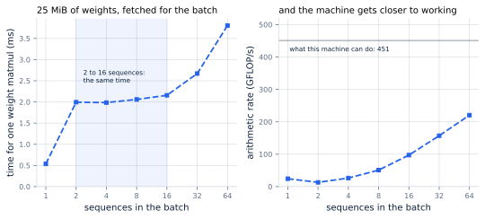
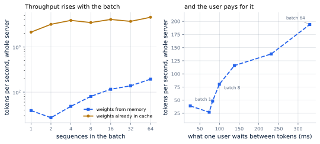
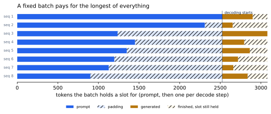

# 16. Batching

*Written to [STANDARDS.md](STANDARDS.md). Generated from
`chapters/ch16.md` and `code/results/ch16.json`; run `make ch16` in
`code/` to re-measure and re-render.*

**Depends on:** Chapter 8,
Chapter 12.
**Tier 0** — a few minutes on a laptop CPU, free.

## Objectives

By the end of this chapter you can:

1. Explain why serving several sequences at once costs almost nothing
   extra, and say exactly when that stops being true.
2. Build batched decoding, and name which part of a decode step a batch
   shares and which part it cannot.
3. Measure the throughput a batch buys and the latency it costs, and
   place both on Chapter 8's roofline.
4. Say what a *fixed* batch wastes, and why that waste is the whole
   reason the next chapter exists.

## Why it matters

Every chapter since Chapter 4 has been working around the
same fact: a decode step reads every weight in the model and produces
one token. The reading is the expensive part, the token is the cheap
part, and nothing so far has changed the ratio.

Batching changes it directly. Read the weights once, use them for
64 sequences, and the same fetch produces 64
tokens. It is the only technique in this book that attacks the memory
wall head-on rather than routing around it, and it is why every serving
engine is built around a scheduler rather than around a model.

The case study says how much this matters. At peak it takes
200 requests a second, each generating about 300
tokens: **60,000 output tokens a second**. Serving one
sequence at a time, the reference model on one accelerator manages
207 of them, so the service would need 290
accelerators. At a batch of 64 it needs 8.
Batching is not a tuning parameter here. It is the difference between a
service and a research demo.

## What a batch can share, and what it cannot

A decode step is two different kinds of work wearing one name.

**The weight matmuls can be shared.** Every projection and every
feed-forward layer multiplies the current token's vector by a weight
matrix. With one sequence that is a *matrix-vector* product: one row
against the whole matrix. With a **batch** of B sequences — B requests
advanced together in one pass — it becomes a matrix-matrix product,
B rows against the same matrix. The matrix is fetched once either way.

**Attention cannot be shared.** Every sequence has its own keys and
values, in its own blocks, and its own length. There is no matrix that
holds all of them and no single multiply that covers them. Each
sequence attends over its own cache, separately, however many are in
flight.

That division is the whole chapter. The shared part gets cheaper per
token as the batch grows; the private part does not.

Here is the shared part, three lines of it:

<!-- abridged: tinyserve/batch.py -->

```python
        # The shared part: one fetch of each weight for the whole batch.
        q = (h @ layer.wq).reshape(b_size, cfg.n_heads, cfg.head_dim)
        k = (h @ layer.wk).reshape(b_size, cfg.n_kv_heads, cfg.head_dim)
        v = (h @ layer.wv).reshape(b_size, cfg.n_kv_heads, cfg.head_dim)
```

`h` used to be one row and is now `b_size` of them. Nothing else about
those lines changed. And here is the private part, which has to be a
loop:

<!-- abridged: tinyserve/batch.py -->

```python
        # The private part: each sequence attends over its own cache.
        attn = np.empty((b_size, cfg.n_heads * cfg.head_dim), dtype=DType)
        for b, cache in enumerate(caches):
            kk, vv = cache.append(i, k[b][:, None, :], v[b][:, None, :], starts[b])
            ...
            scores = (q[b][:, None, :] @ kk.transpose(0, 2, 1)) * cfg.head_dim**-0.5
            attn[b] = (softmax(scores) @ vv).reshape(-1)
```

A production engine does not write that loop in Python — it hands the
whole ragged collection to one attention kernel, which does the
sequences concurrently (Chapter 20). But it is still a
loop, and it is still per sequence. The structure is the same; only the
constant is different.

## It changes no tokens, and not quite no bits

Four sequences decoded together, then the same four decoded alone:
**same tokens, yes**, over 8 tokens each.

The scores are another matter. Take one sequence, with its own prompt,
its own cache and its own position, and run one decode step with it in
a batch of 1, of 2, of 4, and so on up. Nothing about that sequence
changes. Its scores do, by up to 2e-6, and they settle down
only from a batch of 16 upward on this machine.

The cause is the same *kind* of thing as Chapter 15's and a
different mechanism. There the length of a sum changed. Here the shape
of a matrix changes, and a matrix library does not have one routine: it
has a matrix-vector routine for a single row, a general routine for
many, and several blocked variants in between. Which one runs depends
on how many sequences are in flight.

That has an uncomfortable consequence, and it is worth stating plainly
before the next chapter makes it worse. In a server that batches
continuously, **the number of other people being served changes from
step to step**, so the arithmetic path your request takes changes with
it. Re-running the same prompt on the same server with the same seed
can give a different answer, not because anything is broken, but
because the batch was a different size. If you need reproducibility,
you need a batch size of one, and 290 accelerators.

## What a batch actually buys

Everything else stripped away: one weight matrix, one multiply, many
batch sizes.

<!-- include: tables/ch16-matmul.md -->
| Sequences | Time for one 1280x5120 matmul | Weights re-read at | Arithmetic rate | Time per token |
|---|---|---|---|---|
| 1 | 0.54 ms | 49 GB/s | 24 GFLOP/s | **537 us** |
| 2 | 1.99 ms \* | 13 GB/s | 13 GFLOP/s | **997 us** |
| 4 | 1.98 ms | 13 GB/s | 26 GFLOP/s | **496 us** |
| 8 | 2.06 ms \* | 13 GB/s | 51 GFLOP/s | **257 us** |
| 16 | 2.16 ms | 12 GB/s | 97 GFLOP/s | **135 us** |
| 32 | 2.67 ms | 10 GB/s | 157 GFLOP/s | **83 us** |
| 64 | 3.80 ms | 7 GB/s | 220 GFLOP/s | **59 us** |

30 weight matrices of 25 MiB (750 MiB in total, more than this machine's cache holds), each multiplied once by a batch of rows; the time is one pass divided by the number of matrices. Nothing else is in the measurement: no attention, no cache, no model.

\* run-to-run spread exceeded 5%.



**Figure 16.1** — Four times the work for the same time, until it isn't.
*Provenance in `code/figures/ch16-matmul.caption.txt`.*

Read the middle of that table slowly, because it is the point of the
chapter. **Two sequences take 1.99 ms. Eight take
2.16 ms.** Four times the arithmetic, the same time. The
25 MiB of weights had to come out of memory either way, and while
they were arriving the machine had arithmetic units standing idle;
filling them cost nothing.

Past that the weights are no longer the constraint and the arithmetic
is: 16 to 64 sequences takes 2.16 ms to
3.80 ms, now rising with the work. In the language of
Chapter 8, the batch has walked up
the memory-bound slope and gone over the ridge. The arithmetic rate
tells the same story from the other side: 13 GFLOP/s at
two sequences, 220 at 64 — 17x
more work from a machine that was always the same speed. Even then it
is only 49% of the 451 GFLOP/s this machine reaches on
a large square multiply, because a matrix 64 rows tall
still does not fill it. Batching closes most of that gap. It does not
close all of it, and nothing does.

> **The batch of one is a special case, and not in the way you would
> guess.** One sequence takes 0.54 ms and two take
> 1.99 ms — the second sequence makes it 3.7x
> *slower*, not faster. A single row is a matrix-vector product, which
> a library streams straight through the weights; from two rows up it
> switches to the general matrix routine, which first copies the
> weights into a packing buffer so the inner loop can stride through
> them cheaply.
>
> That is a hypothesis, so it was measured. Over one hot matrix, two
> matrix-vector products take 0.68 ms and the one
> matrix-matrix product covering the same two rows takes
> 1.61 ms: **0.93 ms unaccounted for**, against
> 1.01 ms to write one copy of that matrix. The same order,
> which is as close as a black box gets to a confession.
>
> Chase this if you ever benchmark a batch of one and find it
> suspiciously good. It is not the workload you will run.

## The whole step

Now the same sweep with the model attached — a 753 MiB model whose
weights come from memory at 12.5 GB/s, beside a 3.8 MiB model
whose weights never leave cache:

<!-- include: tables/ch16-sweep.md -->
| Sequences | Step time | Of which shared | Of which per-sequence | Tokens/s | Tokens/s, cache-resident model |
|---|---|---|---|---|---|
| 1 | 25.6 ms | 24.4 ms | 1.1 ms | **39** | 2,143 |
| 2 | 73.8 ms | 72.0 ms | 1.7 ms | **27** | 3,193 |
| 4 | 82.6 ms | 79.6 ms | 2.7 ms | **48** | 3,900 |
| 8 | 99.6 ms | 95.0 ms | 4.4 ms | **80** | 3,490 |
| 16 | 138.1 ms | 129.4 ms | 8.3 ms | **116** | 4,091 |
| 32 | 231.9 ms | 212.9 ms | 19.1 ms | **138** | 3,712 |
| 64 | 329.9 ms | 297.5 ms | 32.3 ms | **194** | 4,577 |

The whole decode step for a 753 MiB model whose weights come from memory at 12.5 GB/s, beside the 3.8 MiB model whose weights are already in cache. The step time is what one user waits between tokens.



**Figure 16.2** — Throughput is bought with latency.
*Provenance in `code/figures/ch16-tradeoff.caption.txt`.*

Three things to take from it.

**Batching pays where fetching hurts.** The model that has to fetch its
weights gains 5.0x in throughput across the sweep. The model
that already has them in cache gains 2.1x. Same code, same
machine, same batch sizes; the difference is entirely whether there was
a fetch worth amortizing. This is Chapter 4's claim,
restated as a lever.

**The private part grows and the shared part does not.** From one
sequence to 64, the per-sequence attention work grows
29x — it is a loop, it has nothing to share — while the
shared part still takes 90% of the step. Batching leaves
attention alone, which is why the next several chapters are about
attention.

**The user pays.** Each sequence's own wait between tokens is the whole
step, every time: 26 ms at a batch of one, 330 ms at
64. That is 13x the wait for 5.0x the
throughput. Chapter 5 asked which
constraint binds; this is the dial that constraint sits on.

Our machine's numbers are poor ones — it breaks even at 32
FLOP per byte, where an accelerator breaks even at 296, so it
runs out
of the free region quickly. At the reference model's scale the same
arithmetic is far kinder: a batch of one gives 207 tokens a
second at 5 ms between tokens, and a batch of 64
gives 7,500 at 9 ms — **36x the
throughput for under twice the wait**, and still memory-bound at
the end of it. The shape is the same. The free region is much bigger.

## What a fixed batch wastes

Everything above assumed a batch that exists. Making one is where
static batching falls apart.

A *static* batch is fixed at the moment it starts: the same sequences,
from first token to last. Two things follow, and neither is a bug.



**Figure 16.3** — Solid is work; hatched is paid for.
*Provenance in `code/figures/ch16-static.caption.txt`.*

**Every prompt is padded to the longest.** One matrix has one width. In
the 8 sequences drawn above, the shortest prompt is
901 tokens and the batch is 2,524 wide, so
that sequence is processed as though it were 2,524 tokens
long.

**Every sequence holds its slot until the longest finishes.** The
shortest reply in that batch is 129 tokens; the batch
runs 556 steps. For the other 427, that sequence
sits in its slot contributing nothing.

<!-- include: tables/ch16-waste.md -->
| Batch | Prompt tokens that are real | Decode steps that are real | Together | Steps the batch runs | Steps a sequence needs |
|---|---|---|---|---|---|
| 1 | 100% | 100% | **100%** | 298 | 298 |
| 2 | 76% | 73% | **76%** | 407 | 298 |
| 4 | 61% | 56% | **60%** | 534 | 298 |
| 8 | 50% | 44% | **49%** | 672 | 298 |
| 16 | 42% | 38% | **41%** | 794 | 298 |
| 32 | 36% | 33% | **35%** | 899 | 298 |
| 64 | 31% | 30% | **31%** | 983 | 298 |

Batches filled from 4,000 sampled requests (seed 0), each run until its longest sequence finishes. Nothing here is an implementation flaw: it all follows from the batch being fixed for its whole life.

On the case study's traffic, a batch of 64 spends
**31% of what it pays for on work** — 31%
of the prompt positions and 30% of the decode steps
are real. The batch runs 983 steps so that the average
sequence in it can have the 298 it needs.

And notice the direction. Bigger batches are exactly what the
throughput argument wanted, and they are exactly what makes this worse:
the longest of 64 draws is longer than the longest of
eight. A static batch spends the throughput it bought.

There is a third waste the table does not show, because it does not
appear in a distribution: a request that arrives one step after the
batch starts waits for the entire batch to finish before it is even
looked at. At 983 steps, that is a wait no service level
objective survives.

All three have the same cause — the batch is fixed — and the same fix.
Chapter 17 is that fix, and it is the single most
important idea in serving.

## Where this is soft

**The attention loop is Python.** The shared and private halves are
measured separately for exactly this reason: the shared half is real
arithmetic and transfers, the private half is dominated by our
interpreter and a production kernel would shrink it by a large factor.
Read the private column as an upper bound with the wrong constant, not
as a measurement of attention.

**This machine's matrix library is in the results.** The batch-of-one
matrix-vector path, and the packing copy that makes two sequences
slower than one, are properties of this CPU stack. An accelerator has
its own discontinuities in its own places. The flat region and the
knee are general; where exactly they fall is not.

**Prefill batching is counted, not run.** The padding waste is computed
over sampled traffic, not measured on a padded forward pass. The
count is exact; what it costs in time depends on an implementation this
book does not write, because Chapter 18 replaces the whole
idea.

**Figure 16.3 puts prompt tokens and decode steps on one axis.** They
are not the same price — Chapter 3 measured how far
apart — so read it as slots held, not as time.

**No arrivals and no departures.** Every batch here is formed at once
and run to the end. That is the assumption the next chapter removes.

## In production

- **vLLM: `--max-num-seqs`** caps how many sequences run in one
  iteration, and **`--max-num-batched-tokens`** caps the tokens across
  them. The second is the one that matters once prompts are long: a
  batch is measured in tokens per iteration, not sequences.
- **SGLang: `--max-running-requests`**, with `--max-prefill-tokens`
  (default 16,384) bounding a prefill batch.
- **Nobody ships static batching.** If you find yourself writing a loop
  that collects N requests, runs them together and returns, you have
  built the thing this chapter measured at 31% useful. Use
  an engine.
- **Raise the batch until the latency budget binds, not until memory
  does.** Memory sets a hard ceiling (Chapter 13);
  the SLO usually sets a lower one. Find out which is binding before
  tuning either.
- **Watch inter-token latency at the p99, not the mean.** The batch
  size moves while the server runs, so the distribution has more than
  one mode in it.

## Numbers to remember

| Quantity | Value |
|---|---|
| Sequences added for free, memory-bound matmul | 2 to 16 — 8x the work, same time |
| Arithmetic rate across the sweep | 13 → 220 GFLOP/s (17x) |
| Throughput, weights from memory | 5.0x across the sweep; in cache, 2.1x |
| What the user pays for it | 26 ms → 330 ms between tokens |
| At the reference model's scale | 36x the throughput for 5 ms → 9 ms |
| A static batch of 64, case-study traffic | 31% of what it pays for is work |
| Accelerators for 60,000 tokens/s | 290 at batch 1, 8 at batch 64 |

## Sources

- Williams, Waterman and Patterson, "Roofline: An Insightful Visual
  Performance Model for Multicore Architectures", CACM 52(4), 2009 —
  the model this chapter's measurements are read against.
- Kwon, Li, Zhuang, Sheng, Zheng, Yu, Gonzalez, Zhang and Stoica,
  "Efficient Memory Management for Large Language Model Serving with
  PagedAttention", SOSP 2023, doi:10.1145/3600006.3613165 — for what a
  batch costs in memory, which is what caps it.
- vLLM and SGLang engine-argument documentation, for the flags above;
  values and dates in `FACTS.md`.
- Goto and van de Geijn, "Anatomy of High-Performance Matrix
  Multiplication", ACM TOMS 34(3), 2008 — why a matrix library packs
  its operands, and therefore why two sequences can be slower than one.

## Exercises

**★ 16.1** A decode step reads 753 MiB of weights and performs two
operations per parameter per token. At a batch of 1, how much
arithmetic does the machine do per byte it fetches? At a batch of 32?
Compare both with this machine's break-even point of 32 and an
accelerator's 296.

**★ 16.2** The table says two sequences take 1.99 ms and eight
take 2.16 ms. A colleague concludes that batching makes the
model four times faster. What is wrong with that sentence, and what is
the correct one?

**★★ 16.3** Run `make ch16` with `BATCHES` extended to 128 and 256 for
the memory-resident model. Does throughput keep rising? Plot tokens per
second against inter-token latency and mark the batch you would choose
for a 200 ms budget. What breaks first — the budget, or memory?

**★★ 16.4** The private half of the step grows 29x from
one sequence to 64. Replace the Python loop with one
`einsum` over sequences of equal length and measure how much of that
disappears. Why can a production engine do this for sequences of
*different* lengths when you cannot?

**★★★ 16.5** Static batching wasted 31% of what it paid for.
Design the smallest change that would recover most of it without
building a scheduler: allow a finished sequence's slot to be refilled
at the next step, but keep the batch size fixed. Implement it against
the sampled traffic, measure the utilization you recover, and then name
the two things it still cannot do. Those two are
Chapter 17.
