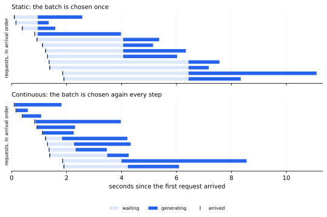
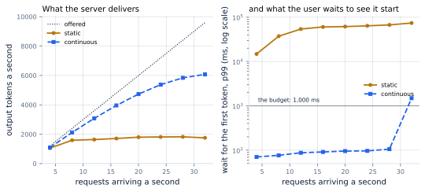
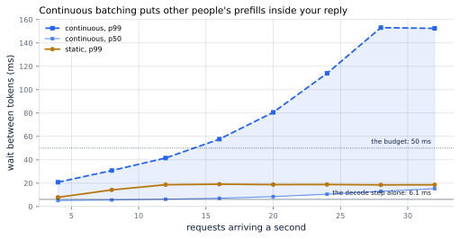

# 17. Continuous Batching

*Written to [STANDARDS.md](STANDARDS.md). Generated from
`chapters/ch17.md` and `code/results/ch17.json`; run `make ch17` in
`code/` to re-measure and re-render.*

**Depends on:** Chapter 16, Chapter 14,
Chapter 5.
**Tier 0** — a few seconds on a laptop CPU, free.

## Objectives

By the end of this chapter you can:

1. Write the continuous batching loop from memory, and say what makes
   it different from the loop in Chapter 16.
2. Name the three decisions a scheduler makes at every iteration, and
   say what each one costs when it is made badly.
3. Measure continuous batching against a static baseline on the same
   traffic, and read from the results where each one stops keeping up.
4. Explain why a continuously batched server has a *worse* tail between
   tokens than a static one, and say what the fix is.
5. Say what really caps the batch in production, and why it is not the
   batch-size flag.

## Why it matters

Chapter 16 ended with an indictment. A batch fixed at the moment
it starts wastes most of what it pays for: every prompt padded to the
longest in the batch, every finished sequence holding a slot it no
longer needs, and every new arrival waiting for the whole batch to
drain before anyone looks at it. Chapter 16 measured the result on
the case study's traffic: most of what a fixed batch pays for is not
work.

All three wastes have one cause — the batch is chosen once — and one
fix. Choose it again, every iteration.

That is the whole idea, and it is worth being clear about how large it
is. In the paper that introduced it, iteration-level scheduling and the
batching change that goes with it produced **"36.9x throughput
improvement at the same level of latency"** over NVIDIA
FasterTransformer, the strongest serving system available at the time,
on a 175-billion-parameter model. The only change in this book of
comparable size is the KV cache of Chapter 12. And unlike
quantization or a faster kernel, this one costs you nothing: no
accuracy, no numerical risk, no new hardware. It is a change to a loop.

Every serving engine in Chapter 6 is built around
this loop. When people say "vLLM is fast", the largest single reason is
the subject of Chapter 14 and this chapter, working
together: paging makes memory grow a block at a time, and continuous
batching spends that flexibility.

## The idea, in one picture

<!-- defines: continuous batching, iteration-level scheduling -->
**Continuous batching** — also called **iteration-level scheduling** —
means the server decides which sequences are in the batch *before every
single forward pass*, rather than once when the batch is formed. A
request that arrives mid-flight joins at the next iteration. A request
that finishes leaves at the end of the iteration it finished in, and
its slot is immediately available to somebody else.

Here is the same 12 requests, arriving at the same moments, run
through both schedulers:



**Figure 17.1** — The same arrivals, two schedulers.
*Provenance in `code/figures/ch17-timeline.caption.txt`.*

Read the top panel first. Requests arrive (the tick marks), and then
they wait — the pale bars — until a batch is formed. When one is, every
member starts together and every member *stays* until the last of them
is finished, whatever its own reply length. Then the next batch forms.
The pale bars are the tell: they get longer as the queue backs up, and
they are pure, recoverable waste.

Now the bottom panel. Each bar starts essentially at its own tick mark.
Requests finish at different times, in roughly the order their replies
ran out. In this small example the last request finishes at
8.6 s instead of 11.1 s, and no request waits
behind an unrelated one for longer than it takes to admit it.

That is the whole chapter. Everything else is the consequences.

## The loop

The scheduler's job is to answer three questions, over and over, for as
long as the server is running.

**Which waiting request do we start?** Starting one means running its
prefill, which costs real time that every already-running sequence
pays. It also means committing memory to it. This is **admission
control** <!-- defines: admission control -->: the decision about when
to let new work into the system, as distinct from the decision about
what to do with the work already in it.

**Which running sequences advance?** In the simplest policy, all of
them, which is what our loop does. Real engines cap it — by sequences,
by tokens, or by both.

**What do we do when memory runs out?** Somebody has to give a slot
back. Chapter 12 named this: **preemption**.

Written out, with the bookkeeping removed, the loop is this:

<!-- abridged: tinyserve/scheduler.py -->

```python
    while i < len(waiting) or queue or running:
        while i < len(waiting) and waiting[i].arrival_s <= clock:
            queue.append(waiting[i]); i += 1
...
        if head is not None and fits and len(running) < max_batch:
            queue.pop(0)
            seconds = prefill_step(head.prompt_tokens).seconds
...
            running.append(head)
...
            continue
...
        # Otherwise: one token for everyone running.
        context = sum(r.context for r in running) // len(running)
        seconds = decode_step(len(running), context).seconds
...
        for r in list(running):
            if r.done:
                pool.used -= r.blocks(block_size)
                running.remove(r)
```

Read it as English. *Take in anything that has arrived. If somebody is
waiting and there is room, start them. Otherwise give everybody running
one token. Let go of anyone who has finished.* Then do it again.

That is fewer moving parts than the static loop it replaces, and it is
the single most valuable loop in this book.

> **If you're new here: what "iteration" means**
>
> One iteration is one forward pass through the model — one trip
> through every layer, reading every weight. In decoding, one iteration
> produces exactly one new token for each sequence in the batch. So
> "deciding the batch every iteration" means deciding it every time a
> token is about to be produced — at the batch this server actually
> ran, on average 22.7 sequences, about once every
> 6.1 ms.
>
> A static batcher makes that decision once and then runs thousands of
> iterations without revisiting it. That is the only difference between
> the two systems. Everything below follows from it.

### The margin that stops the thrashing

There is one piece of the admission test that looks like a detail and
is not. A request is only admitted if the pool has room for its prompt
*plus a margin*:

<!-- listing: tinyserve/scheduler.py Pool.room_for -->

```python
def room_for(self, tokens: int) -> bool:
    """Enough for this prompt, plus the margin that stops thrashing."""
    return self.free >= math.ceil(tokens / self.block_size) + self.watermark
```

Without that margin, consider what happens when memory fills. The
server evicts a sequence, which frees exactly the blocks that sequence
was holding. The evicted request goes back to the front of the queue.
The scheduler looks at the queue, sees a request whose prompt fits in
exactly the space just freed, and admits it — the same one. One decode
step later the pool is full again, and it is evicted again. The server
runs forever, does real work each cycle, and never finishes anybody.

vLLM exposes the margin directly: `--watermark`
<!-- defines: watermark -->, documented as the "fraction of total KV
cache blocks to keep free when admitting waiting or preempted requests
into running queue". SGLang spells the same idea differently, as
`--schedule-conservativeness`: "a larger value means more conservative
scheduling. Use a larger value if you see requests being retracted
frequently."

This is the first of several places in the chapter where a scheduler's
*hesitation* is load-bearing. A scheduler that always says yes is not
an aggressive scheduler; it is a broken one.

## The same traffic, two schedulers

Now the measurement. 600 requests arrive as a Poisson process
at 12 a second, with the case study's prompt and reply lengths
(1,200 and 300 tokens on average). The same
arrivals, the same lengths, the same cost for a prefill and for a
decode step, go through both schedulers. Only the scheduler differs.

<!-- include: tables/ch17-head-to-head.md -->
| | Static batching | Continuous batching | Ratio |
|---|---|---|---|
| Output tokens a second | 1,637 | 3,081 | **1.9x** |
| Time to first token, p50 | 31,472 ms | 20 ms | **1,568x** |
| Time to first token, p99 | 54,040 ms | 87 ms | **619x** |
| Between tokens, p50 | 12.6 ms | 6.2 ms | **2.0x** |
| Between tokens, p99 | 18.7 ms | 41.5 ms | **2.2x worse** |
| End to end, p50 | 36.6 s | 1.9 s | **19x** |
| Slots the batch held, mean | 127 | 22.7 | **--** |
| Sequences actually advancing, mean | 37.4 | 22.7 | **--** |
| Slots held that held live work | 29% | 100% | **--** |
| Peak of the block pool | 74% | 13% | **6x** |
| Time to drain, over the arrival window | 2.1x | 1.10x | **--** |

The same 600 requests, the same arrivals (12 a second, Poisson), the same prompt and output lengths, the same cost model for a prefill and a decode step. Only the scheduler differs. Static forms a batch when 256 requests have arrived or one second has passed, whichever comes first, and is given all the memory it asks for. Every ratio is the better number over the worse one, except where it says otherwise.

Six things in that table are worth saying out loud.

**Throughput nearly doubles** — 1,637 to 3,081 output
tokens a second, 1.9x — with no change to the model, the
hardware, or the arithmetic. The extra tokens come entirely from slots
that were previously held by sequences with nothing to do.

**The wait to see anything at all collapses**, from
31,472 ms to 20 ms at the median: 1,568x. This
is the number that changes what the product feels like. A user waiting
31.5 s before the first word appears has left.

**End to end, the median request finishes 19x sooner** —
36.6 s against 1.9 s. Notice that this is a much
bigger factor than the throughput gain. Throughput measures what the
server produced; this measures what a person experienced, and the two
come apart precisely because static batching makes short requests wait
behind long ones.

**Slot utilization goes from 29% to 100%.** The
100% is not an achievement, it is a definition: under continuous
batching a slot cannot be held by a finished sequence, because the
sequence leaves the batch in the iteration it finishes. There is no
tuning involved. The waste is structurally impossible.

**Memory use drops 6x** — from 74% of the block
pool to 13%. This one surprises people, because continuous
batching is usually sold as a throughput technique. But the static
batch holds every sequence's cache until the *last* one finishes, so
its peak is the sum of a whole batch at its longest. Continuous
batching releases each sequence's blocks the moment it is done, so the
peak is only what is genuinely in flight.

**And the one that does not improve**: the p99 wait between tokens gets
*worse*, 18.7 ms to 41.5 ms. Hold that thought for two
sections.

### Head-of-line blocking, which is what we actually removed

<!-- defines: head-of-line blocking -->One name covers most of what the
table shows. **Head-of-line blocking** is when a piece of work is stuck
behind an unrelated piece of work in front of it — not because it needs
anything that work produces, but purely because of the order they were
put in.

A static batch is head-of-line blocking made into a design. A
five-token reply and a thousand-token reply in the same batch finish at
the same moment, because the batch is one unit. The five-token reply
did not need to wait. It waited because of where it was standing.

Continuous batching does not make the server faster at any single
thing. It removes the queue discipline that was making short work wait
for long work. That is why the end-to-end gain (19x) is so
much larger than the throughput gain (1.9x): most of what it
recovers was never a hardware problem.

## Under rising load

One rate proves the direction. The shape of the two curves as traffic
rises is what tells you how to size a fleet.



**Figure 17.2** — What each scheduler delivers as the traffic rises.
*Provenance in `code/figures/ch17-load.caption.txt`.*

<!-- include: tables/ch17-load.md -->
| Requests a second | Offered | Static: tokens/s | Static: TTFT p99 | Continuous: tokens/s | Continuous: TTFT p99 | Continuous: between tokens, p99 |
|---|---|---|---|---|---|---|
| 4 | 1,200 | 1,056 \* | 14.8 s | **1,094** | 70 ms | 21 ms |
| 8 | 2,400 | 1,591 \* | 37.2 s | **2,121** | 76 ms | 31 ms |
| 12 | 3,600 | 1,637 \* | 54.0 s | **3,081** | 87 ms | 42 ms |
| 16 | 4,800 | 1,709 \* | 60.2 s | **3,960** \* | 91 ms | 58 ms |
| 20 | 6,000 | 1,799 \* | 61.3 s | **4,734** \* | 95 ms | 81 ms |
| 24 | 7,200 | 1,815 \* | 63.8 s | **5,374** \* | 96 ms | 114 ms |
| 28 | 8,400 | 1,822 \* | 66.9 s | **5,839** \* | 105 ms | 153 ms |
| 32 | 9,600 | 1,756 \* | 73.9 s | **6,077** \* | 1,485 ms | 152 ms |

\* not keeping up: the server took more than 10% longer to drain than the requests took to arrive, or missed the 1,000 ms p99 time-to-first-token budget. Offered load is the arrival rate times the mean output length (300 tokens), which is what the service would have to produce to keep up.

The left panel of the figure is the one to look at twice. The dotted
line is the **offered load** — arrival rate times mean reply length, or
what the server would have to produce to keep up. Continuous batching
tracks it closely and then bends away. Static batching leaves it almost
immediately and flattens: no amount of extra traffic moves it, because
the server is already saturated. Across the sweep the ceiling is
1,822 tokens a second against 6,077 — **3.3x**,
on identical hardware running an identical model.

The right panel is worse than it looks, because it is on a log scale.
Static batching's p99 wait for a first token is 15 s
at 4 requests a second and 74 s at
32. It never comes near the case study's
1,000 ms budget at any rate tested — including the lightest one.
Continuous batching stays under 1,000 ms up to 12
requests a second, and reaches 1,485 ms at the top of the
sweep — at a load where it is delivering 6,077 tokens a second,
which static batching never reaches at any rate.

So the honest summary of the table is not "continuous batching is
better". It is: **static batching fails the promise at every load, and
continuous batching keeps it up to a load you can now measure.** Those
are different kinds of statement. The second one is a capacity number
you can plan against.

> **If you're new here: what "not keeping up" means**
>
> A server keeps up when it finishes work at least as fast as work
> arrives. If it does not, the queue in front of it grows without
> bound, and every latency number you measure is a function of how long
> you ran the test rather than a property of the server.
>
> That is why the table flags rows two ways: by whether the server took
> more than 10% longer to drain than the requests took to arrive, and
> by whether it met the p99 first-token budget. Either failure means
> the row's other numbers describe a server already in trouble. A
> saturated server's "average latency" is not a measurement; it is a
> stopwatch on your test harness.

## What it costs: your tokens, somebody else's prefill

Now the bill. Continuous batching wins everything above and loses one
thing, and the thing it loses is the smoothness of a reply once it has
started.



**Figure 17.3** — The median is fine. The tail is not.
*Provenance in `code/figures/ch17-itl.caption.txt`.*

Continuous batching's *median* wait between tokens is
6.2 ms at 12 requests a second — close to the
6.1 ms a decode step alone costs at that batch size, which is the
floor. Its p99 is 41.5 ms: **7x the floor**, and
climbing to 153 ms at the top of the sweep. Static
batching's p99 sits between 8 ms and
19 ms across the whole sweep and barely moves.

The mechanism is not subtle, and it follows directly from the loop.
Look at it again: *if somebody is waiting and there is room, start
them.* Starting them means running their prefill, and a prefill of a
1,200-token prompt costs 19 ms — about
3x a decode step. While that prefill runs, every
sequence already decoding produces nothing. Their clocks keep running.

Then the loop goes round, sees the queue is still not empty, and starts
another one. And another. Under load, several prefills can land
back-to-back between two of your tokens, and the gap you experience is
their sum. That is the whole of the tail in Figure 17.3: the
153 ms at the top of the sweep is several 19 ms
prefills landing one after another, with your next token queued behind
all of them.

State it as a sentence, because it is the sentence this chapter exists
to set up: **under continuous batching, the pause a user sees in the
middle of their reply is somebody else's prompt being read.**

Static batching does not have this problem for the simple reason that
it has no mid-flight arrivals at all. Its decode phase is
uninterruptible because nothing is allowed to interrupt it. That is not
a virtue worth keeping — it buys a stable p99 between tokens at the
price of a 31.5 s median wait for the first one — but it
does explain the one column where it wins.

The fix is not to admit fewer requests. It is to stop treating a
prefill as an atomic thing that must run to completion before anyone
else gets a token: split it into chunks and interleave those chunks
with the decode steps, so a long prompt costs everybody a little rather
than costing them all of it at once. That is chunked prefill, and it is
Chapter 18.

## What actually caps the batch

The batch-size flag is the obvious knob and almost never the binding
constraint. Our head-to-head ran with a cap of 256 sequences
and the continuous scheduler averaged 22.7. It never came
close to the cap. Something else was deciding.

That something is memory, and Chapter 13 already
showed why: every sequence in flight holds a KV cache that grows by a
block every 16 tokens. The pool is finite. The batch is as large
as the pool allows, and not one sequence larger.

Here is the same traffic through smaller and smaller pools, with
nothing else changed:

<!-- include: tables/ch17-pool.md -->
| Block pool | Sequences in flight | Tokens/s | TTFT p99 | Preemptions | Tokens generated twice |
|---|---|---|---|---|---|
| 64.0 GB (100%) | 22.7 | **3,081** | 0.1 s | 0 | 0.0% |
| 16.0 GB (25%) | 22.7 | **3,081** | 0.1 s | 0 | 0.0% |
| 6.4 GB (10%) | 22.7 | **3,080** | 0.8 s | 3 | 0.0% |
| 3.2 GB (5%) | 15.9 | **2,339** | 18.8 s | 82 | 1.5% |
| 1.9 GB (3%) | 9.7 | **1,604** | 53.9 s | 98 | 2.1% |
| 1.3 GB (2%) | 6.4 | **1,114** | 102.4 s | 116 | 3.0% |

Continuous batching at 12 requests a second through smaller and smaller pools. The full pool is 64 GB, which is what is left on one accelerator after the weights. Nothing else changes.

Two readings, and they point in opposite directions.

**The pool has enormous headroom at this load.** Shrinking it to
10% of what the accelerator actually has — 6.4 GB
instead of 64 GB — costs essentially nothing: 3,080
tokens a second against 3,081, with 3
preemptions across 600 requests. At 12 requests a second
with these reply lengths, the server simply does not need the memory.
If you are sizing hardware from a spreadsheet, this is the row that
saves you money.

**And then it falls off a cliff.** At 2% of the pool
(1.3 GB) throughput drops 2.8x to 1,114 tokens
a second, there are 116 preemptions, and the p99 wait for
a first token is 102.4 s.

Two things are going wrong there, and it is worth separating them
because they call for different fixes. The first, and by far the
larger, is that the pool has become the batch-size cap: sequences in
flight drop from 22.7 to 6.4, and Chapter 16
has already said what a small batch costs — the weights are fetched
just as often and fewer tokens ride on each fetch.

The second is that some of the work is now done twice. When a preempted
sequence is admitted again, the tokens it had already generated are
gone; it starts from its prompt. vLLM documents exactly this: a
preempted request "will be re-scheduled in future and re-start its
prefill phase." In our smallest pool, 3.0% of every token
produced was produced twice.

The first of those is what costs you the throughput. The second is what
tells you it is happening, which is why the preemption count and not
the throughput graph is the thing to alert on.

<!-- listing: tinyserve/scheduler.py _make_room -->

```python
def _make_room(trace: Trace, pool: Pool, running: list[Request],
               queue: list[Request], block_size: int) -> int:
    """The pool is full. Evict the newest sequence and start it again later.

    Recomputing is the cheaper of the two ways out -- the other is
    copying its cache to host memory and back -- and which to prefer is
    a scheduling-policy question, taken up with chunked prefill.
    Newest-first is the standard choice: the sequence that has invested
    least loses least.
    """
    evicted = 0
    while pool.free < 0 and running:
        victim = running.pop()
        pool.used -= victim.blocks(block_size)
        trace.recomputed_tokens += victim.generated
        victim.generated = 0
        victim.first_token_s = None
        victim.gap_s = 0.0
        queue.insert(0, victim)
        evicted += 1
    return evicted
```

Newest-first is the conventional choice and the one we use: the
sequence that has generated the least loses the least. SGLang makes the
policy a flag, `--retraction-policy`, which also offers retracting by
length (preferring requests with shorter outputs) or by priority.

The alternative to recomputing is copying the evicted sequence's cache
out to host memory and reading it back later — *swapping*. vLLM
supported both; its documentation now says that "in vLLM V1, the
default preemption mode is `RECOMPUTE` rather than `SWAP`, as
recomputation has lower overhead in the V1 architecture", helped by
prefix caching (Chapter 15) making that recomputation cheap
when the prompt is one the server has already seen. Which to prefer, and how to choose victims,
is a scheduling policy question, and it belongs with the others in
Chapter 18.

The operational reading of all of this: **preemptions are the metric to
watch.** A handful is fine. A stream of them means your pool is too
small for your load, and the server will not tell you by getting
slower in an obvious way — it will tell you by doing the same work
repeatedly. vLLM's own advice is to raise `gpu_memory_utilization`, or
lower `max_num_seqs` or `max_num_batched_tokens`, or shard the model
across more devices.

## Where this is soft

**This chapter simulates a scheduler; it does not time a model.** The
cost of a prefill of *P* tokens and of a decode step over *B* sequences
comes from the roofline arithmetic of
Chapter 5 over the reference model and
published hardware specifications — the same cost model that drew that
chapter's throughput curve. What is being measured is
which requests are in flight at each instant and what they wait for.
The *ratios* between the two schedulers are trustworthy because both
run against the identical cost model; the absolute milliseconds inherit
every simplification in that model.

**The cost model has no scheduler overhead in it.** A real engine
spends time building block tables, launching kernels, and deciding
things. At small batches that overhead is a meaningful share of an
iteration, and it counts against continuous batching specifically,
because continuous batching makes that decision far more often. Treat
our decode-step floor as a floor.

**Static batching is modelled generously.** It forms a batch after one
second rather than waiting for 256 arrivals, it is given the
same paged allocator as the continuous scheduler, and it is never
refused memory. A real static server with a rectangular KV tensor would
hold considerably more memory than 74% of the pool, and one
that waited for a full batch would have a far worse first-token
latency. The comparison understates the gap.

**The admission policy here is the simplest one that works.** One
request admitted per iteration, first-come-first-served, prefill
preferred whenever the queue is not empty. That is deliberate: it is
the policy that makes the inter-token tail as bad as it gets, which is
what Chapter 18 needs as its starting point. Engines do
better already.

**One arrival process, one pair of length distributions, one seed.**
The traffic is the case study's (STANDARDS.md section 7). A workload of
uniform lengths would show much less difference between the two
schedulers, because head-of-line blocking needs variance to bite. Long
reply lengths would show much more.

**Nothing here is distributed.** One replica, one copy of the weights,
no routing, no prefix-aware placement. Everything from
Chapter 19 onward complicates this
picture.

## In production

- **You do not turn this on; it is what an engine *is*.** vLLM and
  SGLang schedule at iteration granularity and offer no other mode, so
  there is no `--continuous-batching` flag to look for. NVIDIA's
  TensorRT-LLM calls the same thing *in-flight batching*, and its own
  documentation glosses the name: "also known in the community as
  continuous batching or iteration-level batching". If you are hunting
  for a flag, you are probably running your own loop instead of an
  engine, and you should stop.
- **The flags that matter are the caps.** vLLM's `--max-num-seqs`
  ("maximum number of sequences to be processed in a single iteration")
  and `--max-num-batched-tokens` ("maximum number of tokens that can be
  processed in a single iteration"); SGLang's `--max-running-requests`.
  The token cap is the one that binds once prompts are long, and it is
  the one that controls the tail in Figure 17.3.
- **Order is a policy.** vLLM's `--scheduling-policy` takes `fcfs`
  (default) or `priority`. SGLang's `--schedule-policy` defaults to
  `fcfs` and also offers `lpm` (longest prefix match, which schedules
  for cache hits rather than for fairness), `lof`, `dfs-weight`,
  `random`, `priority` and `routing-key`.
- **Watch `vllm:num_requests_running` against your cap.** If running
  sits far below `max_num_seqs`, the batch is capped by memory, not by
  the flag — the situation in the pool table above. Raising the flag
  does nothing. Raising `gpu_memory_utilization`, or shortening the
  context, does.
- **Watch preemptions, and treat a steady stream of them as an
  incident.** They are how "not enough KV cache" manifests, and the
  symptom is redone work rather than slow steps.
- **Report `vllm:time_to_first_token_seconds` and
  `vllm:inter_token_latency_seconds` as histograms, at the p99.** The
  mean of either is meaningless here for the reason Figure 17.3 shows:
  the distribution has a decode mode and a somebody-else's-prefill
  mode, and the mean sits between them describing neither.

## Numbers to remember

| Quantity | Value |
|---|---|
| Throughput, static → continuous, at 12 req/s | 1,637 → 3,081 tok/s (1.9x) |
| Ceiling across the sweep | 1,822 → 6,077 tok/s (3.3x) |
| Time to first token, p50 | 31,472 ms → 20 ms (1,568x) |
| End to end, p50 | 36.6 s → 1.9 s (19x) |
| Slots holding live work | 29% → 100% |
| Peak block-pool use | 74% → 13% (6x less) |
| What it costs: between-token p99 | 18.7 ms → 41.5 ms, against a 6.1 ms floor |
| Load the SLO survives, of 4-32 req/s | static: none of the rates tested; continuous: up to 12 |
| Pool needed at 12 req/s | 6.4 GB of 64 GB (10%) |
| Where it collapses | 1.3 GB: 116 preemptions, 3.0% of tokens produced twice |

## Sources

- Yu, Jeong, Kim, Kim and Chun, "Orca: A Distributed Serving System for
  Transformer-Based Generative Models", OSDI 2022, pp. 521–538 — the
  paper that introduced iteration-level scheduling and selective
  batching, and reported 36.9x throughput at the same latency against
  NVIDIA FasterTransformer on GPT-3 175B.
- Kwon, Li, Zhuang, Sheng, Zheng, Yu, Gonzalez, Zhang and Stoica,
  "Efficient Memory Management for Large Language Model Serving with
  PagedAttention", SOSP 2023, doi:10.1145/3600006.3613165 — the
  allocator that makes the batch flexible enough for this loop to be
  worth writing.
- vLLM documentation: `configuration/engine_args` for
  `--scheduling-policy`, `--watermark`, `--max-num-seqs` and
  `--max-num-batched-tokens`; `configuration/optimization` for
  preemption and its remedies; `design/metrics` for what a preempted
  request loses and which histograms to export. Values and dates in
  `FACTS.md`.
- SGLang documentation, `advanced_features/server_arguments`, for
  `--schedule-policy`, `--schedule-conservativeness` and
  `--retraction-policy`.
- Dean and Barroso, "The Tail at Scale", CACM 56(2), 2013 — why the
  p99 of Figure 17.3, and not its median, is the number that describes
  your service.

## Exercises

**★ 17.1** The table says throughput rose 1.9x and the median
request finished 19x sooner. Explain in two sentences why
those are different numbers, and say which one you would put in a
design document arguing for the change.

**★ 17.2** A colleague proposes fixing the inter-token tail by setting
`--max-num-seqs` to 8. Using the pool table and Figure 17.3, say what
that would actually do to throughput, to time-to-first-token, and to
the tail. Then say what it would do to your accelerator bill.

**★★ 17.3** Run `make ch17` with the admission rule changed so that at
most one prefill runs between any two decode steps. Measure what
happens to the p99 between tokens and to the p99 time to first token.
You have just built a crude version of the next chapter's idea: which
of its two problems does it solve, and which does it not?

**★★ 17.4** Our scheduler admits requests first-come-first-served.
Implement shortest-remaining-output-first instead, using the true
reply length (which a real server does not know). Measure mean and p99
completion time. Then explain why vLLM and SGLang both default to
first-come-first-served anyway, and what would have to be true for the
alternative to be usable.

**★★★ 17.5** The smallest pool in the table generated
3.0% of its tokens twice. Implement swapping as the
alternative to recomputing: on preemption, copy the victim's blocks to
host memory at a bandwidth you choose, and copy them back on
re-admission. Find the PCIe bandwidth at which swapping beats
recomputing for this traffic, and check it against a real interconnect.
Then re-run with prefix caching (Chapter 15) enabled for the
recompute path and see whether the answer survives.
