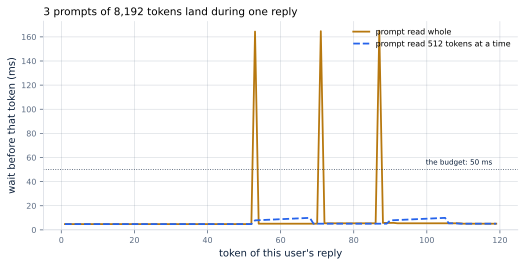
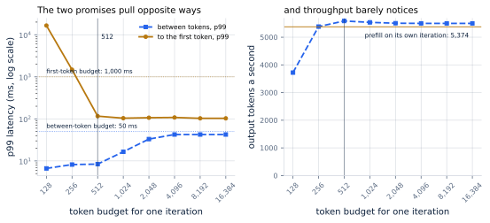
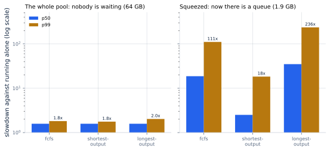

# 18. Chunked Prefill and Scheduling Policies

*Written to [STANDARDS.md](STANDARDS.md). Generated from
`chapters/ch18.md` and `code/results/ch18.json`; run `make ch18` in
`code/` to re-measure and re-render.*

**Depends on:** Chapter 17, Chapter 3,
Chapter 13.
**Tier 0** — a few seconds on a laptop CPU, free.

## Objectives

By the end of this chapter you can:

1. Explain why one long prompt stalls every other user's reply, and
   compute how long the stall is before running anything.
2. Build a stall-free schedule: decode tokens first, prefill chunks
   with what is left of a per-iteration token budget.
3. Choose that budget from a service level objective rather than from a
   default, and say which promise each direction breaks.
4. Say when a queue order matters and when it changes nothing, and
   measure the fairness cost of shortest-job-first.
5. Decide between recomputing and swapping a preempted sequence, from
   the arithmetic and from what the whole system does.

## Why it matters

Chapter 17 ended with one number going the wrong way.
Deciding the batch at every iteration won on throughput, on the wait
for a first token, on memory and on end-to-end time — and lost on the
wait *between* tokens, whose 99th percentile rose to
41.5 ms against a 7.1 ms floor, and to
114 ms once the traffic reached 24 requests a
second. At that rate it breaks the case study's promise of
50 ms between words.

The cause was named there and is worth restating, because everything in
this chapter is a response to it. A prompt is admitted, its prefill
runs, and while it runs *no sequence already decoding produces
anything*. The person watching a reply appear sees it stop. The length
of the stop is not a mystery: it is how long that prompt takes to read,
which for the case study's 1,200-token prompts is
19 ms and for an 8,192-token document is
159 ms.

This chapter fixes that, and then goes on to the three other decisions
a scheduler has to make once it can decide anything at all: how much
work to put in one iteration, who to serve first, and what to do when
the memory runs out. Those four decisions are the entire content of a
production scheduler. There is nothing else in there.

## One reply, three interruptions

Start as small as possible: one user, generating a 120-token
reply, while 3 prompts of 8,192 tokens each
arrive during it. Nothing else is running. Here is the wait before each
token of that one reply.



**Figure 18.1** — Each spike is somebody else's prompt.
*Provenance in `code/figures/ch18-interference.caption.txt`.*

The amber line is Chapter 17's scheduler. Most tokens
arrive 5.1 ms apart, which is the decode step. Three of them
arrive 165 ms apart, and the three correspond exactly to the
three arrivals. 3 gaps break the 50 ms
promise, out of 120.

The blue line is the same traffic with one change. Instead of reading
each 8,192-token prompt in one iteration, the server reads
512 tokens of it per iteration and spends the rest of each
iteration doing what it was doing: giving the decoding sequence its
next token. The worst wait falls from 165 ms to
9.9 ms — **17x smaller** — and
0 gaps break the promise.

Look closely at the blue line and you can still see the interruptions:
between tokens 50 and 105 it sits a little above the floor, because
those iterations are carrying prefill work as well. That is the
mechanism made visible. **The work did not go away. It was spread.**

And notice what it cost the interrupted user: nothing. Their reply
finishes at 0.72 s instead of 1.09 s —
*sooner*, because the server never spent a whole iteration on prefill
alone, producing no tokens for anybody.

## The loop, one change

**Chunked prefill**, named in Chapter 3, is the
mechanism: a prompt too long to fit in what is left of an iteration is
split, and read over several iterations.
<!-- defines: stall-free batching -->The
schedule it makes possible is what Sarathi-Serve named **stall-free
batching** — a schedule that "adds new requests in a batch without
pausing ongoing decodes".

The rule has two halves and an order between them, and the order is the
whole idea:

1. Every sequence that is decoding gets its token. They go in first,
   always, and they are never displaced.
2. Whatever is left of a fixed **token budget**
   <!-- defines: token budget --> — a cap on how many token positions
   the whole iteration may carry, decodes and prompt chunks together —
   is spent reading somebody's prompt. If the prompt does not fit in the
   remainder, read as much of it as fits and continue next time.

That is exactly what vLLM V1 does: its scheduler "batches all pending
decode requests before scheduling any prefill operations", then fills
the remaining budget and chunks what does not fit. In our scheduler the
whole rule is two lines:

<!-- abridged: tinyserve/scheduler.py -->

```python
        # The decodes have first claim on the iteration.
        budget = max(0, token_budget - len(decoding))
...
        chunk = (min(budget, chunk_req.prompt_tokens - chunk_req.prefilled)
                 if chunk_req is not None and budget > 0 else 0)
```

Both kinds of work then go through the model together, in one pass over
the weights:

<!-- listing: tinyserve/serving.py mixed_step no-docstring -->

```python
def mixed_step(batch: int, seq: int, chunk: int = 0, chunk_cached: int = 0,
               bytes_per_weight: int = 2) -> Step:
    scale = bytes_per_weight / 2
    cached = batch * seq + chunk_cached
    bytes_read = int(WEIGHT_BYTES * scale + cached * KV_BYTES_PER_TOKEN * scale)
    flops = 2 * PARAMS * batch + flops_forward(MODEL, chunk, chunk_cached + chunk)
    t_memory = bytes_read / HBM_BYTES_PER_S
    t_compute = flops / PEAK_BF16_FLOPS
    return Step(batch=batch, seq=seq, seconds=max(t_memory, t_compute),
                bytes_read=bytes_read, flops=flops,
                bound_by="memory" if t_memory >= t_compute else "compute")
```

That is the sentence to hold onto. **A prefill chunk rides along on a
weight fetch that was going to happen anyway.** The decode step already
had to read every parameter in the model; carrying a few hundred prompt
tokens through the same fetch costs arithmetic, which the accelerator
had spare (Chapter 8 showed exactly
how much), and no extra bytes.

> **If you're new here: why "budget" is measured in tokens**
>
> An iteration's cost is not really about how many *requests* are in
> it. It is about how many token positions the model has to push
> through its layers. A batch of 64 sequences each taking one decode
> step is 64 positions. A batch of 64 plus a 2,048-token prompt chunk
> is 2,112 positions — thirty-three times the arithmetic, in the same
> iteration, with the same weights read once.
>
> That is why every engine's real knob is a *token* budget
> (`--max-num-batched-tokens`, `--chunked-prefill-size`) and not a
> sequence count. A sequence count cannot tell a one-token decode from
> a ten-thousand-token prompt, and the difference between those two is
> the difference between a 7.1 ms iteration and a
> 159 ms one.

## Choosing the budget

The budget is the chapter's one tuning decision, and it is genuinely a
trade rather than a setting with a right answer. vLLM's documentation
states both directions: "smaller values (e.g., 2048) achieve better ITL
because there are fewer prefills slowing down decodes", while "higher
values achieve better time to first token (TTFT) as you can process
more prefill tokens in a batch."

Here is that trade measured, at 24 requests a second — the
load at which Chapter 17's scheduler stopped keeping
the promise.



**Figure 18.2** — Two promises, one knob.
*Provenance in `code/figures/ch18-budget.caption.txt`.*

<!-- include: tables/ch18-budget.md -->
| Token budget | Tokens/s | TTFT p50 | TTFT p99 | Between tokens, p50 | Between tokens, p99 | Iterations carrying prefill | Keeps |
|---|---|---|---|---|---|---|---|
| _prefill alone_ | 5,374 | 25 ms | 96 ms | 10.5 ms | 114.0 ms | 18% | TTFT only |
| 128 | 3,721 | 7.6 s | 16.5 s | 6.2 ms | 6.6 ms | 87% | between-token only |
| 256 | 5,384 | 211 ms | 1.5 s | 7.2 ms | 8.2 ms | 72% | between-token only |
| **512** | 5,586 | 35 ms | 116 ms | 7.9 ms | 8.4 ms | 39% | both |
| 1,024 | 5,536 | 30 ms | 104 ms | 8.4 ms | 16.5 ms | 26% | both |
| 2,048 | 5,506 | 27 ms | 107 ms | 8.8 ms | 33.1 ms | 19% | both |
| 4,096 | 5,499 | 27 ms | 108 ms | 8.9 ms | 42.5 ms | 17% | both |
| 8,192 | 5,499 | 27 ms | 103 ms | 8.9 ms | 42.5 ms | 17% | both |
| 16,384 | 5,499 | 27 ms | 103 ms | 8.9 ms | 42.5 ms | 17% | both |

600 requests at a rate of 24 a second (seed 0), the rate at which the previous chapter's scheduler stopped keeping its promise. The first row is that scheduler: a prefill gets an iteration to itself. Every row below mixes prefill into the same iteration as the decodes, splitting it when it does not fit in the budget. "Keeps" is against the case study's p99 promises: 1,000 ms to the first token and 50 ms between them.

Read the first row and then the row marked in bold, because between
them they contain the chapter.

The first row is Chapter 17's scheduler: a prefill gets
an iteration to itself. 5,374 tokens a second, and
114 ms between tokens at the 99th percentile — more than twice
the 50 ms promise. **It fails.**

The bold row is a stall-free schedule with a 512-token budget.
5,586 tokens a second — 1.04x the throughput, not
less — with 8.4 ms between tokens, **14x better**,
and 116 ms to the first token. It keeps both promises. There
is no trade against the previous chapter here at all: it is better on
every column.

That is worth being explicit about, because "throughput-latency
trade-off" is such a fixed phrase that it gets applied where it does not
belong. Sarathi-Serve's title is *Taming* the trade-off, and the taming
is real: on this traffic, mixing prefill into decode iterations is free.
The paper reports the same shape at a larger scale — "2.6x higher
serving capacity" for Mistral-7B on one A100, and "up to 3.7x" for
Yi-34B on two, against vLLM.

The trade that *does* exist is inside the sweep, between the rows:

**Too small and the prompts cannot keep up.** At 128
tokens, 87% of all iterations are carrying prefill and it
still is not enough: the wait for a first token reaches
16.5 s at the 99th percentile and throughput falls to
3,721. Once the decoding sequences alone consume the budget,
there is nothing left for prefill at all, and new work simply stops
being admitted. A budget smaller than your steady-state batch is not a
conservative setting; it is a stall of a different kind.

**Too large and you are back where you started.** At
16,384 tokens, an entire 1,200-token prompt fits
in one iteration, so it is never split, and the between-token p99
returns to 42.5 ms — near the previous chapter's
114 ms. The knob is doing nothing because nothing ever exceeds
it.

**And the middle is wide.** Every budget from 512 up keeps both
promises at this load; 512 is simply the one that delivers most.
Throughput varies by a few per cent across the whole range, which is
the right way round: the knob controls latency, and you can turn it
without watching the throughput graph.

At the lighter load of 12 requests a second the same budget gives
3,084 tokens a second at 8.3 ms between tokens,
against 3,081 and 41.5 ms for the previous
chapter's scheduler. Same conclusion, more headroom.

## Who goes first

A scheduler that can choose the batch every iteration can also choose
*whose* prompt to start. That is a policy, and the obvious question is
how much it is worth.

The answer, on this traffic, is a useful surprise.



**Figure 18.3** — Order matters only when somebody is waiting.
*Provenance in `code/figures/ch18-policy.caption.txt`.*

<!-- include: tables/ch18-policy.md -->
| Block pool | Queue order | End to end p50 | End to end p99 | Slowdown p50 | Slowdown p99 | Worst slowdown | Tokens/s |
|---|---|---|---|---|---|---|---|
| 64 GB (full) | `fcfs` | 1.88 s | 7.99 s | **1.6x** | 2x | 2x | 5,586 |
| 64 GB (full) | `shortest-output` | 1.88 s | 8.00 s | **1.6x** | 2x | 2x | 5,585 |
| 64 GB (full) | `longest-output` | 1.89 s | 7.98 s | **1.6x** | 2x | 3x | 5,587 |
| 1.9 GB (squeezed) | `fcfs` | 26.87 s | 38.62 s | **18.7x** | 111x | 253x | 2,686 |
| 1.9 GB (squeezed) | `shortest-output` | 2.47 s | 54.65 s | **2.5x** | 18x | 19x | 2,822 |
| 1.9 GB (squeezed) | `longest-output` | 40.80 s | 63.67 s | **35.0x** | 236x | 411x | 2,683 |

The same 600 requests at 24 a second through three queue orders, twice: once with the whole block pool and once with it squeezed to 3% of it. Slowdown is how much longer a request took than it would have taken alone on an idle server -- the fairness number, and the one that moves. `shortest-output` and `longest-output` sort by the true reply length, which a real server does not know; they are the best and worst a perfect oracle could do.

**With the whole 64 GB pool, the order changes nothing.** The
three policies finish the median request within 0.7% of each
other. There is no mystery here and it is not a flaw in the experiment:
the server admits almost every request on arrival, so the queue it
would be ordering is empty. **A scheduling policy is a decision about
who waits, and if nobody waits there is no decision to make.**

This is the single most common mistake in scheduler tuning. Teams reach
for priorities and fair-share policies while the server still has
headroom, measure nothing, and conclude the feature does not work.

**Squeeze the pool to 3% of that and the order
decides everything.** Now there is a queue, and:

- First-come-first-served finishes the median request in
  26.9 s and stretches the unluckiest request to
  253 times what it would have taken alone.
- Shortest-output-first finishes the median in 2.5 s —
  **11x faster** — and, far more strikingly, holds the
  worst slowdown to 19x against FCFS's
  253x. It even delivers slightly more tokens a second
  (2,822 against 2,686), because short requests
  release their memory sooner.
- Longest-output-first — the same oracle used backwards, included to
  bound the damage a bad policy can do — pushes the median to
  40.8 s and the worst slowdown to 411x.

<!-- defines: shortest-job-first -->Preferring the shortest work is
**shortest-job-first**, and it is one of the oldest results in
scheduling: it minimises the average wait. The table shows both why it
is tempting and what it costs. Look at the end-to-end p99 column, not
the slowdown one: shortest-output-first takes it from 38.6 s
to 54.6 s, **1.4x worse**. The long requests are
not slowed relative to their own size — their slowdown is much better
— but in wall-clock seconds they wait longer, because everything short
keeps arriving and going in front of them.

That is the fairness question in one pair of numbers, and it has no
technical answer. A code-completion service should probably run
shortest-first. A service where a long request is a long *document*
somebody is waiting on should probably not.

There is also a practical objection, and it is fatal to the version
measured here: **the server does not know how long a reply will be.**
Our two oracle policies sort by the true output length, which is
information that does not exist until the reply is finished. What real
engines expose instead is the one thing the caller can be asked for:
vLLM's `--scheduling-policy` takes `fcfs` (the default) or `priority`,
where the priority is supplied with the request. SGLang defaults to
`fcfs` too and offers `lpm` — longest prefix match, which orders the
queue to maximise prefix-cache hits (Chapter 15) rather than
to be fair — along with `lof`, `dfs-weight`, `random`, `priority` and
`routing-key`.

Read the oracle rows, then, as a bound rather than a recipe: they say
how much a perfect predictor would be worth, which is the number to
weigh a real predictor's accuracy against.

## When the memory runs out

The last decision. Chapter 17 showed a pool small
enough to force preemption and used the simplest way out: throw the
evicted sequence's cache away and start it again later. There is
another: copy the cache to host memory and copy it back. vLLM supported
both and documents its choice — "in vLLM V1, the default preemption
mode is `RECOMPUTE` rather than `SWAP`, as recomputation has lower
overhead in the V1 architecture."

Start with the arithmetic for one sequence, because it is
straightforward and it points the wrong way.

<!-- include: tables/ch18-swap.md -->
| Context | Recompute it | Copy it over PCIe 4.0 x16 | Copy it over PCIe 5.0 x16 | Copy it over NVLink (H100) | Link speed at which they tie |
|---|---|---|---|---|---|
| 256 tokens | 4.8 ms | 2.1 ms | 1.0 ms | 0.1 ms | **14 GB/s** |
| 512 tokens | 7.9 ms | 4.2 ms | 2.1 ms | 0.1 ms | **17 GB/s** |
| 1,024 tokens | 16.0 ms | 8.4 ms | 4.2 ms | 0.3 ms | **17 GB/s** |
| 1,500 tokens | 23.8 ms | 12.3 ms | 6.1 ms | 0.4 ms | **16 GB/s** |
| 2,048 tokens | 33.2 ms | 16.8 ms | 8.4 ms | 0.6 ms | **16 GB/s** |
| 4,096 tokens | 70.8 ms | 33.6 ms | 16.8 ms | 1.2 ms | **15 GB/s** |
| 8,192 tokens | 159.3 ms | 67.1 ms | 33.6 ms | 2.4 ms | **13 GB/s** |

One preempted sequence, both ways. Recomputing re-reads its context: arithmetic, growing faster than the length. Copying moves its keys and values out and back: 128 KiB a token each way, growing linearly. The last column is the link speed at which the two cost the same.

Recomputing a 1,500-token context costs 24 ms
of arithmetic. Copying it out and back over PCIe 5.0 costs
6.1 ms, and over NVLink 0.4 ms. The two tie at about
16 GB/s — and every interconnect in the table is faster
than that. On raw time per event, **swapping wins, and it wins by more
as contexts grow**: at 8,192 tokens it is
159 ms against 34 ms.

Now run it.

<!-- include: tables/ch18-preemption.md -->
| Way out of a full pool | Tokens/s | Sequences in flight | Preemptions | Prompt tokens read | Copied | Time copying | TTFT p99 |
|---|---|---|---|---|---|---|---|
| recompute | **2,738** | 18.3 | 1,163 | 3.04x over | 0 GB | 0.00 s | 11.7 s |
| swap over PCIe 4.0 x16 | **2,139** | 12.6 | 357 | 1.00x over | 52 GB | 3.28 s | 26.0 s |
| swap over PCIe 5.0 x16 | **2,182** | 12.6 | 357 | 1.00x over | 52 GB | 1.64 s | 24.4 s |
| swap over NVLink (H100) | **2,223** | 12.6 | 357 | 1.00x over | 52 GB | 0.12 s | 22.9 s |

A 1.9 GB pool (3% of the accelerator's free memory) at 12 requests a second, small enough that the server has to take sequences back out of the batch. Recomputing throws the evicted cache away; swapping copies it to host memory and back across the named link.

Recomputing delivers 2,738 tokens a second. Swapping over PCIe
5.0 delivers 2,182 — **1.25x worse** — and its p99
wait for a first token is 24.4 s against 11.7 s,
2.1x worse. Recomputing wins the system even though it
loses every individual event, and it wins while re-reading every prompt
3.04x over.

The explanation is in the "sequences in flight" column, and it is a
lesson about scheduling rather than about bandwidth.

<!-- listing: tinyserve/scheduler.py _evict no-docstring -->

```python
def _evict(trace: Trace, pool: Pool, decoding: list[Request],
           restart: list[Request], block_size: int,
           swap_bytes_per_s: float | None, clock: float) -> tuple[int, float]:
    evicted, seconds = 0, 0.0
    while pool.free < 0 and decoding:
        victim = decoding.pop()
        pool.used -= victim.blocks(block_size)
        if swap_bytes_per_s:
            bytes_moved = victim.context * KV_BYTES_PER_TOKEN
            seconds += bytes_moved / swap_bytes_per_s
            trace.swapped_bytes += bytes_moved
            victim.swapped = True            # its tokens are kept, elsewhere
            victim.out_since = clock         # and its user is still waiting
        else:
            trace.recomputed_tokens += victim.generated
            trace.recomputed_prompt_tokens += victim.prefilled
            victim.generated = 0
            victim.prefilled = 0
            victim.first_token_s = None
            victim.gaps_ms.clear()
        victim.gap_s = 0.0
        restart.insert(0, victim)
        evicted += 1
    return evicted, seconds
```

A **recomputed** sequence comes back empty. It re-enters through the
chunked prefill path, taking its memory a few hundred tokens at a time,
so the pool refills gradually and other sequences keep finishing in the
meantime. The batch stays at 18.3 sequences.

A **swapped** sequence comes back *whole*. It needs its entire cache
restored in one go before it can take a single step, and in a pool that
is already full there is rarely room. So it waits, and while it waits
it is holding a place in the queue: the batch falls to
12.6 — 1.5x smaller — and a smaller batch is
exactly what Chapter 16 said costs throughput.

Throwing the work away turns out to be a form of backpressure. The
cheaper operation produced the worse system, because what mattered was
not the cost of the transfer but the shape of the re-entry.

Two caveats before you take that as a rule. The transfer time here is
charged against the server's own clock, as though nothing else can
proceed during it; a real engine overlaps some of it. And recomputing
is far cheaper in practice than it is here, because prefix caching
(Chapter 15) is on by default and a re-read prompt is very
likely to be a cache hit — which is precisely the reason vLLM's
documentation gives for the change: "in V1, with prefix caching being
better (zero over head) and therefore on by default, the preemption and
recompute strategy should work better."

The number that actually matters is neither: it is the preemption count
itself. 1,163 preemptions in 600 requests means the
pool is too small, and no choice of eviction mechanism fixes that.

## Where this is soft

**This chapter simulates a scheduler; it does not time a model.** What
a mixed iteration costs — *B* sequences taking one token each plus a
chunk of *C* prompt tokens — is arithmetic over the reference model and
published hardware specifications, the same model
Chapter 5 used. Both arms of every
comparison run against the identical cost model, so the ratios are
trustworthy; the absolute milliseconds inherit every simplification in
it.

**The arithmetic model charges attention as a rectangle.** It counts
every new token as attending over every token in the sequence, rather
than only over those before it. Splitting a prompt therefore reduces
its charged arithmetic slightly, which flatters chunking. At the case
study's 1,200-token prompts, attention is 4% of a
prefill and the largest drift across the whole budget sweep is
1.8% — `test_the_two_steps_are_one_step` asserts that bound
rather than assuming it. At 8,192-token prompts attention is
22% of the work and the drift reaches
11%, so read this chapter's numbers as applying to
chat-length prompts.

**No kernel overhead, and mixed batches are the case with most of it.**
A real engine runs a mixed iteration through kernels that must handle
ragged sequence lengths and a prefill chunk at once; that machinery is
where chunked prefill's genuine overhead lives, and none of it is
modelled here. It counts against small budgets in particular, because
small budgets mean more iterations.

**The oracle policies cannot be implemented.** `shortest-output` and
`longest-output` sort by the true reply length. They bound what
prediction would be worth; they are not a proposal.

**One arrival process, one seed, one pair of length distributions.**
The traffic is the case study's (STANDARDS.md section 7). Chunked
prefill's value scales with how long and how variable prompts are: a
service with uniform 200-token prompts would see almost none of this,
and a document-summarisation service would see far more.

**The swap model is pessimistic and the recompute model is
optimistic.** Swapping pays for its transfer serially, with no overlap;
recomputing pays full price with no prefix-cache hits. Both are stated
above, and both push the comparison the same way, which is the
direction that agrees with vLLM's default — so treat the result as
consistent with the production choice rather than as independent
confirmation of it.

## In production

- **Chunked prefill is on.** "In V1, chunked prefill is enabled by
  default whenever possible." You are not deciding whether to use it;
  you are deciding the budget.
- **`--max-num-batched-tokens` is the budget** in vLLM, and
  `--chunked-prefill-size` in SGLang (`-1` disables it). vLLM's own
  advice is "for optimal throughput, we recommend setting
  `max_num_batched_tokens > 8192` especially for smaller models on
  large GPUs" — which is the throughput-first end of Figure 18.2. If
  you have a p99 between-token promise, that advice is not for you;
  sweep it against your own SLO, which takes an afternoon.
- **Sweep the budget at the load you are worried about, not at an easy
  one.** At 12 requests a second in our sweep, every budget
  passed. The budget only revealed itself as a decision at
  24.
- **Leave the queue order alone until there is a queue.** Check
  `vllm:num_requests_waiting` first. If it is near zero, a scheduling
  policy cannot help you and a bigger pool or more replicas can.
- **`--scheduling-policy priority` needs a priority from somewhere.**
  Usually a tier in the request, from the API key. Decide what the
  tiers mean before you turn it on, because FCFS is the only policy
  nobody has to argue about.
- **Use `lpm` when your traffic has shared prefixes and your SLO is
  loose.** It orders the queue for cache hits rather than for fairness,
  which is the right trade for batch workloads and the wrong one for
  interactive ones.
- **Alert on preemptions, not on the preemption mode.** The mode is a
  second-order choice; a steady preemption rate means the pool is too
  small for the load, and that is the thing to fix.

## Numbers to remember

| Quantity | Value |
|---|---|
| One 8,192-token prompt landing in your reply | 165 ms of silence, whole; 9.9 ms chunked (17x) |
| Prefill of the case study's 1,200-token prompt | 19 ms, against a 7.1 ms decode step |
| Stall-free against prefill-alone, at 24 req/s | 5,374 → 5,586 tok/s, between-token p99 114 ms → 8.4 ms |
| The budget that did it | 512 tokens an iteration |
| Budget too small (128) | first token p99 16.5 s, throughput 3,721 |
| Budget too large (16,384) | between-token p99 back to 42.5 ms |
| Queue order, pool with headroom | changes the median by 0.7% |
| Queue order, pool squeezed to 3% | FCFS 26.9 s → shortest-first 2.5 s (11x), p99 1.4x worse |
| Recompute or swap, one 1,500-token sequence | 24 ms against 6.1 ms; they tie at 16 GB/s |
| Recompute or swap, the whole server | 2,738 against 2,182 tok/s — the cheaper event lost |

## Sources

- Agrawal, Kedia, Panwar, Mohan, Kwatra, Gulavani, Tumanov and Ramjee,
  "Taming Throughput-Latency Tradeoff in LLM Inference with
  Sarathi-Serve", OSDI 2024, pp. 117–134 — chunked prefills and
  stall-free scheduling, reporting 2.6x higher serving capacity for
  Mistral-7B on one A100 and up to 3.7x for Yi-34B on two, against
  vLLM.
- Yu, Jeong, Kim, Kim and Chun, "Orca: A Distributed Serving System for
  Transformer-Based Generative Models", OSDI 2022, pp. 521–538 — the
  iteration-level scheduling this chapter modifies.
- vLLM documentation: `configuration/optimization` for chunked prefill
  being on by default, the token-budget trade-off and the preemption
  modes; `configuration/engine_args` for `--scheduling-policy` and
  `--max-num-batched-tokens`; `design/metrics` for what a preempted
  request loses. Values and dates in `FACTS.md`.
- SGLang documentation, `advanced_features/server_arguments`, for
  `--chunked-prefill-size`, `--schedule-policy` and
  `--retraction-policy`.
- PCI-SIG and NVIDIA datasheets for the interconnect speeds in the swap
  table; recorded in `FACTS.md`.

## Exercises

**★ 18.1** A 8,192-token prompt takes 159 ms to
read. With a token budget of 512 and 64 sequences decoding, how
many iterations does that prompt take to finish, and what does each one
add to the wait of a user already decoding? Check your answer against
Figure 18.1.

**★ 18.2** The table shows throughput almost flat from 512 to
16,384 tokens, while the between-token p99 rises from
8.4 ms to 42.5 ms over the same range. A colleague
proposes 16,384 "for throughput". Write the two-sentence
reply.

**★★ 18.3** Run `make ch18` with the case study's prompts replaced by a
uniform 200 tokens. How much of this chapter survives? Now try a
bimodal mixture — 90% short chat turns and 10% document summaries — and
explain why the p99 behaves the way it does.

**★★ 18.4** The oracle policies sort by the true reply length. Build a
predictor that does not cheat: estimate the output length from the
prompt alone (its length, or a keyword), with whatever accuracy you can
get, and measure how much of shortest-output-first's
11x median improvement survives. At what accuracy does it
stop being worth having?

**★★★ 18.5** Swapping lost because a swapped sequence needs its whole
cache back at once. Implement *chunked* swap-in: bring the cache back
a few blocks at a time so the sequence can re-enter gradually, as a
recomputed one does. Does it recover the 1.25x gap? Then
add a prefix cache to the recompute path and re-run both. Which one is
the default you would ship, and what property of your traffic decides
it?
