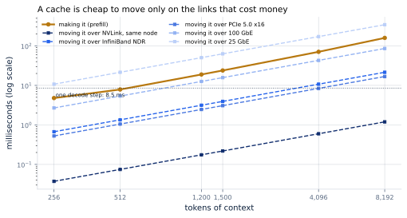
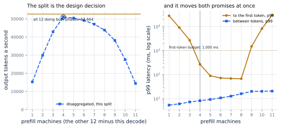
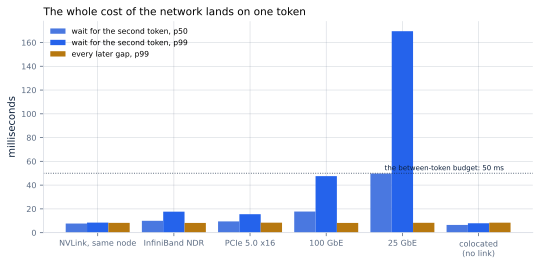

# 19. Disaggregated Prefill and Decode

*Written to [STANDARDS.md](STANDARDS.md). Generated from
`chapters/ch19.md` and `code/results/ch19.json`; run `make ch19` in
`code/` to re-measure and re-render.*

**Depends on:** Chapter 18, Chapter 3,
Chapter 13.
**Tier 0** — about a minute and a half on a laptop CPU, free. The
design it models is Tier 3: many accelerators and a fast network.

## Objectives

By the end of this chapter you can:

1. State the case for running prefill and decode on different machines,
   and compute what moving a KV cache between them costs.
2. Say where that cost lands in a user's experience — which is one
   specific token, not the average.
3. Choose a prefill-to-decode split for a fleet, and say how much a
   wrong one costs.
4. Say when disaggregation is worth it and when it is not, and read
   the published gains against the baseline they were measured on.
5. Explain why a 7.4x in a paper and no measurable gain at all in
   this chapter are both true.

## Why it matters

Chapter 3 established the division this whole part
turns on. Prefill is compute-bound: it has thousands of token positions
to push through the layers and plenty of arithmetic to do. Decode is
memory-bound: it fetches every weight in the model to produce one token
per sequence. They want different batch sizes, different hardware, and
different schedules.

Chapter 18 answered that by interleaving them on the same
accelerator a few hundred prompt tokens at a time. This chapter is the
other answer, and it is the one every large deployment now uses:
**disaggregation** <!-- defines: disaggregation --> — give each phase
its own machines, and move the keys and values between them.

DistServe's abstract states the case exactly:

> Existing LLM serving systems colocate the two phases and batch the
> computation of prefill and decoding across all users and requests. We
> find that this strategy not only leads to strong prefill-decoding
> interferences but also couples the resource allocation and parallelism
> plans for both phases.

Two complaints, and they are different. *Interference* is what
Chapter 17 measured and Chapter 18 fixed.
*Coupling* is the deeper one: on one machine, every decision you make
for prefill you have also made for decode. This chapter measures what
uncoupling them buys, and reaches a conclusion that a reader who has
only read the papers will not expect.

## What it costs to move a cache

Before any simulation, one piece of arithmetic decides whether the idea
is viable at all.

If a prompt is read on machine A and generated on machine B, then
everything machine A computed — the keys and values for every token of
that prompt — has to get to machine B. For the reference model that is
128 KiB per token, so a 1,200-token prompt produces
**157 MB** of cache to move.

**Figure 19.1** — Making it, and moving it.
*Provenance in `code/figures/ch19-transfer.caption.txt`.*

<!-- include: tables/ch19-transfer.md -->
| Context | Its cache | Prefill takes | Over NVLink, same node | Over InfiniBand NDR | Over PCIe 5.0 x16 | Over 100 GbE | Over 25 GbE | Link to match the prefill |
|---|---|---|---|---|---|---|---|---|
| 256 tokens | 34 MB | 4.8 ms | 0.0 ms | 0.7 ms | 0.5 ms | 2.7 ms | 10.7 ms | **7.0 GB/s** |
| 512 tokens | 67 MB | 7.9 ms | 0.1 ms | 1.3 ms | 1.0 ms | 5.4 ms | 21.5 ms | **8.5 GB/s** |
| 1,200 tokens | 157 MB | 18.9 ms | 0.2 ms | 3.1 ms | 2.5 ms | 12.6 ms | 50.3 ms | **8.3 GB/s** |
| 1,500 tokens | 197 MB | 23.8 ms | 0.2 ms | 3.9 ms | 3.1 ms | 15.7 ms | 62.9 ms | **8.2 GB/s** |
| 4,096 tokens | 537 MB | 70.8 ms | 0.6 ms | 10.7 ms | 8.4 ms | 42.9 ms | 171.8 ms | **7.6 GB/s** |
| 8,192 tokens | 1,074 MB | 159.3 ms | 1.2 ms | 21.5 ms | 16.8 ms | 85.9 ms | 343.6 ms | **6.7 GB/s** |

The reference model keeps 128 KiB of keys and values per token, so a cache is large and moving it is a bandwidth problem, not a latency one. The last column is the link speed at which the move takes exactly as long as the prefill that produced it -- a link slower than that turns the move into the bottleneck. One decode step, for scale, is 8.5 ms.

Read the last column first. It is the link speed at which moving the
cache takes exactly as long as the prefill that produced it — call it
the break-even link. For a 1,200-token prompt it is
8.3 GB/s; for an 8,192-token one,
6.7 GB/s.

That number is the whole feasibility question, and it says something
encouraging: the break-even is a few gigabytes a second, and the links
in a serving cluster are tens to hundreds. On InfiniBand NDR at
50 GB/s, a 1,200-token cache moves in
3.1 ms against 19 ms of prefill. Inside one
node on NVLink it is 0.2 ms. Disaggregation is not
blocked by physics.

But notice the row that is not fine. Over 25 GbE the same cache
takes 50 ms, which is *longer than computing it from
scratch*. A cluster wired with ordinary Ethernet cannot disaggregate;
it can only pretend to. This is what DistServe means by placing the
phases "according to the serving cluster's bandwidth to minimize the
communication caused by disaggregation", and why SGLang's
implementation reaches for `--disaggregation-ib-device` and RDMA rather
than sockets.

> **If you're new here: what an interconnect is, and why there are
> several**
>
> A machine's memory is not the only thing data can travel over. In a
> serving cluster there are three tiers, and they differ by more than
> an order of magnitude each:
>
> - **Inside one accelerator**, HBM, at about 3 TB/s. This is the
>   number Chapter 4 was about.
> - **Between accelerators in one server**, NVLink, at 900 GB/s per
>   GPU. Fast enough that this chapter's transfers are free.
> - **Between servers**, InfiniBand or Ethernet, at 50 GB/s down to a
>   few. This is where disaggregation gets interesting and where it
>   can fail.
>
> "Disaggregated" says nothing about which of these you are crossing.
> Two GPUs in the same box, one doing prefill and one doing decode, are
> disaggregated and pay almost nothing. Two racks apart is a different
> proposition with the same name.

## Splitting a fleet

Now the design decision. Take 12 accelerators and the case
study's busy hour — 200 requests a second, 60,000 output
tokens a second to produce — and divide the machines between the two
phases every way there is.

**Figure 19.2** — The split is the decision, and it is sharp.
*Provenance in `code/figures/ch19-split.caption.txt`.*

<!-- include: tables/ch19-split.md -->
| Machines | Tokens/s | TTFT p50 | TTFT p99 | Between tokens, p50 | Between tokens, p99 | Sequences per decode machine |
|---|---|---|---|---|---|---|
| 1P + 11D | 15,558 | 56.6 s | 112.7 s | 5.2 ms | 5.4 ms | 7.1 |
| 2P + 10D | 30,547 | 18.1 s | 36.7 s | 5.7 ms | 6.1 ms | 16.5 |
| 3P + 9D | 44,882 | 5.3 s | 11.4 s | 6.6 ms | 7.1 ms | 30.1 |
| 4P + 8D | 58,644 | 75 ms | 553 ms | 8.0 ms | 8.8 ms | 48.3 |
| **5P + 7D** | 59,491 | 22 ms | 83 ms | 8.8 ms | 10.0 ms | 60.0 |
| 6P + 6D | 59,163 | 18 ms | 66 ms | 10.1 ms | 12.1 ms | 77.5 |
| 7P + 5D | 58,383 | 17 ms | 63 ms | 12.7 ms | 15.4 ms | 108.2 |
| 8P + 4D | 54,077 | 39 ms | 2.4 s | 18.5 ms | 19.9 ms | 159.8 |
| 9P + 3D | 41,057 | 6.0 s | 15.6 s | 19.0 ms | 20.1 ms | 189.1 |
| 10P + 2D | 27,301 | 20.1 s | 44.1 s | 19.1 ms | 20.3 ms | 213.0 |
| 11P + 1D | 13,510 | 64.8 s | 132.6 s | 19.3 ms | 20.8 ms | 242.4 |
| _12 colocated_ | **59,853** | 24 ms | 73 ms | 6.8 ms | 8.4 ms | 29.6 |

8,000 requests at 200 a second (seed 0) through 12 accelerators, divided every way, over InfiniBand NDR. The last row is the same 12 accelerators each doing both phases with Chapter 18's scheduler at a 512-token budget. Throughput is measured over the arrival window with the first 50% discarded, so a fleet's drain tail is not counted as slow serving.

The best split is **5 prefill and 7 decode
machines** — about 1:1 — delivering 59,491 tokens a
second. The worst delivers 13,510: **4.4x less from
the same hardware.**

Both ends fail, for reasons you can name from
Chapter 3, and they are not the same reason.

**Too few prefill machines** and prompts queue before anybody reads
them. At 1P + 11D the fleet delivers 15,558
tokens a second and the p99 wait for a first token is 113 s.
The decode side is starved — look at the last column, which falls to
7.1 sequences a machine. You have bought eleven machines'
worth of memory bandwidth and given it almost nothing to do.

**Too few decode machines** and the opposite. At 11P +
1D the prompts are read promptly, but every sequence in the
service piles onto one decode machine: 242 of them at
once, 20.8 ms between tokens, and 13,510 tokens a
second. The first-token wait is 133 s too, not because
prefill is slow but because the decode machine cannot accept anybody.

The middle is where both are busy — and the curve around it is not
symmetric, which is the practically important part. One machine *above*
the best split delivers 0.6% less; one *below* it delivers
1% less. Three above, 9% less; three below,
49% less. **Err toward too much prefill.** The failure on that
side is gentle and the failure on the other is a cliff.

That asymmetry has a cause worth naming: a decode machine can always
take one more sequence (until its memory runs out), so a slightly
overloaded decode pool degrades smoothly. A prompt that has nowhere to
be read just waits.

And the right value depends on the traffic: the table at the end of
this chapter shows the optimum moving from 2 prefill machines
to 5 as prompts get longer. It is a parameter that has to
be re-derived whenever the workload shifts.

## Where the network bill lands

Something surprising happens when you look for the transfer cost in the
latency numbers: it is not in the inter-token latency, and it is not in
the time to first token.

The reason is a detail of how prefill works, and it is worth pausing
on. The last position of a prompt, once the model has processed it,
produces logits — that is, the model's opinion about the next token.
That *is* the first token of the reply. So the prefill machine has the
first token before the cache has gone anywhere, and it can send it
straight back to the user.

Which means **the time to first token does not include the transfer at
all**. The cache crosses the network while the user is reading their
first word, and the wait shows up in exactly one place: the gap before
their *second* token.

**Figure 19.3** — One token pays for the whole network.
*Provenance in `code/figures/ch19-second-token.caption.txt`.*

<!-- include: tables/ch19-links.md -->
| Link | Speed | Tokens/s | Wait for the second token, p50 | p99 | Every later gap, p99 |
|---|---|---|---|---|---|
| NVLink, same node | 900 GB/s | 59,482 | **9.0 ms** | 10.4 ms | 10.2 ms |
| InfiniBand NDR | 50 GB/s | 59,491 | **11.5 ms** | 18.5 ms | 10.0 ms |
| PCIe 5.0 x16 | 64 GB/s | 59,484 | **11.0 ms** | 16.4 ms | 10.0 ms |
| 100 GbE | 12 GB/s | 59,473 | **19.6 ms** | 47.0 ms | 10.2 ms |
| 25 GbE | 3 GB/s | 59,478 | **52.2 ms** | 162.9 ms | 10.0 ms |
| _colocated: no link_ | -- | 59,853 | **6.7 ms** | 7.9 ms | 8.4 ms |

The same 5P + 7D fleet over each link. The prefill machine produces the first token before the cache goes anywhere, so the whole cost of the move lands in one place: the wait for the *second* token. Every gap after that is an ordinary decode step, which is why the last column barely moves.

The right-hand column is the one to be surprised by. Across every link
in the table — a 288x range of bandwidth, from inside a server
down to commodity Ethernet — throughput varies by
0.0% and every gap after the second varies by
0.2 ms. That gap is a decode step and nothing else. The decode machines never see
a prompt, so nothing can interrupt them, and their inter-token latency
is the pure thing Chapter 16 predicted.

The second token is another matter. It goes from 9.0 ms on
NVLink to 52 ms at the median on 25 GbE, with a p99
of 163 ms — which breaks the case study's 50 ms
promise on a single token, once, per request. A colocated fleet's
second token costs 6.7 ms, the same as any other.

This is a good example of why percentiles over all gaps can hide
things. One bad gap in 300 is the 99.7th percentile of that
request's gaps; it will not appear in a p99 over every gap in the
system. **If you disaggregate, instrument the second token
separately.** Nothing else will show you the network.

## The comparison nobody quotes

Now the number this chapter exists for. The same 12
accelerators, the same 8,000 requests, the same arrivals — once
split 5P + 7D, and once with every machine doing both
phases under Chapter 18's scheduler.

**Neither design makes more tokens than the other.** Colocated
delivers 59,853 tokens a second against the best split's
59,491 — a margin of 0.6%, and running the same
comparison on 3 independent arrival streams puts it
between -0.2% and +0.6%. It lands on both sides of
zero. There is no throughput difference here to find.

What colocating does win is latency, and it wins it on every measure:
73 ms to a first token against 83 ms at the p99,
6.8 ms between tokens against 8.8 ms at the median, and
8.4 ms against 10.0 ms at the tail. The reason is the one
the rest of this chapter has been building: colocating never moves a
cache over a wire.

A margin this small is worth being careful with, which is why the
comparison is run on several streams rather than one. It is also why
it is run on 8,000 requests. An earlier draft of this chapter
used a quarter of that and reported colocating three per cent ahead —
a difference that does not survive a longer run, because at a quarter
of the traffic neither fleet's queue had finished filling.
Chapter 41 has the test that catches it.

<!-- include: tables/ch19-regimes.md -->
| Regime | Best split | Disaggregated | Colocated | Ratio |
|---|---|---|---|---|
| 100-token prompts at 200 req/s | 2P + 10D | 59,940 tok/s | 59,945 tok/s | **1.00x** |
| 300-token prompts at 200 req/s | 2P + 10D | 59,933 tok/s | 59,939 tok/s | **1.00x** |
| 1,200-token prompts at 200 req/s | 5P + 7D | 59,491 tok/s | 59,853 tok/s | **0.99x** |
| 4,000-token prompts at 200 req/s | 6P + 6D | 24,972 tok/s | 38,469 tok/s | **0.65x** |
| 4,000-token prompts at 60 req/s | 5P + 7D | 18,067 tok/s | 18,102 tok/s | **1.00x** |
| 2 accelerators at 33 req/s | 1P + 1D | 10,056 tok/s | 10,088 tok/s | **1.00x** |
| 4 accelerators at 67 req/s | 2P + 2D | 20,024 tok/s | 20,098 tok/s | **1.00x** |
| 8 accelerators at 133 req/s | 3P + 5D | 39,869 tok/s | 39,952 tok/s | **1.00x** |
| 12 accelerators at 200 req/s | 5P + 7D | 59,491 tok/s | 59,853 tok/s | **0.99x** |

Every disaggregated row re-searches the split, so none of them is a straw man. The colocated arm is one accelerator per replica running Chapter 18's scheduler. The 4,000-token row holds the prompt tokens arriving per second at the case study's, so the fleet is not simply saturated; the rows above it do not, which is why both designs fall behind at 200 req/s with long prompts.

The table above says the same thing in every regime we tried: short
prompts, long prompts, small fleets, large ones. Across fleet sizes
disaggregation delivers 0.99x to 1.00x of what the same machines
deliver colocated — the same, within the noise, everywhere we
looked. It never wins, and it never loses either.

Before concluding that three OSDI and ISCA papers are wrong, read
vLLM's own documentation, which says it plainly:

> Disaggregated prefill DOES NOT improve throughput.

and gives the two things it does do:

> Tuning time-to-first-token (TTFT) and inter-token-latency (ITL)
> separately [...] Controlling tail ITL [...] by preventing prefill jobs
> from interrupting decode operations.

So how do we get from there to DistServe's "7.4x more requests or 12.6x
tighter SLO"? Three differences, and each is worth understanding
because each tells you when to reach for this.

**The baseline.** DistServe compares against systems that colocate *and
batch prefill with decode across all users* — the design
Chapter 17 built and measured, where a prompt stops
everyone's reply. Our colocated arm is not that. It is
Chapter 18's stall-free scheduler, which already removed
the interference. Most of what disaggregation is sold as fixing,
chunked prefill fixed on one machine with no network at all. If you
read one thing from these two chapters, read that.

**Latency constraints, not raw throughput.** DistServe's claim is
"7.4x more requests or 12.6x tighter SLO, compared to state-of-the-art
systems, while staying within latency constraints for > 90% of
requests". That is goodput under a promise
(Chapter 5), not tokens a second. Where the promise is tight enough that a colocated
server has to over-provision to keep it, separating the phases lets you
buy exactly what each one needs. Our case study's promises are not that
tight; a stricter one would move the answer.

**Heterogeneity, which this simulation cannot show.** This is the big
one. Every accelerator here is identical, and both arms run one
accelerator per replica. DistServe "co-optimizes the resource
allocation and parallelism strategy tailored for each phase". NVIDIA's
Dynamo documentation suggests "a larger TP for the memory-bound
decoding phase while a smaller TP for the computation-bound prefill
phase" — TP is **tensor parallelism**
<!-- defines: tensor parallelism -->, splitting each weight matrix
across several accelerators so they share the work of one layer, which
Chapter 38 builds. And Splitwise's premise is running
each phase on machine types suited to it, for which it reports 1.4x
higher throughput at 20% lower cost. **Uncoupling is the point, and a
model where the two phases must use identical machines has thrown the
point away before it starts.**

That is an honest limitation rather than a refutation. What this
chapter can show is the part that is true on homogeneous hardware: the
transfer is affordable, it lands on one token, the split is a sharp and
workload-dependent tuning parameter, and none of it buys throughput by
itself.

## Where this is soft

**This chapter simulates a fleet; it does not time one.** A prefill, a
decode step and a transfer all come from arithmetic over the reference
model and published specifications. The comparison is fair because both
arms use the identical cost model and the identical requests; the
absolute numbers inherit every simplification in it.

**Identical accelerators, one per replica.** No tensor parallelism, no
mixed hardware, no per-phase parallelism plan. This removes the largest
published benefit of disaggregation, as the section above says at
length. Read the result as "disaggregation on its own, with everything
else held equal", which is the only comparison this book can make
honestly.

**The transfer blocks the user, not the machine.** A prefill worker
hands its cache off and takes the next prompt immediately, which
matches Dynamo's description of the transfer as "non-blocking"; the
user waits for it, which is where the second-token cost comes from.
A real implementation also spends GPU and NIC time on the copy, and
none of that is charged here. The network numbers are therefore a lower
bound.

**Prefill machines are given one prompt at a time.** Prefill is already
compute-bound (Chapter 3), so batching prompts buys
much less than batching decodes does (Chapter 16), but it is not
nothing, and a real prefill worker batches. This makes the prefill side
slightly pessimistic, which favours the colocated arm.

**Prefill-side memory is not modelled, and that flatters
disaggregation.** A disaggregated fleet's prefill machines have KV pool
memory too, and it sits nearly unused — a real cost of the design, in
the currency Chapter 13 showed is scarcest. Counting
it would make disaggregation look worse still.

**A preempted sequence goes all the way back.** When a decode machine
runs out of memory, its victim has to be re-prefilled somewhere else
entirely and re-transferred. That is what the code does and what a real
system must do, but it makes preemption more expensive under
disaggregation than under Chapter 18's recompute path, and
the fleets here rarely preempt, so the effect is under-measured.

**One arrival process, one seed.** As in every chapter of this part.

## In production

- **Do chunked prefill first.** It is on by default, it needs no
  network, and it removes the interference that disaggregation's
  marketing is mostly about. If your inter-token tail is bad and you
  have not tuned `--max-num-batched-tokens`, disaggregation is not your
  next move.
- **Check the wire before you design the fleet.** Compute the
  break-even link for your model and context length
  (8.3 GB/s here) and compare it with what your cluster
  actually has, end to end, under load. The table's arithmetic takes a
  minute and can rule the whole design out.
- **In vLLM it is `--kv-transfer-config`, and it is experimental.** The
  documentation says so: "This feature is experimental and subject to
  change." Connectors include NixlConnector, LMCacheConnectorV1 and
  MooncakeConnector.
- **In SGLang it is `--disaggregation-mode prefill|decode`**, with
  `--disaggregation-transfer-backend` (`mooncake` by default, or
  `nixl`) and `--disaggregation-ib-device`, behind a router started
  with `--pd-disaggregation --prefill <url> --decode <url>`.
- **NVIDIA's Dynamo is the orchestration layer**, not an engine: it
  routes to prefill and decode workers running vLLM, SGLang or
  TensorRT-LLM and moves the cache with NIXL, GPU memory to GPU memory.
- **Instrument the second token.** It is the only place the network
  shows up, and no standard dashboard has it.
- **Expect to re-tune the split.** It is a function of your prompt and
  reply lengths, and those drift. A fleet divided 1:1 for
  chat traffic is divided wrong for document summarisation.

## Numbers to remember

| Quantity | Value |
|---|---|
| KV cache of a 1,200-token prompt | 157 MB at 128 KiB a token |
| Moving it: InfiniBand NDR / NVLink / 25 GbE | 3.1 ms / 0.2 ms / 50 ms |
| Link at which moving costs as much as computing | 8.3 GB/s (1,200 tokens), 6.7 GB/s (8,192) |
| Best split of 12 accelerators at 200 req/s | 5P + 7D (1:1), 59,491 tok/s |
| Cost of the worst split | 13,510 tok/s — 4.4x less |
| Where the transfer lands | the second token: 11.5 ms on InfiniBand NDR, 52 ms on 25 GbE |
| Where it does not land | every later gap: within 0.2 ms across all links |
| Disaggregated against colocated, same fleet | 59,491 against 59,853 — the same, -0.2% to +0.6% across 3 arrival streams |
| Across every regime tried | 0.99x to 1.00x |

## Sources

- Zhong, Liu, Chen, Hu, Zhu, Liu, Jin and Zhang, "DistServe:
  Disaggregating Prefill and Decoding for Goodput-optimized Large
  Language Model Serving", OSDI 2024, pp. 193–210 — the case for
  disaggregation, stated as goodput under latency constraints, with
  7.4x more requests or 12.6x tighter SLO against colocated baselines.
- Patel, Choukse, Zhang, Shah, Goiri, Maleki and Bianchini,
  "Splitwise: Efficient Generative LLM Inference Using Phase
  Splitting", ISCA 2024, doi:10.1109/ISCA59077.2024.00019 — the
  heterogeneous-hardware argument: 1.4x throughput at 20% lower cost by
  running each phase on machines suited to it.
- Qin, Li, He, Cui, Ren, Zhang, Wu, Zheng and Xu, "Mooncake: Trading
  More Storage for Less Computation — A KVCache-centric Architecture
  for Serving LLM Chatbot", FAST 2025, pp. 155–170 (Best Paper) —
  disaggregation at production scale, reporting 59–498% more effective
  request capacity and 115%/107% more requests in Kimi's A800 and H800
  clusters.
- Agrawal et al., "Sarathi-Serve", OSDI 2024 — the alternative this
  chapter measures against, and the reason our colocated baseline is
  hard to beat.
- vLLM documentation, `features/disagg_prefill`, for
  `--kv-transfer-config`, the connectors, and the statement that
  disaggregated prefill does not improve throughput. SGLang
  documentation, `advanced_features/pd_disaggregation`. NVIDIA Dynamo
  documentation, `design-docs/disaggregated-serving`. Values and dates
  in `FACTS.md`.

## Exercises

**★ 19.1** Your cluster has 12 accelerators on a
25 GbE network. Using the transfer table, decide in one
paragraph whether to disaggregate, and say which number decided it.

**★ 19.2** The best split here is 1:1. Without running
anything, predict which way it moves if (a) replies get twice as long,
(b) prompts get twice as long, (c) prefix caching
(Chapter 15) starts hitting on half the prompt tokens.
Then run `make ch19` with each change and check.

**★★ 19.3** Our prefill machines take one prompt at a time. Batch them:
let a prefill worker take as many prompts as fit in a token budget, as
Chapter 18's iterations do. Predict what it does to the
throughput gap and to the first-token p99 before you run it, and say
which of the two you expect to move.

**★★ 19.4** The second-token cost is invisible in a p99 over all gaps.
Write the Prometheus query you would actually alert on, given
`vllm:inter_token_latency_seconds` as a histogram and nothing else.
What can you not detect, and what metric would you add?

**★★★ 19.5** This chapter's comparison holds hardware identical, which
removes disaggregation's main argument. Extend the cost model with a
second accelerator type — pick two real ones from `FACTS.md`, with
their own bandwidth, arithmetic rate and price — and let the prefill
and decode pools use different ones. Find the mixed fleet with the
lowest cost per million output tokens that keeps the case study's
promises, and compare it with the best homogeneous fleet. Does
Splitwise's result reappear?
