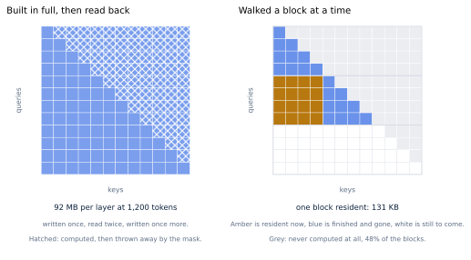
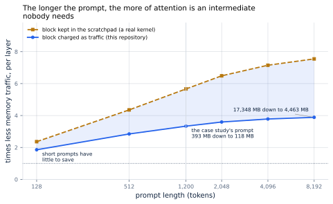
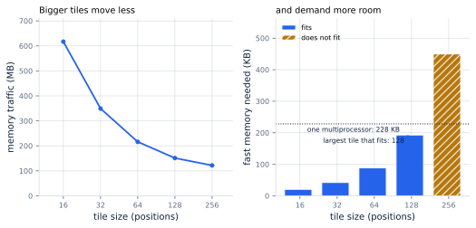

# 20. Attention Kernels

*Written to [STANDARDS.md](STANDARDS.md). Generated from
`chapters/ch20.md` and `code/results/ch20.json`; run `make ch20` in
`code/` to re-derive and re-render.*

**Depends on:** Chapter 2,
Chapter 3, Chapter 8,
Chapter 16.
**Tier 0** — a few seconds on a laptop CPU, free. Nothing here runs on
a GPU: the quantity this chapter is about is counted, not timed.

## Objectives

By the end of this chapter you can:

1. Name the intermediate result that dominates what attention costs,
   and compute its size for any model and prompt length.
2. Explain how a kernel finishes a softmax without having seen all of
   its inputs, and why that makes the result exact rather than
   approximate.
3. Compute the memory traffic of both kernels for a given shape, and
   say by how much one beats the other.
4. Derive a tile size from a model's head dimension and an
   accelerator's scratchpad, rather than tuning for it.
5. Say why this chapter is about prefill, with the number that makes
   decode the wrong place to look.

## Why it matters

Every chapter so far has treated attention as one step with a cost.
This one opens it.

Attention multiplies each query by every key it is allowed to see,
turns those numbers into weights, and uses the weights to mix the
values (Chapter 2). Written the obvious
way — the way `tinyserve` has written it for nineteen chapters — that
is two matrix multiplications with a softmax between them, and two
intermediates handed along: a **score matrix** with one number for
every (query, key) pair, and a weight matrix of the same shape.
<!-- defines: score matrix -->

Those two intermediates are the subject of this chapter, because of
one property. The queries, keys and values grow in proportion to the
sequence length. The score matrix grows with the *square* of it.

For the case study's 1,200-token prompt, on the book's 8B
model, one layer's queries, keys and values come to 15 MB. The
score matrix for the same layer is **92 MB** —
6.2x the size of everything it was built from. Over all 32 layers of one prefill,
2.9 GB is written out and read back — to produce
an output the same size as the queries that went in.

And it gets worse with length, because a square term always does. At
128 tokens the score matrix is 0.7x its
own inputs — smaller than they are. At 8,192 it is
43x.

Chapter 8 gave the rule this
chapter turns on: a step that is short of arithmetic per byte fetched
is limited by memory, and the way to make it faster is to move less.
The score matrix is bytes moved for nothing. It is written to memory,
read back to be exponentiated, written again as weights, and read
again to be multiplied by the values: four passes over the largest
array in the computation, so that a later step can consume it and
throw it away.

Nothing about attention requires that array to exist.

## What a kernel is

<!-- defines: kernel launch -->

A **kernel** is one program that runs on the accelerator
(Chapter 3 introduced the word). The model's forward
pass is a sequence of them: the host processor tells the accelerator
"run this matrix multiply", waits, tells it "run this softmax", waits,
and so on. Each of those instructions is a **kernel launch**, and
between launches the results have to be somewhere both kernels can see
them. That somewhere is the accelerator's main memory, its **HBM**
(Chapter 7).

That is the mechanism behind the paragraph above. The score matrix is
written to HBM not because anybody wants it there, but because the
multiply that produces it and the softmax that consumes it are
different kernels, and HBM is where different kernels meet.

> **If you're new here: the two kinds of memory on an accelerator.**
> An accelerator has a large pool of memory shared by everything —
> tens of gigabytes, fast by the standards of ordinary computers,
> and still the bottleneck for everything in this book. It also has a
> small scratchpad attached to each processing core: a few hundred
> kilobytes, and private to the work running on that core. NVIDIA
> calls the large pool HBM and the scratchpad **shared memory**, or
> **SRAM** after the circuit it is built from. FlashAttention's own
> figure for an A100 puts them at "HBM: 1.5 TB/s (40 GB)" against
> "SRAM: 19 TB/s (20 MB)" — about thirteen times the bandwidth, in
> two thousandths of the space. The whole of this chapter is about
> keeping something in the second one instead of the first.
> <!-- defines: SRAM -->

The fix, then, is not to make the three kernels faster. It is to make
them one kernel, so that the intermediate never has to be handed
between them — and then to arrange the work so that the intermediate
fits in the scratchpad. That is what FlashAttention does, and the
reason the idea has a paper rather than a footnote is that the middle
step, the softmax, appears to make it impossible.

## The problem with softmax

A softmax turns a row of raw scores into weights that add up to one.
It does it by exponentiating each score and dividing by the total, and
it subtracts the largest score in the row first, for the reason
Chapter 2 gave: without that
subtraction, a large score overflows to infinity and the whole row
becomes meaningless.

That subtraction is the problem. *The largest score in the row is not
known until every score in the row has been computed.* A kernel
working through the keys a few at a time does not have it, and cannot
produce a single final weight until it does.

This is why attention was written as three kernels for as long as it
was. The dependency looks real.

### Finishing a sum you have not finished seeing

It is not real, and the way around it is worth doing by hand, because
the whole chapter rests on it.

Suppose a row's scores arrive in two batches. The first batch has a
largest value; call it **old**. You go ahead and compute what a
softmax would give if the row ended there: `exp(score - old)` for each
score, and their sum. Then the second batch arrives, and it contains a
larger value; call that one **new**.

Everything you computed is now wrong. But it is wrong by a factor you
know exactly, and the same factor for every term, because

    exp(score - new) = exp(score - old) * exp(old - new)

and only the second factor depends on which maximum you used. So
multiply the running sum by `exp(old - new)` and it is correct for the
new maximum. Multiply the running *output* by it as well and that is
correct too, because the output is a weighted sum of value vectors and
every weight in it was off by the same amount.

Worked with numbers: scores of 1 and 3 arrive, then a 5. After the
first batch the running maximum is 3 and the running sum is
`exp(-2) + exp(0)`, which is 1.135. The 5 arrives, so multiply that
sum by `exp(3 - 5)` = 0.135, giving 0.154, and add the new term
`exp(0)`: 1.154. Computing it in one go from the true maximum gives
`exp(-4) + exp(-2) + exp(0)` = 1.154. The same number — to the last
bit, not just to three decimal places.

That is the whole trick. Milakov and Gimelshein published it in 2018
as the **online softmax**: carry a running maximum and a running sum,
and when the maximum moves, rescale what you have.
<!-- defines: online softmax -->

Note what it is not. It is not an approximation, a truncation, or a
bound. It is the same sum, reassociated. Multiplication distributes
over addition, and nothing is dropped.

## Build

Here is the loop that results. For each block of queries, walk the
keys and values in blocks, keeping three things per query row: the
largest score seen so far, the sum of the exponentials so far, and the
output accumulated so far.

<!-- listing: tinyserve/flash.py attention_tiled no-docstring -->

```python
def attention_tiled(q: np.ndarray, k: np.ndarray, v: np.ndarray,
                    mask: np.ndarray, meter: Meter | None = None,
                    q_tile: int = Q_TILE, kv_tile: int = KV_TILE
                    ) -> tuple[np.ndarray, None]:
    heads, new, dim = q.shape
    seen = k.shape[1]
    scale = dim ** -0.5
    out = np.zeros((heads, new, dim), dtype=DType)

    for i in range(0, new, q_tile):
        qi = q[:, i:i + q_tile]                         # (heads, tq, dim)
        tq = qi.shape[1]
        if meter is not None:
            meter.read(qi)
        # Running state, one row per query in this tile.
        m = np.full((heads, tq), -np.inf, dtype=DType)  # largest score so far
        l = np.zeros((heads, tq), dtype=DType)          # sum of exponentials
        acc = np.zeros((heads, tq, dim), dtype=DType)   # output so far

        for j in range(0, seen, kv_tile):
            block = mask[i:i + q_tile, j:j + kv_tile]
            if meter is not None:
                meter.tiles += 1
            if np.all(np.isneginf(block)):
                # Every pair in this tile is masked out. A causal mask
                # makes roughly half of them so, and skipping them is
                # the second saving: the work is never done at all.
                if meter is not None:
                    meter.tiles_skipped += 1
                continue
            kj, vj = k[:, j:j + kv_tile], v[:, j:j + kv_tile]
            if meter is not None:
                meter.read(kj), meter.read(vj)   # once, however many share them
            kj, vj = share_kv_heads(kj, vj, heads)

            s = (qi @ kj.transpose(0, 2, 1)) * scale + block
            if meter is not None:
                meter.write(s)          # the tile, and only the tile

            m_new = np.maximum(m, s.max(axis=-1))
            # A query row can be fully masked inside a tile that
            # straddles the diagonal. Its maximum is still -inf, and
            # subtracting -inf from -inf is not a number, so shift by
            # zero instead: every exponential in the row is then
            # exp(-inf) = 0 and the row contributes nothing, which is
            # the right answer.
            shift = np.where(np.isneginf(m_new), DType(0.0), m_new)
            p = np.exp(s - shift[..., None])
            alpha = np.exp(m - shift)   # 0 on the first tile, by exp(-inf)

            l = alpha * l + p.sum(axis=-1)
            acc = alpha[..., None] * acc + p @ vj
            m = m_new

        if not np.all(l > 0):
            raise ValueError("a query attends to nothing: the mask hides "
                             "every key from some position, including itself")
        tile_out = (acc / l[..., None]).astype(DType)
        if meter is not None:
            meter.write(tile_out)
        out[:, i:i + q_tile] = tile_out
    return out, None
```

Read the middle of it against the paragraph above: `m_new` is the
maximum after this block, `alpha` is the rescaling factor
`exp(old - new)`, and the two lines that apply it to `l` and `acc` are
the correction. When this block's scores are all smaller
than what came before, `alpha` is 1 and the correction does nothing.

Three details in that listing are worth pausing on.

**The block is used and thrown away.** `s` is one tile of scores. It
is computed, consumed by the two lines below it, and overwritten on
the next pass; nothing downstream ever needs it again. In a real
kernel the tile sizes are chosen so it lives in the scratchpad and
never reaches HBM at all. In this NumPy one it is an ordinary array,
so the meter sees it cross and charges for it — which means **every
saving in this chapter is a lower bound.** The measure section gives
both ends of that bracket.

**Whole blocks are skipped.** A causal mask hides every key that comes
after a query (Chapter 2). Worked as a
whole matrix, that half is computed and then thrown away by adding
negative infinity to it. Worked in blocks, a block that lies entirely
above the diagonal is recognised before any arithmetic happens and
skipped. At 2,048 tokens that is **48% of the
blocks** — work the whole-matrix version does and this one does not.

**The first tile is not a special case.** `m` starts at negative
infinity, so `alpha` on the first block is `exp(-inf)`, which is zero,
which correctly says "there is nothing accumulated yet to rescale".
The general case handles the first block for free.



**Figure 20.1** — On the left the whole rectangle is built at once,
including the hatched half the mask discards. On the right one block
is resident, the blocks behind it are finished and gone, and the
blocks above the diagonal are never computed.
*Provenance in `code/figures/ch20-score-matrix.caption.txt`.*

### It must not change the answer

The kernel is a seam, exactly as the cache was in
Chapter 14: `forward` is handed a function and does not
care which one it got.

<!-- abridged: tinyserve/model.py -->

```python
def forward(model: Model, tokens: np.ndarray, cache: KVCache | None = None,
            trace: dict | None = None, attention=attention_whole) -> np.ndarray:
    ...
        heads, weights = attention(q, k, v, mask)
```

One default argument is the whole of the change to the model. The
grouped-query expansion of Chapter 7 moved inside the
kernel at the same time, because a real one reads each shared key head
from memory once and hands the same copy to the query heads in its
group — which is how the tables below charge for it.

<!-- listing: tinyserve/model.py share_kv_heads no-docstring -->

```python
def share_kv_heads(k: np.ndarray, v: np.ndarray, heads: int
                   ) -> tuple[np.ndarray, np.ndarray]:
    n_rep = heads // k.shape[0]
    if n_rep == 1:
        return k, v
    return np.repeat(k, n_rep, axis=0), np.repeat(v, n_rep, axis=0)
```

Same prompt (200 tokens), same weights,
32 tokens generated, once with each kernel, at
5 different tile sizes including a tile of one and
a tile larger than the whole sequence.

**Identical tokens: yes**, every time. The largest
disagreement anywhere in the logits is 2.0e-06.

Inside attention itself, on a prefill of 8 heads, the two
kernels differ by at most 7.2e-07 on values that reach
2.65 — a relative difference of 2.7e-07, against a
float32 rounding step of 1.2e-07. The two kernels perform the
same multiplications in a different order, and floating-point addition
is not associative, so they land a rounding step or two apart. That is
the entire difference, and it is the same kind of difference
Chapter 16 found between two batch sizes.

This is why the literature calls FlashAttention **exact attention**.
It is not a quality-for-speed trade, and it needs no accuracy
evaluation before it can be deployed. The word is in the title of the
paper that introduced it: "FlashAttention: Fast and Memory-Efficient
*Exact* Attention with IO-Awareness".

## Measure

Every byte below was counted as the code moved it. The two kernels
each take a meter, and every array they read from or write to the slow
level of memory is passed through it, so the totals are a property of
the code that ran rather than of a formula written beside it.

<!-- include: tables/ch20-counted.md -->
| Prompt | Score matrix | Traffic, built in full | Traffic, tiled | Times less | Largest thing held | Blocks skipped | Formula |
|---|---|---|---|---|---|---|---|
| 128 | 0.5 MB | 3.1 MB | 1.7 MB | **1.85x** | 0.5 MB -> 131 KB | 25% | agrees |
| 256 | 2.1 MB | 10.5 MB | 5.0 MB | **2.11x** | 2.1 MB -> 131 KB | 38% | agrees |
| 512 | 8.4 MB | 37.7 MB | 16.3 MB | **2.32x** | 8.4 MB -> 131 KB | 44% | agrees |
| 1,024 | 33.6 MB | 142.6 MB | 57.7 MB | **2.47x** | 33.6 MB -> 131 KB | 47% | agrees |
| 2,048 | 134.2 MB | 553.6 MB | 216.0 MB | **2.56x** | 134.2 MB -> 131 KB | 48% | agrees |

One layer of an 8-head model with 64-dimensional heads in float32, tiles of 64x64, seed 0. Every byte is counted as the code moves it, not estimated. The last column checks each count against the closed-form formula the next table applies to a model too large to run here; they must agree exactly, and `make tests` fails if they do not.

The last column is the one that makes the rest of this chapter
possible. The book's 8B model will not run on a laptop, so its numbers
have to come from a closed-form formula — and a formula is worth
nothing unless it reproduces what the code actually did. These agree
exactly, at every length and every tile size, and `make tests` fails
if they ever stop agreeing.

So, the model the case study serves:

<!-- include: tables/ch20-reference.md -->
| Prompt | Score matrix, one layer | Against its own inputs | Traffic, built in full | Traffic, tiled | Times less | Times less, block resident | All layers, built in full | All layers, tiled |
|---|---|---|---|---|---|---|---|---|
| 128 | 1 MB | 0.7x | 7 MB | 4 MB | **1.9x** | 2.4x | 0.07 ms | 0.04 ms |
| 512 | 17 MB | 2.7x | 78 MB | 27 MB | **2.8x** | 4.4x | 0.74 ms | 0.26 ms |
| 1,200 * | 92 MB | 6.2x | 393 MB | 118 MB | **3.3x** | 5.7x | 3.76 ms | 1.13 ms |
| 2,048 | 268 MB | 10.7x | 1,116 MB | 310 MB | **3.6x** | 6.5x | 10.66 ms | 2.96 ms |
| 4,096 | 1,074 MB | 21.3x | 4,379 MB | 1,158 MB | **3.8x** | 7.2x | 41.83 ms | 11.06 ms |
| 8,192 | 4,295 MB | 42.7x | 17,348 MB | 4,463 MB | **3.9x** | 7.5x | 165.71 ms | 42.63 ms |

\* the case study's prompt. The book's 8B model: 32 query heads sharing 8 key heads of 128 dimensions, bf16, 32 layers, tiles of 64x64. "Against its own inputs" is the score matrix divided by the queries, keys and values it is built from. "Times less" charges the blocks of scores as traffic, which is what this NumPy implementation makes them; the column after it charges them to the scratchpad instead, which is what a CUDA kernel's tile size is chosen for. The real figure is the second; the chapter quotes the first, so every saving in it is a lower bound. Times are bytes over 3.35 TB/s (FACTS.md): a floor for the memory, not a prediction of a kernel's runtime, which also has arithmetic to do.

At the case study's prompt, attention moves 393 MB per layer
built the obvious way and 118 MB tiled: **3.3x less,
70% of the traffic gone.** Across all 32 layers
that is 3.76 ms of memory time against 1.13 ms.

That 3.3x is the pessimistic end. 49 MB of the
118 MB is the blocks of scores, which this implementation
allocates and a real kernel keeps in the scratchpad — that is what the
tile size is chosen for. Charge those to the scratchpad instead and
the same prompt moves 69 MB, which is
**5.7x less**; at 8,192 tokens the pair
is 3.9x and 7.5x. The truth for a CUDA
kernel is the upper figure and for the code in this repository the
lower one, so the chapter quotes the lower one throughout and you can
read every number in it as "at least".

2.63 ms on one prefill is hard to weigh. Multiply it by the
200 prompts a second the case study takes and it is
**0.53 accelerator-seconds of memory time saved per
second of traffic** — about half an accelerator's time, on the eight
that Part III's design decision record sized this service at. That is
the unit to think in: not what a kernel saves a request, but what it
saves a fleet.



**Figure 20.2** — The saving is not a fixed factor. It grows with the
prompt, because what is being avoided grows with the square of the
length while everything else grows linearly.
*Provenance in `code/figures/ch20-traffic.caption.txt`.*

Two things about that curve.

**It is small at the left.** At 128 tokens the saving is
1.9x, because the score matrix is still smaller than the
queries, keys and values it came from. A model serving short prompts
has little to gain here, and should be told so.

**The lower curve flattens and the upper one does not**, and the gap
between them is the explanation. The tiled kernel has two square terms
of its own: it writes one block of scores per pair of tiles, and it
re-reads the keys and values once per query tile. Charge the blocks as
traffic and they dominate, so the lower curve heads for a ceiling near
four — 3.9x at 8,192 tokens against
3.8x at 4,096. Keep them in the
scratchpad and only the re-reading is left, so the upper curve is
still climbing at 7.5x.

Both ceilings are set by the same thing: how many times the keys and
values have to be read, which is how many query tiles there are,
which is the tile size. Which raises the question of where the tile
size comes from.

### Where the tile size comes from

A larger tile means fewer tiles, which means the keys and values are
re-read fewer times. Traffic falls with every increase. Across the
range a kernel can use it falls 4.1x, from
617 MB at a tile of 16 to
151 MB at 128.

So make the tile enormous. The limit is the scratchpad. A tile of, say,
128 positions needs a block of queries, a block of keys and a block of
values — each 128 vectors of 128 numbers — plus the
128-by-128 block of scores between them and the running state. Double
the tile and the three blocks of vectors double, but the block of
scores quadruples, and the scratchpad does not grow at all.

<!-- include: tables/ch20-tiles.md -->
| Tile | Memory traffic | Blocks computed | Blocks skipped | Fast memory one tile needs | Share of a multiprocessor | Fits |
|---|---|---|---|---|---|---|
| 16 | 617 MB | 8,256 | 8,128 | 21 KB | 9% | yes |
| 32 | 349 MB | 2,080 | 2,016 | 42 KB | 19% | yes |
| 64 | 216 MB | 528 | 496 | 88 KB | 39% | yes |
| **128** | 151 MB | 136 | 120 | 193 KB | 85% | yes |
| 256 | 122 MB | 36 | 28 | 450 KB | 197% | no |

At 2,048 tokens. Traffic is counted on the runnable model; the fast memory is what one tile of the book's 8B model needs in bf16 -- a query tile, a key tile, a value tile, the block of scores between them, the running output and the two running numbers per row -- against the 228 KB a Hopper streaming multiprocessor has (FACTS.md). Traffic falls with every increase in tile size and the memory rises with the square of it, so the tile is as large as will fit: 128. A real kernel also wants room to fetch the next tile while it works on this one, so it has less to spend than this table allows.



**Figure 20.3** — Traffic pushes the tile up and the scratchpad caps
it. The largest tile that fits is the answer.
*Provenance in `code/figures/ch20-tiles.caption.txt`.*

For the book's model — 128-dimensional heads in bf16 — a tile
of 128 needs 193 KB, which is
85% of the 228 KB a Hopper streaming multiprocessor
has. A tile of 256 needs 450 KB:
197% of what exists. So the tile is 128, and
it was not tuned. It was derived, from a head dimension and a
published hardware number.

This is what FlashAttention's authors mean when they say the algorithm
is "optimal for a range of SRAM sizes". The tile is a function of the
hardware, and when the hardware changes the tile changes with it.

## Where it breaks

**Decode.** Everything above is about prefill, and the reason is one
number. A decode step has one new token, so its score matrix is a
single row: 96 KB against the 7 MB the step
moves in total. Tiling it saves **4.4%** of the traffic —
counted rather than derived, on the runnable model, it is
2.3% — against 70% at prefill.

The reason is where the bytes are. At decode, 98% of
what attention moves is the keys and values of the sequence so far,
and both kernels must read every one of them. There is no large
intermediate to avoid because there is no large intermediate.
Chapter 12 already established what dominates a decode step,
and this chapter does not change it.

If you take one thing from this chapter into a profiler, take that:
**a faster attention kernel is a prefill optimisation.** It shortens
time to first token and it raises the rate at which a server can
absorb prompts, which Chapter 18 showed is what a mixed
schedule is rationing. It does not move the gap between tokens.

**Short prompts.** The score matrix only overtakes the queries, keys
and values it is built from at **192 tokens** for this model
— 1.5 times the head dimension, which is where the two
expressions cross. Below that there is a square term but it is not the
largest thing in the computation, and the machinery does not pay for
itself. A model with wider heads has to see a longer prompt before any
of this matters.

**No attention map.** The tiled kernel returns nothing where the
whole-matrix one returns weights, because it never assembled them.
Anything that wants to look at where a model attended — an
interpretability tool, a debugging view, an explanation feature in a
product — needs a kernel that builds the matrix. This is visible in
the interfaces: in Hugging Face Transformers an attention backend
returns `attn_output, attn_weights`, and the documentation notes that
the weights are "optional here". The whole-matrix backend is still
selectable, under the name `eager`, next to `flash_attention_2` and
`flash_attention_3`. Knowing why it is still there saves somebody
filing a bug about it.

**Everything above is bytes, not seconds.** The times in these tables
are bytes divided by the accelerator's memory bandwidth: a floor, on
the assumption that memory is the constraint. A real kernel also has
arithmetic to do, has to keep its cores busy while it waits, and can
lose more to a bad access pattern than it saves in volume. The gap
between this floor and a real kernel is what the rest of Part IV is
about: Chapter 21 measures what the
launches themselves cost, and Chapter 23 walks one
production implementation to see where the remaining time goes.

## In production

Nobody writes this kernel. The engines of
Chapter 6 call a library, and the two that matter
for the model in this book are these.

**FlashAttention** is the reference implementation. Each generation
has been a rewrite against a specific accelerator rather than a new
algorithm: FlashAttention-2 is subtitled "Better Parallelism and Work
Partitioning", and FlashAttention-3 rebuilt it around Hopper's ability
to overlap data movement with arithmetic, reporting a
"speedup on H100 GPUs by 1.5-2.0x with FP16", "reaching up to 740
TFLOPs/s (75% utilization)" — against "FlashAttention-2 achieving only
35% utilization on the H100 GPU". The interesting
thing about that pair of numbers is what it says about the previous
version: a kernel can be the best available implementation of a good
algorithm and still be leaving two thirds of the machine idle.

**FlashInfer** is the one built for serving rather than training, and
Chapter 23 reads it. It takes the paged cache of
Chapter 14 as a first-class input, which matters: the
kernel above assumes the keys of a sequence are contiguous, and after
Chapter 14 they are not.

What a serving engine exposes is the choice between them, and there
are more of them than two: vLLM's list also carries Triton, CUTLASS
and vendor-specific backends for the cases the main two do not cover.
It selects one by trying each in priority order and taking the first
compatible with the model and the configuration. The choice can be
forced with `--attention-backend`, and the FlashAttention generation
with `--attention-config.flash_attn_version`. Its documented defaults
track the hardware: "FA4 on SM100+ (Blackwell), FA3 on SM90 (Hopper),
FA2 otherwise" — which is also how you learn that a fourth generation
exists, since at the time of writing it has no paper.

The practical advice is narrow. The default backend is almost always
right, and the reason to know this chapter is not to change the flag.
It is to read a profile: to know that a long-prompt workload spends
its prefill in one fused kernel rather than a chain of them, to
recognise a tile size when you see one and know what bounds it, and to
be unsurprised when a faster attention kernel does nothing at all for
a decode-heavy service.

## Numbers to remember

- **6.2x** — the score matrix, at the case study's
  1,200-token prompt, as a multiple of the queries, keys
  and values it is built from. At 8,192 tokens,
  43x.
- **3.3x to 5.7x** — memory traffic saved
  by tiling at that prompt length. The lower figure charges the blocks
  of scores as traffic, the upper keeps them in the scratchpad where a
  real kernel puts them. At 8,192 tokens the pair is
  3.9x and 7.5x; at 128,
  1.9x.
- **4.4%** — the same saving at decode. This is a prefill
  optimisation.
- **128 positions** — the tile size, derived from
  128-dimensional heads and 228 KB of scratchpad, not
  tuned.
- **2.7e-07** — the relative difference the change makes to
  the answer, against a float32 rounding step of 1.2e-07.

## Sources

- Tri Dao, Daniel Y. Fu, Stefano Ermon, Atri Rudra, Christopher Ré,
  "FlashAttention: Fast and Memory-Efficient Exact Attention with
  IO-Awareness", arXiv:2205.14135 — the algorithm, and the word
  *exact* in the title. The abstract describes it as "an IO-aware
  exact attention algorithm that uses tiling to reduce the number of
  memory reads/writes between GPU high bandwidth memory (HBM) and GPU
  on-chip SRAM", and reports it "requires fewer HBM accesses than
  standard attention, and is optimal for a range of SRAM sizes".
- Maxim Milakov, Natalia Gimelshein, "Online normalizer calculation
  for softmax", arXiv:1805.02867 — the rescaling trick the single
  pass depends on, published four years before the kernel that needed
  it.
- Tri Dao, "FlashAttention-2: Faster Attention with Better Parallelism
  and Work Partitioning", arXiv:2307.08691.
- Jay Shah, Ganesh Bikshandi, Ying Zhang, Vijay Thakkar, Pradeep
  Ramani, Tri Dao, "FlashAttention-3: Fast and Accurate Attention with
  Asynchrony and Low-precision", arXiv:2407.08608 — the source of the
  throughput and utilization figures quoted above.
- NVIDIA, *Hopper Tuning Guide*, release 13.3 — "shared memory
  capacity per SM is 228 KB, a 39% increase compared to A100's
  capacity of 164 KB", and the carveout sizes a kernel may ask for.
  This is the number the tile size is derived from.
- vLLM documentation, *Attention Backend Feature Support* — how a
  backend is chosen, and the defaults quoted above.

## Exercises

★ The book's model has 128-dimensional heads. Work out the
largest tile that fits in 228 KB for a model with 64-dimensional
heads, and for one with 256. `head_dim` is `d_model` divided by
`n_heads`, so check your answers by setting `n_heads` to 64 and then
to 16 in `tinyserve/reference.py` and re-running `make ch20`.

★ A service has prompts averaging 128 tokens. Using the
table above, say what a faster attention kernel is worth to it, and
what you would look at instead.

★★ The tiled kernel in this chapter writes each block of scores
through the meter and never re-reads it. Add a third kernel that
tiles over keys but not queries, count its traffic, and explain the
result in terms of which array gets re-read.

★★ At 8,192 tokens the lower curve flattens near
3.9x while the upper one is still climbing at
7.5x. Derive both ceilings from the byte formulas
in `tinyserve/flash.py`, and say what each would be with a tile of
256 if the scratchpad allowed it.

★★★ `attention_tiled` skips a block when the whole block is masked.
For a chunked prefill (Chapter 18) of a
64-token chunk into a long sequence, how many blocks are
skipped, and what does that say about where chunked prefill's cost
actually lands? Measure it, do not estimate it.
