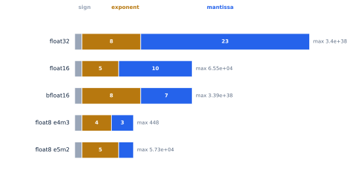
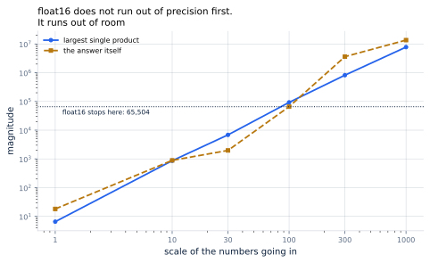
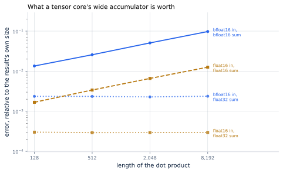

# 22. Precision and Tensor Cores

*Written to [STANDARDS.md](STANDARDS.md). Generated from
`chapters/ch22.md` and `code/results/ch22.json`; run `make ch22` in
`code/` to re-derive and re-render.*

**Depends on:** Chapter 4,
Chapter 8, Chapter 7,
Chapter 16.
**Tier 0** — a few seconds on a laptop CPU, free. Rounding is exact
arithmetic on bit fields; the hardware figures are published
specifications.

## Objectives

By the end of this chapter you can:

1. Read a format's name — `bfloat16`, `e4m3` — and state from it what
   the format can hold and how precisely.
2. Say why bfloat16 replaced float16 for serving, given that float16
   is the more precise of the two.
3. Explain what a tensor core accelerates, and what it does not.
4. Say where a low-precision multiply keeps its running total, and
   measure what happens when it keeps it in the wrong place.
5. Compute what a change of format does to a model's weights, its
   cache, and its position on the roofline.

## Why it matters

Chapter 4 established the constraint everything in this
book answers to: a decode step is limited by how many bytes it has to
fetch, not by how much arithmetic it does. Every technique since has
moved fewer of them — sharing them (Chapter 15), refusing
to reserve them (Chapter 14), never writing them down
(Chapter 20).

There is a cruder lever, and this chapter is about it. **Store each
number in fewer bytes.** Every weight and every cached key halves at a
stroke — no policy, no scheduler, no cleverness — and the accelerator's
arithmetic units run faster on the smaller format besides.

For the book's 8B model on one H100:

| | float32 | bfloat16 | float8 |
|---|---|---|---|
| Weights | 32 GB | 16 GB | 8 GB |
| Peak arithmetic | 67 TFLOP/s | 990 TFLOP/s | 1,980 TFLOP/s |

That is **15x the arithmetic and half the bytes**,
between the first column and the second, for a model that is otherwise
identical.

Nothing is free, and what is being spent is exactness. The rest of this
chapter is about how much, where it comes from, and which of the
plausible-looking choices is a trap.

## What a floating-point number is

<!-- defines: mantissa, exponent -->

A floating-point number is scientific notation in binary. It stores
three things: a **sign**, an **exponent** that says roughly how big
the number is, and a **mantissa** that carries the digits.

> **If you're new here.** Write 6,371,000 as 6.371 × 10⁶. The 6.371 is
> the mantissa — the digits — and the 6 is the exponent — the scale.
> A computer does the same in base two. Give the exponent more bits and
> the number can be far bigger and far smaller; give the mantissa more
> bits and it carries more digits. The total is fixed, so the two are
> in competition, and every format is a different answer to how to
> divide them.

That is the entire design space, and it is small enough to draw:

**Figure 22.1** — The same picture explains every format in this
chapter. float16 and bfloat16 are both sixteen bits; they differ only
in where the line between exponent and mantissa falls.
*Provenance in `code/figures/ch22-bits.caption.txt`.*

Two consequences follow, and they are worth stating separately because
people reach for the wrong one.

**The exponent sets the range.** float16 spends 5 bits
on it and can hold numbers up to **65,504**. bfloat16 spends
8 — the same as float32 — and reaches
**3.39e+38**. That is not a small difference; it is thirty-three
orders of magnitude.

**The mantissa sets the precision.** float16 keeps
10 mantissa bits, bfloat16 keeps 7. So
bfloat16's numbers are **8x coarser**: about
2.4 decimal digits against 3.3.

<!-- include: tables/ch22-formats.md -->
| Format | Bits | Sign/exponent/mantissa | Largest | Smallest with full precision | Gap either side of 1.0 | Decimal digits | Peak on one H100 |
|---|---|---|---|---|---|---|---|
| float32 | 32 | 1 / 8 / 23 | 3.403e+38 | 1.18e-38 | 1.19e-07 | 7.2 | 67 TFLOP/s |
| tensorfloat32 * | 19 | 1 / 8 / 10 | 3.401e+38 | 1.18e-38 | 0.000977 | 3.3 | 495 TFLOP/s |
| **float16** | 16 | 1 / 5 / 10 | 6.55e+04 | 6.1e-05 | 0.000977 | 3.3 | 990 TFLOP/s |
| **bfloat16** | 16 | 1 / 8 / 7 | 3.39e+38 | 1.18e-38 | 0.00781 | 2.4 | 990 TFLOP/s |
| float8 e4m3 | 8 | 1 / 4 / 3 | 448 | 0.0156 | 0.125 | 1.2 | 1,980 TFLOP/s |
| float8 e5m2 | 8 | 1 / 5 / 2 | 5.734e+04 | 6.1e-05 | 0.25 | 0.9 | 1,980 TFLOP/s |

Every column but the last is arithmetic on the three field widths, computed in `tinyserve/precision.py`. \* tensorfloat32 is a compute format: 19 meaningful bits held in a 32-bit slot, so it changes how a multiply is done and not what a weight costs to store. Peak figures are the H100 SXM datasheet's, halved from the quoted "with sparsity" rows to the dense throughput that dense inference gets; float32 is the one that never reaches a tensor core (FACTS.md).

Read the float16 and bfloat16 rows against each other and the
chapter's central oddity appears. The format the industry converged on
for serving is the *less precise* of the two. It is worth understanding
why before trusting anything else in this chapter.

## What rounding costs the model

Start with the easy half: precision. Take the model's own numbers —
its weights, the activations flowing through it, the attention weights,
the logits — round each to every format, and measure how far they
moved.

<!-- include: tables/ch22-tensors.md -->
| The model's numbers | Largest | tensorfloat32 | float16 | bfloat16 | float8 e4m3 | float8 e5m2 |
|---|---|---|---|---|---|---|
| attention weights (wq) | 0.356 | 5.15e-05 | 5.15e-05 | 4.16e-04 | 6.54e-03 | 1.31e-02 |
| feed-forward weights (w1) | 0.39 | 4.69e-05 | 4.69e-05 | 3.76e-04 | 6.02e-03 | 1.21e-02 |
| token embeddings | 0.403 | 4.57e-05 | 4.57e-05 | 3.67e-04 | 5.88e-03 | 1.16e-02 |
| activations, after a layer | 3.29 | 2.33e-05 | 2.33e-05 | 1.88e-04 | 2.99e-03 | 6.10e-03 |
| attention weights, after softmax | 1 | 8.16e-06 | 8.16e-06 | 6.68e-05 | 1.15e-03 | 2.00e-03 |
| logits | 4.07 | 5.20e-05 | 5.20e-05 | 4.19e-04 | 6.65e-03 | 1.33e-02 |

Root-mean-square error after a round trip through each format, as a fraction of the largest value in the tensor. From a 4-layer model of width 128 over 64 tokens. Nothing here overflows: every number in this model is small. float16 and tensorfloat32 agree down the column because they have the same number of mantissa bits, which is what error at this scale depends on -- the extra exponent bits buy range, and range is not what is being tested.

At these magnitudes the ranking is exactly what the mantissa bits
predict. On the attention weights, float16 moves things by
5.1e-05 and bfloat16 by 4.2e-04 —
**8x worse**, which is the
8x coarser grid showing up exactly where it
should. Eight-bit e4m3 moves them by 6.5e-03.

Nothing overflows. Every number in this model is smaller than
4.07, and float16 reaches 65,504, so its smaller
exponent costs nothing at all here. On this evidence float16 is simply
the better format.

That conclusion is wrong, and the reason is not visible in any tensor
this model produces.

## Where the numbers get big

The values a model *stores* are small. The values it *computes* need
not be.

A dot product across the reference model's width adds 4,096
products together. Each product is two numbers multiplied, so it is
about the square of whatever scale the inputs are at, and the sum of
4,096 of them is larger again. Feed in numbers of a few hundred —
which large models genuinely produce, even though this book's small one
does not — and the arithmetic leaves float16's range behind.

**Figure 22.2** — The individual products and the answer, against the
scale of the inputs, with float16's ceiling marked.
*Provenance in `code/figures/ch22-range.caption.txt`.*

At an input scale of **100**, a float16 accumulator
returns infinity. Not an inaccurate answer: no answer. Everything
downstream of it is infinity too, and then the softmax turns infinity
into a NaN, and the model emits nothing. bfloat16, over the whole
sweep up to 1000 — where the true answer is
1.36e+07 — overflows **no**.

That is the trade, and it is not symmetric. Losing precision degrades
an answer a little. Losing range destroys it completely. bfloat16 won
because **a coarse answer is worth more than no answer**, and because
keeping float32's exponent means a model trained in float32 can be run
in bfloat16 without anyone rescaling anything.

## Where the sum is kept

There is a second decision hiding inside every matrix multiply, and it
matters more than the first.

A dot product multiplies pairs and adds them up. The inputs are in
some format; the *running total* is in some format. They need not be
the same, and on real hardware they are not: a tensor core takes
bfloat16 or float8 inputs and accumulates in float32.

<!-- defines: accumulator -->

That is worth measuring rather than accepting. Here is the same
multiply with the inputs rounded identically, changing only where the
**accumulator** lives:

**Figure 22.3** — The only difference between the flat lines and the
climbing ones is the format of the running total.
*Provenance in `code/figures/ch22-accumulation.caption.txt`.*

The float32 accumulator is **flat**. Its error is set by rounding the
inputs once and does not grow no matter how long the sum gets:
2.4e-03 at 8,192 terms, the same as at
128.

The narrow accumulator **climbs with every doubling** —
9.8e-02 at 8,192 terms, which is
41x worse, against 6x worse
at 128. The reason is that every addition rounds the whole
running total, so the errors accumulate along with the sum instead of
being introduced once.

**This is what a tensor core is.** Not simply a unit that multiplies
small numbers quickly: a unit that multiplies small numbers quickly
*and keeps the total in float32 while it does*. Take the second half
away and the speed would not be worth having. The same figure explains
why float8 inference needs scaling factors around every matrix rather
than a straight substitution — at 8,192 terms even e4m3 with a
float32 accumulator sits at 3.8e-02, and Chapter 24
picks that up.

Notice also that float16 with a float32 accumulator is
8x more accurate than bfloat16 with one. The
precision difference is real and it never goes away. It is simply not
the thing that decides.

## What it buys

Back to the roofline of
Chapter 8.

<!-- include: tables/ch22-hardware.md -->
| Format | Bytes a number | Weights | Time to read them | KV cache a token | Ridge point | Compute-bound above batch | Peak |
|---|---|---|---|---|---|---|---|
| float32 | 4 | 32 GB | 9.55 ms | 256 KiB | 20 FLOP/byte | 40 | 67 TFLOP/s |
| tensorfloat32 | 4 | 32 GB | 9.55 ms | 256 KiB | 148 FLOP/byte | 296 | 495 TFLOP/s |
| float16 | 2 | 16 GB | 4.78 ms | 128 KiB | 296 FLOP/byte | 296 | 990 TFLOP/s |
| bfloat16 | 2 | 16 GB | 4.78 ms | 128 KiB | 296 FLOP/byte | 296 | 990 TFLOP/s |
| float8 e4m3 | 1 | 8 GB | 2.39 ms | 64 KiB | 591 FLOP/byte | 296 | 1,980 TFLOP/s |
| float8 e5m2 | 1 | 8 GB | 2.39 ms | 64 KiB | 591 FLOP/byte | 296 | 1,980 TFLOP/s |

The book's 8B model on one H100, by the format its weights and cache are kept in. "Time to read them" is the weights over 3.35 TB/s, which Chapter 4 showed is the floor under every decode step. The ridge point is where the accelerator stops being limited by memory and starts being limited by arithmetic; it depends on the arithmetic the format reaches and not at all on how many bytes a number takes. The last column puts the two together: a decode step at batch B does 2PB arithmetic and reads P times the format's bytes, so halving the format doubles its intensity exactly as it doubles the ridge, and the batch at which the step turns compute-bound does not move.

The weights take 4.78 ms to read in bfloat16 against
2.39 ms in float8 — the floor under every decode step, halved.
That is the whole of what a decode step gets, and it is worth having.

The ridge point also moves, from 296 to 591 FLOP
per byte, and this is where it is easy to reason wrongly. The ridge
depends on the arithmetic the format reaches divided by the memory
bandwidth; the bandwidth has not changed and the bytes per number do
not enter it at all. So the ridge doubles purely because the
arithmetic did.

Then work out what that means for a decode step, rather than guessing.
A step at batch *B* does 2*PB* arithmetic and reads *P* times the
format's bytes, so halving the format **doubles its arithmetic
intensity** — exactly as it doubled the ridge. The two cancel. The
batch at which a decode step stops being memory-bound is
296 in bfloat16 and 296 in float8: the
same number.

So a smaller format does not move a decode step out of the
memory-bound regime, and it does not push it further in either. It
makes every step in that regime take half as long, which is the
saving, and the doubled arithmetic goes to prefill, which
Chapter 3 showed is the compute-bound half.

The cache halves too: 128 KiB a token in bfloat16 against
64 KiB in float8. On Chapter 13's arithmetic that
is twice as many sequences in the same pool, which is
Chapter 17's batch size, which is throughput. A format
change reaches further into this book than any other single decision.

## Where it breaks

**tensorfloat32 is not a storage format.** It is 19
meaningful bits in a 32-bit slot, so it makes multiplies faster and
saves no memory at all. Its row in the table above carries float32's
32 GB. A reader who sees "19 bits" and expects the weights
to shrink will be disappointed.

**float32 never reaches a tensor core.** Its 67 TFLOP/s
comes from ordinary arithmetic units. The
15x in this chapter's opening is not the cost of
precision as such; it is the cost of asking for a format the fast path
does not implement.

**The published peaks assume sparsity.** Every tensor-core figure on
NVIDIA's H100 page carries the footnote "With sparsity", meaning a
model with half its weights structurally zeroed. Dense inference gets
half those numbers, which is what this chapter quotes. A capacity plan
built on the headline figure is out by a factor of two.

**Nothing here is a timing run.** The rounding is exact — the
implementation is checked against NumPy's float16 over
601,024 values and every one agrees, including the
exact halfway cases where the rounding rule is the only thing that
decides — but no number in this chapter came off a GPU. What a
format costs in practice also depends on conversion, on layout, and on
whether the shapes involved suit the hardware's tile sizes, none of
which arithmetic on bit fields can show.

**And the errors here are one operation deep.** A real forward pass is
thousands of operations, layer after layer. Whether 4.2e-04 per tensor
compounds into a worse answer or cancels out is a question about the
model, not about the format, and Chapter 24
is where the book starts measuring it.

## In production

Serve in **bfloat16** unless you have a specific reason not to. It is
what models are released in, it needs no scaling machinery, and it
cannot overflow anywhere float32 would not.

Reach for **float8** when the memory matters more than the last digit,
and expect to carry scaling factors: the format's range is narrow
enough that tensors have to be brought into it deliberately rather
than cast. NVIDIA's Transformer Engine exists to manage exactly that,
and e4m3 and e5m2 exist as a pair for the same reason — the paper that
defined them gives e4m3 more mantissa for values and e5m2 more
exponent for the wider-ranging ones.

**float16** remains correct for inference on hardware without bfloat16,
which in practice means older consumer cards. It is the more precise
format and the one more likely to produce a NaN, and both halves of
that sentence are this chapter's measurements.

Two flags worth recognising, and one surprise in them. vLLM's
`--dtype` chooses the format weights are loaded and computed in, and
its default `auto` is not quite "whatever the checkpoint says": the
documentation states it "will use FP16 precision for FP32 and FP16
models, and BF16 precision for BF16 models". A float32 checkpoint is
served in float16, not bfloat16 — so a model trained in float32 and
served on the default is served in the one format in this chapter that
can overflow. Worth knowing before debugging a NaN.

`--kv-cache-dtype` chooses the format for the cache alone and defaults
to `auto`, which "will use model data type". Setting it to `fp8` —
which the documentation notes means `fp8_e4m3` on CUDA — while leaving
the weights in bfloat16 is the split to reach for first: it halves the
thing that grows with traffic, and leaves the arithmetic where the
model was trained.

## Numbers to remember

- **65,504** — float16's largest number. Memorise this one; it
  is the boundary a production NaN is usually on the wrong side of.
  bfloat16's is 3.39e+38.
- **8x** — how much coarser bfloat16 is than
  float16. It is the less precise format, and it won anyway.
- **15x** — the arithmetic a tensor core does at
  bfloat16 against what float32 gets without one, on an H100:
  67 against 990 TFLOP/s dense.
- **41x** — how much worse a bfloat16 sum of
  8,192 terms is than the same inputs accumulated in float32.
  This is what the accumulator is for.
- **128 KiB a token** — the reference model's cache in bfloat16,
  halving to 64 KiB in float8.

## Sources

- Paulius Micikevicius, Dusan Stosic, Neil Burgess, Marius Cornea,
  Pradeep Dubey, Richard Grisenthwaite, Sangwon Ha, Alexander Heinecke,
  Patrick Judd, John Kamalu, Naveen Mellempudi, Stuart Oberman,
  Mohammad Shoeybi, Michael Siu, Hao Wu, "FP8 Formats for Deep
  Learning", arXiv:2209.05433 — the two 8-bit formats, defined as
  "an 8-bit floating point (FP8) binary interchange format consisting
  of two encodings". E4M3 departs from IEEE deliberately: its "dynamic
  range is extended by not representing infinities and having only one
  mantissa bit-pattern for NaNs", while "E5M2 follows IEEE 754
  conventions for representation of special values".
- NVIDIA, *H100 Tensor Core GPU* product specifications — the peak
  figures quoted here, every tensor-core row of which carries the
  footnote "With sparsity". The dense halves are what this chapter
  uses.
- IEEE 754-2019, *Standard for Floating-Point Arithmetic* — the
  rounding rule the implementation follows, round-to-nearest with ties
  to even, and the structure every format here except e4m3 obeys.
- vLLM documentation, *Engine Arguments* — the `--dtype` and
  `--kv-cache-dtype` values and defaults quoted above, including that
  `auto` "will use FP16 precision for FP32 and FP16 models, and BF16
  precision for BF16 models".
- Google Brain's bfloat16 originated the format this chapter
  recommends; NVIDIA's
  [Train With Mixed Precision](https://docs.nvidia.com/deeplearning/performance/mixed-precision-training/)
  guide documents the accumulator behaviour measured above.

## Exercises

★ float16's largest number is 65,504. Without running anything,
work out its smallest positive number with full precision, and check
against the table.

★ A model's activations reach a scale of 50 and its width is
4,096. Using Figure 22.2, say whether a float16 accumulator is
safe, and what you would measure to be sure.

★★ e5m2 has the same 5 exponent bits as float16 but
reaches 57,344 rather than 65,504. Explain the difference
from the field widths alone.

★★ Add a format to `tinyserve/precision.py` with 1 sign bit, 6
exponent bits and 9 mantissa bits. Predict where it lands in the
tensor table before running `make ch22`, then check.

★★★ The accumulation measurement rounds the running total after every
term, which is the worst case. Real hardware sums in a tree. Implement
tree accumulation in `_matmul_narrow`, measure it against both lines in
Figure 22.3, and say how much of the gap the tree closes and why.
