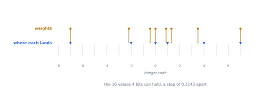
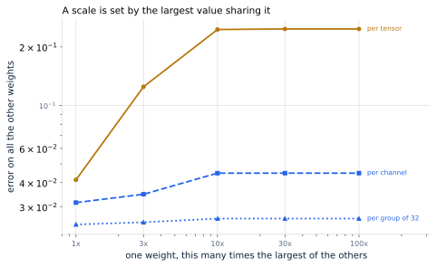
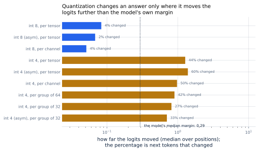

# 24. Quantization from the Ground Up

*Written to [STANDARDS.md](STANDARDS.md). Generated from
`chapters/ch24.md` and `code/results/ch24.json`; run `make ch24` in
`code/` to re-derive and re-render.*

**Depends on:** Chapter 22, Chapter 4,
Chapter 13, Chapter 16.
**Tier 0** — a few seconds on a laptop CPU, free. Every number here is
exact arithmetic on the book's own model.

## Objectives

By the end of this chapter you can:

1. Quantize a set of numbers to integers by hand, and say what the
   largest possible error is before measuring it.
2. Choose between symmetric and asymmetric quantization from the shape
   of the data.
3. Say which values should share a scale, and measure what a wrong
   answer to that costs.
4. Predict when a quantization error will change a model's output and
   when it will not.
5. Compute what each scheme does to a model's memory, counting the
   scales.

## Why it matters

Chapter 22 halved the bytes by narrowing the
exponent and the mantissa. Every format there was still floating
point: each number carried its own scale, in its own exponent bits.

This chapter takes the exponent away. One scale for a whole group of
numbers, and each number stored as a small integer counting steps of
it. Eight bits per weight, then four — 16 GB of weights becoming
4 GB, for the model the case study serves.

That is worth more than the bytes suggest. The weights are the floor
under every decode step (Chapter 4): reading them takes
4.78 ms in bfloat16 and 1.49 ms at four bits. And
what the weights stop occupying, the KV cache can have — which
Chapter 13 showed is concurrent sequences, which
Chapter 16 showed is throughput.

It is also the first technique in this book that **changes the
model's answers**. Everything until now was arithmetic-preserving:
paging, caching, tiling, scheduling, all of them rearranged work
without altering a single output. This alters the weights. The
question is no longer whether the output changed but by how much, and
whether it matters — and that question has a surprisingly precise
answer.

## The arithmetic

Quantizing is two lines. Find the scale, then divide by it and round:

    scale = (the largest magnitude) / (the largest code)
    code  = round(value / scale)

and to get the number back, multiply the code by the scale again.

Here are eight weights, 4 bits, worked through:

- **The values:** 0, 0.1, -0.25, 0.8, -0.05, 0.4, -0.8, 0.15
- **The largest magnitude** is 0.8, and 4 signed
  bits reach 7, so the **scale** is
  0.8 / 7 = **0.1143**.
- **The codes** are each value divided by that and rounded:
  0, 1, -2, 7, 0, 4, -7, 1.
- Multiply back by the scale and the largest error is
  **0.0571** — which is no accident. Rounding to the nearest
  multiple of 0.1143 cannot be wrong by more than half of it,
  and half of it is 0.0571.



**Figure 24.1** — The grid a scheme can represent, and the weights
dropping onto it. Every weight sharing a scale shares this grid.
*Provenance in `code/figures/ch24-grid.caption.txt`.*

That bound — **half a step, always** — is the whole error analysis, and
it says where the difficulty is. The step is the largest magnitude
divided by the largest code. Nothing can be done about the largest
code; that is fixed by the bit width. So everything depends on **the
largest magnitude**, and therefore on which numbers are forced to
share one.

## Symmetric or asymmetric

First, a smaller decision. The scheme above centres the grid on zero:
the same number of codes either side. That is **symmetric**
quantization, and it has a property worth keeping — zero maps to code
zero exactly, so a weight of zero comes back as exactly zero and adds
no bias to any sum it enters.

The alternative spans the actual range from smallest to largest, and
records separately which code means zero. That is **asymmetric**, and
it costs a second number per group — the **zero point** — but wastes
no codes.

<!-- defines: symmetric quantization, asymmetric quantization, zero point, scale -->

Which is better follows from the data, not from taste. Weights sit
either side of zero in roughly equal measure, so a symmetric grid
wastes nothing and asymmetric buys little for its extra storage.
Anything one-sided — the output of a ReLU, attention weights after a
softmax, all of which are non-negative — gives a symmetric scheme half
its codes to spend on values that cannot occur.

<!-- listing: tinyserve/quantize.py quantize no-docstring -->

```python
def quantize(x: np.ndarray, scheme: Scheme
             ) -> tuple[np.ndarray, np.ndarray, np.ndarray]:
    x = np.asarray(x, dtype=np.float32)
    flat, shape = _reshape_for(x, scheme)

    if scheme.symmetric:
        biggest = np.abs(flat).max(axis=1, keepdims=True)
        scale = np.where(biggest == 0, 1.0, biggest / scheme.qmax)
        zero = np.zeros_like(scale)
    else:
        lo = flat.min(axis=1, keepdims=True)
        hi = flat.max(axis=1, keepdims=True)
        span = hi - lo
        scale = np.where(span == 0, 1.0, span / (scheme.levels - 1))
        zero = np.round(-lo / scale)

    codes = np.clip(np.round(flat / scale) + zero, scheme.qmin, scheme.qmax)
    return codes.astype(np.int32), scale.astype(np.float32), zero.astype(np.float32)
```

## Who shares a scale

This is the decision that matters, and this chapter's central measurement.

Three choices, in order of how finely they divide the weights:

- **Per tensor.** One scale for the whole matrix. One extra number per
  matrix; nothing to think about.
- **Per channel.** One scale per output column, so each column's grid
  is fitted to that column.
- **Per group.** One scale for every *g* consecutive weights along the
  direction the dot product sums over — typically 128, 64 or 32 of
  them.

<!-- include: tables/ch24-schemes.md -->
| Scheme | Bytes a weight | Values sharing a scale | Error, typical | Error, worst | Against bfloat16 |
|---|---|---|---|---|---|
| _bfloat16, for comparison_ | 2.000 | 1 (each carries its own exponent) | 3.91e-04 | -- | 1x |
| int8, symmetric, per tensor | 1.000 | 16,384 | 2.27e-03 | 3.94e-03 | 6x worse |
| int8, asymmetric, per tensor | 1.000 | 16,384 | 2.19e-03 | 3.89e-03 | 6x worse |
| int8, symmetric, per channel | 1.031 | 128 | 1.57e-03 | 3.93e-03 | 4x worse |
| int4, symmetric, per tensor | 0.500 | 16,384 | 4.13e-02 | 7.14e-02 | 105x worse |
| int4, asymmetric, per tensor | 0.500 | 16,384 | 3.71e-02 | 6.62e-02 | 95x worse |
| int4, symmetric, per channel | 0.531 | 128 | 2.84e-02 | 7.14e-02 | 73x worse |
| int4, symmetric, per group of 64 | 0.562 | 64 | 2.55e-02 | 7.14e-02 | 65x worse |
| int4, symmetric, per group of 32 | 0.625 | 32 | 2.29e-02 | 7.14e-02 | 59x worse |
| int4, asymmetric, per group of 32 | 0.750 | 32 | 1.91e-02 | 6.01e-02 | 49x worse |

Root-mean-square error after a round trip, averaged over all 24 weight matrices of the book's small model and reported as a fraction of the largest weight in each. "Bytes a weight" includes the scales: a scale is a float32 and an asymmetric scheme needs a zero point beside it, so a small group is not as cheap as its bit width suggests.

On this model's weights, eight bits costs 2.27e-03 against
bfloat16's 3.91e-04, and four bits costs 4.13e-02 — 
**18x worse than eight**, and that figure is not
approximate. Eight signed bits reach a largest code of 127 and four
reach 7, so the step is 127/7 = 18 times coarser, and the error is the
step. Dividing those four bits into groups of
32 brings it back to 2.29e-02, **1.8x
better than one scale for the tensor.**

<!-- include: tables/ch24-groups.md -->
| Values per scale | Error | Bytes a weight | Over four bits |
|---|---|---|---|
| 128 | 2.78e-02 | 0.531 | +6% |
| 64 | 2.55e-02 | 0.562 | +12% |
| 32 | 2.29e-02 | 0.625 | +25% |
| 16 | 2.02e-02 | 0.750 | +50% |

Four-bit symmetric quantization at four group sizes. Every halving of the group buys a little accuracy and costs a fixed amount of storage, because each group needs its own float32 scale. The knee is where a reader's own tolerance puts it; 32 and 128 are the sizes the published methods use.

Each halving of the group buys accuracy and costs storage, because
every group needs its own float32 scale. At 32 values per scale the
overhead is +25% on top of the four bits; at
16 it is +50%, and a scheme advertised as
"four-bit" is storing 0.625 bytes a weight.

### Why grouping wins

The gains above are modest — under two — and on this model that is the
honest figure. Its weights are Gaussian, drawn from one distribution,
with no value far from the others. Real trained models are not like
that: they have channels whose values run far larger than the rest,
and that observation is what every per-channel and per-group recipe in
the literature is a response to.

This book's model has no such outliers, so the next measurement puts
one in deliberately. It is constructed, and the number that comes out
is the cost of a structure this model does not have — which is the
honest way to show an effect a toy cannot exhibit.

One weight among 256x64, made progressively larger, and the
error measured on **all the others**:



**Figure 24.2** — What one large value costs the weights that share
its scale.
*Provenance in `code/figures/ch24-outlier.caption.txt`.*

With one scale for the tensor, the error on the ordinary weights goes
from 4.13e-02 to 2.48e-01 —
**6.0x worse** — once the outlier reaches
100x the size of anything else. With a scale per group
of 32, it moves from 2.43e-02 to
2.61e-02: **1.07x**, which is
nothing.

The mechanism is the arithmetic above and nothing more. The scale is
the largest magnitude over the largest code, so one enormous value
stretches the grid for everything sharing it, and the ordinary weights
— all of them near zero on the new grid — round to the same few codes.
Past a point they all round to zero and the matrix is destroyed, which
is the plateau on the left-hand curve.

Confine the outlier to a group of 32 and it stretches 32 weights'
grid instead of a million.

## Does it change the answer

It must, a little. The useful question is when that becomes visible,
and there is a sharp way to ask it.

Run the model twice on the same prompt, once with real weights and
once quantized, and compare the logits at every position. Then compare
that movement against the **margin** — the gap between the model's
first and second choice at that position. If the logits move by less
than the margin, the model's decision is unchanged whatever the error.
If they move by more, it can flip.



**Figure 24.3** — The dotted line is the model's median margin.
Schemes to the left of it mostly do not change decisions; schemes to
the right mostly do.
*Provenance in `code/figures/ch24-margin.caption.txt`.*

Over 48 positions this model's median margin is
0.29, and at the tenth percentile it is 0.03 — some
decisions are nearly ties.

- **Eight bits** moves the logits by 0.083, below the margin
  at all but 19% of positions, and changes
  4% of next tokens.
- **Four bits, per tensor** moves them by 1.27 — above the
  margin at 100% of positions — and changes
  44%.
- **Four bits, per group of 32** moves them 0.81 and
  changes 27%: the same four bits, a third fewer
  changed decisions, for +25% more storage.

The principle generalises past this model. **Quantization error only
matters where it exceeds the model's own confidence.** A model sure of
its next token stays sure; a model nearly balanced between two can be
tipped by very little. That is why quantization damage does not spread
evenly over a benchmark but concentrates on the hard cases, and why a
model can lose almost nothing on average while getting visibly worse at
exactly the questions that were difficult already.

> **A caution about this particular model.** It is untrained, so its
> logits are close together and its margins are small; a trained model
> is more confident and correspondingly harder to tip. The measurement
> here establishes the *relationship* between error, margin and
> flipped decisions. It does not establish how much a real model
> loses, and no arithmetic on a random-weight network could.
> Chapter 28 is where the book measures that.

## What it buys

<!-- include: tables/ch24-memory.md -->
| Scheme | Weights | Time to read them | Smaller than bfloat16 | Left on an 80 GB card for cache |
|---|---|---|---|---|
| _bfloat16_ | 16 GB | 4.78 ms | 1.00x | 64 GB |
| int8, symmetric, per tensor | 8.0 GB | 2.39 ms | 2.00x | 72 GB |
| int8, asymmetric, per tensor | 8.0 GB | 2.39 ms | 2.00x | 72 GB |
| int8, symmetric, per channel | 8.0 GB | 2.39 ms | 2.00x | 72 GB |
| int4, symmetric, per tensor | 4.0 GB | 1.19 ms | 4.00x | 76 GB |
| int4, asymmetric, per tensor | 4.0 GB | 1.19 ms | 4.00x | 76 GB |
| int4, symmetric, per channel | 4.0 GB | 1.20 ms | 3.99x | 76 GB |
| int4, symmetric, per group of 64 | 4.5 GB | 1.34 ms | 3.56x | 75 GB |
| int4, symmetric, per group of 32 | 5.0 GB | 1.49 ms | 3.20x | 75 GB |
| int4, asymmetric, per group of 32 | 6.0 GB | 1.79 ms | 2.67x | 74 GB |

The book's 8B model on one 80 GB accelerator. The time to read the weights is the floor under every decode step (Chapter 4), and what is left over is what Chapter 13 spends on the KV cache -- so a smaller model is worth more than its own size, because the memory it frees becomes batch size.

The weights go from 16 GB to 5 GB at four bits in
groups of 32, and the time to read them from 4.78 ms to
1.49 ms. On an 80 GB card that leaves
75 GB for the KV cache against 64 GB —
**1.17x the cache**, which by Chapter 13's
arithmetic is 1.17x the concurrent sequences and by
Chapter 16's is close to that much throughput.

Two halvings for one change, and they compound.

## Where it breaks

**The scales are not free, and marketing forgets them.** "Four-bit" in
groups of 32 is 0.625 bytes a weight, not 0.5. That is
still a large saving and it is not the one on the label.

**This chapter quantized weights only.** The activations flowing
through the model are still float32, so every matrix multiply
dequantizes before it multiplies. That is the right first move —
weights are the bytes a decode step is waiting on — and it means none
of the arithmetic here got faster, only smaller.
Chapter 26 takes on activations, where the
outliers are worse and the payoff is different.

**Nothing here was calibrated.** Every scale above comes from the
largest magnitude present, which is the simplest possible choice and
not the best one: a single freak weight sets the grid for its whole
group, and a scale chosen to minimise total error rather than to cover
every value will beat it. Choosing scales well, using data, is what
Chapter 25 is about.

**And the model is small and untrained.** Its weights have no outlier
structure, its margins are narrow, and the error it tolerates is not a
guide to what an 8B model tolerates. What transfers is the arithmetic,
the mechanism behind Figure 24.2, and the relationship in Figure 24.3.

## In production

Nobody quantizes with the code in this chapter, and everybody uses its
arithmetic. What the published methods add is the choice of scale —
and the group size, which is the number to look for in any model card.

**Group sizes of 128 and 32 dominate.** 128 is the common default, as
the near-free option; 32 is what people fall back to when quality
slips. This chapter's table is why: the accuracy moves steadily and the
storage moves steadily, so it is a dial rather than a decision.

**Weights are quantized symmetrically; activations are not.** Weights
straddle zero and lose nothing to a symmetric grid. Activations after a
softmax or a ReLU are one-sided, and a symmetric scheme would throw
away half its codes on them.

**Eight bits is close to free and four bits is a decision.** On this
model's weights the gap is 18x, and the same ordering
holds in the literature: int8 is normally adopted without a quality
discussion, and int4 is adopted with one.

The idea is older than the models it is now applied to. Jacob and
colleagues set out the integer-only scheme in 2017 for mobile vision
networks, "a quantization scheme that allows inference to be carried
out using integer-only arithmetic", and the scale-and-zero-point
arithmetic every library uses today is theirs.

## Numbers to remember

- **Half a step** — the largest error quantization can make, always.
  The step is the largest magnitude in the group divided by the number
  of codes.
- **18x** — how much worse four bits is than eight on
  this model's weights, before any grouping.
- **6.0x against 1.07x** — what
  one outlier costs the weights sharing its scale, per tensor and per
  group of 32. This is the argument for grouping in one comparison.
- **+25%** — what a scale every 32 weights adds on top
  of four bits. A "four-bit" model stores 0.625 bytes a
  weight.
- **0.29** — this model's median top-2 logit margin, the bar an
  error has to clear before it changes an answer.

## Sources

- Benoit Jacob, Skirmantas Kligys, Bo Chen, Menglong Zhu, Matthew
  Tang, Andrew Howard, Hartwig Adam, Dmitry Kalenichenko,
  "Quantization and Training of Neural Networks for Efficient
  Integer-Arithmetic-Only Inference", arXiv:1712.05877 (CVPR 2018) —
  the scale-and-zero-point scheme this chapter builds, proposed as
  "a quantization scheme that allows inference to be carried out using
  integer-only arithmetic".
- Tim Dettmers, Mike Lewis, Younes Belkada, Luke Zettlemoyer,
  "LLM.int8(): 8-bit Matrix Multiplication for Transformers at Scale",
  arXiv:2208.07339 — the outlier structure that Figure 24.2 has to
  construct because this book's model does not have it.
  Chapter 25 takes it up properly.
- Elias Frantar, Saleh Ashkboos, Torsten Hoefler, Dan Alistarh,
  "GPTQ: Accurate Post-Training Quantization for Generative Pre-trained
  Transformers", arXiv:2210.17323 — what replaces this chapter's
  largest-magnitude scale with a calibrated one.

## Exercises

★ A group of weights has largest magnitude 0.5 and is quantized to 4
bits symmetrically. What is the step, and what is the largest error
possible? Check against the worked example's method.

★ A model card says "4-bit, group size 128". How many bytes a weight
is that really, if each group carries a float32 scale? Compare with
0.625 for group size 32.

★★ Figure 24.2's per-tensor curve stops rising and goes flat. Work out
what the flat value corresponds to, and confirm it by computing the
root-mean-square of the original weights relative to their largest
value.

★★ Add int2 to `SCHEMES` in `bench/run_ch24.py` and predict, before
running, both its error and whether it changes more decisions than
int4. Run `make ch24` and explain any surprise.

★★★ The margin measurement in Figure 24.3 uses an untrained model with
narrow margins. Design an experiment that would establish the same
relationship on a trained model, state what you would need that this
chapter does not have, and say which of the three figures here would
change shape and which would not.
