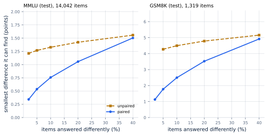
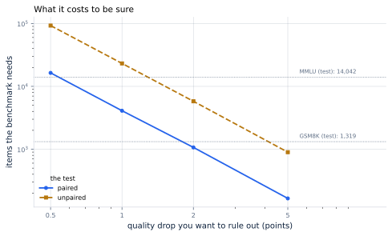
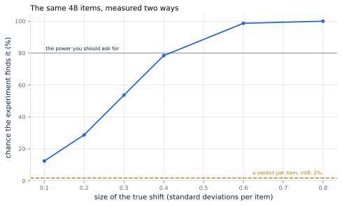

# 28. Measuring What You Lost

*Written to [STANDARDS.md](STANDARDS.md). Generated from
`chapters/ch28.md` and `code/results/ch28.json`; run `make ch28` in
`code/` to re-derive and re-render.*

**Depends on:** Chapter 24,
Chapter 9, Chapter 1.
**Tier 0** — a few seconds on a laptop CPU, free.

## Objectives

By the end of this chapter you can:

1. Say what difference a given benchmark can actually detect, and
   compute it for your own.
2. Run the right test for an experiment where both models answer the
   same questions, and say what the wrong one costs.
3. Work out how many items it takes to sign off a stated quality
   budget, before agreeing to the budget.
4. Explain why a metric averaged over tokens can barely move while a
   quarter of replies change.

## Why it matters

Every chapter of this Part makes the model smaller and then asks
whether it got worse. The asking is usually done like this: run a
benchmark before, run it after, print two numbers, and see which is
bigger.

That procedure has no idea whether it is looking at a difference. Most
of the differences it reports are noise, and most of the real ones it
misses, and both failures come from the same place — it is the wrong
test for the experiment being run. The experiment is *paired*: the two
models answered the same questions. Almost nobody uses that, and it is
worth between 1.0x and 3.5x depending on how
much the two models agree.

Nothing in this chapter needs a model. What is being measured is the
experiment.

## What a benchmark can see

Start with the number nobody looks up: given a benchmark of a certain
size, how small a difference can it find?

<!-- defines: statistical power, minimum detectable difference -->

The answer needs two conventions, and they are the standard ones: a
result counts as real if it would happen by chance less than
5% of the time, and the experiment should find a real
difference 80% of the time it is there. That second number is
the **statistical power**, and the difference an experiment finds
80% of the time is its **minimum detectable difference**.

<!-- include: tables/ch28-benchmarks.md -->
| Benchmark | Items | Smallest difference it can find, paired | Unpaired | Pairing is worth |
|---|---|---|---|---|
| MMLU (test) | 14,042 | **0.54 points** | 1.27 points | 2.4x |
| GSM8K (test) | 1,319 | **1.79 points** | 4.28 points | 2.4x |
| HumanEval | 164 | **4.88 points** | -- | -- |
| an internal eval | 200 | **4.41 points** | -- | -- |

Simulated, 4,000 runs per point, seed 0: the smallest true difference each benchmark finds 80% of the time at the 5% level, when the two models disagree on 5% of items. "Paired" is McNemar's test, which looks only at the items the two models answer differently. "Unpaired" is the two accuracy rates compared as though they came from different samples, which is what gets run. A dash means no difference the stated disagreement allows is ever found 80% of the time -- at those sizes the unpaired test cannot settle the question at all. Test-set sizes are each dataset's own published split (FACTS.md).

Read the first column and the last together. **MMLU, at
14,042 items, can find 0.54 points if the test is run
properly and 1.27 points if it is not.** GSM8K, at
1,319, finds 1.79 points and 4.28 points. The internal
evaluation set a team writes for itself — call it 200
items, which is generous — finds 4.41 points, and nothing at
all the other way.

So the next time a compression change is reported as costing "about a
point" on an internal eval, the honest reading is that the experiment
could not have told the difference between a point and nothing.

## Why pairing is the whole game

<!-- defines: paired test -->

The two tests differ in what they look at. The **paired test** — the
one for an experiment where both models answered the same items — puts
aside every item they agreed on and asks a single question about the
rest: of the items they answered differently, did more go one way than
the other? The other test compares two accuracy rates as though they
came from two different samples of questions. They did not. They came
from the same questions.

**Figure 28.1** — Pairing is worth most where the models agree most.
*Provenance in `code/figures/ch28-pairing.caption.txt`.*

The two lines converge as the models disagree more. At
40% disagreement pairing is worth
1.0x — nothing. At 2% it is worth
3.5x.

That is the shape that matters, because **a compression change lives
at the left-hand edge of that chart**.
Chapter 24 measured it: int8 changed a few
per cent of answers, int4 rather more. A change that alters two per
cent of answers and a test that cannot exploit the other ninety-eight
is a bad combination, and it is the usual one.

There is a second defect in the unpaired test, visible in the table
above as the dash: on a small benchmark it does not merely lack power,
it can never reach 80% at all, for any difference consistent
with the models disagreeing that little. It is also, at these sample
sizes, *conservative* — its false-positive rate is well under the
5% it claims, because assuming independence inflates its
standard error. That is the same defect seen from the other side,
and it is not a redeeming feature. A test that cannot find what is
there is not made better by rarely finding what is not.

## Signing off a budget

The practical version of all this is a question a team has to answer
before it agrees to anything: *how many items does it take to show the
drop is under X?*

**Figure 28.2** — What it costs to be sure. *Provenance in
`code/figures/ch28-signoff.caption.txt`.*

To rule out a drop of one point takes **4,096 items
paired** and **23,170 unpaired**. MMLU is large enough
for the first and not for the second. Halve the budget to half a point
and it takes 16,384 and 92,681: MMLU
is now on the wrong side of both.

Two things follow, and they are the chapter in one line each.

**Set the budget after looking at this chart, not before.** A quality
budget that the available evaluation cannot resolve is not a budget,
it is a hope. If your evaluation is 200 items, the tightest
honest budget is 4.41 points, and a proposal to accept "no
more than one point" is not something you can hold anyone to.

**Precision is quadratic and therefore expensive.** Halving the
difference you want to detect multiplies the items you need by four.
That is why the answer to "can we be sure it did not get worse" is
usually no, and why the useful question is the one with a number in
it.

## Running several benchmarks

One more way to be wrong, and it is the easy one. Run the model
against several benchmarks and report whichever moved.

Each benchmark has an 5% chance of moving by luck when nothing
has changed. Three of them, and the chance at least one moves is
14%. Twenty, and it is
**64%**. That is the same arithmetic as
Chapter 32's false-match rate: a small per-trial
error rate, applied often enough, is a large one.

The fix is not statistical machinery. It is to decide which
benchmark answers your question, write that down before running
anything, and treat the others as description rather than evidence.

## What an average over tokens hides

Perplexity is the measure most compression papers report, because it
is cheap and needs no task. It is the exponential of a mean log-loss
over tokens, and the trouble is in the word *mean*.

<!-- include: tables/ch28-perplexity.md -->
| Tokens made worse | By how much | Mean loss moves | Perplexity moves | Replies with at least one |
|---|---|---|---|---|
| 0.1% | 0.5 nats | 0.0005 | +0.05% | **26%** |
| 0.1% | 1.0 nats | 0.0010 | +0.10% | **26%** |
| 0.1% | 2.0 nats | 0.0020 | +0.20% | **26%** |
| 0.1% | 4.0 nats | 0.0040 | +0.40% | **26%** |
| 1.0% | 0.5 nats | 0.0050 | +0.50% | **95%** |
| 1.0% | 1.0 nats | 0.0100 | +1.01% | **95%** |
| 1.0% | 2.0 nats | 0.0200 | +2.02% | **95%** |
| 1.0% | 4.0 nats | 0.0400 | +4.08% | **95%** |
| 5.0% | 0.5 nats | 0.0250 | +2.53% | **100%** |
| 5.0% | 1.0 nats | 0.0500 | +5.13% | **100%** |
| 5.0% | 2.0 nats | 0.1000 | +10.52% | **100%** |
| 5.0% | 4.0 nats | 0.2000 | +22.14% | **100%** |

Exact arithmetic. Perplexity is the exponential of a mean log-loss over tokens, so a change confined to a small share of tokens moves it by the product and no more. The last column is the same change seen the way a user sees it: the chance that a reply of 300 tokens contains at least one of them. One token in a thousand is invisible in the first measure and in a quarter of replies in the second.

Follow the top row. A change that makes 0.1% of tokens
4 nats worse — which is to say, destroys them — moves
perplexity by **0.40%**. Nobody would notice that in a
table. In a 300-token reply, the chance of containing at
least one of those tokens is **26%**.

A quarter of replies contain a destroyed token, and the headline
measure moved by four parts in a thousand. Perplexity is not a bad
measure; it is an average, and an average is the wrong instrument for
a failure that is rare and severe. The failures compression produces
are exactly that shape.

## The book's own measurement, held to this standard

This chapter is easier to write than to obey, so here it is applied to
the book's own work.

Chapter 24 compared nine quantization
schemes over 48 positions.

<!-- include: tables/ch28-ch24.md -->
| Scheme | Answers changed | Best case, if all one way | Chance the test finds it | Unpaired |
|---|---|---|---|---|
| int8, symmetric, per tensor | 2 of 48 | 4.2 points | 1% | 0% |
| int8, asymmetric, per tensor | 1 of 48 | 2.1 points | 0% | 0% |
| int8, symmetric, per channel | 2 of 48 | 4.2 points | 2% | 0% |
| int4, symmetric, per tensor | 21 of 48 | 36.3 points | 99% | 100% |
| int4, asymmetric, per tensor | 29 of 48 | 19.6 points | 35% | 57% |
| int4, symmetric, per channel | 24 of 48 | 30.0 points | 82% | 92% |
| int4, symmetric, per group of 64 | 20 of 48 | 38.3 points | 100% | 100% |
| int4, symmetric, per group of 32 | 13 of 48 | 27.1 points | 100% | 95% |
| int4, asymmetric, per group of 32 | 16 of 48 | 33.3 points | 100% | 100% |

Chapter 24 compared nine quantization schemes over 48 positions. Read as a pass-or-fail experiment, the int8 rows are not an experiment at all: one or two answers changed, and even if every one of them went the same way the test would find it under two per cent of the time. Which is why that chapter did not run this test. It measured a number per position -- how far the logits shifted against the margin between the top two answers -- and at the same 48 positions a paired test on a number finds a shift of 0.4 standard deviations 78% of the time.

The int4 rows are fine: they changed so many answers that even that
small an experiment finds them. The int8 rows are not an experiment.
The best of them changed 2 answers out of
48, and a pass-or-fail test on that would find a real
difference **2%** of the time. Reported as "int8 is
fine", it would have been a claim with nothing behind it.

That chapter did not run that test. It measured a number per position
— how far the logits moved against the margin between the top two
answers — and reported that instead.

**Figure 28.3** — The same 48 items, measured two ways.
*Provenance in `code/figures/ch28-power.caption.txt`.*

At the same 48 positions, a paired test on a number
finds a shift of 0.4 standard deviations
78% of the time. **A verdict throws away everything
except the sign.** If the thing you measure can be a number — a
log-probability, a distance, a margin, a score — make it one, and a
small evaluation becomes an experiment.

## Where this chapter simplifies

**The items are independent and the model is not adaptive.** Real
benchmarks have correlated items — several questions from the same
passage, several problems in the same style — which makes the
effective sample size smaller than the item count. Everything here is
therefore optimistic: the true minimum detectable difference is larger
than the number in the table.

**Accuracy is treated as fixed and known.** In practice it is
estimated from the same run, which adds a little variance the
simulation does not.

**Sampling is not modelled.** Every figure here assumes each item has
one deterministic outcome per model. Evaluating at a temperature
above zero adds a second source of variance, and a `pass@k` metric
adds a third. Both make the experiment weaker, not stronger; the
remedy is the same one this chapter already recommends, which is to
keep a number rather than a verdict.

**The tests are the standard ones, not the best ones.** McNemar's
test and a two-proportion z-test are what a team will actually reach
for, so they are what is compared. Bootstrap and permutation tests on
paired data do better still, and the argument for pairing is
unchanged by which paired test you pick.

**The benchmark sizes are the published test splits**, recorded in
FACTS.md. A team that evaluates on a subset has a smaller benchmark
than the table says, and the numbers move accordingly.

## In production

**Report the disagreement rate, not only the two accuracies.** How
many items the two models answered differently is the number that
decides what your experiment can see, it takes one line of code, and
almost no compression report contains it.

**Use the paired test, or at least keep the per-item results.** If
the harness throws away which items were right and keeps only the
score, the pairing is gone and cannot be recovered. That is a
one-field change to a results file and it is worth between
1.0x and 3.5x of your evaluation budget.

**Decide the metric before the run.** A change evaluated against
twenty benchmarks will beat one of them. Write down which benchmark
and which threshold decides the question, then run.

**Prefer a number to a verdict wherever the task allows it.** Exact
match is a verdict. Log-probability of the correct answer is a
number, and on the same items it is a far stronger experiment.
Chapter 24 is the worked example.

**Treat perplexity as a smoke alarm, not a verdict.** It is cheap, it
catches gross damage, and it is nearly blind to the rare-and-severe
failures that quantization actually produces. If it moves, something
is very wrong; if it does not move, you have learned almost nothing.

## Numbers to remember

- **0.54 points against 1.27 points** — what MMLU's
  14,042 items can find, with the right test and the usual one.
- **3.5x at 2% disagreement,
  1.0x at 40%** — what pairing is worth.
  Compression changes few answers, so it is worth the most there.
- **4,096 items** — what it takes to rule out a
  one-point drop, paired. 23,170 unpaired.
- **64%** — the chance at least one of
  20 benchmarks moves by luck when nothing changed.
- **0.40% against 26%** — the same damage
  seen as a perplexity move and as the share of
  300-token replies containing a destroyed token.
- **2%** — the chance a 48-item
  pass-or-fail experiment finds an int8 difference. Which is why
  Chapter 24 measured a number instead.

## Sources

- Quinn McNemar, "Note on the sampling error of the difference between
  correlated proportions or percentages", *Psychometrika* 12(2), 1947,
  pp. 153-157, doi:10.1007/BF02295996 — the test for two treatments
  on the same subjects, which is what evaluating two models on one
  benchmark is. Its own summary: "two formulas are presented for
  judging the significance of the difference between correlated
  proportions."
- Dan Hendrycks, Collin Burns, Steven Basart, Andy Zou, Mantas
  Mazeika, Dawn Song, Jacob Steinhardt, "Measuring Massive Multitask
  Language Understanding", arXiv:2009.03300 (ICLR 2021) — the
  benchmark, covering "57 tasks including elementary mathematics, US
  history, computer science, law, and more". Its test split is
  14,042 items.
- Karl Cobbe and colleagues, "Training Verifiers to Solve Math Word
  Problems", arXiv:2110.14168 — GSM8K, "a dataset of 8.5K high
  quality linguistically diverse grade school math word problems",
  whose test split is 1,319.
- Mark Chen and colleagues, "Evaluating Large Language Models Trained
  on Code", arXiv:2107.03374 — HumanEval, 164 problems, and the
  `pass@k` metric whose extra variance this chapter does not model.

## Exercises

★ Your evaluation set has 500 items and your team has agreed a budget
of "no more than one point". Using the chart, say what is wrong with
that agreement and propose a repair.

★ A colleague reports that quantizing to int8 cost 0.3 points on a
1,000-item internal eval. What is the first question to ask, and what
answer would make the result believable?

★★ Perplexity moved by 0.2% and the on-call engineer wants to ship.
Write the two additional measurements you would ask for, and say what
each would rule out.

★★ Take a metric your team reports as a pass rate and design the
continuous version of it. Then estimate, from this chapter's numbers,
how much smaller an evaluation set you could get away with.

★★★ The items in a real benchmark are not independent. Design the
experiment that measures how correlated yours are, and say how you
would use the answer to correct the numbers in this chapter's first
table.
