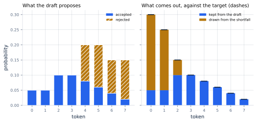
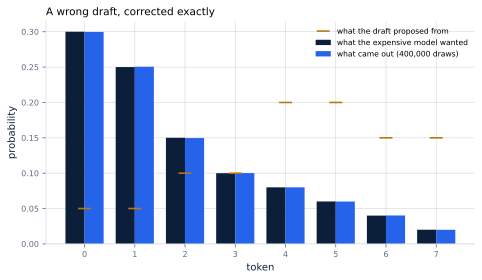
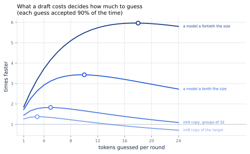

# 29. Speculative Decoding

*Written to [STANDARDS.md](STANDARDS.md). Generated from
`chapters/ch29.md` and `code/results/ch29.json`; run `make ch29` in
`code/` to re-derive and re-render.*

**Depends on:** Chapter 4, Chapter 16,
Chapter 24, Chapter 5.
**Tier 0** — a few seconds on a laptop CPU, free.

## Objectives

By the end of this chapter you can:

1. State what a draft model is for, and why a *worse* model can make a
   better one faster without making it wrong.
2. Apply the accept-or-correct rule, and explain why the tokens it
   keeps have exactly the expensive model's distribution.
3. Compute expected tokens per round from an acceptance rate, and
   choose how many tokens to guess.
4. Say when speculative decoding does not help, and recognise the two
   ways it can be a loss.

## Why it matters

Chapter 4 gave the sentence this chapter attacks: producing
one token reads every weight in the model. Not some of them — all of
them, for every token, for every sequence.

Chapter 16 answered that by sharing the read between users. It
works, and it does nothing for one user: a single reply still arrives
one token per full pass over the weights, at
4.84 ms a token for the book's 8B model.

The observation this chapter turns on is that **the expensive model
can check several tokens almost as cheaply as it can produce one.**
Checking five tokens means running the model over five positions at
once, which reads the same weights, and by the arithmetic of
Chapter 16 that costs barely more than one position. So: let
something cheap guess the next few tokens, then have the expensive
model check them all in a single pass, and keep the ones it agrees
with.

If that sounds like it must degrade the output, it does not, and that
is the surprising part. The tokens kept can be made to have **exactly**
the distribution the expensive model would have produced alone. Not
close to it. Exactly. Leviathan and colleagues, who introduced this,
put it as "exact decoding from the large models faster", "without
changing the distribution", "with identical outputs".

## The rule

<!-- defines: draft model, target model, acceptance rate -->

Two models. The **target** is the one whose answers you want. The
**draft** is anything cheaper that guesses plausibly.

For one position, the target wants a distribution over tokens — call
it *p* — and the draft proposed a token by sampling from its own, *q*.
The rule is:

- **Accept** the proposed token with probability *p(token) / q(token)*,
  capped at 1.
- **Otherwise** throw it away and sample a replacement from the
  *shortfall*: the part of *p* that exceeds *q*, renormalised.

That is all of it. Two lines of arithmetic, and the whole technique
rests on why they are exact.

<!-- listing: tinyserve/speculative.py verify no-docstring -->

```python
def verify(p: np.ndarray, q: np.ndarray, token: int,
           rng: np.random.Generator) -> tuple[bool, int]:
    p = p / p.sum()
    q = q / q.sum()
    if q[token] > 0 and rng.random() < min(1.0, p[token] / q[token]):
        return True, token
    shortfall = np.maximum(p - q, 0.0)
    total = shortfall.sum()
    if total <= 0:                      # p and q agree everywhere p is left
        return False, sample(p, rng)
    return False, sample(shortfall / total, rng)
```

### Why it is exact

Follow where a token can come from.

It can be **accepted**. That happens when the draft proposed it, with
probability *q(x)*, and the coin came up accept, with probability
min(1, *p(x)/q(x)*). Multiply: min(*q(x)*, *p(x)*). The draft's
contribution to each token is capped at what the target wanted.

Or it can come from the **correction**, which is reached only after a
rejection, and which draws from max(*p* − *q*, 0) — precisely the
amount by which the target wanted a token more than the draft offered
it.

Add the two. Where the draft asked for too little, the correction adds
the difference. Where it asked for too much, the cap removes the
excess. Every token comes out at *p(x)*.



**Figure 29.1** — The draft over-proposes some tokens and
under-proposes others. The cap removes the excess and the correction
replaces the shortfall.
*Provenance in `code/figures/ch29-rule.caption.txt`.*

### And it is exact in practice too

A proof is one thing. Here is the rule sampled 400,000 times against
a draft that is not merely worse than the target but *wrong* — a
different distribution, differing from the target by
0.50 in total variation, which for eight tokens
is very wrong indeed.



**Figure 29.2** — The output and the target are indistinguishable. The
draft is nothing like either.
*Provenance in `code/figures/ch29-exactness.caption.txt`.*

The largest gap between what came out and what the target wanted is
**0.00049**, which is 0.78 standard
errors of the sampling — that is, no gap at all. Total variation
between output and target: 0.00087, against the draft's
own 0.50.

**A bad draft costs speed. It cannot cost correctness.** That single
property is what separates this from every other technique in Parts IV
and V: quantization trades quality for memory and has to be evaluated;
this does not, and does not.

## How much it is worth

The accounting is short. Guess *k* tokens. Each is accepted with some
probability — call it *α*, the **acceptance rate** — and the first
rejection ends the round, with the correction supplying one token in
its place. If all *k* survive, the target's own next token is already
computed and comes free.

So a round yields

    (1 - α^(k+1)) / (1 - α)

tokens. Two things fall out of that expression. Guessing nothing
(*k* = 0) yields one token, as it must. A perfect draft yields *k* + 1,
not *k*, because of the free one at the end.

Simulated against the formula at 24 combinations of
*α* and *k*, 4,000 rounds each, the worst disagreement is
2.2%.

And a round costs *k* draft steps plus one target step. Divide:

<!-- include: tables/ch29-speedup.md -->
| Draft (cost of one draft step) | 30% accepted | 50% accepted | 70% accepted | 80% accepted | 90% accepted | 95% accepted |
|---|---|---|---|---|---|---|
| int8 copy of the target (0.5 of a target step) | 1.00x (worse than not bothering) | 1.00x (worse than not bothering) | **1.13x** at k=1 | **1.22x** at k=2 | **1.38x** at k=3 | **1.51x** at k=5 |
| int4 copy, groups of 32 (0.312 of a target step) | 1.00x (worse than not bothering) | **1.14x** at k=1 | **1.35x** at k=2 | **1.52x** at k=3 | **1.83x** at k=5 | **2.11x** at k=8 |
| a model a tenth the size (0.1 of a target step) | **1.18x** at k=1 | **1.46x** at k=2 | **1.98x** at k=4 | **2.47x** at k=6 | **3.43x** at k=10 | **4.48x** at k=15 |
| a model a fortieth the size (0.025 of a target step) | **1.32x** at k=2 | **1.76x** at k=4 | **2.67x** at k=7 | **3.66x** at k=10 | **5.96x** at k=18 | **9.11x** at k=28 |

Each cell is the best number of guesses per round and what it is worth. A round costs k draft steps and one target step and yields (1 - a^(k+1)) / (1 - a) tokens, so the best k rises with the acceptance rate and with how cheap the draft is. Nothing here is measured on hardware: the acceptance rate is a parameter and the costs are ratios of decode steps, priced by Chapter 16.



**Figure 29.3** — Every curve rises, peaks, and falls. The circle is
the best number of guesses.
*Provenance in `code/figures/ch29-speedup.caption.txt`.*

**There is always a best number of guesses, and it is not large.**
Each extra guess is paid for whether or not it survives, while the
chance it survives falls geometrically. With a draft costing
0.025 of a target step and 6.0x available at
90% acceptance, the optimum is 18 guesses; with a draft
costing half a target step it is 3, and the gain is
1.38x.

That last figure is the important one. **A draft that costs half a
target step is barely worth running** — and if the acceptance rate
falls to 30%, the same draft gives 1.00x: slower than not
bothering. The technique is not free, and the table above has cells
where it loses.

## Where a draft comes from

A draft has to be cheap *and* agree. Those pull against each other,
and the second is easy to underestimate.

Here is the acceptance rate for drafts that are quantized copies of
the target — Chapter 24's schemes, which
are genuinely cheaper to run and genuinely related to what they are
drafting for:

<!-- include: tables/ch29-acceptance.md -->
| Draft | Bytes a weight | Picks the same token | Guess survives, sampled |
|---|---|---|---|
| int8, per tensor | 1.000 | 97.5% | 99.0% |
| int4, groups of 32 | 0.625 | 70.0% | 90.3% |
| int4, per tensor | 0.500 | 55.0% | 83.5% |
| int2, per tensor | 0.250 | 0.0% | 48.5% |
| an unrelated small model | -- | 0.0% | -- |

Over 40 positions of one prompt. The drafts are quantized copies of the target from Chapter 24: cheaper to run, and related to what they are drafting for, which is the property that matters. An unrelated model of the same architecture agrees at 0.20%, which is chance.

The two columns differ because the rule does not require the draft to pick the same token -- it accepts in proportion to how much the two distributions overlap. Read the last column with care: this model is untrained, so its output is nearly flat (5.72 nats against 6.24 for a uniform distribution over the same vocabulary), and two flat distributions overlap heavily whatever they are. A trained model is far more confident and its acceptance rates are correspondingly lower.

An int8 copy picks the same token 98% of the time. Drop to
four bits in groups of 32 and it is 70%; at two bits the
model is destroyed and it is 0%.

And an **unrelated** model of the same architecture agrees
0% of the time, against a chance rate of
0.20% over this vocabulary. That is the constraint people skip:
the draft cannot merely be small, it has to have learned the same
things. In production the draft is a small model from the same family,
trained on the same data, or the target's own earlier layers, or — the
cheapest option of all — a lookup of what the prompt already said,
which Chapter 30 takes up.

> **Read the sampled acceptance column carefully.** It is higher than
> the agreement column because the rule does not need the draft to
> pick the same token; it accepts in proportion to how much the two
> distributions overlap. But this book's model is untrained, and its
> output is nearly flat — 5.72 nats of entropy against
> 6.24 for a uniform distribution over the same
> 512 tokens. Two flat distributions overlap heavily whatever
> they are, so those figures are optimistic in a way a trained model's
> would not be. The column to trust here is agreement; the acceptance
> rate of a real pair has to be measured on that pair.

## What it would be worth

<!-- include: tables/ch29-reference.md -->
| Draft | Guesses | Tokens a round | Times faster | Between tokens |
|---|---|---|---|---|
| int8 copy of the target | 2 | 2.44 | **1.22x** | 3.96 ms |
| int4 copy, groups of 32 | 3 | 2.95 | **1.52x** | 3.17 ms |
| a model a tenth the size | 6 | 3.95 | **2.47x** | 1.96 ms |
| a model a fortieth the size | 10 | 4.57 | **3.66x** | 1.32 ms |

The book's 8B model, whose decode step is 4.84 ms between tokens without any of this (Chapter 16's cost model, one sequence, 1,500 tokens of context). Every row assumes 80% of guesses are accepted, which is a stated assumption and not a measurement -- the acceptance rate depends on the draft, the target and the traffic, and the only honest way to get it is to measure the pair you actually have.

At 80% acceptance, a draft a fortieth of the target's size takes the
book's model from 4.84 ms between tokens to
1.32 ms — 3.66x — with 10 guesses
a round. An int8 copy of the target manages 1.22x.

Both numbers assume an acceptance rate rather than measuring one, and
that is stated in the table because it is the assumption everything
here rests on.

## Where it breaks

**It buys latency, not throughput.** Every figure above is about one
sequence's gap between tokens. A server that is already batching
(Chapter 17) has its arithmetic units busy, and
speculation adds work to them: the draft steps are real work, and the
rejected guesses are work thrown away. On a *saturated* server
speculative decoding can reduce total throughput while improving any
individual reply. It is a technique for the regime
Chapter 5 called latency-bound, and the
engines say so themselves: vLLM's documentation describes speculative
decoding as reducing "inter-token latency under medium-to-low QPS
(queries per second), memory-bound workloads". Under load it should be
turned down or off, and the lighter drafting methods of
Chapter 30 exist partly because they
"provide modest speedups without increasing workload during peak
traffic".

**The acceptance rate is a property of the pair, not the draft.** The
same draft will accept at very different rates on different traffic:
predictable text accepts well, and the surprising continuations a user
actually asked for accept worst. An average acceptance rate can hide
a distribution with a bad tail, and the tail is where
Chapter 5's promise lives.

**Two models to operate.** A draft is a second set of weights in
memory — memory that Chapter 13 spends on the KV
cache — a second thing to load, version and update. If the draft is
1/40th the size the memory is a rounding error; if it is an int8 copy
of the target it is half the model again.

**The measurements here are a cost model, not a run.** The acceptance
rates come from an untrained model and are flagged as optimistic; the
speedups are arithmetic over the decode step
Chapter 16 priced. What is *exact* in this chapter is the
correctness of the rule, which is sampled and holds to
0.78 standard errors, and the formula for expected
tokens, which is simulated and holds to 2.2%.

## In production

**Turn it on for latency, off under load.** That single rule covers
most of the decision.

**Start with the cheapest draft that agrees.** The table above says a
draft costing half a target step needs a very high acceptance rate to
pay for itself, and drafts that cheap-to-run are the ones that agree
least. The sweet spot in practice is a model one or two orders of
magnitude smaller, from the same family.

**Guess few.** The optima in Figure 29.3 are single digits for
anything but the cheapest drafts, and the curves fall off past them.
vLLM's `num_speculative_tokens` — "Number of speculative tokens to
propose per step" — is the *k* in this chapter's formula, and it has
no default: the engine requires you to choose, for methods that cannot
infer it. Figure 29.3 is how to choose it.

**Measure acceptance on your own traffic, and keep measuring it.** It
is the only input that matters and the only one that cannot be
predicted, and it drifts as the traffic drifts.

## Numbers to remember

- **0.78 standard errors** — how far the output of
  the accept-or-correct rule sits from the target's own distribution
  over 400,000 draws. The rule is exact, and a bad draft costs only
  speed.
- **(1 − α^(k+1)) / (1 − α)** — tokens per round. Worth memorising;
  everything else in this chapter follows from it.
- **18 guesses** — the optimum for a draft costing
  0.025 of a target step at 90% acceptance, worth
  6.0x. For a draft costing half a step it is 3,
  worth 1.38x.
- **1.00x** — the same expensive draft at 30% acceptance.
  Below one: speculation can lose.
- **0%** — how often an unrelated model of the same
  architecture agrees with the target. A draft has to be related, not
  merely small.

## Sources

- Yaniv Leviathan, Matan Kalman, Yossi Matias, "Fast Inference from
  Transformers via Speculative Decoding", arXiv:2211.17192 (ICML 2023)
  — the rule this chapter implements, and the claim it is built on:
  "exact decoding from the large models faster", "without changing the
  distribution", "with identical outputs". They report "a 2X-3X
  acceleration compared to the standard T5X implementation" on T5-XXL.
- Charlie Chen, Sebastian Borgeaud, Geoffrey Irving, Jean-Baptiste
  Lespiau, Laurent Sifre, John Jumper, "Accelerating Large Language
  Model Decoding with Speculative Sampling", arXiv:2302.01318 — the
  same idea, arrived at independently and presented at Chinchilla
  scale.
- vLLM documentation, *Speculative Decoding* — the guidance quoted
  above that the technique targets "inter-token latency under
  medium-to-low QPS (queries per second), memory-bound workloads",
  and the `num_speculative_tokens` setting, "Number of speculative
  tokens to propose per step".

## Exercises

★ A draft is accepted 60% of the time and costs a tenth of a target
step. Compute the tokens per round at k = 1, 2 and 4, and say which
you would ship.

★ Using the formula, show that guessing nothing gives exactly one
token per round, and that a perfect draft gives k + 1 rather than k.
Explain the extra one in words.

★★ The acceptance rates in this chapter's table come from an untrained
model whose output is nearly uniform. Predict the direction each
column would move for a trained model and say why, then say what you
would measure to check.

★★ Add a `--temperature` to the verification in
`tinyserve/speculative.py` and measure how acceptance changes as the
target's distribution sharpens. Explain the result in terms of the
overlap between p and q.

★★★ Chapter 17's scheduler batches many sequences. Extend it to run
speculative decoding for each, charge the draft steps honestly, and
find the offered load at which speculation stops paying for itself.
State the acceptance rate you assumed and how the answer moves with
it.
