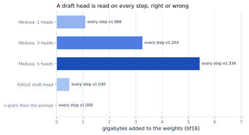
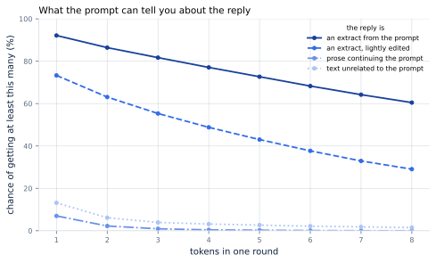
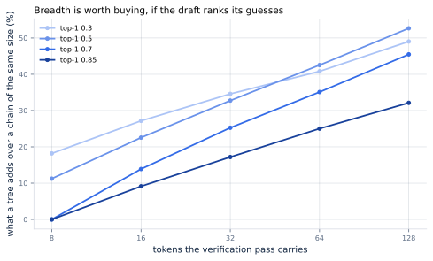
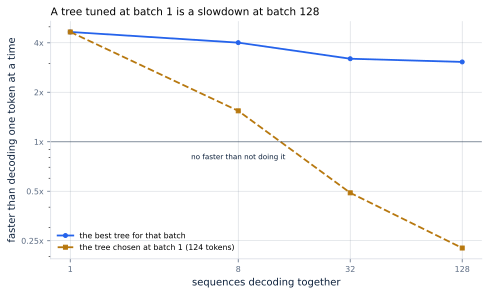

# 30. Self-Speculation and Draft Heads

*Written to [STANDARDS.md](STANDARDS.md). Generated from
`chapters/ch30.md` and `code/results/ch30.json`; run `make ch30` in
`code/` to re-derive and re-render.*

**Depends on:** Chapter 29, Chapter 16,
Chapter 8.
**Tier 0** — a few seconds on a laptop CPU, free.

## Objectives

By the end of this chapter you can:

1. Compute what a draft head weighs, and say why that is the first
   number to look at rather than the last.
2. Say which workloads a draft built from the prompt alone can serve,
   and measure it on your own traffic.
3. Explain what a tree of guesses buys over a chain of the same size,
   and what a draft has to be able to do before it buys anything.
4. Predict what any of this does at a production batch size, which is
   not what the papers report.

## Why it matters

Chapter 29 needed two models: a small one to guess
and a large one to check. The arithmetic was exact and the answer was
exactly the large model's. What the chapter did not have to live with
is the small model — finding one with the same tokenizer, training it,
serving it beside the large one, keeping the pair in step through
every update. In production that is most of the work.

<!-- defines: draft head, prompt lookup -->

The methods in this chapter remove it. A **draft head** is an extra
output layer bolted onto the model you already serve, trained to
predict not the next token but the one after it. **Prompt lookup**
goes further and adds nothing at all: it guesses by finding where the
last few words appeared earlier in the prompt and proposing whatever
followed them then.

Both are sold as free. Neither is, and the two are not expensive in
the same way.

## What a head weighs

Start with the one number a paper about draft heads will not put in
its abstract.

<!-- include: tables/ch30-heads.md -->
| Drafter | Parameters | Bytes | Of the model | Every decode step |
|---|---|---|---|---|
| Medusa, 1 heads | 0.54B | 1.08 GB | 6.8% | x1.068 |
| Medusa, 2 heads | 1.08B | 2.17 GB | 13.5% | x1.135 |
| Medusa, 3 heads | 1.63B | 3.25 GB | 20.3% | x1.203 |
| Medusa, 5 heads | 2.71B | 5.42 GB | 33.9% | x1.339 |
| EAGLE draft head | 0.24B | 0.48 GB | 3.0% | x1.030 |
| n-gram from the prompt | 0.00B | 0.00 GB | 0.0% | x1.000 |

Exact arithmetic over the reference model (4,096 hidden, 128,256 vocabulary, 16.0 GB of weights in bf16). A Medusa head is a square residual block plus its own projection to the whole vocabulary, which is where all of the cost is. EAGLE's figure is the one its authors publish for Vicuna-7B, the smallest model in their table, rather than a guess at the architecture. The last column is what the extra weights do to a decode step, which is memory-bound: bigger weights take proportionally longer to read, on every step, including the ones where the draft guesses wrong.

**Figure 30.1** — A draft head is read on every step, right or wrong.
*Provenance in `code/figures/ch30-heads.caption.txt`.*

A Medusa head, as its own implementation builds it, is a square
residual block on the hidden size followed by
`Linear(hidden_size, vocab_size)`. The residual block is small. The
projection is not: it is a second copy of the model's output layer,
4,096 by 128,256, and there is one per head. Three heads —
the default in the project's own training command — come to
1.63B parameters, **3.25 GB on top of a
16.0 GB model**, which is 20.3% more weight.

A decode step is memory-bound (Chapter 4): its cost is
reading the weights. Weights that are 20.3% bigger take
20.3% longer to read, on **every step**, including every
step whose guesses are thrown away. So the heads start the chapter
1.203x behind, and the speedup has to beat that before it
has done anything at all.

EAGLE's draft is a different shape: a small model that autoregresses
over the target's second-to-top-layer features rather than over
tokens, which its abstract describes as "minimal overhead". Its
repository publishes a parameter count per target model rather than an
architecture, and for the smallest model in that table it is
0.48 GB of weights — 3.0% of the reference model, so
1.030x behind instead of 1.203x. Whatever the
architecture turns out to be, it is not paying for a second copy of
the output layer, and that is the whole of the difference.

> **This gets worse as tokenizers get bigger.** A Medusa head costs
> hidden size times vocabulary. Llama 3 replaced Llama 2's tokenizer
> with one that "expands the vocabulary size to 128,256 (from 32K
> tokens in the previous version)", which is a little over four times.
> The same head architecture on the same hidden size therefore costs a
> little over four times as much on the newer model, and nothing about
> the method changed. The trend in tokenizers is upward.

## Drafting with no model at all

The other direction is to add nothing. Take the last few words
written, find where they appeared earlier in the prompt, and propose
what followed. No parameters, no training, no second process — and no
guess at all when the prompt has nothing to say.

Whether that works is a question about the *task*, and it is
measurable without a model, because what is being asked is how much
the reply overlaps the prompt. Here it is measured over real prose —
this book's own chapters — for four shapes of reply.

<!-- include: tables/ch30-drafting.md -->
| The reply is | A guess at all | 1 token | 2 | 4 | 8 | Tokens a round | Speedup at 8 nodes |
|---|---|---|---|---|---|---|---|
| an extract from the prompt | 100% | 92% | 86% | 77% | 60% | 7.03 | x7.03 |
| an extract, lightly edited | 88% | 73% | 63% | 49% | 29% | 4.83 | x4.83 |
| prose continuing the prompt | 37% | 7% | 2% | 0% | 0% | 1.11 | x1.11 |
| text unrelated to the prompt | 46% | 13% | 6% | 3% | 1% | 1.35 | x1.35 |

Measured over 1,200 words of real prose per row, with the context indexed as the reply is written and n-grams of 2 to 8 words, seed 0. The columns are the chance of getting at least that many tokens from one round, which is the product of the per-depth rates and not any one of them. The first two rows are input-grounded replies -- an extract from the document, and the same extract with one word in ten changed. The third continues the document without quoting it. The fourth is the control: a reply with nothing to do with the prompt, which still earns a little by copying from what it has already written.

**Figure 30.2** — What the prompt can tell you about the reply.
*Provenance in `code/figures/ch30-drafting.caption.txt`.*

The spread is not a spread of quality. It is two different methods
wearing one name.

**When the reply comes out of the prompt, this is nearly free money.**
A reply extracted from the document reaches one token
92% of the time and four tokens 77% of
the time, which over eight guesses is 7.03 tokens a
round and **7.03x**, from a dictionary. Change one word
in ten — an edit, a paraphrase, the difference between quoting a
document and rewriting it — and it falls to
73% at one token and 4.83x. Still
excellent, and the fall from the first row to the second is the
honest measure of how sensitive this is to the reply being a copy.

**When the reply does not come out of the prompt, there is nothing
here.** Prose that continues the document without quoting it gets a
guess at all at only 37% of positions, is right at the
first token 7% of the time, and returns
1.11x. That is not a worse drafter. It is a drafter with
nothing to copy.

One detail in the last row is worth noticing. Text with *nothing* to
do with the prompt still returns 1.35x — slightly more
than the continuation task — because the index grows as the reply is
written, and a reply that repeats itself can be copied from itself.
Prompt lookup's author flags the same effect in reverse: the gain on
the first turn of a chat is small "since the prompt is small", and
grows once there is a conversation to match against.

## Arranging the guesses

Chapter 29 proposed a chain: k guesses, one after
another, accepted up to the first mistake. There is another shape.

<!-- defines: tree attention -->

**Tree attention** proposes several alternatives at each position and
verifies them all in a single pass, with an attention mask that stops
the branches from seeing each other. A chain of eight guesses and a
tree of eight nodes carry the same number of tokens through the
verification pass and cost the same; they are not worth the same,
because the tree gets more than one attempt at each position.

**Figure 30.3** — Breadth is worth buying, if the draft ranks its
guesses. *Provenance in `code/figures/ch30-trees.caption.txt`.*

At a top-1 acceptance of 0.7, a chain of eight returns
3.20 tokens a round. The best tree of
64 nodes returns 4.32 — **35% more
for the same verification pass** — and its shape,
(2, 2, 2, 1, 1, 1, 1, 2), says where the nodes are worth spending: wide at the
top, where every path still has a chance of being reached, narrow
below. The gain is largest where the draft is weakest: 53%
at a top-1 rate of 0.5.

That panel is a model, and it is pinned to a measurement: the chance
the target's own token is the draft's second or third choice is
modelled as a rank distribution whose top-1 rate is the draft's
measured one. It is the only part of this chapter that is not counted
directly, and it is there because of what happens when you try to
measure it on the drafter this chapter *did* measure.

**The n-gram drafter gets almost nothing from breadth: 2%,
from sixteen times the nodes.** Its second candidate is not a second
guess. It is a rarer match — a place in the document where the same
few words happened to be followed by something else — and rarer
matches are not better guesses. A trained head produces a
distribution, and its second-most-likely token means something. An
index produces a list of coincidences.

So tree attention is not a trick you can bolt onto any drafter. It is
worth exactly as much as your drafter's ranking is, which is a thing
to measure before building one.

## What the batch does to all of this

Every number so far has been for one sequence. Servers do not run one
sequence.

<!-- include: tables/ch30-batch.md -->
| Batch | Nodes a pass carries free | Best tree | Its speedup | The batch-1 tree instead | Tokens 64 nodes must yield |
|---|---|---|---|---|---|
| 1 | 302 | (4, 2, 2, 1, 1, 1, 1, 2) (124 nodes) | x4.65 | x4.65 | 1.20 |
| 8 | 42 | (2, 2, 1, 1, 1, 1, 1, 1) (30 nodes) | x4.01 | x1.54 | 1.87 |
| 32 | 14 | (1, 1, 1, 1, 1, 1, 1, 1) (8 nodes) | x3.20 | x0.49 | 5.90 |
| 128 | 7 | (1, 1, 1, 1, 1, 1) (6 nodes) | x3.06 | x0.23 | 12.78 |

Arithmetic over the reference model at a 1,500-token context, for a drafter whose top-1 acceptance is 0.70 and whose ranked alternatives are modelled rather than measured. "Nodes a pass carries free" is where the verification pass stops being memory-bound and starts paying for every extra token. The fifth column is the same tree the first row chose, run at that batch. The last is what a round would have to accept, with Medusa's three heads on the model, for 64 nodes to be worth verifying at all.

**Figure 30.4** — A tree tuned at batch 1 is a slowdown at batch 128.
*Provenance in `code/figures/ch30-batch.caption.txt`.*

A verification pass is free while it is memory-bound, which is the
same argument as Chapter 16's: the weights are read once whatever
the pass carries, so extra tokens ride along at no cost until there
are enough of them to make the arithmetic the larger of the two. At
batch 1 that point is **302 tokens**. There is room for any
tree anybody has proposed.

At batch 128 it is **7**.

The batch has already used the room up. Every sequence brings its own
tree, so a 124-token tree at batch 128 is
putting 124 times 128 tokens through a pass
that had room for 7, and the pass is now paying full price
for all of them. The tree that returned 4.65x at batch
1 returns **0.23x at batch 128** — which
is to say it makes the server 4.4x *slower* than
not speculating at all.

The fix is not to stop; it is to stop using the paper's setting. The
best tree at batch 128 is 6 tokens rather
than 124, and it still returns 3.06x.
Speculation survives the batch. The tree does not.

The same argument sets what a head has to earn. With Medusa's three
heads on the model, a 64-token verification round at batch 1 has to
accept 1.20 tokens to break even, which is nothing. At
batch 128 it has to accept **12.78** —
against the 6.77 that the best tree in Figure 30.3
returns at the highest acceptance rate plotted there. It is not close,
and no amount of training the head closes it.

## Where this chapter simplifies

**The text is this book's own, and the tokens are words.** A real
tokenizer splits into smaller and more repetitive units, which gives
an n-gram drafter more to match on, so the rates here are a floor in
that respect. Against that, this book's prose repeats its own phrases
deliberately and far more than most writing does, which pushes the
other way. The two do not cancel and neither is quantified. What
transfers is the *shape*: input-grounded replies are cheap to draft
and ungrounded ones are not.

**The grounded task is a ceiling, by construction.** The first row's
reply is sentences lifted verbatim from the document, so a drafter
that finds the sentence copies all of it. Real summarisation
paraphrases. The second row — 10% of the words changed — is
the one to reason from, and even that is generous: prompt lookup's own
author reports "a relatively consistent 2.4x speedup (on average)" on
real summarisation and context-QA, against the 4.83x
measured here.

**How a draft ranks its second guess is modelled, not measured.**
Figure 30.3 and the whole of the batch table rest on it. The model has
one free parameter and that parameter is pinned by the draft's
top-1 rate, which is the most disciplined version of this available
without a trained head to measure. Nothing in the chapter's
conclusions depends on the exact curve: the batch result holds for any
tree of that size, and the breadth result was measured rather than
modelled.

**Acceptance is treated as independent of the batch.** It is not
quite: a longer context changes what the drafter has to match
against. The direction is favourable — more context is more to copy —
so the batch conclusion is, if anything, understated.

**Nothing here is a timing run.** What a verification pass costs is
the book's roofline over published specifications, as everywhere in
Parts I and II. On a real machine the tree also costs an attention
mask, a gather, and a rejection step that this does not charge for,
all of which make the wide tree worse rather than better.

## In production

**Look at the head's size before its acceptance rate.** It is the one
number that is knowable before you train anything, it is paid on every
step, and on a large vocabulary it is not small. A head that adds
20.3% to the weights needs to beat 1.203x before
it has broken even, and that is the floor, not the target.

**Measure your own prompt-to-reply overlap before building a
drafter.** One query over your logs: how often does a reply's next
word appear after the same few words in its prompt? If your traffic is
summarisation, document QA, code editing or multi-turn chat, prompt
lookup is a few dozen lines and costs nothing. If it is open-ended
generation, it is not a weaker version of speculation, it is nothing.

**Retune the tree at your batch size, and retune it when the batch
moves.** Published tree configurations are tuned at batch 1. Serving
frameworks let you set the number of speculative tokens per request;
Chapter 41's measurements say the right value at batch
128 is a small number, and the published one is a
slowdown. This is the single most common way speculative decoding is
deployed wrongly.

**Turn it off under load rather than tuning it to zero.** vLLM's own
documentation puts speculation at "medium-to-low QPS"
(Chapter 29). A scheduler that disables it when the
batch grows past a threshold you measured is simpler than one that
resizes the tree continuously, and captures most of the same benefit.

**Prefer the drafting method with no weights, if it fits.** Prompt
lookup has no training cost, no second artefact to version, no
tokenizer to keep in step, and adds exactly nothing to the decode
step. On a workload it suits it is not a compromise; it is the better
method.

## Numbers to remember

- **3.25 GB on a 16.0 GB model** — three Medusa heads,
  20.3% more weight, read on every step. The projection to
  the vocabulary is all of it.
- **1.203x** — what those heads cost before any guess is
  made, and the floor the speedup has to clear.
- **7.03x against 1.11x** — prompt lookup
  on a reply extracted from the prompt, and on prose that does not
  quote it. Same drafter, same code.
- **35%** — what a tree of 64 nodes adds over a
  chain, for a draft that ranks its guesses. **2%**
  — what it added for one that does not.
- **302 tokens against 7** — what a verification
  pass carries free at batch 1 and at batch 128. The batch
  spends the room the tree wanted.
- **0.23x** — what the batch-1 tree does at batch
  128: 4.4x slower than not
  speculating.

## Sources

- Tianle Cai, Yuhong Li, Zhengyang Geng, Hongwu Peng, Jason D. Lee,
  Deming Chen, Tri Dao, "Medusa: Simple LLM Inference Acceleration
  Framework with Multiple Decoding Heads", arXiv:2401.10774 (ICML
  2024) — "adding extra decoding heads to predict multiple subsequent
  tokens in parallel" and, "using a tree-based attention mechanism",
  constructing "multiple candidate continuations" verified
  "simultaneously in each decoding step". Reports "over 2.2x speedup"
  for Medusa-1 and "2.3-3.6x" for Medusa-2. The head architecture this
  chapter prices is the one in the project's own
  `medusa/model/medusa_model.py`.
- Yuhui Li, Fangyun Wei, Chao Zhang, Hongyang Zhang, "EAGLE:
  Speculative Sampling Requires Rethinking Feature Uncertainty",
  arXiv:2401.15077 (ICML 2024) — "autoregression at the feature
  (second-to-top-layer) level is more straightforward than at the
  token level", reporting "a latency speedup ratio of 2.7x-3.5x" on
  LLaMA2-Chat 70B. Its repository publishes a parameter count per
  target model, which is what this chapter uses.
- Apoorv Saxena, "Prompt Lookup Decoding", 2023 — the method measured
  here, reporting "significant speedups (2x-4x) in input-grounded
  tasks, with no effect on output quality" and "a relatively
  consistent 2.4x speedup (on average)" on summarisation and
  context-QA. Honest about the other side too: roleplay "showed the
  worst gains" because "there isn't many ngrams to copy". Available in
  vLLM as `"method": "ngram"`.

## Exercises

★ A Medusa head costs hidden size times vocabulary. Compute it for a
model with a 32,000-token vocabulary and for one with
128,256, at the same hidden size, and say what that does to the
argument for draft heads over the last three years.

★ Your service does document question answering. Write the one query
against your logs that decides whether prompt lookup is worth an
afternoon, and say what number would make you stop.

★★ The tree in Figure 30.3 is wide at the top and narrow below. Argue
from the arithmetic why that is the right shape, then find a draft for
which it is not.

★★ At batch 128 the verification pass carries
7 tokens free. Work out what happens to that number if the
context doubles, and if the model's weights are quantized to 8 bits
(Chapter 24). Predict the direction of
each before you compute it.

★★★ Design the controller that turns speculation on and off. What does
it measure, how often, what does it do when the batch is changing
faster than it can measure, and how do you stop it oscillating?
