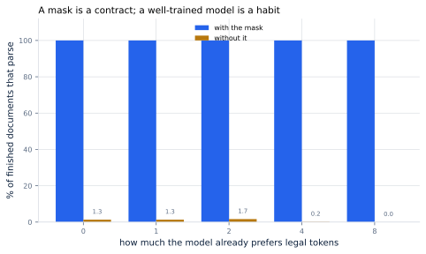
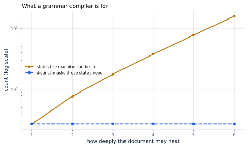
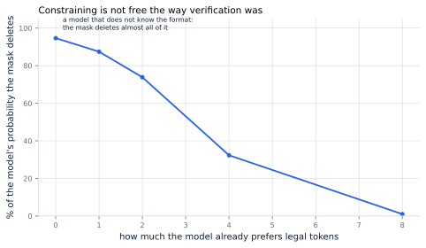

# 31. Constrained Decoding

*Written to [STANDARDS.md](STANDARDS.md). Generated from
`chapters/ch31.md` and `code/results/ch31.json`; run `make ch31` in
`code/` to re-derive and re-render.*

**Depends on:** Chapter 2,
Chapter 29, Chapter 4.
**Tier 0** — a few seconds on a laptop CPU, free.

## Objectives

By the end of this chapter you can:

1. Explain how a mask over the vocabulary turns "usually valid JSON"
   into "always valid JSON".
2. Say why a grammar's states can grow without its masks growing, and
   what an engine compiles a grammar into.
3. Compute what constraining costs per token, and say why it is not
   the cost people worry about.
4. Say precisely how constrained decoding differs from
   Chapter 29: one is exact and the other is not.

## Why it matters

A model asked for JSON usually produces JSON. A service whose caller
parses the reply needs better than usually.

The fix does not involve the model. It goes between the logits and the
sampler: work out which tokens could legally come next, set every
other logit to negative infinity, and sample from what remains. The
model cannot break the format because the tokens that would break it
are not available to it.

<!-- defines: constrained decoding, token mask -->

That is **constrained decoding**, and the thing it needs is a **token
mask** — one bit per vocabulary entry, recomputed at every step. This
chapter builds one for JSON, which is the smallest interesting case
because brackets nest and so a finite list of states will not do.

## What it is worth

Start with the question a service actually has: does the reply parse?

<!-- include: tables/ch31-validity.md -->
| The model's own grasp of JSON | With the mask: valid | finished | Without it: valid | finished |
|---|---|---|---|---|
| none at all | **100.0%** | 99.7% | 1.3% | 100.0% |
| slight | **100.0%** | 100.0% | 1.3% | 100.0% |
| some | **100.0%** | 100.0% | 1.7% | 100.0% |
| good | **100.0%** | 100.0% | 0.2% | 97.3% |
| strong | **100.0%** | 99.8% | 0.0% | 11.0% |

600 documents at each level, cut off at 400 tokens. "Valid" is the share of the documents that *finished* which parse; a walk cut off at the token limit is incomplete, which is a different failure and is counted in the column beside it. The model here is a stand-in whose preference for legal tokens can be turned up, which is the only property of a real model this measurement depends on.



**Figure 31.1** — The same sampler, with the mask and without it.
*Provenance in `code/figures/ch31-validity.caption.txt`.*

With the mask, **100%** of finished documents parse,
at every level of the model's own grasp of the format. Without it,
1.3% at best — and the mask's column is
100% not because the model got better but because
invalid documents were never reachable.

One column is worth more attention than the headline. As the
unconstrained model gets *better* at JSON, its documents stop
**finishing**: at the highest skill only 11% of them
ended at all. A model that has learned to open brackets without
learning to close them runs until it hits the token limit, producing a
long, plausible, unterminated fragment — and burning a slot on the
server the whole time. The failure mode of nearly-good structured
output is not a parse error. It is a timeout.

## What an engine compiles

The mask has to be produced for every token of every request, so the
way it is produced matters more than the fact of it.

The obvious way is to walk the grammar at each step and ask what it
permits. Here is why nobody does that.

The machine's state is a label plus a stack of the containers still
open — that stack is why a regular expression cannot do this job, since
JSON nests to any depth and a machine with finitely many states cannot
remember how many brackets it owes. And the number of those states
explodes:

<!-- include: tables/ch31-states.md -->
| Nesting allowed | States | Distinct masks | States per mask |
|---|---|---|---|
| 1 | 27 | **27** | 1 |
| 2 | 77 | **27** | 3 |
| 3 | 177 | **27** | 7 |
| 4 | 377 | **27** | 14 |
| 5 | 777 | **27** | 29 |
| 6 | 1,577 | **27** | 58 |

Enumerated exhaustively. The states double with every level of nesting, because the stack is a sequence of objects and arrays. The masks do not, because what may come next depends on the innermost open container and never on the ones beneath it -- so all 27 of them fit in 128 bytes over this 38-token vocabulary, and the work per token at serving time is a lookup. Each mask leaves 1 to 26 tokens open, 27% of the vocabulary on average: most of what the model could say, at any moment, it may not.



**Figure 31.2** — The states double with every level. The masks do
not.
*Provenance in `code/figures/ch31-states.caption.txt`.*

From 27 states at depth 1 to
1,577 at depth 6, doubling each time, because
the stack is a sequence of objects and arrays and there are twice as
many sequences at each new level.

**And the number of distinct masks is 27, at every depth.**

The reason is worth stating carefully, because it is the whole of what
makes this cheap. What may come next depends on the *innermost* open
container and never on the ones beneath it: a comma inside an object
means the same thing three levels down as it does at the top. So the
entire stack collapses to its last element as far as the mask is
concerned, and 58 different states at depth
6 share a single mask between them.

That is what a grammar compiler is for. It enumerates the masks once,
before any request arrives, and at serving time the work per token is
finding the right row. All 27 of them pack into
128 bytes over this chapter's vocabulary.

Willard and Louf put the general version of this as reformulating
generation "in terms of transitions between the states of a
finite-state machine", which allows "the construction of an index over
a language model's vocabulary" — the index being the table above,
built for whatever grammar was asked for.

<!-- listing: tinyserve/grammar.py JsonMachine.mask_key no-docstring -->

```python
def mask_key(self) -> tuple:
    return (self.label, self.top, self.in_key, self.seen_digit,
            self.seen_dot, self.leading_zero)
```

## What it costs

<!-- include: tables/ch31-cost.md -->
| Per token | Amount | As a share of a decode step |
|---|---|---|
| Additions to the logits | 128,256 | 0.000801% of its arithmetic |
| Mask read from the table | 16,032 bytes | 0.00010% of its bytes |
| A decode step, for comparison | 16.2 GB read, 16.0 GFLOP | 100% |

At the reference model's 128,256-token vocabulary, one bit of mask per token packed. Counted, not timed: the mask is one lookup and one addition per vocabulary entry, and a decode step reads every weight in the model, so both sides are exact. A real implementation can be slower than this arithmetic -- the lookup has to find the right row, and with a real tokenizer whose pieces cut across the grammar, building the table is the hard part -- but the floor is five orders of magnitude below the step it rides on.

Per token, at the reference model's 128,256-token
vocabulary: 128,256 additions and 16,032 bytes of mask read
from the table. Against a decode step that reads 16.2 GB of
weights, that is **0.00010% of the bytes** and
0.000801% of the arithmetic.

It is, in other words, free. Not approximately free — five orders of
magnitude below the step it rides on. Willard and Louf report that
their method "adds little overhead to the token sequence generation
process", and the arithmetic above is why.

**The cost that is real is elsewhere.** Compiling the grammar is work,
and it happens per distinct grammar rather than per token, so a service
with one schema pays once and a service where every request carries its
own JSON Schema pays on every request. That cost is not in any table
here, and it is the one to look for in a profile: a request whose first
token is slow and whose remaining tokens are normal is a request that
compiled a grammar.

And a real tokenizer makes the compiling much harder than this
chapter's does. This vocabulary has one JSON piece per token. A real
one has pieces learned from text, which cut across the structure — a
single token can be `":"` or `"},{"` — so deciding whether a token is
legal means deciding whether *every character in it* is legal from
where you are. The shape of the problem is the same; the bookkeeping
is not.

## Where it breaks

**It is not exact, and Chapter 29 was.** This is the
contrast worth carrying away from both chapters. Speculative decoding
produces exactly the distribution the model would have produced alone;
a bad draft costs speed and nothing else. Constrained decoding deletes
part of the model's distribution and renormalises what is left. That
is a change to what the model would have said.



**Figure 31.3** — What the mask throws away, against how much the
model already agreed with it.
*Provenance in `code/figures/ch31-distortion.caption.txt`.*

How large a change depends entirely on how much the model already
agreed. For a model that does not know the format, the mask deletes
**95%** of its probability: the output is mostly the
mask's opinion and hardly the model's. For one that does, it deletes
1% and changes almost nothing.

The practical reading is that **constrained decoding is safest on a
model that barely needs it.** If the mask is doing most of the work,
what comes out is syntactically perfect and may be semantically
worthless — well-formed JSON with the wrong values in it, which is a
worse failure than a parse error because nothing downstream notices.

**A mask can only forbid, never require.** Every mask in this chapter
leaves 1 to 26 tokens open, on average
27% of the vocabulary. Among those the model chooses
freely, so a schema that says a field must be a number gets a number,
and nothing here makes it the *right* number.

**The grammar is the specification, and it can be wrong.** Every bug
in this chapter's machine — and there were several, each one a
document that parsed as JSON to the machine and not to a parser — was
a case where the grammar admitted something the format does not. A
grammar is code and needs the same tests as code, which is why the
module's tests walk hundreds of documents and hand every finished one
to a real parser rather than trusting the machine's own opinion.

**And this is not a timing run.** The per-token cost is counted, not
measured. A real implementation has to find the right row of the table
for a real tokenizer, and the arithmetic above is a floor rather than
a prediction.

## In production

**Use the engine's, not your own.** Every serving engine ships this,
and the hard part — a real tokenizer against a real grammar — is
exactly the part a from-scratch implementation gets wrong.

**Prefer a fixed schema to a per-request one.** The compile is the
cost, and it is paid per distinct grammar. A service with one schema
compiles once at startup; a service that accepts arbitrary JSON Schema
per request compiles on the request path, and will see it in the
first-token latency.

**Keep the model good at the format anyway.** Figure 31.3 is the
argument: a mask on a model that already agrees changes almost
nothing, and a mask on a model that does not is writing the answer
itself. Fine-tuning or prompting the model toward the format is not
made redundant by constraining it; it is what makes constraining safe.

**Watch for unterminated output rather than for parse errors.** With a
mask in place, parse errors stop happening. What replaces them is
documents that never end, and the symptom is a timeout and a consumed
slot rather than an exception.

## Numbers to remember

- **100% against 1.3%** — finished
  documents that parse, with the mask and without.
- **27 masks, 128 bytes** — the whole of a JSON
  grammar compiled, however deeply the document nests. The states grow
  without bound; the masks do not.
- **0.00010%** — what the mask costs as a share of a
  decode step's memory traffic. The compile is the cost, not the mask.
- **95% against 1%** — the model's own
  probability the mask deletes, for a model that does not know the
  format and one that does. Constraining is not exact, and this is by
  how much.
- **11%** — how many of an unconstrained, format-aware
  model's documents finished at all. Nearly-good structured output
  fails as a timeout, not as a parse error.

## Sources

- Brandon T. Willard, Rémi Louf, "Efficient Guided Generation for
  Large Language Models", arXiv:2307.09702 — the reformulation this
  chapter measures, of generation "in terms of transitions between the
  states of a finite-state machine", "allowing the construction of an
  index over a language model's vocabulary". They report it "adds
  little overhead to the token sequence generation process".
- Yixin Dong, Charlie F. Ruan, Yaxing Cai, Ruihang Lai, Ziyi Xu, Yilong
  Zhao, Tianqi Chen, "XGrammar: Flexible and Efficient Structured
  Generation Engine for Large Language Models", arXiv:2411.15100 — the
  production version of the compilation this chapter does by hand, and
  the engineering that a real tokenizer demands.
- ECMA-404, *The JSON Data Interchange Syntax* — the grammar the
  machine in `tinyserve/grammar.py` implements, including the two
  rules it got wrong first: no leading zeros, and a digit after every
  decimal point.

## Exercises

★ The mask table has 27 entries whatever the nesting depth.
Explain in one sentence why a grammar for a format that *cannot* nest
would need fewer, and name such a format.

★ A request's first token takes 400 ms and the rest take 8 ms each.
What is the most likely cause, and what would you change?

★★ Figure 31.3 shows the mask deleting 95% of a naive
model's probability. Argue both sides of whether that output should be
returned to a caller, and say what you would log.

★★ Add a rule to `tinyserve/grammar.py` that forbids duplicate keys in
an object. Say what it does to the state count and to the mask count,
and predict which before you run it.

★★★ This chapter's vocabulary has one JSON piece per token. Take a
real sub-word tokenizer, where a single token may span a quote and a
brace, and describe the algorithm that decides which of its tokens are
legal in a given state. What does it do to the size of the table, and
what does it do to the compile?
