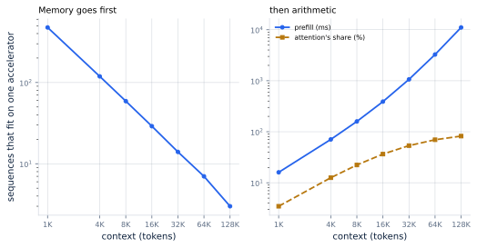
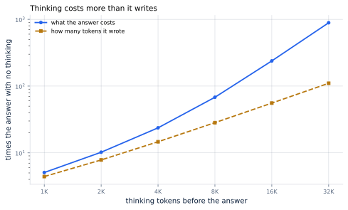
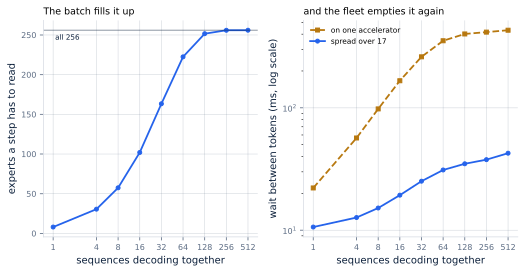

# 33. Long Context, Reasoning, and MoE

*Written to [STANDARDS.md](STANDARDS.md). Generated from
`chapters/ch33.md` and `code/results/ch33.json`; run `make ch33` in
`code/` to re-derive and re-render.*

**Depends on:** Chapter 4,
Chapter 8, Chapter 16,
Chapter 13.
**Tier 0** — a second on a laptop CPU, free.

## Objectives

By the end of this chapter you can:

1. Say what a 128K-token prompt costs, in memory and in time, and
   where each of those becomes the binding constraint.
2. Explain why a reply that thinks costs more than its length
   suggests, and compute how much more.
3. Say what a batch does to a mixture of experts, and why the answer
   is the opposite of what the headline numbers imply.
4. Recognise the one question all three of these are asking, which is
   which term of the decode step is currently the largest.

## Why it matters

Parts I to III built a server for one shape of traffic: a
Chapter 1-sized prompt, a short reply, a dense model
that fits on one accelerator. Three things have happened to that
shape, and each one moves the roofline somewhere else.

The prompts got longer. The replies got very much longer, because the
model now writes to itself before it writes to you. And the models
stopped being dense.

These look like three chapters. They are one, because each is asking
the same question — which term of the decode step is the largest right
now — and each answers it differently.

## A long prompt

A prompt costs memory before it costs anything else.

<!-- include: tables/ch33-context.md -->
| Context | Cache, one sequence | Sequences that fit | Cache share of the step | Between tokens | Prefill | Attention's share of it |
|---|---|---|---|---|---|---|
| 1,024 | 0.13 GB | 476 | 35% | 7.3 ms | 16 ms | 3% |
| 4,096 | 0.54 GB | 119 | 68% | 15.0 ms | 71 ms | 13% |
| 8,192 | 1.07 GB | 59 | 80% | 23.7 ms | 159 ms | 22% |
| 16,384 | 2.15 GB | 29 | 80% | 23.4 ms | 390 ms | 36% |
| 32,768 | 4.29 GB | 14 | 79% | 22.7 ms | 1,064 ms | 53% |
| 65,536 | 8.59 GB | 7 | 79% | 22.7 ms | 3,264 ms | 70% |
| 131,072 | 17.18 GB | 3 | 76% | 20.2 ms | 11,078 ms | 82% |

Arithmetic over the reference model on one accelerator: 16.0 GB of weights leave 64 GB for caches, at 131,072 bytes a token. The batch in the fourth and fifth columns is whatever fits, up to 64. Two crossings worth remembering: one sequence's cache outweighs the entire model at 122,104 tokens, and attention overtakes everything else in a prefill at 28,523.

**Figure 33.1** — Memory goes first, then arithmetic. *Provenance in
`code/figures/ch33-context.caption.txt`.*

At 1K tokens, 476 sequences fit beside the
weights. At 128K, **3**. One sequence's cache
is 17.2 GB, and the accelerator has 64 GB left after the
16.0 GB of weights. There is a crossing worth committing to
memory: **one sequence's cache outweighs the entire model at
122,104 tokens**. Past there, the thing you loaded the
model for is no longer the biggest thing on the card.

The wait between tokens barely moves — 7.3 ms at
1K, 20.2 ms at 128K — and that is not
good news. It is flat because the batch shrank by as much as the cache
per sequence grew. The machine is doing the same work for a
hundredth as many users.

Prefill is where the arithmetic arrives. Attention is quadratic in the
prompt and everything else is linear, so attention's share climbs:
22% of a 8K prefill,
82% of a 128K one. The crossing is at
**28,523 tokens**, where reading the prompt costs
more in attention than in every weight matrix put together. By
128K a single prefill is **11.1 s**, which is
a first-token latency no promise survives and the reason long-context
serving is a chunking problem (Chapter 18) before it is
anything else.

## A long reply

A reply is not a long prompt read backwards. It costs more, for a
reason the token count does not show.

<!-- include: tables/ch33-thinking.md -->
| Thinking tokens | Output | Visible | Sequences that fit | Seconds an answer | Dollars a thousand answers | Against no thinking |
|---|---|---|---|---|---|---|
| 0 | 300 | 100.0% | 325 | 2.5 | $0.035 | 1x |
| 1,024 | 1,324 | 22.7% | 193 | 12.5 | $0.177 | 5x |
| 2,048 | 2,348 | 12.8% | 137 | 25.2 | $0.355 | 10x |
| 4,096 | 4,396 | 6.8% | 87 | 58.4 | $0.824 | 24x |
| 8,192 | 8,492 | 3.5% | 50 | 131.1 | $2.366 | 68x |
| 16,384 | 16,684 | 1.8% | 27 | 247.9 | $8.289 | 238x |
| 32,768 | 33,068 | 0.9% | 14 | 479.2 | $30.902 | 888x |

The same 1,200-token prompt and the same 300-token visible answer, with thinking in front of it. Costs rise faster than the token count because the reply's own cache grows as it is written, so fewer sequences fit and each one has less of the machine to share. Anthropic's documentation puts the floor on a thinking budget at 1,024 tokens and advises batch processing above 32,768, where requests "can hit system timeouts and open-connection limits" -- which the last row's 479 seconds explains.

**Figure 33.2** — Thinking costs more than it writes. *Provenance in
`code/figures/ch33-thinking.caption.txt`.*

The case study's answer is 300 tokens and takes
2.5 s, at $0.035 a thousand. Put
4,096 tokens of thinking in front of it and the reply is
15x as long and **24x as
expensive**. Push to 32,768 and it is
110x as long and **888x as expensive**,
of which 0.9% is the part anybody reads.

The gap between those two multiples is the whole point. A reply's
cache grows as it is written, so a model that thinks for
32,768 tokens is holding a cache that size by the end. The
sequences that fit fall from 325 to 14, and
each one now has a fourteenth of the machine instead of a
three-hundredth. **Length multiplies the work and divides the batch,
and the cost is the product.**

Two consequences that are not obvious from a price list.

**Thinking tokens are output tokens.** Anthropic's documentation says
so plainly, in the field it tells you to watch:
`usage.output_tokens_details.thinking_tokens` "reports how many of the
billed output tokens were internal reasoning". The visible answer is
not what you are buying.

**Long thinking is a different serving regime, not a longer request.**
The same documentation advises batch processing above
32,768 thinking tokens, where requests "can hit system
timeouts and open-connection limits". The last row of that table
explains why: **479 s** for one answer. A synchronous request
that takes eight minutes is not a latency problem to be tuned, it is
a design that needs a queue.

## A model that is mostly asleep

<!-- defines: mixture of experts, routed expert -->

A **mixture of experts** replaces each feed-forward layer with many of
them and sends each token to a few. Each of those is a **routed
expert**, and the arrangement is announced with two numbers:
DeepSeek-V3 is "671B total parameters with 37B
activated for each token", 256 routed experts with
8 chosen per token.

Read the second number and the promise is obvious: a decode step reads
the weights of a 37B model and answers like something much
larger.

That is true of one token.

<!-- include: tables/ch33-mixture.md -->
| Batch | Experts touched | The step reads | Per token | Between tokens, one machine | Over 17 | Network share |
|---|---|---|---|---|---|---|
| 1 | 8 of 256 | 37B | 37.00B | 22 ms | **10.6 ms** | 0% |
| 4 | 31 of 256 | 95B | 23.65B | 57 ms | **12.7 ms** | 0% |
| 8 | 57 of 256 | 163B | 20.42B | 98 ms | **15.2 ms** | 1% |
| 16 | 102 of 256 | 277B | 17.33B | 166 ms | **19.3 ms** | 1% |
| 32 | 163 of 256 | 434B | 13.56B | 261 ms | **25.1 ms** | 2% |
| 64 | 222 of 256 | 585B | 9.14B | 353 ms | **31.1 ms** | 3% |
| 128 | 252 of 256 | 660B | 5.15B | 401 ms | **34.9 ms** | 6% |
| 256 | 256 of 256 | 671B | 2.62B | 416 ms | **37.7 ms** | 11% |
| 512 | 256 of 256 | 671B | 1.31B | 431 ms | **42.6 ms** | 19% |

DeepSeek-V3: 671B total parameters, 37B activated for each token, 256 routed experts with 8 chosen per token (FACTS.md). Each sequence routes independently, so a step reads the union of what the batch chose, and the union fills up. The fifth column is one accelerator, which is hypothetical -- the weights alone are 1,342 GB and need 17 of them. The sixth is the same step with the experts spread across those 17, which is how it is actually served, over NVLink.

**Figure 33.3** — The batch fills it up, and the fleet empties it
again. *Provenance in `code/figures/ch33-mixture.caption.txt`.*

Every sequence routes independently, so a step has to read the
*union* of the experts the batch chose, and a union of random choices
fills up fast. At batch 1 it is 8 experts and
37B of weights. At batch 128 it is
**252 of 256** and **660B** —
which is to say, at a production batch, a mixture of experts reads
almost all of itself.

Two things happen at once and they point opposite ways. Per *token*
the weights get cheaper, from 37.0B to
5.15B, because they are shared over more tokens. Per
*step* they get dearer, and the step is what a user waits through.
Confusing those two is how a mixture gets deployed badly.

### Why it is served on a fleet

<!-- defines: expert parallelism -->

The single-accelerator column of that table is hypothetical and worth
saying so: 1,342 GB of weights in bf16 need
**17 accelerators** before anything is served at all.

That constraint turns out to be the solution. **Expert parallelism**
gives each machine a share of the routed experts, so a step reads the
parts every token needs — attention, embeddings, shared experts,
16.5B of them — plus its own slice of whatever was touched.
The wait between tokens at batch 128 goes from
401 ms on one machine to **34.9 ms** on
17, comfortably inside a 50 ms promise, and
512 sequences still come in at
42.6 ms.

The parallelism that looked like a way round a memory problem is what
makes the batch affordable. It is not an optimisation bolted on
afterwards; it is the only shape in which the arithmetic works.

It does have a price, and it is a network one. Each token's hidden
state has to reach its chosen experts and come back, twice per layer,
which at batch 128 is 6% of the step
over NVLink — and **143 ms** over 100-gigabit Ethernet,
which is four times the whole step. Chapter 19
measured what the links can do; this is the workload that needs the
fastest of them.

## Where this chapter simplifies

**Every number here is arithmetic over published specifications.** No
model was run and no timing was taken. What that buys is that the
results hold on hardware this book cannot rent; what it costs is
everything a real kernel does that a roofline does not model, which is
always in the direction of worse.

**The reference model's attention is the plain kind.** DeepSeek-V3
uses multi-head latent attention, which compresses the cache and would
make its long-context column look considerably better than the one in
the first table. Mixing the two would have made the mixture's numbers
incomparable with the rest of the book, so the cache figures
throughout are the reference model's and the mixture section's
conclusion is about the weight term, which is the term that moves.

**Routing is assumed uniform.** Real routing is skewed, which touches
fewer experts at a small batch and the same number at a large one, so
the curve in Figure 33.3 starts lower and ends in the same place. The
load-balancing machinery in these models exists to push routing
toward uniform, so the assumption is the one the designers are aiming
at.

**Expert parallelism is modelled as a clean split.** A real
deployment has stragglers, imperfect balance and a scheduler between
the all-to-alls, all of which make the parallel column worse. The
replicated part sets a floor it cannot go below, which is the part
the model does capture.

**Thinking length is treated as a knob.** It is not: a model decides
how long to think, and the distribution has a tail. Sizing a fleet
from a mean thinking length is the mistake Chapter 41
warns about in a different costume.

## In production

**Measure your context distribution before buying memory.** Long
context is a memory problem first and an arithmetic problem second,
and the two have different fixes. The table's third column is the one
to compute for your own traffic; if the answer is single digits, no
amount of kernel work helps.

**Chunk long prefills, and expect to.** A 128K prompt is
11.1 s of prefill on one accelerator, which stalls every
other user for that long unless it is split
(Chapter 18). This is the case that chapter was built
for.

**Bill and budget on total output tokens, not visible ones.** A
service whose replies think is buying 110x the tokens
at the top of that table's range. Every capacity plan and every price
in Chapter 42 takes output tokens as its input, and thinking
tokens are output tokens.

**Put long-thinking work on a queue.** Eight minutes is not a request.
Asynchronous or batch APIs exist for exactly this shape, and the
provider documentation says so.

**Do not size a mixture of experts from its activated parameter
count.** That number describes one token. Size it from the weights it
must hold, which is the total, and from the union its batch will
touch, which approaches the total too.

**Buy the interconnect before the accelerators.** A mixture served
across machines moves hidden states on every layer of every step. Over
NVLink that is 6% of the step; over Ethernet it is
several times the whole of it.

## Numbers to remember

- **122,104 tokens** — where one sequence's KV cache
  outweighs the entire model's weights. Past there, the model is not
  the big thing on the card.
- **28,523 tokens** — where attention overtakes
  every weight matrix in a prefill. Quadratic terms wait a long time
  and then arrive all at once.
- **3 sequences** — what fits at 128K context
  on one accelerator, against 476 at 1K.
- **888x** — what 32,768 thinking tokens do
  to the cost of one answer, against 110x the tokens.
  Length multiplies the work and divides the batch.
- **8 experts against 252** — what
  a step reads at batch 1 and at batch 128. A mixture
  of experts is a 37B model for one token and a
  660B model for a batch.
- **401 ms against 34.9 ms** — the same
  step on one accelerator and spread over the 17 its
  weights need anyway.

## Sources

- DeepSeek-AI, "DeepSeek-V3 Technical Report", arXiv:2412.19437 —
  "a strong Mixture-of-Experts (MoE) language model with
  671B total parameters with 37B activated for
  each token", using "Multi-head Latent Attention (MLA) and
  DeepSeekMoE architectures". Its configuration — 256
  routed experts, 8 activated per token, DeepSeek-V3's
  61 layers and 7,168 hidden dimension — is the one priced here.
- Anthropic, "Extended thinking" — the documented floor on a thinking
  budget is 1,024 tokens, "the API rejects smaller
  values"; the billed count is reported in
  `usage.output_tokens_details.thinking_tokens`, "how many of the
  billed output tokens were internal reasoning"; and above
  32,768 tokens it advises batch processing, because
  requests that long "can hit system timeouts and open-connection
  limits".
- Jianlin Su and colleagues, "RoFormer: Enhanced Transformer with
  Rotary Position Embedding", arXiv:2104.09864 — the position
  encoding that made extending a context window a matter of
  interpolation rather than retraining.
- Hao Liu, Matei Zaharia, Pieter Abbeel, "Ring Attention with
  Blockwise Transformers for Near-Infinite Context",
  arXiv:2310.01889 — splitting a single sequence's attention across
  machines, which is what the first table's last row eventually
  forces.

## Exercises

★ Your traffic's 99th-percentile prompt is 30,000 tokens. From the
first table, say which of memory and arithmetic binds first, and what
you would buy.

★ A product manager proposes enabling thinking "since it is only a few
thousand extra tokens". Write the two-sentence reply, with a number
in it.

★★ The mixture's step reads 660B at batch
128. Work out what happens to the fifth and sixth
columns if the model had 256 experts and activated 16
rather than 8, and say which way the design should
move for a server.

★★ At 128K context only 3 sequences fit.
Work out how many fit if the KV cache is quantized to 8 bits
(Chapter 24), and say what that does to
the between-tokens column and why.

★★★ Expert parallelism sends hidden states over the network twice per
layer. Design the measurement that tells you whether your deployment
is bound by the accelerators or by the links, using only metrics a
serving stack already exposes.
