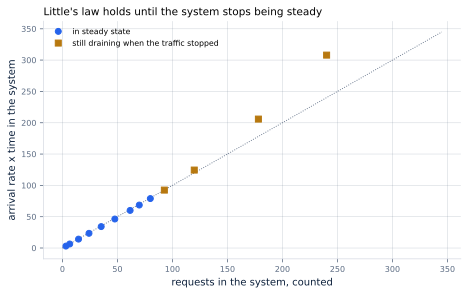
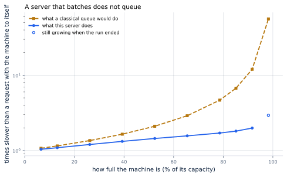
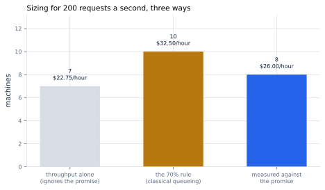

# 41. Capacity Planning

*Written to [STANDARDS.md](STANDARDS.md). Generated from
`chapters/ch41.md` and `code/results/ch41.json`; run `make ch41` in
`code/` to re-derive and re-render.*

**Depends on:** Chapter 5,
Chapter 13, Chapter 17,
Chapter 18.
**Tier 0** — about a minute on a laptop CPU, free.

## Objectives

By the end of this chapter you can:

1. State Little's law, apply it to a serving fleet, and say when it
   stops holding.
2. Measure a machine's capacity and separate it from the load the
   machine can usefully carry.
3. Say why the standard rule about not running servers hot is wrong
   for this workload, with the number by which it is wrong.
4. Size a fleet from a latency promise rather than from throughput or
   from habit.

## Why it matters

Everything so far has been about making a machine faster. This is
about how many of them to buy, and it is the question every other
chapter was in service of.

The naive method is a division: demand over capacity. The case study
wants 200 requests a second, one machine manages
30.5, so buy 7. That answer is
wrong, and the interesting part is *why* it is wrong and by how much —
because the standard correction for it is also wrong, in the opposite
direction and by more.

A machine at its capacity has no room left. Requests arrive in bursts,
and a machine with nothing in hand turns a burst into a queue, and a
queue into a broken promise. So everyone leaves headroom. The question
is how much, and the textbook answer — which this chapter will
measure and reject — is a lot.

## What a machine can do

First, capacity, measured rather than assumed. Offer a machine more
and more traffic and watch what comes out.

<!-- include: tables/ch41-load.md -->
| Requests a second | Of capacity | In the system | End to end, mean | p99 | TTFT p99 | Between tokens, p99 | Tokens/s | Moves by |
|---|---|---|---|---|---|---|---|---|
| **2** | 7% | 3 | 1.53 s | 5.24 s | 68 ms | 7.9 ms | 607 | 3% |
| **4** | 13% | 7 | 1.60 s | 5.50 s | 74 ms | 8.1 ms | 1,213 | 3% |
| **8** | 26% | 15 | 1.77 s | 6.10 s | 83 ms | 8.3 ms | 2,428 | 3% |
| **12** | 39% | 24 | 1.94 s | 6.70 s | 95 ms | 8.3 ms | 3,643 | 3% |
| **16** | 52% | 35 | 2.12 s | 7.31 s | 112 ms | 8.4 ms | 4,856 | 3% |
| **20** | 65% | 47 | 2.30 s | 7.90 s | 141 ms | 8.7 ms | 6,069 | 3% |
| **24** | 79% | 62 | 2.51 s | 8.60 s | 256 ms | 9.6 ms | 7,279 | 3% |
| **26** | 85% | 71 | 2.66 s | 9.06 s | 469 ms | 10.0 ms | 7,880 | 3% |
| 28 * | 92% | 84 | 2.92 s | 9.72 s | 1,368 ms | 10.3 ms | 8,480 | 4% |
| 30 + | 98% | 131 | 4.31 s | 11.83 s | 3,441 ms | 10.6 ms | 9,049 | 32% |
| 32 + | 105% | 378 | 12.29 s | 23.21 s | 16,239 ms | 10.6 ms | 9,114 | 91% |
| 36 + | 118% | 1105 | 35.81 s | 56.94 s | 51,868 ms | 10.6 ms | 9,146 | 101% |
| 40 + | 131% | 1705 | 55.21 s | 85.59 s | 81,021 ms | 10.6 ms | 9,164 | 102% |

One machine, seed 0. Every rate was run twice, at 6,000 requests and at 12,000; the columns are the longer run and "moves by" is how far the furthest of the mean, the p99 and the throughput shifted between the two. Bold rows keep both of the case study's promises -- 1,000 ms to a first token and 50 ms between tokens, at the 99th percentile. Rows marked * break at least one. Rows marked + never settled: their latencies grew with the length of the run, so they are numbers about the benchmark and not about the machine. Capacity is 9,164 tokens a second, which at 300 tokens a reply is 30.5 requests a second, and "of capacity" is measured against that.

Throughput rises with offered load and then stops: **9,164
tokens a second**, which at 300 tokens a reply is
30.5 requests a second. Past that the machine
produces no more, and the extra arrivals simply accumulate.

Notice what *does not* happen in the bold rows. There is no cliff:
from 2 requests a second to 26 — 85% of
capacity — the end-to-end p99 goes from 5.24 s to 9.06 s,
and what lies between them is a slope, not a step. Hold that thought;
it is the chapter's finding.

### A number that does not exist

Before the finding, the last column, because it is the reason the rest
of the table can be believed.

Every rate was run twice: once over 6,000 requests and once
over 12,000. The column is how far the furthest of the
mean, the p99 and the throughput moved between the two runs. Up to
28 requests a second it moves by 4% or
less. From 30 it does not: at 40 a second
the p99 is 42 s over the shorter run and
86 s over the longer one. It doubled because the run
doubled.

That is not noise and it is not a bug in the scheduler. Past capacity
the backlog grows for as long as traffic keeps arriving, so there is
no steady-state latency for a benchmark to find; whatever number it
prints is a statement about how long it ran. The same trap works the
other way below capacity, where a run too short for the queue to fill
reports a tail that is too *good* — which is the more dangerous of the
two, because the number it gives you is the one you will sell.

Neither case announces itself. Both produce a clean-looking
percentile. The only cheap test is the one in that column: run it
again for longer and see whether the answer moves.
`harness.steady_state` does that for every load in this chapter, and a
load whose numbers are still moving is reported as unsettled rather
than quoted — including in Figure 41.2, where it is drawn hollow.

## Little's law

Before the finding, a tool. For any system in a steady state:

    the number of things inside it = the rate they arrive x the time each spends inside

That is **Little's law**, and its remarkable property is how little it
assumes. Not exponential arrivals, not one server or many, not a
queueing discipline, not a distribution of service times. Little's own
statement of it requires only that the means are finite and that the
processes are "strictly stationary" — that the system is in a steady
state. Everything else is free.
<!-- defines: Little's law -->

It is worth checking anyway, because a server that batches looks
nothing like the queues the law is usually taught with. Here both
sides are measured independently — the population by counting requests
in flight at 13 offered loads, the right-hand side from arrival
rate and mean time — and compared:

**Figure 41.1** — Both sides of Little's law, measured separately.
*Provenance in `code/figures/ch41-little.caption.txt`.*

It holds to **3.5%** at every load where the server is in
a steady state, and stops holding — by 30% — from
30 requests a second, which is exactly the load at
which the sweep says nothing settles any more. The law did
not fail; the one thing it asks for, stationarity, did. That makes it a useful alarm as well
as a useful tool: **if L and λW disagree, your system is not in a
steady state, whatever your dashboard says.**

The practical use is that it turns one unknown into another. Measure
any two of arrivals, in-flight requests and latency, and you have the
third. A fleet holding 71 requests at 26 a
second is, by the law alone, giving each of them a **mean** of
2.72 s; measured directly it is 2.66 s. If those two
disagree, one of them is measuring something other than you think.

Note the word *mean*. Little's law says nothing whatever about the
distribution, and the tail is what
Chapter 5 showed a promise is made of: at
the same load the p99 is 9.06 s, which is not a number any
amount of algebra will give you. The law tells you where the average
is; only measurement tells you where the tail is.

## Why the usual rule is wrong here

Now the finding.

Classical queueing theory gives a sharp result for a single server
handling one request at a time: the time a request spends in the
system grows as **1 / (1 − utilization)**. At half capacity it is
twice the service time. At 90% it is ten times. At 99%, a hundred.

That expression is the reason for every rule of thumb about keeping
servers under 70% — past there, the curve turns vertical and small
increases in load produce large increases in latency. It is sound
advice for a web server.

It is wrong for this one, and not by a little:

<!-- include: tables/ch41-theory.md -->
| Of capacity | What this server does | What a classical queue would do | Over-predicted by |
|---|---|---|---|
| 7% | 1.04x | 1.07x | **1.0x** |
| 13% | 1.09x | 1.15x | **1.1x** |
| 26% | 1.20x | 1.35x | **1.1x** |
| 39% | 1.32x | 1.65x | **1.2x** |
| 52% | 1.45x | 2.10x | **1.5x** |
| 65% | 1.57x | 2.90x | **1.8x** |
| 79% | 1.71x | 4.67x | **2.7x** |
| 85% | 1.81x | 6.72x | **3.7x** |
| 92% | 1.99x | 12.00x | **6.0x** |
| 98% | 2.94x | 56.04x | **19.1x** |
| 105% | 8.36x | over capacity | -- |
| 118% | 24.36x | over capacity | -- |
| 131% | 37.57x | over capacity | -- |

Slowdown is time in the system divided by 1.47 s, which is what one request takes with the machine to itself. The classical column is 1 / (1 - utilization), the standard result for a single-server queue and the arithmetic behind every rule of thumb about not running servers hot. It does not describe this server, and the last column is how much hardware believing it would buy.

**Figure 41.2** — What the textbook predicts, and what the server
does.
*Provenance in `code/figures/ch41-utilization.caption.txt`.*

At 92% of capacity the classical model predicts
12.0x the service time. The server delivers
**1.99x** — an over-prediction of 6.0x. At
92% it predicts 12x and the server delivers
1.99x: over by 6.0x.

### Because it does not queue

The reason is in the mechanism, and it was built in
Chapter 17.

A classical queue has requests waiting in line for a server that
handles one at a time. The second in line waits for the first to
finish entirely. That serial waiting is what produces
1 / (1 − ρ): as the server gets busier, the line gets longer, and the
wait is the length of the line times the service time.

This server has no line. A request that arrives joins the batch —
Chapter 17 admits it at the very next iteration — and
from then on *every* sequence in the batch advances together, one
token each per step. Load does not make a request wait for others to
finish. It makes every step slightly slower, because the batch is
bigger and each step reads a little more KV cache
(Chapter 13).

**Serial waiting compounds; shared slowdown does not.** A queue at 90%
utilization has nine requests ahead of you. A batch at 90% utilization
has you in it, moving, slightly slower than you would be alone.

That is why the measured curve is nearly a straight line where the
classical one turns vertical, and it is the single most useful thing
in this chapter: **an LLM server can be run hot.**

### Where the cliff actually is

It does not run hot for free, and the limit is not the one classical
theory points at. Two things end the graceful regime:

**Memory.** A bigger batch needs more KV cache, and when the pool runs
out the scheduler starts preempting (Chapter 17).
Preemption *is* serial waiting — an evicted sequence goes back and
starts again — so the classical shape returns the moment memory binds.
Chapter 18 measured what that costs.

**The promise between tokens.** A bigger batch makes every step
slower, and the gap between tokens is that step. Throughput can still
be rising while the gap has already broken the promise, and the table
above shows both columns so the two can be told apart.

Neither limit is utilization. Both are measurable, and neither can be
predicted from a rule of thumb.

## Sizing the fleet

So: how many machines for 200 requests a second?

<!-- include: tables/ch41-sizing.md -->
| How it was sized | Load a machine | Machines | Cost an hour |
|---|---|---|---|
| Throughput alone, ignoring the promise | 30.5 req/s | 7 | $22.75 |
| The 70% rule from classical queueing | 21.4 req/s | 10 | $32.50 |
| **The load at which the promise still holds** | **26.0 req/s** | **8** | **$26.00** |

For 200 requests a second. The promise holds up to 26 requests a machine, which is 85% of what the machine can do -- far past where the classical rule would stop. Sizing on throughput alone meets no promise at all; sizing on the rule of thumb buys machines the measurement says are not needed.

**Figure 41.3** — The same demand, sized three ways.
*Provenance in `code/figures/ch41-sizing.caption.txt`.*

- **Throughput alone** gives 7 machines, each at
  100% of capacity. It meets no promise; at that load the machine is
  not finishing its work.
- **The 70% rule** gives 10. It is safe, and it is
  2 machines more than the measurement calls for.
- **The promise itself** gives 8. Both promises
  hold up to 26 requests a machine — 85% of
  capacity — with a first token at 469 ms and
  10.0 ms between tokens, at the 99th percentile.

$6.50 an hour is not the point. The point is that the rule of
thumb and the measurement disagree, and only one of them was derived
from this workload.

> **An aside worth noticing.** Design decision record I sized this same
> service at 8 machines, by an entirely different
> route: sweeping fleet sizes in the multi-machine simulator of
> Chapter 19 until one kept up. Two
> independent measurements, the same answer. That is the kind of
> agreement that should make you more willing to believe both — and
> its absence, in a real capacity plan, is the signal to go looking
> for which of the two is wrong.

## Where it breaks

**One machine's capacity is not a fleet's.** Everything above measures
one machine and divides. A real fleet has a load balancer that does
not distribute perfectly, machines that fail, and a deployment process
that takes some out of service on purpose. Every one of those wants
headroom that this chapter has not counted.

**The traffic is stationary and the world is not.** These arrivals are
a Poisson process at a fixed rate. Real traffic is diurnal — the case
study says so — and the peak is what a fleet is sized for while the
trough is what it is billed for. Chapter 42 takes that up.

**Capacity depends on the shape of the traffic, not just its volume.**
Every request here has the same distribution of prompt and output
lengths. A shift toward longer prompts moves the prefill work and the
memory both, and the capacity number moves with it. Re-measure when
the traffic changes, and treat any single capacity figure as attached
to the traffic it was measured on.

**It is a simulation.** The scheduler is the one Part III built and
the step costs are arithmetic over the reference model, not a timing
run. What that gets right is the *shape* — Little's law, the
divergence from the classical curve, where the promise breaks. The
absolute capacity of a real machine running a real engine has to be
measured on it.

## In production

**Measure capacity, do not derive it.** Offer a machine increasing
load until throughput stops rising, and write down both that number
and the load at which the promise breaks. They are different numbers
and the second one is the one you plan with.

**Plan against the promise, not against utilization.** "Keep it under
70%" is advice from a different kind of system. The right question is
the load at which the p99 you sold stops holding, and that has to be
measured.

**Watch Little's law as an alarm.** Arrivals, in-flight requests and
latency are all things a serving stack already reports. When
λW stops matching L, the system has left its steady state — which is
usually the first measurable sign of trouble, and earlier than the
latency alert.

**Size on the peak and pay for the trough.** A fleet sized for
200 requests a second at the busy hour is idle at four in the
morning, and Chapter 42 is about what to do with that.

## Numbers to remember

- **L = λW** — Little's law. Holds to 3.5% on this
  server, assumes only a steady state, and its failure is a useful
  alarm.
- **30.5 requests a second** — one machine's capacity
  for the case study's traffic, 9,164 tokens a second.
- **6.0x** — how much the classical 1 / (1 − ρ) over-predicts
  the slowdown at 92% of capacity. It predicts
  12.0x; the server does 1.99x.
- **85%** — the utilization at which this server still keeps
  both promises. A batching server can be run hot.
- **8 machines** for 200 requests a second,
  $26.00 an hour, against 10 if you believe
  the rule of thumb.

## Sources

- John D. C. Little, "A Proof for the Queuing Formula: L = λW",
  *Operations Research* 9(3), 1961, pp. 383-387 — the result. The
  abstract states the conditions exactly: "if the three means are
  finite and the corresponding stochastic processes strictly
  stationary, and, if the arrival process is metrically transitive
  with nonzero mean, then L = λW". Stationarity is the assumption
  Figure 41.1 shows breaking.
- Mor Harchol-Balter, *Performance Modeling and Design of Computer
  Systems*, Cambridge University Press, 2013 — the queueing theory
  this chapter uses and the part of it that does not apply here.
- Betsy Beyer, Chris Jones, Jennifer Petoff, Niall Richard Murphy
  (eds.), *Site Reliability Engineering*, O'Reilly, 2016, chapter 22
  ("Addressing Cascading Failures") — what happens past the right-hand
  edge of Figure 41.2, and why the graceful degradation measured here
  should not be relied on beyond the range it was measured over.

## Exercises

★ A fleet reports 4,000 requests a second and 12,000 requests in
flight. What is the average time a request spends in the system? Which
law did you use and what does it assume?

★ Using the load table, find the highest rate at which the machine
keeps the between-token promise but *not* the first-token promise, and
say which one you would relax if you had to.

★★ The chapter sizes the fleet at 8 machines for a
peak of 200 requests a second. Suppose the traffic has a
peak-to-trough ratio of 4. How many machine-hours a day does the fleet
cost, and how many are actually used? Keep the answer for
Chapter 42.

★★ Add a rate to `RATES` in `bench/run_ch41.py` between the last two
and predict, before running, whether Little's law will hold there.
Explain your prediction in terms of the drain ratio.

★★★ The classical curve in Figure 41.2 assumes one request served at a
time. Derive the corresponding expression for a server that serves all
requests simultaneously at a rate that falls with the number in the
batch, using the step cost of Chapter 16. Compare it with the
measured curve and say where the remaining gap comes from.
