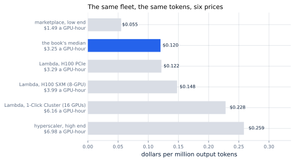
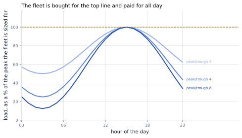
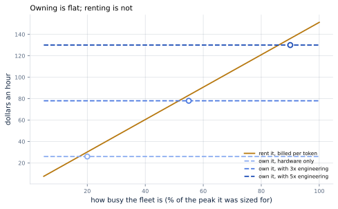

# 42. GPU FinOps

*Written to [STANDARDS.md](STANDARDS.md). Generated from
`chapters/ch42.md` and `code/results/ch42.json`; run `make ch42` in
`code/` to re-derive and re-render.*

**Depends on:** Chapter 41, Chapter 1,
Chapter 5.
**Tier 0** — instant, free. Arithmetic over published prices.

## Objectives

By the end of this chapter you can:

1. Compute cost per million tokens from a fleet size and a price, and
   say which of the two moves it more.
2. Explain why a fleet's bill is set by its quietest hour, not its
   busiest.
3. Decide whether to serve a model yourself or pay per token, and
   state the utilization at which the answer changes.
4. Recognise the pricing structures that do not do what their names
   suggest.

## Why it matters

Chapter 41 sized the fleet: 8 machines for
200 requests a second. This chapter asks what that costs, and
then the only question a business actually has — whether to do it at
all.

The arithmetic is short. 8 machines at $3.25 an hour
is $26.00 an hour, $18,980 a month. At the peak they
were sized for, the fleet produces 60,000 output tokens a
second, so each million costs **$0.120**.

Three things are wrong with that number, and the chapter is about all
three. It assumes a price, when prices differ by more than most of
this book's optimisations. It assumes the fleet is always at its peak,
when it never is. And it is the cost of *producing* tokens, which is
not the same as the cost of *having* them.

## The price is a bigger lever than the engineering

Start with the one nobody mentions.

<!-- include: tables/ch42-prices.md -->
| Where you rent it | A GPU-hour | The fleet, an hour | A month | Per million output tokens |
|---|---|---|---|---|
| marketplace, low end | $1.49 | $11.92 | $8,702 | $0.055 |
| **the book's median** | $3.25 | $26.00 | $18,980 | $0.120 |
| Lambda, H100 PCIe | $3.29 | $26.32 | $19,214 | $0.122 |
| Lambda, H100 SXM (8-GPU) | $3.99 | $31.92 | $23,302 | $0.148 |
| Lambda, 1-Click Cluster (16 GPUs) | $6.16 | $49.28 | $35,974 | $0.228 |
| hyperscaler, high end | $6.98 | $55.84 | $40,763 | $0.259 |

8 machines serving 60,000 output tokens a second, which is the fleet Chapter 41 sized and the peak it was sized for. The spread from cheapest to dearest is 4.7x, for identical hardware doing identical work. Named prices are from each provider's own page on the date in FACTS.md; the bold row is the cross-provider median the rest of this book uses.

**Figure 42.1** — Identical hardware, identical work, six invoices.
*Provenance in `code/figures/ch42-price-spread.caption.txt`.*

The same fleet doing the same work costs between
$0.055 and $0.259 per million tokens —
a factor of **4.7x** — with nothing changed but where it
is rented.

Put that next to the rest of the book. Chapter 15 was worth
a large fraction of prefill; Chapter 20 took a chunk out
of attention's memory traffic; Chapter 24
halved the weights. All of them are real, and all of them are smaller
than the difference between two invoices for the same GPU.

This is not an argument against the engineering. It is an argument for
doing the procurement *first*, because it is a week of somebody's time
and it moves the number more than a quarter of tuning.

## The bill is set by the quiet hours

The second correction is larger.

A fleet is sized for the peak — Chapter 41 sized this
one for the busy hour — and rented for all twenty-four. The case study
says the traffic is diurnal, and a diurnal day spends most of itself
below its peak.

**Figure 42.2** — The gap between the curve and the dashed line is
rented and idle.
*Provenance in `code/figures/ch42-duty.caption.txt`.*

<!-- include: tables/ch42-duty.md -->
| Peak to trough | Average load, as a share of peak | Hours a day above 80% | What that does to the cost a token |
|---|---|---|---|
| 1:1 | 100% | 24 | $0.120 per million |
| 2:1 | 75% | 11 | $0.160 per million |
| 3:1 | 67% | 9 | $0.181 per million |
| 4:1 | 62% | 9 | $0.193 per million |
| 6:1 | 58% | 7 | $0.206 per million |
| 8:1 | 56% | 7 | $0.214 per million |

A day shaped as a sine between its trough and its peak. The fleet is sized for the peak and paid for every hour, so the cost of a token is the full-tilt cost divided by the average load. Even a gentle two-to-one day adds a third to the cost of every token; a working-hours service with a quiet night adds more.

Even a gentle two-to-one day averages 75% of peak, which
takes the cost of a million tokens from $0.120 to
$0.160. A 8-to-one day — a working-hours service
with a quiet night, which is most business software — averages
56% and costs $0.214.

**Utilization is the whole game.** Every technique in this book makes
a machine produce more tokens an hour; the duty cycle decides how many
of those hours anyone pays for. A team that doubles throughput and
leaves the fleet idle two-thirds of the day has not halved its cost
per token.

What to do about it is a short list and none of it is inference
engineering: autoscale on a signal that leads demand, move batch work
into the troughs, sell the spare capacity, or buy less and let the
peak degrade. Chapter 41's finding helps here — a
batching server degrades gently, so running the peak slightly hot
costs less than it would on a system that queued.

## Own it or rent it

Now the real question. Somebody else will sell these tokens by the
million. Should you make them at all?

The comparison has a trap in it, and it is worth naming before the
numbers. It is natural to compare the cost of producing an output
token against the price of an output token. That is wrong, because a
provider charges for the prompt as well, and this service sends
**4x as many tokens in as it takes out** —
1,200 of prompt against 300 of reply. Leave
the prompt out and you understate the alternative by most of its cost.

Compared properly — dollars an hour for the same traffic, both
directions counted:

<!-- include: tables/ch42-own-or-rent.md -->
| What you count | Owning, an hour | Breaks even at | Billed tokens a day there |
|---|---|---|---|
| hardware only | $26.00 | **20%** of peak | 5,184M |
| with 3x engineering | $78.00 | **55%** of peak | 14,256M |
| with 5x engineering | $130.00 | **90%** of peak | 23,328M |

Against Llama 3 8B Instruct Lite, Together at $0.14 per million output tokens and $0.14 per million input. Both sides are dollars an hour for the same traffic, which is the only comparison that holds when one is billed per token and the other per machine-hour. This service sends 4 times as many tokens in as it takes out -- 1,200 of prompt against 300 of reply -- and a provider charges for both, which is why comparing on output alone gets the answer wrong.

**Figure 42.3** — Renting rises with use. Owning does not.
*Provenance in `code/figures/ch42-own-or-rent.caption.txt`.*

At the peak, owning the fleet costs $26.00 an hour and renting
the same traffic costs $151.20 — **5.8x**. Serving it
yourself wins, and wins comfortably.

But look at the shape rather than the ratio. **Renting is a line
through the origin; owning is a flat line.** You pay for tokens you
produce, or you pay for machines whether or not they produce
anything. So the answer is not a property of the workload; it is a
property of the duty cycle:

- Counting **hardware only**, owning pays from 20% of
  peak — about 5,184M billed tokens a day.
- Counting **engineering at three times the hardware**, from
  55%.
- At **five times**, from 90%, which is a utilization
  most services never see.

That last row is the one to take seriously. The hardware is the part
of self-hosting that is easy to count and the smallest part of the
bill. A serving stack needs people who understand every chapter of
this book, on call, indefinitely. If the fleet is small, those people
cost more than the machines, and the break-even moves to a utilization
that a diurnal service cannot reach.

**The rule that falls out:** serve it yourself when the traffic is
large, steady, and already has a team. Rent it when it is small,
spiky, or new. And notice that the second case is every service at the
start of its life, which is why "start on an API and move when the
bill hurts" is both the common advice and the right one.

## What the pricing structures actually do

Three of them are not what their names suggest.

**A committed cluster is not a volume discount.** At the provider
priced above, on-demand H100s are $3.99 a GPU-hour
and a committed cluster of sixteen is $6.16 — 
**1.54x more expensive**, for a two-week to
one-year commitment. The cluster is a different product: dedicated,
interconnected machines that can train across all of them, which is
worth paying for if you need it and money thrown away if you do not.
Read what a commitment buys before assuming it is a discount.

**Spot capacity may not exist.** The same provider publishes no spot
price at all. Interruptible capacity is a hyperscaler idea and it is
not universal, and a plan that assumes 60%-off preemptible GPUs should
check that the provider sells them.

**A reserved price is often not published.** "Contact us for reserved
capacity at our lowest prices" is the whole of what that provider
says. Any plan built on an assumed reserved discount is built on a
number somebody will have to negotiate.

## Where it breaks

**Prices move faster than this book does.** Every figure here is
recorded in `FACTS.md` with the page it came from and the date. They
will be wrong. What should survive is the method and the shape of the
curves — which is why every figure is swept over price and
utilization rather than stated at one of them.

**The engineering multiple is a range, not a number.** Three to five
times the hardware is what the industry reports; it is not something
this book measured, and for a team that already runs the stack the
marginal cost of one more model is far lower than either figure. Put
your own number in.

**Cost is not the only axis.** Latency you control, data that does not
leave your network, no rate limits, a model nobody can deprecate under
you — none of those appear in any table here, and any of them can
decide the question on its own. This chapter prices one axis
precisely and says nothing about the others.

**One model, one traffic shape.** The whole comparison turns on the
ratio of prompt to reply, and a service with short prompts and long
replies gets a different answer — possibly the opposite one. Put your
own token counts in before concluding anything.

**And the fleet behind it is a simulation.** Chapter 41
sized it with the scheduler Part III built, over a cost model rather
than a timing run. The cost arithmetic here is exact; the fleet size
it operates on carries that chapter's caveats.

**One small inconsistency, stated rather than smoothed over.** Part
III's design decision record puts the same fleet at $0.126 per million
output tokens against this chapter's $0.120 — five per cent
apart. The record divided the cost by the tokens the fleet was
*measured* delivering in a sampling window; this chapter divides by
the tokens the service is *asked* for. Neither is wrong and the gap is
the sampling. It is left visible because a book that quietly
reconciled two numbers would be hiding exactly the kind of thing a
reader should go looking for in their own figures.

## In production

**Shop before you tune.** 4.7x is available from
procurement, for a week of somebody's time. Only one technique in this
book beats it outright — the KV cache of Chapter 12, which is
not optional — and everything after it is smaller.

**Report cost per million tokens, not GPU utilization.** Utilization
is an input; cost per token is the thing the business pays, and it is
the only number that moves for the right reasons.

**Measure the duty cycle before sizing anything.** A peak-to-trough
ratio is a one-line query against traffic you already have, and it
changes the cost per token more than the fleet size does.

**Recheck the own-or-rent decision when any of its three inputs
move** — the price of a GPU-hour, the price of a token, or your own
utilization. It is not a decision made once.

## Numbers to remember

- **$0.120 per million output tokens** — the case study's
  fleet at full tilt, $26.00 an hour for 8
  machines. At a 8:1 diurnal day it is $0.214.
- **4.7x** — the spread in cost per token between the
  cheapest and dearest published price for the same accelerator.
- **5.8x** — how much cheaper owning is than renting at the
  peak, once input tokens are counted on both sides.
- **20% and 90%** — the utilization at which
  owning starts to pay, counting hardware alone and counting
  engineering at five times the hardware.
- **1.54x more expensive** — what a committed
  cluster costs against on-demand at one provider that publishes both.
  Commitments are not automatically discounts.

## Sources

- Lambda, *GPU Cloud Pricing* — the on-demand and cluster prices
  quoted above, taken from the provider's own page on the date in
  `FACTS.md`, including the 1-Click Cluster rates that exceed the
  on-demand ones and the absence of any spot price.
- Together AI, *Pricing* — the per-token prices for
  Llama 3 8B Instruct Lite, Together, $0.14 per million output tokens and
  $0.14 per million input, likewise from the provider's page.
- Chapter 41 — the fleet this chapter prices, and the
  measurement behind its size.

## Exercises

★ A service sends 200 tokens of prompt and gets 800 back — the
opposite of the case study. Recompute the own-or-rent comparison at
the peak and say which way it goes.

★ Your fleet runs at 35% average utilization. Using the duty-cycle
table's method, what does a million tokens cost, and what would
halving the fleet do to it?

★★ The break-even in Figure 42.3 is a utilization. Rewrite it as a
volume in tokens a day, and explain why the two are not the same
statement.

★★ Add a price to `PRICES` in `bench/run_ch42.py` from a provider you
can actually buy from today, re-run `make ch42`, and say where it
lands in Figure 42.1.

★★★ This chapter prices one model on one traffic shape. Build the
break-even surface over prompt-to-reply ratio and utilization, find
the region where renting wins, and describe in one sentence what kind
of product lives there.
