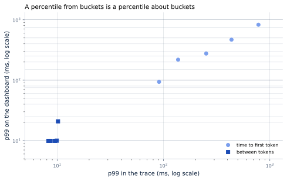
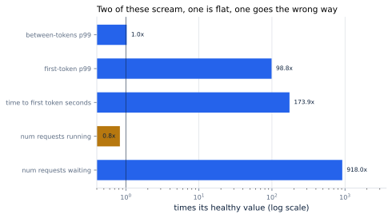
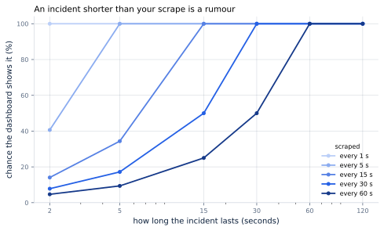

# 43. Observability

*Written to [STANDARDS.md](STANDARDS.md). Generated from
`chapters/ch43.md` and `code/results/ch43.json`; run `make ch43` in
`code/` to re-derive and re-render.*

**Depends on:** Chapter 5,
Chapter 9, Chapter 41.
**Tier 0** — half a minute on a laptop CPU, free.

## Objectives

By the end of this chapter you can:

1. Say how far the percentile on your dashboard is from the percentile
   in your service, and why.
2. Write an alert on a latency promise that is exactly right rather
   than approximately wrong.
3. Choose which signals to watch during a memory incident, having seen
   which ones move and which do not.
4. Say what a scrape interval and a label each cost you.

## Why it matters

Every measurement in this book so far has been taken directly: run the
thing, record the numbers, compute the answer. A running service
cannot do that. It exports counters and histograms, something scrapes
them every so often, a query turns what survives into a line on a
screen, and somebody is paged off the result.

Each of those steps throws information away, and the losses are not
random. They are largest exactly where a promise is written, during
exactly the incidents you built the dashboard for.

This chapter takes the scheduler Part III built, exports it the way a
production engine exports itself, and measures the difference between
what happened and what the dashboard said.

## The percentile on the screen is not the percentile

A Prometheus histogram does not keep your samples. It keeps a count
per bucket — how many were at or below one second, how many at or
below two and a half — and the samples themselves are gone. A query
for the 99th percentile finds the bucket the rank falls in and
interpolates linearly inside it, assuming the samples are spread
evenly through that bucket.

They are not.

<!-- include: tables/ch43-dashboards.md -->
| Requests a second | Metric | p99 in the trace | p99 on the dashboard | Off by | The bucket it landed in |
|---|---|---|---|---|---|
| 12 | time to first token | 90.9 ms | 93.8 ms | +3.2% | 80-100 ms |
| 12 | between tokens | 8.3 ms | 9.9 ms | +19.7% | 0-10 ms |
| 20 | time to first token | 137.2 ms | 218.4 ms | +59.1% | 100-250 ms |
| 20 | between tokens | 8.7 ms | 9.9 ms | +14.1% | 0-10 ms |
| 24 | time to first token | 252.0 ms | 276.1 ms | +9.6% | 250-500 ms |
| 24 | between tokens | 9.5 ms | 9.9 ms | +3.9% | 0-10 ms |
| 26 | time to first token | 436.3 ms | 468.2 ms | +7.3% | 250-500 ms |
| 26 | between tokens | 9.9 ms | 10.0 ms | +0.6% | 0-10 ms |
| 28 | time to first token | 781.5 ms | 827.6 ms | +5.9% | 750-1,000 ms |
| 28 | between tokens | 10.2 ms | 20.8 ms | +104.5% | 10-25 ms |

The scheduler of Chapter 18 at five offered loads, 6,000 requests each, seed 0. The "trace" column is the percentile of the samples themselves; the "dashboard" column is what Prometheus' `histogram_quantile` returns from the counts, using vLLM's own default bucket boundaries (FACTS.md). The error is the width of whichever bucket the percentile landed in: the between-tokens promise of 50 ms sits in a bucket running 25 to 50 ms, and the first-token promise of 1 s in one running 0.75 to 1.00 s.



**Figure 43.1** — A percentile from buckets is a percentile about
buckets. *Provenance in `code/figures/ch43-dashboard.caption.txt`.*

Every point sits above the line. At the fleet's operating load the
first-token p99 is 436 ms and the dashboard says
468 ms, which is close enough. The worst case measured is
not: between tokens at 28 requests a second is
10.2 ms in the trace and **20.8 ms** on the screen,
+105%.

The size of the error has nothing to do with the load and everything
to do with which bucket the answer lands in. vLLM's between-tokens
histogram has 19 buckets, and the one the case study's
latencies live in runs from 10 to 25 milliseconds. A percentile
interpolated inside a bucket two and a half times as wide as the value
is not a measurement of the value.

### What to do about it

Not "use more buckets", which costs cardinality and moves the problem.
The fix is to stop asking the question the histogram is bad at.

A promise is a threshold, and a histogram's *counts* are exact. The
case study promises 50 ms between tokens, and vLLM's buckets
happen to include an edge at exactly that: the bucket containing the
promise runs 25-50 ms. So the number of samples at or
below 50 ms is known precisely, and so is the share:

```
sum(rate(vllm:inter_token_latency_seconds_bucket{le="0.05"}[5m]))
/ sum(rate(vllm:inter_token_latency_seconds_count[5m]))
```

That is the fraction of tokens inside the promise, exactly, with no
interpolation anywhere. Alert on it going below 0.99 and you have
alerted on the promise. The first-token promise of 1 s
sits on an edge too — its bucket is 0.75-1.00 s — so the
same query works there.

**Choose your promise to land on a bucket edge, or add an edge where
your promise is.** A threshold that falls in the middle of a bucket
cannot be alerted on precisely at all, and that is a thing to discover
while writing the SLO rather than during the incident.

## Which signals move

The second thing a dashboard has to do is tell you something is wrong.
Here is the same traffic with the block pool cut to 6% of
what Chapter 41 sized — 3.8 GB, which is what a
leak, a noisy neighbour, or a rollout with the wrong flag looks like
from inside the server.

<!-- include: tables/ch43-detection.md -->
| Signal | Healthy | With the fault | Moved by |
|---|---|---|---|
| `vllm:num_requests_waiting` | 1.00 | 918.00 | 918.0x |
| `vllm:num_requests_running` | 64.00 | 53.00 | 0.8x |
| `vllm:time_to_first_token_seconds` | 0.21 | 36.24 | 173.9x |
| `vllm:num_preemptions` | 0 | 1,653 | -- |
| first-token p99 (ms) | 436 | 43,128 | 98.8x |
| between-tokens p99 (ms) | 9.9 | 10.2 | 1.0x |

The same traffic at 26 requests a second, once with the block pool Chapter 41 sized (30,515 blocks) and once with it cut to 6% of that (3.8 GB), which is what a leak, a noisy neighbour or a bad rollout looks like from inside the server. Read the second row twice: the number of requests *running* goes **down**. A dashboard showing it looks calmer during the incident than before it.



**Figure 43.2** — Two of these scream, one is flat, one goes the wrong
way. *Provenance in `code/figures/ch43-detection.caption.txt`.*

Read the four rows in order, because they are four different lessons.

**`num_requests_waiting` goes from 1 to
918.** A factor of 918x. This is the
signal. It is a gauge, it is free, and it is the first thing to put on
a dashboard.

**`num_requests_running` goes from 64 *down* to
53.** The server is preempting: sequences are being
thrown out to make room, so fewer are running than before. A dashboard
built around batch size or requests-in-flight shows a **calmer**
picture during the incident than before it. If your alert is "running
requests above N", it will never fire.

**The first-token p99 goes from 436 ms to 43 s**
— 99x. This is the user-visible damage, and it is a
consequence rather than a cause: by the time it moves, the queue has
already been building.

**The between-tokens p99 goes from 9.9 ms to
10.2 ms.** 1.0x. It does not move. The requests that
are decoding are decoding fine; it is the ones that are not decoding
that are the problem, and a metric over gaps between tokens never sees
a sequence that is not producing any. **A service can be completely
broken with its between-tokens promise perfectly intact.**

And `num_preemptions` goes from 0 to
1,653. It was exactly zero before. A counter that is
normally zero and is not zero is the easiest alert anybody ever
writes, and this one is a leading indicator of every memory problem in
Chapter 18.

## What a scrape interval costs

A gauge is read, not accumulated. Whatever it was at the instant of
the scrape is the whole of what is recorded, and anything between
scrapes did not happen as far as the dashboard is concerned.



**Figure 43.3** — An incident shorter than your scrape is a rumour.
*Provenance in `code/figures/ch43-scrapes.caption.txt`.*

A 15-second incident is caught 100% of
the time by a 15-second scrape and **25%** of the time
by a 60-second one. Three out of four such incidents leave no trace at
all on a minute-scraped dashboard. A two-second one — which is long
enough for several hundred requests to miss their promise — is caught
14% of the time even at 15 seconds.

This is why a user report of "it was slow for a moment" and a flat
dashboard are not a contradiction, and why the argument that follows
is always the wrong argument. The dashboard did not disagree with the
user; it was not looking.

Counters do not have this problem, which is the practical conclusion.
`num_preemptions` and `request_success` accumulate, so an event
between scrapes is still in the total at the next one. Gauges —
`num_requests_waiting`, `kv_cache_usage_perc` — do. **Alert on
counters; use gauges to understand what the counter told you.**

## What a label costs

The last loss is the one that gets noticed, because it arrives as a
bill.

<!-- include: tables/ch43-cardinality.md -->
| Labels | Values on the last one | Gauge series | Series for one histogram |
|---|---|---|---|
| `model` | 3 | 3 | 66 |
| `model`, `tenant` | 40 | 120 | 2,640 |
| `model`, `tenant`, `endpoint` | 4 | 480 | 10,560 |
| `model`, `tenant`, `endpoint`, `instance` | 8 | 3,840 | 84,480 |

A histogram is not one time series. It is one per bucket plus a sum and a count, which for vLLM's between-tokens histogram is 19 + 3 = 22 before a single label is attached. Multiply by every combination of label values and a metrics bill stops being about volume and starts being about cardinality.

A histogram is not one time series. vLLM's between-tokens histogram is
22 series before a single label is attached —
19 buckets, a sum and a count. Attach 4 labels
of the sizes in that table and one histogram is
**84,480 series**, against 3,840 for a plain
gauge with the same labels.

The label that does this is almost always the same one. Tenant,
user, request id, model version with a build number in it: anything
whose set of values grows with your business rather than with your
architecture. A label whose values are bounded and small is free. One
that is not is a slow-motion outage of your monitoring system, which
is a thing that happens during incidents, because that is when the
series count is highest.

## Where this chapter simplifies

**The service is simulated and the metrics are reconstructed.** No
Prometheus was run. What is modelled is the shape of the loss — bucket
interpolation, scrape aliasing, cardinality — and each of those is
exact arithmetic over the samples the simulator produced. What is not
modelled is everything a real stack adds: scrape failures, staleness
handling, recording-rule lag, and the several seconds between a metric
being true and a page arriving.

**One fault, of one kind.** The pool was cut. A slow disk, a hot
shard, a network partition, a bad tokenizer, a poisoned cache entry:
each has its own signature, and the only general claim here is the one
the table makes, which is that the signature is not always where you
would look for it.

**The bucket boundaries are vLLM's defaults at the version checked.**
They are configurable and they change between versions. The method —
look up which bucket your promise falls in, before writing the alert —
does not.

**The scrape model assumes an independent, uniformly-phased scrape.**
Real scrapes are periodic and can beat against a periodic workload,
which makes aliasing worse rather than better.

## In production

**Put the queue on the dashboard, not the batch.**
`vllm:num_requests_waiting` is the signal;
`vllm:num_requests_running` is context, and it moves the wrong way
during exactly the incident you most want it for.

**Alert on the bucket count, not the estimated percentile.** The
counts are exact and the interpolation is not. Write the promise so
it lands on a bucket edge, and alert on the share of samples inside
that edge.

**Alert on counters; investigate with gauges.**
`vllm:num_preemptions` normally sits at zero and accumulates when it
does not, which makes it both a perfect alert and immune to the
scrape interval.

**Scrape at least twice as often as the shortest incident you want to
see.** If you want to see a fifteen-second stall, fifteen seconds is
not often enough.

**Trace a request end to end before you need to.** Arrival, queue,
first chunk of prefill, first token, last token: five timestamps that
turn "it was slow" into which of the five it was. Every one of them
is in the scheduler already; the cost is carrying a request id.

**Budget your cardinality deliberately, and never label by user.**
One histogram with four labels is 84,480 series. Put
the high-cardinality dimension in a log line or a trace, where it is
paid for once, rather than in a metric, where it is paid for on every
scrape forever.

## Numbers to remember

- **10.2 ms against 20.8 ms** — the same p99, in the
  trace and on the dashboard. A percentile from buckets is a
  percentile about buckets.
- **918x** — how far `num_requests_waiting` moves in a
  memory incident, while `num_requests_running` goes *down*, from
  64 to 53.
- **1.0x** — how far the between-tokens p99 moves in the same
  incident. A service can be broken with that promise intact.
- **0 to 1,653** — a counter that is
  normally zero, which is the easiest alert there is.
- **25%** — how often a 15-second
  incident is visible on a minute-scraped dashboard.
- **84,480 series** — one histogram with 4
  labels. The bill is cardinality, not volume.

## Sources

- vLLM documentation, *Production Metrics* — the metric names used
  throughout this chapter, "exposed via the `/metrics` endpoint on the
  vLLM OpenAI compatible API server", including the gauges
  `vllm:num_requests_waiting` and `vllm:num_requests_running`, the
  counter `vllm:num_preemptions`, and the histograms
  `vllm:time_to_first_token_seconds` and
  `vllm:inter_token_latency_seconds`. The bucket boundaries priced
  here are the defaults in `vllm/v1/metrics/buckets.py`, quoted in
  FACTS.md.
- Betsy Beyer, Chris Jones, Jennifer Petoff, Niall Richard Murphy
  (eds.), *Site Reliability Engineering*, O'Reilly, 2016, chapter 6
  "Monitoring Distributed Systems" and chapter 10 "Practical
  Alerting" — the case for alerting on symptoms a user would notice
  rather than on causes, which is the argument behind every choice in
  this chapter's production list.

## Exercises

★ Look up the bucket boundaries your engine ships and find the bucket
your latency promise falls in. If it is not an edge, write the change
you would make.

★ Your dashboard shows requests running falling and latency rising.
Name two faults consistent with that, and the one metric that
distinguishes them.

★★ Write the Prometheus alert for "fewer than 99% of tokens arrive
inside the promise", using counts rather than `histogram_quantile`.
Then write the one for the first-token promise, and say what differs.

★★ Work out the scrape interval you need to see, at least half the
time, an incident as long as one request's end-to-end latency at your
load. Then say what that does to your series count and your bill.

★★★ Design the end-to-end trace for one request through the
scheduler of Chapter 18: which spans, which attributes,
what you sample, and how you keep the trace of the slow request
rather than a random one.
